# IAC Dharma v3.0 - Architecture Overview

## 📋 Table of Contents
1. [System Architecture](#system-architecture)
2. [Component Flowcharts](#component-flowcharts)
3. [Service Interactions](#service-interactions)
4. [Data Flow](#data-flow)
5. [Security Architecture](#security-architecture)
6. [Deployment Architecture](#deployment-architecture)
7. [Advanced Architecture Patterns](#advanced-architecture-patterns)
8. [Scalability & Performance](#scalability--performance)
9. [Distributed Systems Patterns](#distributed-systems-patterns)
10. [Resilience & Fault Tolerance](#resilience--fault-tolerance)
11. [Event-Driven Architecture](#event-driven-architecture)
12. [Observability Deep Dive](#observability-deep-dive)

---

## 🏗️ System Architecture

### High-Level Architecture

```
┌─────────────────────────────────────────────────────────────────────────────┐
│                          IAC Dharma v3.0 Platform                            │
│                    Enterprise Infrastructure as Code                          │
└─────────────────────────────────────────────────────────────────────────────┘

┌─────────────────────────────────────────────────────────────────────────────┐
│                           Client Applications Layer                           │
├─────────────────────────────────────────────────────────────────────────────┤
│  Web UI    │   Mobile App   │   CLI Tools   │   API Clients   │   SDKs      │
│  (React)   │   (Flutter)    │   (Python)    │   (REST/GraphQL)│  (Multi)    │
└──────────────────────────┬──────────────────────────────────────────────────┘
                           │
                           ▼
┌─────────────────────────────────────────────────────────────────────────────┐
│                         API Gateway Layer (Port 4000)                         │
├─────────────────────────────────────────────────────────────────────────────┤
│  ┌──────────────┐  ┌──────────────┐  ┌──────────────┐  ┌──────────────┐   │
│  │   GraphQL    │  │  REST APIs   │  │  WebSocket   │  │    Auth      │   │
│  │   Endpoint   │  │   Routing    │  │Subscriptions │  │  Middleware  │   │
│  └──────────────┘  └──────────────┘  └──────────────┘  └──────────────┘   │
│  ┌──────────────────────────────────────────────────────────────────────┐   │
│  │  Rate Limiting │ Caching (Redis) │ Load Balancing │ Request Logging │   │
│  └──────────────────────────────────────────────────────────────────────┘   │
└────────────┬────────────────────────────────────────────────────────────────┘
             │
             ▼
┌─────────────────────────────────────────────────────────────────────────────┐
│                         Security & Access Control                             │
├─────────────────────────────────────────────────────────────────────────────┤
│  ┌─────────────────────────────────────────────────────────────────────┐   │
│  │           Zero Trust Security Service (Port 8500)                    │   │
│  │  • Never Trust, Always Verify  • Multi-Factor Trust Scoring         │   │
│  │  • Device Posture Validation   • Continuous Authentication          │   │
│  │  • Policy Engine               • Audit Logging                      │   │
│  └─────────────────────────────────────────────────────────────────────┘   │
└────────────┬────────────────────────────────────────────────────────────────┘
             │
             ▼
┌─────────────────────────────────────────────────────────────────────────────┐
│                         Core Services Layer                                   │
├─────────────────────────────────────────────────────────────────────────────┤
│                                                                               │
│  ┌──────────────────┐  ┌──────────────────┐  ┌──────────────────┐          │
│  │  AI Orchestrator │  │  AIOps Engine    │  │  Self-Healing    │          │
│  │   (Port 8300)    │  │   (Port 8100)    │  │   (Port 8400)    │          │
│  │                  │  │                  │  │                  │          │
│  │ • NLI Processing │  │ • 12 ML Models   │  │ • Auto-Remediate │          │
│  │ • Intent Analysis│  │ • Predictions    │  │ • Health Monitor │          │
│  │ • Command Gen    │  │ • Optimization   │  │ • Issue Resolver │          │
│  └──────────────────┘  └──────────────────┘  └──────────────────┘          │
│                                                                               │
│  ┌──────────────────┐  ┌──────────────────┐  ┌──────────────────┐          │
│  │ Chaos Engineer   │  │  Observability   │  │ Cost Optimizer   │          │
│  │   (Port 8700)    │  │   (Port 8800)    │  │   (Port 8900)    │          │
│  │                  │  │                  │  │                  │          │
│  │ • Experiments    │  │ • Metrics        │  │ • Multi-Cloud    │          │
│  │ • Resilience Test│  │ • Tracing        │  │ • Recommendations│          │
│  │ • Failure Inject │  │ • Dashboards     │  │ • Cost Analysis  │          │
│  └──────────────────┘  └──────────────────┘  └──────────────────┘          │
│                                                                               │
│  ┌──────────────────┐  ┌──────────────────┐                                 │
│  │   CMDB Agent     │  │ User Management  │                                 │
│  │   (Port 8200)    │  │   (Port 8600)    │                                 │
│  │                  │  │                  │                                 │
│  │ • Asset Tracking │  │ • Authentication │                                 │
│  │ • Relationships  │  │ • Authorization  │                                 │
│  │ • Config DB      │  │ • RBAC           │                                 │
│  └──────────────────┘  └──────────────────┘                                 │
└────────────┬────────────────────────────────────────────────────────────────┘
             │
             ▼
┌─────────────────────────────────────────────────────────────────────────────┐
│                          Data & Storage Layer                                 │
├─────────────────────────────────────────────────────────────────────────────┤
│  ┌─────────────┐  ┌─────────────┐  ┌─────────────┐  ┌─────────────┐       │
│  │ PostgreSQL  │  │   Neo4j     │  │    Redis    │  │ TimescaleDB │       │
│  │  (Port 5433)│  │ (Port 7474) │  │ (Port 6379) │  │ (Integrated)│       │
│  │             │  │             │  │             │  │             │       │
│  │ • Relational│  │ • Graph DB  │  │ • Cache     │  │ • Time Series│       │
│  │ • Metadata  │  │ • CMDB      │  │ • Sessions  │  │ • Metrics    │       │
│  │ • Users     │  │ • Relations │  │ • Queues    │  │ • Analytics  │       │
│  └─────────────┘  └─────────────┘  └─────────────┘  └─────────────┘       │
└────────────┬────────────────────────────────────────────────────────────────┘
             │
             ▼
┌─────────────────────────────────────────────────────────────────────────────┐
│                      Messaging & Event Processing                             │
├─────────────────────────────────────────────────────────────────────────────┤
│  ┌──────────────────────────────┐  ┌──────────────────────────────┐        │
│  │    Apache Kafka              │  │    Zookeeper                 │        │
│  │    (Port 9092)               │  │    (Port 2181)               │        │
│  │                              │  │                              │        │
│  │  • Event Streaming           │  │  • Coordination              │        │
│  │  • Message Bus               │  │  • Service Discovery         │        │
│  │  • Real-time Processing      │  │  • Configuration             │        │
│  └──────────────────────────────┘  └──────────────────────────────┘        │
└────────────┬────────────────────────────────────────────────────────────────┘
             │
             ▼
┌─────────────────────────────────────────────────────────────────────────────┐
│                    Monitoring & Observability Layer                           │
├─────────────────────────────────────────────────────────────────────────────┤
│  ┌─────────────┐  ┌─────────────┐  ┌─────────────┐  ┌─────────────┐       │
│  │ Prometheus  │  │   Grafana   │  │   MLflow    │  │    Logs     │       │
│  │ (Port 9090) │  │ (Port 3000) │  │ (Port 5000) │  │ (Stdout)    │       │
│  │             │  │             │  │             │  │             │       │
│  │ • Metrics   │  │ • Dashboards│  │ • ML Tracking│  │ • Aggregation│       │
│  │ • Alerts    │  │ • Visualize │  │ • Experiments│  │ • Analysis   │       │
│  │ • TSDB      │  │ • Reports   │  │ • Models    │  │ • Retention  │       │
│  └─────────────┘  └─────────────┘  └─────────────┘  └─────────────┘       │
└─────────────────────────────────────────────────────────────────────────────┘

┌─────────────────────────────────────────────────────────────────────────────┐
│                       Infrastructure Layer                                    │
├─────────────────────────────────────────────────────────────────────────────┤
│  Docker Containers → Docker Compose → iac-v3-network (Bridge Network)       │
│  • 20+ Microservices  • Health Checks  • Auto-restart  • Volume Persistence │
└─────────────────────────────────────────────────────────────────────────────┘
```

---

## 🔄 Component Flowcharts

### 1. Request Flow - User to Infrastructure (Advanced Multi-Path)

```mermaid
flowchart TB
    Start([User Request<br/>HTTP/GraphQL/WebSocket<br/>X-Request-ID: req-abc123<br/>X-Trace-ID: trace-xyz789]) --> Gateway[API Gateway Layer<br/>Port 4000<br/>3ms]
    
    subgraph Gateway_Layer["API GATEWAY LAYER (Port 4000)"]
        Gateway --> ConnPool{Connection Pool<br/>45/100 active<br/>1ms}
        ConnPool -->|Capacity Available| RateLimit[Rate Limiter<br/>Redis Cluster<br/>2ms]
        ConnPool -->|Pool Full| Error503[503 Service Unavailable<br/>Queue 30s or Reject]
        
        RateLimit --> RateCheck{Within Limits?<br/>IP: 342/1000<br/>User: 5000/h<br/>API Key: 10k/day}
        RateCheck -->|✓ YES Pass| CacheLookup[Cache Lookup<br/>Redis<br/>2ms]
        RateCheck -->|✗ NO Exceeded| Error429[429 Too Many Requests<br/>retry-after: 60s<br/>2ms]
        
        CacheLookup --> CacheHit{Cache Hit?<br/>Key: hash endpoint+params+user}
        CacheHit -->|✓ YES 15%| FastReturn[Fast Return Cached Data<br/>X-Cache: HIT<br/>TTL: 60s<br/>Total: 8ms]
        CacheHit -->|✗ NO 85%| Validation[Request Validation<br/>2ms]
        
        Validation --> ValidCheck{Valid Request?<br/>• Parse Headers<br/>• Parse Body<br/>• Schema v3.0<br/>• Content-Type}
        ValidCheck -->|✓ YES Pass| Security
        ValidCheck -->|✗ NO Invalid| Error400[400 Bad Request<br/>Validation errors<br/>2ms]
    end
    
    subgraph Security_Layer["ZERO TRUST SECURITY LAYER (Port 8500)"]
        Security[Identity & Context<br/>Extraction<br/>5ms] --> JWTParse[Parse JWT<br/>1ms]
        JWTParse --> TokenVerify[Verify Token<br/>2ms]
        TokenVerify --> TokenValid{Token Valid?}
        TokenValid -->|✗ NO| Error401[401 Unauthorized<br/>Token expired/invalid<br/>7ms]
        TokenValid -->|✓ YES| ExtractClaims[Extract Claims<br/>1ms]
        ExtractClaims --> EnrichContext[Enrich Context<br/>3ms]
        
        EnrichContext --> ParallelTrust[Parallel Trust Scoring<br/>12ms Async]
        
        subgraph TrustScoring["Trust Score Calculation (Parallel)"]
            ParallelTrust --> Device[Device Posture 35%<br/>OS, Patches, Encryption<br/>Compliance, Security SW<br/>Score: 98.0<br/>4ms]
            ParallelTrust --> User[User Behavior 40%<br/>MFA, Auth Freshness<br/>History, Failed Attempts<br/>Score: 100.0<br/>5ms]
            ParallelTrust --> Context[Context Trust 25%<br/>Time, IP, Geo<br/>Risk, Network<br/>Score: 75.0<br/>3ms]
        end
        
        Device --> Aggregate[Aggregate Score<br/>98×0.35 + 100×0.40 + 75×0.25<br/>= 93.05<br/>Trust Level: FULL]
        User --> Aggregate
        Context --> Aggregate
        
        Aggregate --> PolicyEval[Policy Evaluation<br/>3ms]
        PolicyEval --> MatchPolicy[Match Policy<br/>by Pattern<br/>1ms]
        MatchPolicy --> CheckRoles[Check Roles<br/>& Permissions<br/>1ms]
        CheckRoles --> VerifyTrust[Verify Trust<br/>Level<br/>1ms]
        
        VerifyTrust --> AccessDecision{Access Decision?<br/>Trust Score 93.05}
        AccessDecision -->|✓ ALLOW ≥90<br/>Full Access| AuditLog[Audit & Logging<br/>PostgreSQL + Kafka<br/>2ms]
        AccessDecision -->|⚠ CHALLENGE 60-74<br/>MFA Required| Error403MFA[403 MFA Challenge<br/>20ms]
        AccessDecision -->|✗ DENY <60<br/>Blocked| Error403[403 Forbidden<br/>Access Denied<br/>20ms]
    end
    
    subgraph Routing_Layer["SERVICE ROUTING LAYER"]
        AuditLog --> LoadBalancer[Intelligent Load Balancer<br/>• Round Robin default<br/>• Least Connections<br/>• Weighted Distribution<br/>• Health-based Routing]
        
        LoadBalancer --> AIOrch[AI Orchestrator<br/>:8000]
        LoadBalancer --> AIOps[AIOps Engine<br/>:8100]
        LoadBalancer --> SelfHeal[Self-Healing<br/>:8200]
        LoadBalancer --> Chaos[Chaos Eng.<br/>:8300]
        LoadBalancer --> CostOpt[Cost Optimizer<br/>:8400]
        LoadBalancer --> CMDB[CMDB Agent<br/>:8600]
    end
    
    subgraph Processing["SERVICE PROCESSING PIPELINE (50-200ms)"]
        AIOrch --> BizLogic[Business Logic<br/>Input Validation<br/>Permission Check<br/>Resource Allocation]
        AIOps --> BizLogic
        SelfHeal --> BizLogic
        Chaos --> BizLogic
        CostOpt --> BizLogic
        CMDB --> BizLogic
        
        BizLogic --> DataLayer[Data Access Parallel<br/>PostgreSQL 15ms<br/>Neo4j 25ms<br/>Redis 2ms<br/>TimescaleDB 10ms]
        
        DataLayer --> ExtIntegrations[External Integrations<br/>ML Models 45-200ms<br/>Cloud APIs 100-500ms<br/>Third-party varies]
        
        ExtIntegrations --> EventPub[Event Publishing Async<br/>Kafka Topics<br/>infrastructure-events<br/>cost-events<br/>security-events]
        
        EventPub --> ResponseAsm[Response Assembly<br/>Format JSON/GraphQL<br/>Add Metadata<br/>Cache Result TTL 60s<br/>Emit Metrics]
    end
    
    subgraph Response["RESPONSE PIPELINE (10ms)"]
        ResponseAsm --> Compress[Compression gzip<br/>50KB → 8KB 84%]
        Compress --> Headers[Add Response Headers<br/>X-Response-Time: 145ms<br/>X-Request-ID: req-abc123<br/>Cache-Control: max-age=60<br/>ETag: abc123def456]
        Headers --> Metrics[Metrics & Tracing Async<br/>Prometheus: duration_ms<br/>Jaeger: span complete<br/>Log: access.log]
    end
    
    Metrics --> FinalResponse([HTTP 200 OK<br/>Response to Client<br/><br/>Total Time:<br/>145ms p50<br/>285ms p95])
    
    FastReturn -.Cache Hit Path.-> FinalResponse
    
    subgraph Monitoring["PARALLEL MONITORING & OBSERVABILITY"]
        Mon1[Prometheus Metrics<br/>→ Grafana Real-time]
        Mon2[Jaeger Traces<br/>→ Distributed Tracing UI]
        Mon3[Elasticsearch Logs<br/>→ Kibana Analysis]
        Mon4[Kafka Events<br/>→ Stream Processing Flink]
    end
    
    subgraph Errors["ERROR HANDLING PATHS"]
        Err1[Connection Pool Full → 503]
        Err2[Rate Limit Exceeded → 429]
        Err3[Invalid Request → 400]
        Err4[Authentication Failed → 401]
        Err5[Authorization Denied → 403]
        Err6[Service Unavailable → 503]
        Err7[Internal Server Error → 500]
        Err8[Gateway Timeout → 504]
    end
    
    subgraph CircuitBreaker["CIRCUIT BREAKER STATES"]
        CB1[CLOSED<br/>Normal operation<br/>failure rate < 20%]
        CB2[OPEN<br/>Failing reject immediately<br/>30s timeout]
        CB3[HALF_OPEN<br/>Testing<br/>3 probe requests]
        CB1 -->|Failure| CB2
        CB2 -->|Timer| CB3
        CB3 -->|Success| CB1
        CB3 -->|Failure| CB2
    end
    
    style Start fill:#e1f5ff
    style FinalResponse fill:#c8e6c9
    style Error503 fill:#ffcdd2
    style Error429 fill:#ffcdd2
    style Error400 fill:#ffcdd2
    style Error401 fill:#ffcdd2
    style Error403 fill:#ffcdd2
    style Error403MFA fill:#fff9c4
    style FastReturn fill:#c8e6c9
    style Gateway_Layer fill:#e3f2fd
    style Security_Layer fill:#fff3e0
    style Routing_Layer fill:#f3e5f5
    style Processing fill:#e8f5e9
    style Response fill:#e0f2f1
    style Monitoring fill:#fce4ec
    style Errors fill:#ffebee
    style CircuitBreaker fill:#e8eaf6
```



**Performance Metrics:**
- Cache Hit Rate: 15% (8ms response)
- Cache Miss Rate: 85% (145ms p50, 285ms p95)
- Security Layer: ~30ms
- Service Processing: 50-200ms average
- Total End-to-End: 145ms median, 285ms 95th percentile

**Key Decision Points:**
1. Connection Pool: Capacity check (accept/queue/reject)
2. Rate Limiter: Within limits check (pass/reject 429)
3. Cache: Hit/miss path (8ms vs 145ms)
4. Token: Valid/invalid (continue/401)
5. Trust Score: 93.05 → ALLOW (≥90=Full, 75-89=Limited, 60-74=MFA, <60=Deny)
6. Circuit Breaker: CLOSED/OPEN/HALF_OPEN state transitions

---

### 2. AI Orchestrator - Natural Language Processing Flow (Advanced Decision Tree)



```mermaid
flowchart TB
    Input([User Input: Natural Language<br/>Deploy 3 web servers with load balancer<br/>in AWS us-east-1 region]) --> Stage1
    
    subgraph Stage1["STAGE 1: INPUT PREPROCESSING & VALIDATION (10ms)"]
        Stage1Start[Start Processing<br/>0ms] --> Normalize[Text Normalization<br/>• Lowercase<br/>• Remove special chars<br/>• Expand contractions<br/>• Spell check<br/>2ms]
        
        Normalize --> LangDetect[Language Detection<br/>5ms]
        LangDetect --> LangValid{Supported?<br/>EN/ES/FR/DE}
        LangValid -->|✗ NO| ErrLang[ERROR: Please use English]
        LangValid -->|✓ YES<br/>English 0.99| InputCheck[Input Length Check<br/>3ms]
        
        InputCheck --> LengthValid{Valid Length?<br/>62 chars<br/>12 tokens<br/>Complexity: 0.4}
        LengthValid -->|✗ NO<br/>Too short/long| ErrInput[ERROR: Invalid input]
        LengthValid -->|✓ YES Simple| Stage2
    end
    
    subgraph Stage2["STAGE 2: NLI PROCESSING & INTENT CLASSIFICATION (40ms)"]
        Stage2Start[NLI Engine Start] --> Tokenize[Tokenization & POS Tagging<br/>deploy/VERB three/NUM<br/>web/NOUN servers/NOUN<br/>5ms]
        
        Tokenize --> NER[Named Entity Recognition<br/>BERT Model<br/>15ms]
        
        NER --> Entities[Entities Extracted:<br/>• web servers → INFRASTRUCTURE 0.94<br/>• 3 three → NUMBER 0.99<br/>• load balancer → INFRASTRUCTURE 0.91<br/>• AWS → CLOUD_PROVIDER 0.98<br/>• us-east-1 → REGION 0.97]
        
        Entities --> ConfCheck{Confidence > 0.85<br/>all entities?}
        ConfCheck -->|⚠ NO<br/><0.70| Clarify[REQUEST CLARIFICATION<br/>Did you mean: load balancer<br/>or load sharing?<br/>Accept/Reject/Rephrase]
        ConfCheck -->|✓ YES<br/>High conf| IntentClass[Intent Classification<br/>Multi-label Classifier<br/>20ms]
        
        IntentClass --> PrimaryIntent[Primary Intent:<br/>DEPLOY 0.95 ✓<br/>Alternatives:<br/>CREATE 0.88<br/>PROVISION 0.82]
        
        PrimaryIntent --> ResourceType[Resource Type:<br/>COMPUTE 0.92 ✓<br/>NETWORKING 0.89 ✓]
        
        ResourceType --> IntentConf{Intent Confidence?}
        IntentConf -->|≥0.90 HIGH| Stage3
        IntentConf -->|0.70-0.89 MEDIUM| ShowAlts[Show Alternatives<br/>Ask user to choose]
        IntentConf -->|<0.70 LOW| ReqClarif[Request Clarification<br/>with suggestions]
    end
    
    subgraph Stage3["STAGE 3: CONTEXT ENRICHMENT (35ms Parallel)"]
        Stage3Start[Context Enrichment] --> ParallelQueries
        
        ParallelQueries --> CMDB[CMDB Query<br/>20ms<br/>✓ us-east-1a VPC subnet<br/>✓ No conflict]
        ParallelQueries --> Perms[User Permissions<br/>8ms<br/>✓ Can deploy AWS<br/>✓ us-east-1 authorized]
        ParallelQueries --> Creds[Provider Credentials<br/>12ms<br/>✓ AWS Account xxxx-1234<br/>✓ IAM Role valid]
        ParallelQueries --> Defaults[Load Defaults<br/>5ms<br/>✓ t3.medium<br/>✓ Ubuntu 22.04<br/>✓ SG: default]
        
        CMDB --> PrereqCheck{Prerequisites Met?}
        Perms --> PrereqCheck
        Creds --> PrereqCheck
        Defaults --> PrereqCheck
        
        PrereqCheck -->|✓ YES All OK| Stage4
        PrereqCheck -->|⚠ PARTIAL<br/>No VPC| OfferVPC[OFFER: Create VPC first?<br/>YES/NO]
        PrereqCheck -->|✗ NO<br/>Missing perms| ErrPerms[ERROR: Insufficient permissions]
    end
    
    subgraph Stage4["STAGE 4: TEMPLATE SELECTION & CODE GENERATION (100ms)"]
        Stage4Start[Template Engine] --> TemplateMatch[Template Matching<br/>Decision Tree<br/>15ms]
        
        TemplateMatch --> FilterProvider{Filter by Provider}
        FilterProvider --> AWSTemplates[AWS → 23 templates]
        FilterProvider --> AzureTemplates[Azure → 15 templates]
        FilterProvider --> GCPTemplates[GCP → 9 templates]
        
        AWSTemplates --> FilterType{Filter by Type<br/>COMPUTE + NETWORKING}
        FilterType --> Candidates[8 Candidates:<br/>• aws_ec2_basic.tf 0.65<br/>• aws_ec2_with_alb.tf 0.95 ✓ BEST<br/>• aws_ec2_with_nlb.tf 0.82<br/>• aws_asg_with_alb.tf 0.78<br/>• aws_ecs_fargate.tf 0.42]
        
        Candidates --> SelectedTemplate[Selected:<br/>aws_ec2_with_alb.tf<br/>Confidence: 0.95]
        
        SelectedTemplate --> ParamInfer[Parameter Inference<br/>30ms]
        
        ParamInfer --> ExplicitParams[Explicit Parameters:<br/>✓ instance_count: 3<br/>✓ region: us-east-1<br/>✓ provider: aws<br/>✓ enable_lb: true]
        
        ExplicitParams --> InferredParams[Inferred Parameters ML:<br/>⚙ instance_type: t3.medium 0.87<br/>⚙ ami_id: Ubuntu 22.04<br/>⚙ lb_type: application<br/>⚙ health_check: /health<br/>⚙ key_pair: user-keypair-123]
        
        InferredParams --> MissingParams{Missing Params?}
        MissingParams -->|None or Auto| CodeGen[Terraform Code Gen<br/>40ms<br/>247 lines<br/>VPC, Subnets, SG<br/>EC2, ALB, Target Group]
        MissingParams -->|AZ preference?| AutoSelect[Auto-select:<br/>us-east-1a, 1b, 1c]
        
        AutoSelect --> CodeGen
        CodeGen --> Validate[Code Validation<br/>15ms]
        
        Validate --> TFValidation[• terraform fmt ✓<br/>• terraform validate ✓<br/>• tflint security ✓<br/>• best practices ⚠ 1 warning]
        
        TFValidation --> Stage5
    end
    
    subgraph Stage5["STAGE 5: COST ESTIMATION & OPTIMIZATION (45ms)"]
        Stage5Start[Cost Optimizer Service] --> CalcCost[Resource Cost Calculation]
        
        CalcCost --> EC2Cost[EC2 t3.medium × 3<br/>Compute: $91.10/mo<br/>EBS 100GB × 3: $24.00/mo<br/>Subtotal: $115.10/mo]
        
        CalcCost --> ALBCost[Application Load Balancer<br/>ALB Hour: $16.43/mo<br/>LCU: $5.50/mo<br/>Subtotal: $21.93/mo]
        
        CalcCost --> DataCost[Data Transfer<br/>Inter-AZ: $8.00/mo<br/>Internet 10GB: $0.90/mo<br/>Subtotal: $8.90/mo]
        
        EC2Cost --> TotalCost[TOTAL ESTIMATED COST<br/>$145.93/month<br/>Range: $140-$155]
        ALBCost --> TotalCost
        DataCost --> TotalCost
        
        TotalCost --> Optimize[ML-driven Optimizations<br/>25ms]
        
        Optimize --> Rec1[REC-1: Reserved Instances<br/>1-year no upfront<br/>Savings: 30% ~$27.33/mo<br/>New Cost: $118.60/mo<br/>Risk: LOW commitment]
        
        Optimize --> Rec2[REC-2: Use t3.small<br/>Right-sizing<br/>Savings: 50% ~$45.55/mo<br/>New Cost: $100.38/mo<br/>Risk: MEDIUM performance]
        
        Optimize --> Rec3[REC-3: Savings Plans<br/>compute 1-year<br/>Savings: 28% ~$25.66/mo<br/>New Cost: $120.27/mo<br/>Risk: LOW flexible]
        
        Rec1 --> UserChoice{Apply recommendations?}
        Rec2 --> UserChoice
        Rec3 --> UserChoice
        
        UserChoice -->|YES| Stage6
        UserChoice -->|NO| Stage6
        UserChoice -->|CUSTOMIZE| Stage6
    end
    
    subgraph Stage6["STAGE 6: EXECUTION PLAN & RESPONSE (40ms)"]
        Stage6Start[Response Generator] --> TFPlan[Terraform Plan Generation<br/>25ms]
        
        TFPlan --> PlanInit[terraform init cached ✓ 3s]
        PlanInit --> PlanRun[terraform plan ✓ 8s]
        
        PlanRun --> PlanSummary[Plan Summary:<br/>+ 12 resources to add<br/>~ 0 resources to change<br/>- 0 resources to destroy]
        
        PlanSummary --> Resources[Resources:<br/>• aws_vpc.main<br/>• aws_subnet.public ×3<br/>• aws_security_group.web<br/>• aws_instance.web ×3<br/>• aws_lb.main<br/>• aws_lb_target_group.web<br/>• aws_lb_listener.http<br/>• aws_lb_target_group_attachment ×3]
        
        Resources --> ResponseAsm[Response Assembly<br/>15ms]
        
        ResponseAsm --> JSONResponse[JSON Response:<br/>status: success<br/>intent: DEPLOY 0.95<br/>entities: EC2, ALB, count:3<br/>terraform_code: 247 lines<br/>plan_summary: 12 resources<br/>cost_estimate: $145.93<br/>optimizations: 3 recommendations<br/>next_actions: REVIEW/APPROVE/OPTIMIZE<br/>processing_time_ms: 230<br/>model_version: nli-v3.2.1]
    end
    
    JSONResponse --> Final([Return to User:<br/>• Infrastructure code Terraform<br/>• Cost breakdown with optimizations<br/>• Execution plan summary<br/>• Approval request<br/><br/>Total Processing Time: ~230ms<br/>10ms + 40ms + 35ms + 100ms + 45ms + 40ms])
    
    subgraph ErrorHandling["ERROR & EDGE CASE HANDLING"]
        Err1[Low Confidence <0.70<br/>→ Request clarification]
        Err2[Ambiguous Entities<br/>→ Show alternatives]
        Err3[Missing Critical Params<br/>→ Interactive prompt]
        Err4[Template Not Found<br/>→ Suggest closest match]
        Err5[Invalid Cloud Region<br/>→ Suggest valid regions]
        Err6[Insufficient Permissions<br/>→ List required + remediation]
        Err7[Cost Exceeds Budget<br/>→ Alert + cheaper alternatives]
        Err8[Validation Failures<br/>→ Display errors + fixes]
        Err9[CMDB Conflicts<br/>→ Show conflicts + resolution]
    end
    
    subgraph Optimizations["OPTIMIZATION TECHNIQUES"]
        Opt1[Template Caching Redis<br/>→ 50ms saved]
        Opt2[ML Model Warming<br/>→ Pre-loaded in memory]
        Opt3[Parallel Processing<br/>→ Context enrichment concurrent]
        Opt4[Query Result Caching<br/>→ CMDB 10min TTL]
        Opt5[Connection Pooling<br/>→ DB connections reused]
        Opt6[Async Event Publishing<br/>→ Non-blocking Kafka]
    end
    
    style Input fill:#e1f5ff
    style Final fill:#c8e6c9
    style ErrLang fill:#ffcdd2
    style ErrInput fill:#ffcdd2
    style ErrPerms fill:#ffcdd2
    style Clarify fill:#fff9c4
    style ShowAlts fill:#fff9c4
    style ReqClarif fill:#fff9c4
    style OfferVPC fill:#fff9c4
    style Stage1 fill:#e3f2fd
    style Stage2 fill:#f3e5f5
    style Stage3 fill:#fff3e0
    style Stage4 fill:#e8f5e9
    style Stage5 fill:#ffe0b2
    style Stage6 fill:#e0f2f1
    style ErrorHandling fill:#ffebee
    style Optimizations fill:#e8eaf6
```

**Processing Stages Breakdown:**
1. **Input Preprocessing** (10ms): Normalization, language detection, validation
2. **NLI Processing** (40ms): BERT NER, intent classification with confidence thresholds
3. **Context Enrichment** (35ms): Parallel CMDB/Permissions/Credentials/Defaults queries
4. **Template Selection** (100ms): Decision tree from 47→23→8→1 best template, ML parameter inference
5. **Cost Estimation** (45ms): Detailed cost breakdown + 3 ML-driven optimization recommendations
6. **Execution Plan** (40ms): Terraform plan generation + JSON response assembly

**Key Decision Points:**
- Language: Supported (EN/ES/FR/DE) or error
- Confidence: HIGH (≥0.90), MEDIUM (0.70-0.89), LOW (<0.70)
- Prerequisites: All met, Partial (offer creation), or Missing (error)
- Template: 47 total → Filter by provider → Filter by type → Score → Select best
- Parameters: Explicit (from user), Inferred (ML), Missing (prompt/auto)
- Cost: Apply optimizations? YES/NO/CUSTOMIZE

**Total Processing Time:** ~230ms (with caching optimizations)

---

### 3. AIOps Engine - ML Model Prediction Flow
                                       │
                                       ▼ (3ms)
╔══════════════════════════════════════════════════════════════════════════╗
║                      API GATEWAY LAYER (Port 4000)                       ║
║                                                                          ║
║  ┌──────────────────────────────────────────────────────────────────┐   ║
║  │                 [1] CONNECTION POOL CHECK                        │   ║
║  │  ┌──────────────────────────────────────────────────────────┐   │   ║
║  │  │ Pool Status: 45/100 connections active                  │   │   ║
║  │  │ ◆ Capacity Available?                                   │   │   ║
║  │  │    ├─YES→ Accept connection (Keep-Alive)                │   │   ║
║  │  │    └─NO──→ Queue (max 30s) or Reject (503)              │   │   ║
║  │  └──────────────────────────────────────────────────────────┘   │   ║
║  └───────────────────────────┬──────────────────────────────────────│   ║
║                              ▼ (1ms)                                     ║
║  ┌──────────────────────────────────────────────────────────────────┐   ║
║  │                 [2] RATE LIMITER (Redis Cluster)                 │   ║
║  │  ┌────────────────────┐      ┌────────────────────────────────┐ │   ║
║  │  │ Check Limits:      │      │ Sliding Window Algorithm       │ │   ║
║  │  │ • IP: 1000 req/min │      │ Current: 342/1000              │ │   ║
║  │  │ • User: 5000 req/h │      │ Reset: 18s                     │ │   ║
║  │  │ • API Key: 10k/day │      │                                │ │   ║
║  │  └─────────┬──────────┘      └─────────┬──────────────────────┘ │   ║
║  │            │                            │                        │   ║
║  │            │ ◆ Within Limits?           │                        │   ║
║  │            ├─✓ YES (Pass) ──────────────┤                        │   ║
║  │            │                            │                        │   ║
║  │            └─✗ NO (Exceeded)─→ [RETURN 429 Too Many Requests]   │   ║
║  │                                    └─(2ms)─→ End                │   ║
║  └───────────────────────────┬──────────────────────────────────────┘   ║
║                              ▼ (2ms)                                     ║
║  ┌──────────────────────────────────────────────────────────────────┐   ║
║  │                  [3] CACHE LOOKUP (Redis)                        │   ║
║  │  Key: hash(endpoint + params + user_id)                          │   ║
║  │                                                                   │   ║
║  │  ◆ Cache Hit?                                                    │   ║
║  │     │                                                             │   ║
║  │     ├─✓ YES (Cache HIT - 15% of requests)                        │   ║
║  │     │    └──→ [FAST RETURN CACHED DATA] ──────────────┐          │   ║
║  │     │         • Response Time: 8ms                     │          │   ║
║  │     │         • Skip backend processing                │          │   ║
║  │     │         • Header: X-Cache: HIT                   │          │   ║
║  │     │         • TTL: 60s remaining                     │          │   ║
║  │     │                                                  │          │   ║
║  │     └─✗ NO (Cache MISS - 85% of requests)             │          │   ║
║  │          └──→ Continue to Backend ───────┐            │          │   ║
║  └───────────────────────────┬──────────────│────────────│──────────┘   ║
║                              ▼ (2ms)        │            │              ║
║  ┌──────────────────────────────────────────│────────────│──────────┐   ║
║  │         [4] REQUEST VALIDATION           │            │          │   ║
║  │  ┌──────────────────────────────────┐    │            │          │   ║
║  │  │ • Parse Headers ✓                │    │            │          │   ║
║  │  │ • Parse Body (JSON/GraphQL) ✓    │    │            │          │   ║
║  │  │ • Validate Schema v3.0 ✓         │    │            │          │   ║
║  │  │ • Check Content-Type ✓           │    │            │          │   ║
║  │  └──────────┬───────────────────────┘    │            │          │   ║
║  │             │                             │            │          │   ║
║  │             ◆ Valid?                      │            │          │   ║
║  │             ├─✓ YES (Pass)                │            │          │   ║
║  │             │                             │            │          │   ║
║  │             └─✗ NO (Invalid)              │            │          │   ║
║  │                  └──→ [RETURN 400 Bad Request] ──(2ms)─→ End     │   ║
║  └──────────────────────┬───────────────────────────────────────────┘   ║
╚═════════════════════════╪════════════════════════════════════════════════╝
                          │                  ▲
                          ▼ (5ms)            │ [Cache Return Path]
╔══════════════════════════════════════════════════════════════════════════╗
║              ZERO TRUST SECURITY LAYER (Port 8500)                       ║
║                                                                          ║
║  ┌──────────────────────────────────────────────────────────────────┐   ║
║  │               [5] IDENTITY & CONTEXT EXTRACTION                  │   ║
║  │  ┌──────────┐    ┌──────────┐    ┌──────────┐    ┌──────────┐   │   ║
║  │  │  Parse   │───►│  Verify  │───►│ Extract  │───►│  Enrich  │   │   ║
║  │  │   JWT    │    │   Token  │    │   Claims │    │  Context │   │   ║
║  │  │  (1ms)   │    │  (2ms)   │    │  (1ms)   │    │  (3ms)   │   │   ║
║  │  └──────────┘    └──────────┘    └──────────┘    └──────────┘   │   ║
║  │       │               │                │               │          │   ║
║  │       └───────────────┴────────────────┴───────────────┘          │   ║
║  │                            │                                      │   ║
║  │  ◆ Token Valid?            │                                      │   ║
║  │  ├─✓ YES (Continue)        │                                      │   ║
║  │  │                         │                                      │   ║
║  │  └─✗ NO (Expired/Invalid)  │                                      │   ║
║  │       └──→ [RETURN 401 Unauthorized] ──(7ms)──→ End              │   ║
║  └──────────────────────────┬───────────────────────────────────────┘   ║
║                             ▼ (12ms - Parallel Processing)               ║
║  ┌──────────────────────────────────────────────────────────────────┐   ║
║  │          [6] PARALLEL TRUST SCORE CALCULATION (Async)            │   ║
║  │                                                                   │   ║
║  │    ┌───────────────────┐   ┌───────────────────┐   ┌──────────┐ │   ║
║  │    │  DEVICE POSTURE   │   │   USER BEHAVIOR   │   │ CONTEXT  │ │   ║
║  │    │   [Weight: 35%]   │   │   [Weight: 40%]   │   │[Weight:  │ │   ║
║  │    │                   │   │                   │   │   25%]   │ │   ║
║  │    │ • OS & Patches    │   │ • MFA Status      │   │ • Time   │ │   ║
║  │    │ • Encryption      │   │ • Auth Freshness  │   │ • IP     │ │   ║
║  │    │ • Compliance      │   │ • History Score   │   │ • Geo    │ │   ║
║  │    │ • Security SW     │   │ • Failed Attempts │   │ • Risk   │ │   ║
║  │    │                   │   │ • Role Validation │   │ • Network│ │   ║
║  │    │ Score: 98.0       │   │ Score: 100.0      │   │ Score:   │ │   ║
║  │    │ (4ms)             │   │ (5ms)             │   │  75.0    │ │   ║
║  │    └─────────┬─────────┘   └─────────┬─────────┘   └────┬─────┘ │   ║
║  │              └─────────────────────────┴──────────────────┘       │   ║
║  │                                   │                                │   ║
║  │                                   ▼                                │   ║
║  │              ┌────────────────────────────────────────┐            │   ║
║  │              │  AGGREGATE TRUST SCORE                 │            │   ║
║  │              │  (98×0.35)+(100×0.40)+(75×0.25)        │            │   ║
║  │              │           = 93.05                      │            │   ║
║  │              │  Trust Level: FULL (90-100)            │            │   ║
║  │              └────────────┬───────────────────────────┘            │   ║
║  └───────────────────────────┼──────────────────────────────────────┘   ║
║                              ▼ (3ms)                                     ║
║  ┌──────────────────────────────────────────────────────────────────┐   ║
║  │                [7] POLICY EVALUATION ENGINE                       │   ║
║  │  ┌───────────────┐    ┌───────────────┐    ┌───────────────┐     │   ║
║  │  │  Match Policy │───►│  Check Roles  │───►│ Verify Trust  │     │   ║
║  │  │   by Pattern  │    │  & Permissions│    │    Level      │     │   ║
║  │  │   (1ms)       │    │   (1ms)       │    │   (1ms)       │     │   ║
║  │  └───────┬───────┘    └───────┬───────┘    └───────┬───────┘     │   ║
║  │          │                    │                    │               │   ║
║  │          ✓ Found              ✓ Authorized         ✓ Sufficient   │   ║
║  │                                                                    │   ║
║  │  Decision Tree:                                                   │   ║
║  │          Trust Score ≥ 90  → ALLOW (Full Access)                 │   ║
║  │          Trust Score 75-89 → ALLOW (Limited Access)              │   ║
║  │          Trust Score 60-74 → CHALLENGE (MFA Required)            │   ║
║  │          Trust Score < 60  → DENY (Access Blocked)               │   ║
║  │                                                                    │   ║
║  │  ◆ Access Decision?                                               │   ║
║  │     │                                                              │   ║
║  │     ├─✓ ALLOW (Trust: 93.05, Level: FULL)                        │   ║
║  │     │                                                              │   ║
║  │     ├─⚠ CHALLENGE (Trust: 65, Require MFA)                       │   ║
║  │     │    └──→ [RETURN 403 MFA Challenge] ──→ End                 │   ║
║  │     │                                                              │   ║
║  │     └─✗ DENY (Trust: 45, Blocked)                                │   ║
║  │          └──→ [RETURN 403 Forbidden] ──(20ms)──→ End             │   ║
║  └──────────────────────────┬───────────────────────────────────────┘   ║
║                             ▼ (2ms)                                      ║
║  ┌──────────────────────────────────────────────────────────────────┐   ║
║  │                   [8] AUDIT & LOGGING                             │   ║
║  │  • Event: ACCESS_GRANTED                                          │   ║
║  │  • User: admin_user_001                                           │   ║
║  │  • Resource: /api/infrastructure/deploy                           │   ║
║  │  • Trust Score: 93.05                                             │   ║
║  │  • Decision: ALLOW                                                │   ║
║  │  • Session TTL: 15 minutes                                        │   ║
║  │  → Stored in: PostgreSQL + Kafka Event Stream                     │   ║
║  └──────────────────────────┬───────────────────────────────────────┘   ║
╚═════════════════════════════╪════════════════════════════════════════════╝
                              │ (Total: ~30ms through security)
                              ▼
╔══════════════════════════════════════════════════════════════════════════╗
║                      SERVICE ROUTING LAYER                               ║
║                                                                          ║
║              ┌─────────────────────────────────────┐                     ║
║              │    Intelligent Load Balancer        │                     ║
║              │    • Round Robin (default)          │                     ║
║              │    • Least Connections               │                     ║
║              │    • Weighted Distribution           │                     ║
║              │    • Health-based Routing            │                     ║
║              └──────────────┬──────────────────────┘                     ║
║                             │                                            ║
║       ┌─────────────────────┼─────────────────────────────┐             ║
║       │         │           │           │         │        │             ║
║       ▼         ▼           ▼           ▼         ▼        ▼             ║
║   ┌───────┐ ┌───────┐  ┌───────┐  ┌───────┐ ┌───────┐ ┌───────┐       ║
║   │  AI   │ │ AIOps │  │ Self- │  │ Chaos │ │ Cost  │ │ CMDB  │       ║
║   │Orchest│ │Engine │  │Healing│  │ Eng.  │ │Optim. │ │Agent  │       ║
║   │:8000  │ │:8100  │  │:8200  │  │:8300  │ │:8400  │ │:8600  │       ║
║   └───┬───┘ └───┬───┘  └───┬───┘  └───┬───┘ └───┬───┘ └───┬───┘       ║
║       │         │           │           │         │         │           ║
╚═══════╪═════════╪═══════════╪═══════════╪═════════╪═════════╪═══════════╝
        │         │           │           │         │         │
        └─────────┴───────────┴───────────┴─────────┴─────────┘
                                │
                                ▼ (50-200ms average)
         ┌──────────────────────────────────────────────────┐
         │         SERVICE PROCESSING PIPELINE             │
         │                                                  │
         │  [Step 1] → Business Logic Execution            │
         │            ├─ Input Validation                  │
         │            ├─ Permission Check                  │
         │            └─ Resource Allocation               │
         │                                                  │
         │  [Step 2] → Data Access Layer (Parallel)        │
         │            ├─ PostgreSQL (Transactional - 15ms) │
         │            ├─ Neo4j (Graph Queries - 25ms)      │
         │            ├─ Redis (Cache/Session - 2ms)       │
         │            └─ TimescaleDB (Metrics - 10ms)      │
         │                                                  │
         │  [Step 3] → External Integrations (if needed)   │
         │            ├─ ML Model Inference (45-200ms)     │
         │            ├─ Cloud Provider APIs (100-500ms)   │
         │            └─ Third-party Services (varies)     │
         │                                                  │
         │  [Step 4] → Event Publishing (Async, non-block) │
         │            └─ Kafka Topics                      │
         │               ├─ infrastructure-events          │
         │               ├─ cost-events                    │
         │               └─ security-events                │
         │                                                  │
         │  [Step 5] → Response Assembly                   │
         │            ├─ Format Data (JSON/GraphQL)        │
         │            ├─ Add Metadata (trace, timing)      │
         │            ├─ Cache Result (Redis, TTL: 60s)    │
         │            └─ Emit Metrics (Prometheus)         │
         └──────────────────────┬───────────────────────────┘
                                │
                                ▼ (10ms)
              ┌─────────────────────────────────────┐
              │       RESPONSE PIPELINE             │
              │                                     │
              │  ┌──────────────────────────────────┐
              │  │  Compression (gzip)              │
              │  │  Original: 50KB → 8KB (84%)      │
              │  └────────┬─────────────────────────┘
              │           ▼
              │  ┌──────────────────────────────────┐
              │  │  Add Response Headers            │
              │  │  • X-Response-Time: 145ms        │
              │  │  • X-Request-ID: req-abc123      │
              │  │  • Cache-Control: max-age=60     │
              │  │  • ETag: "abc123def456"          │
              │  └────────┬─────────────────────────┘
              │           ▼
              │  ┌──────────────────────────────────┐
              │  │  Metrics & Tracing (Async)       │
              │  │  • Prometheus: duration_ms       │
              │  │  • Jaeger: span complete         │
              │  │  • Log: access.log               │
              │  └────────┬─────────────────────────┘
              └───────────┼─────────────────────────┘
                          │
                          ▼
                ┌─────────────────┐
                │   HTTP 200 OK   │
                │                 │
                │  Response to    │
                │     Client      │
                │                 │
                │  Total Time:    │
                │  145ms (p50)    │
                │  285ms (p95)    │
                └─────────────────┘

[PARALLEL MONITORING & OBSERVABILITY - Non-blocking]
    │
    ├─► Prometheus (Metrics)     → Grafana Dashboards (Real-time)
    ├─► Jaeger (Traces)          → Distributed Tracing UI
    ├─► Elasticsearch (Logs)     → Kibana Analysis
    └─► Kafka (Events)           → Stream Processing (Flink)

[ERROR HANDLING PATHS]
    • Connection Pool Full    → 503 Service Unavailable (queue or reject)
    • Rate Limit Exceeded     → 429 Too Many Requests (retry-after: 60s)
    • Invalid Request         → 400 Bad Request (validation errors)
    • Authentication Failed   → 401 Unauthorized (token expired/invalid)
    • Authorization Denied    → 403 Forbidden (insufficient permissions)
    • Service Unavailable     → 503 Service Unavailable (circuit breaker open)
    • Internal Server Error   → 500 Internal Error (retry with backoff)
    • Gateway Timeout         → 504 Gateway Timeout (upstream timeout)

[CIRCUIT BREAKER STATES]
    • CLOSED  (Normal operation, failure rate < 20%)
    • OPEN    (Failing, reject requests immediately for 30s)
    • HALF_OPEN (Testing, allow 3 probe requests)
    └─► Success → CLOSED | Failure → OPEN (reset timer)
```

### 2. AI Orchestrator - Natural Language Processing Flow (Advanced Decision Tree)

```
                 ┌──────────────────────────────────────────────────────────┐
                 │  USER INPUT: Natural Language Query                      │
                 │  "Deploy 3 web servers with load balancer in AWS         │
                 │   us-east-1 region"                                      │
                 └─────────────────────┬────────────────────────────────────┘
                                       │ (0ms)
                                       ▼
┏━━━━━━━━━━━━━━━━━━━━━━━━━━━━━━━━━━━━━━━━━━━━━━━━━━━━━━━━━━━━━━━━━━━━━━━━━━┓
┃         [STAGE 1] INPUT PREPROCESSING & VALIDATION                       ┃
┃                                                                          ┃
┃  ┌─────────────────────────────────────────────────────────────────┐    ┃
┃  │ [1.1] Text Normalization (2ms)                                  │    ┃
┃  │  • Lowercase conversion                                          │    ┃
┃  │  • Remove special characters                                     │    ┃
┃  │  • Expand contractions ("3" → "three")                           │    ┃
┃  │  • Spell check & correction (fuzzy matching)                     │    ┃
┃  │  Result: "deploy three web servers with load balancer aws..."   │    ┃
┃  └────────────────────┬────────────────────────────────────────────┘    ┃
┃                       ▼ (5ms)                                            ┃
┃  ┌─────────────────────────────────────────────────────────────────┐    ┃
┃  │ [1.2] Language Detection & Validation                           │    ┃
┃  │  ◆ Supported Language? (EN, ES, FR, DE)                         │    ┃
┃  │     ├─✓ YES (English detected, confidence: 0.99)                │    ┃
┃  │     │                                                            │    ┃
┃  │     └─✗ NO (Unsupported language)                               │    ┃
┃  │          └──→ [RETURN ERROR: "Please use English"] ──→ End      │    ┃
┃  └────────────────────┬────────────────────────────────────────────┘    ┃
┃                       ▼ (3ms)                                            ┃
┃  ┌─────────────────────────────────────────────────────────────────┐    ┃
┃  │ [1.3] Input Length & Complexity Check                           │    ┃
┃  │  • Length: 62 characters (min: 5, max: 2000) ✓                  │    ┃
┃  │  • Token count: 12 tokens                                        │    ┃
┃  │  • Complexity score: 0.4 (simple)                                │    ┃
┃  │                                                                   │    ┃
┃  │  ◆ Input Valid?                                                  │    ┃
┃  │     ├─✓ YES (Proceed to NLI)                                     │    ┃
┃  │     │                                                            │    ┃
┃  │     └─✗ NO (Too short/long or nonsensical)                      │    ┃
┃  │          └──→ [RETURN ERROR: "Invalid input"] ──→ End           │    ┃
┃  └────────────────────┬────────────────────────────────────────────┘    ┃
┗━━━━━━━━━━━━━━━━━━━━━━━┻━━━━━━━━━━━━━━━━━━━━━━━━━━━━━━━━━━━━━━━━━━━━━━━━┛
                        │ (Total: 10ms)
                        ▼
┏━━━━━━━━━━━━━━━━━━━━━━━━━━━━━━━━━━━━━━━━━━━━━━━━━━━━━━━━━━━━━━━━━━━━━━━━━━┓
┃         [STAGE 2] NLI PROCESSING & INTENT CLASSIFICATION                 ┃
┃                                                                          ┃
┃  ┌─────────────────────────────────────────────────────────────────┐    ┃
┃  │ [2.1] Tokenization & Part-of-Speech Tagging (5ms)               │    ┃
┃  │  ["deploy"/VERB, "three"/NUM, "web"/NOUN, "servers"/NOUN, ...]  │    ┃
┃  └────────────────────┬────────────────────────────────────────────┘    ┃
┃                       ▼ (15ms)                                           ┃
┃  ┌─────────────────────────────────────────────────────────────────┐    ┃
┃  │ [2.2] Named Entity Recognition (NER) - BERT Model               │    ┃
┃  │                                                                   │    ┃
┃  │  Entities Extracted:                                             │    ┃
┃  │   ┌────────────────────────────────────────────────────────┐    │    ┃
┃  │   │ • "web servers"     → INFRASTRUCTURE (conf: 0.94)      │    │    ┃
┃  │   │ • "3" (three)       → NUMBER (conf: 0.99)              │    │    ┃
┃  │   │ • "load balancer"   → INFRASTRUCTURE (conf: 0.91)      │    │    ┃
┃  │   │ • "AWS"             → CLOUD_PROVIDER (conf: 0.98)      │    │    ┃
┃  │   │ • "us-east-1"       → REGION (conf: 0.97)              │    │    ┃
┃  │   └────────────────────────────────────────────────────────┘    │    ┃
┃  │                                                                   │    ┃
┃  │  ◆ Confidence > 0.85 for all entities?                           │    ┃
┃  │     ├─✓ YES (High confidence, proceed)                           │    ┃
┃  │     │                                                            │    ┃
┃  │     └─⚠ NO (Low confidence < 0.70)                              │    ┃
┃  │          └──→ [REQUEST CLARIFICATION]                           │    ┃
┃  │               "Did you mean: 'load balancer' or 'load sharing'?"│    ┃
┃  │               User can: Accept | Reject | Rephrase              │    ┃
┃  └────────────────────┬────────────────────────────────────────────┘    ┃
┃                       ▼ (20ms)                                           ┃
┃  ┌─────────────────────────────────────────────────────────────────┐    ┃
┃  │ [2.3] Intent Classification - Multi-label Classifier            │    ┃
┃  │                                                                   │    ┃
┃  │  Primary Intent Detection:                                       │    ┃
┃  │   ┌────────────────────────────────────────────────────────┐    │    ┃
┃  │   │ Action: DEPLOY              (confidence: 0.95) ✓       │    │    ┃
┃  │   │ Alternative: CREATE         (confidence: 0.88)         │    │    ┃
┃  │   │ Alternative: PROVISION      (confidence: 0.82)         │    │    ┃
┃  │   └────────────────────────────────────────────────────────┘    │    ┃
┃  │                                                                   │    ┃
┃  │  Resource Type Detection:                                        │    ┃
┃  │   ┌────────────────────────────────────────────────────────┐    │    ┃
┃  │   │ Primary: COMPUTE            (confidence: 0.92) ✓       │    │    ┃
┃  │   │ Secondary: NETWORKING       (confidence: 0.89) ✓       │    │    ┃
┃  │   └────────────────────────────────────────────────────────┘    │    ┃
┃  │                                                                   │    ┃
┃  │  ◆ Intent Confidence Decision:                                   │    ┃
┃  │     ├─ Confidence ≥ 0.90 → HIGH (Auto-proceed)                   │    ┃
┃  │     ├─ Confidence 0.70-0.89 → MEDIUM (Show alternatives)         │    ┃
┃  │     └─ Confidence < 0.70 → LOW (Request clarification)           │    ┃
┃  │                                                                   │    ┃
┃  │  Result: HIGH confidence ✓ (Proceed without user confirmation)  │    ┃
┃  └────────────────────┬────────────────────────────────────────────┘    ┃
┗━━━━━━━━━━━━━━━━━━━━━━━┻━━━━━━━━━━━━━━━━━━━━━━━━━━━━━━━━━━━━━━━━━━━━━━━━┛
                        │ (Total: 40ms)
                        ▼
┏━━━━━━━━━━━━━━━━━━━━━━━━━━━━━━━━━━━━━━━━━━━━━━━━━━━━━━━━━━━━━━━━━━━━━━━━━━┓
┃         [STAGE 3] CONTEXT ENRICHMENT (Parallel Queries - 35ms)           ┃
┃                                                                          ┃
┃  ┌──────────────────────┬────────────────────────┬────────────────────┐ ┃
┃  │                      │                        │                    │ ┃
┃  ▼                      ▼                        ▼                    │ ┃
┃  ┌─────────────┐  ┌─────────────┐  ┌──────────────────┐  ┌─────────┐│ ┃
┃  │[3.1] CMDB   │  │[3.2] User   │  │[3.3] Provider    │  │[3.4]    ││ ┃
┃  │  Query      │  │  Permissions│  │  Credentials     │  │Defaults ││ ┃
┃  │  (20ms)     │  │  (8ms)      │  │  (12ms)          │  │ (5ms)   ││ ┃
┃  └─────────────┘  └─────────────┘  └──────────────────┘  └─────────┘│ ┃
┃  │                │                 │                     │           │ ┃
┃  │ Result:        │ Result:         │ Result:            │ Result:   │ ┃
┃  │ • Existing:    │ • Can deploy    │ • AWS Account:     │ • t3.med. │ ┃
┃  │   us-east-1a   │   to AWS        │   xxxx-1234        │ • Ubuntu  │ ┃
┃  │   VPC subnet   │ • us-east-1     │ • IAM Role: arn... │   22.04   │ ┃
┃  │ • No conflict  │   authorized ✓  │ • Valid ✓          │ • SG:def. │ ┃
┃  └────────────────┴─────────────────┴────────────────────┴───────────┘ ┃
┃                        │                                                 ┃
┃  ◆ All Prerequisites Met?                                               ┃
┃     ├─✓ YES (CMDB OK, Perms OK, Creds OK, Defaults OK)                 ┃
┃     │                                                                    ┃
┃     ├─⚠ PARTIAL (Perms OK, but no VPC exists)                          ┃
┃     │    └──→ [OFFER: "Create VPC first?" YES/NO]                       ┃
┃     │                                                                    ┃
┃     └─✗ NO (Missing permissions or credentials)                        ┃
┃          └──→ [RETURN ERROR: "Insufficient permissions"] ──→ End       ┃
┗━━━━━━━━━━━━━━━━━━━━━━━┻━━━━━━━━━━━━━━━━━━━━━━━━━━━━━━━━━━━━━━━━━━━━━━━━┛
                        │ (Total: 35ms parallel)
                        ▼
┏━━━━━━━━━━━━━━━━━━━━━━━━━━━━━━━━━━━━━━━━━━━━━━━━━━━━━━━━━━━━━━━━━━━━━━━━━━┓
┃         [STAGE 4] TEMPLATE SELECTION & CODE GENERATION                   ┃
┃                                                                          ┃
┃  ┌─────────────────────────────────────────────────────────────────┐    ┃
┃  │ [4.1] Template Matching Decision Tree (15ms)                    │    ┃
┃  │                                                                   │    ┃
┃  │  Templates Available: 47                                         │    ┃
┃  │  ┌───────────────────────────────────────────────────────────┐  │    ┃
┃  │  │ Filter by Provider:                                        │  │    ┃
┃  │  │  AWS → 23 templates                                        │  │    ┃
┃  │  │       Azure → 15 templates                                 │  │    ┃
┃  │  │       GCP → 9 templates                                    │  │    ┃
┃  │  └─────────┬─────────────────────────────────────────────────┘  │    ┃
┃  │            │                                                     │    ┃
┃  │  ┌─────────▼─────────────────────────────────────────────────┐  │    ┃
┃  │  │ Filter by Resource Type:                                   │  │    ┃
┃  │  │  COMPUTE + NETWORKING → 8 templates                        │  │    ┃
┃  │  │    • aws_ec2_basic.tf              (score: 0.65)           │  │    ┃
┃  │  │    • aws_ec2_with_alb.tf ✓         (score: 0.95) ⟵ BEST   │  │    ┃
┃  │  │    • aws_ec2_with_nlb.tf           (score: 0.82)           │  │    ┃
┃  │  │    • aws_asg_with_alb.tf           (score: 0.78)           │  │    ┃
┃  │  │    • aws_ecs_fargate.tf            (score: 0.42)           │  │    ┃
┃  │  └────────────────────────────────────────────────────────────┘  │    ┃
┃  │                                                                   │    ┃
┃  │  Selected: aws_ec2_with_alb.tf (confidence: 0.95)                │    ┃
┃  └────────────────────┬────────────────────────────────────────────┘    ┃
┃                       ▼ (30ms)                                           ┃
┃  ┌─────────────────────────────────────────────────────────────────┐    ┃
┃  │ [4.2] Parameter Inference & Resolution                          │    ┃
┃  │                                                                   │    ┃
┃  │  Explicit Parameters (from user input):                          │    ┃
┃  │   • instance_count: 3                     ✓ (from "three")      │    ┃
┃  │   • region: "us-east-1"                   ✓ (explicit)           │    ┃
┃  │   • provider: "aws"                       ✓ (explicit)           │    ┃
┃  │   • enable_load_balancer: true            ✓ (inferred)           │    ┃
┃  │                                                                   │    ┃
┃  │  Inferred Parameters (ML model + defaults):                      │    ┃
┃  │   • instance_type: "t3.medium"            ⚙ (ML confidence: 0.87)│    ┃
┃  │     Alternatives: t3.small (0.72), t3.large (0.65)               │    ┃
┃  │   • ami_id: "ami-0c55b159cbfafe1f0"      ⚙ (Ubuntu 22.04 LTS)   │    ┃
┃  │   • load_balancer_type: "application"     ⚙ (inferred from ALB)  │    ┃
┃  │   • health_check: "/health"               ⚙ (default)            │    ┃
┃  │   • key_pair: "user-keypair-123"          ⚙ (from CMDB)          │    ┃
┃  │                                                                   │    ┃
┃  │  Missing Parameters (prompt user):                               │    ┃
┃  │   ◆ Availability Zone preference?                                │    ┃
┃  │      ├─ Auto-select (use us-east-1a, 1b, 1c) ⟵ Default          │    ┃
┃  │      └─ Manual (prompt user)                                     │    ┃
┃  └────────────────────┬────────────────────────────────────────────┘    ┃
┃                       ▼ (40ms)                                           ┃
┃  ┌─────────────────────────────────────────────────────────────────┐    ┃
┃  │ [4.3] Terraform Code Generation                                  │    ┃
┃  │  • Load template: aws_ec2_with_alb.tf                            │    ┃
┃  │  • Inject parameters using Jinja2 templating                     │    ┃
┃  │  • Generate 247 lines of Terraform code                          │    ┃
┃  │  • Include: VPC, Subnets, Security Groups, EC2, ALB, Target Group│    ┃
┃  └────────────────────┬────────────────────────────────────────────┘    ┃
┃                       ▼ (15ms)                                           ┃
┃  ┌─────────────────────────────────────────────────────────────────┐    ┃
┃  │ [4.4] Code Validation                                            │    ┃
┃  │  • Terraform fmt check                    ✓ Passed               │    ┃
┃  │  • Terraform validate                     ✓ Passed               │    ┃
┃  │  • tflint security scan                   ✓ No issues            │    ┃
┃  │  • Best practices check                   ⚠ 1 warning (minor)   │    ┃
┃  │    "Consider using launch templates"                             │    ┃
┃  └────────────────────┬────────────────────────────────────────────┘    ┃
┗━━━━━━━━━━━━━━━━━━━━━━━┻━━━━━━━━━━━━━━━━━━━━━━━━━━━━━━━━━━━━━━━━━━━━━━━━┛
                        │ (Total: 100ms)
                        ▼
┏━━━━━━━━━━━━━━━━━━━━━━━━━━━━━━━━━━━━━━━━━━━━━━━━━━━━━━━━━━━━━━━━━━━━━━━━━━┓
┃         [STAGE 5] COST ESTIMATION & OPTIMIZATION (Parallel - 45ms)       ┃
┃                                                                          ┃
┃  ┌─────────────────────────────────────────────────────────────────┐    ┃
┃  │ [5.1] Resource Cost Calculation (via Cost Optimizer Service)    │    ┃
┃  │  ┌──────────────────────────────────────────────────────────┐   │    ┃
┃  │  │ EC2 Instances (t3.medium × 3, on-demand):                │   │    ┃
┃  │  │  • Compute: $0.0416/hour × 3 × 730 hours = $91.10/month  │   │    ┃
┃  │  │  • EBS (100GB gp3 × 3): $24.00/month                     │   │    ┃
┃  │  │  Subtotal: $115.10/month                                 │   │    ┃
┃  │  └──────────────────────────────────────────────────────────┘   │    ┃
┃  │  ┌──────────────────────────────────────────────────────────┐   │    ┃
┃  │  │ Application Load Balancer:                               │   │    ┃
┃  │  │  • ALB Hour: $0.0225/hour × 730 = $16.43/month           │   │    ┃
┃  │  │  • LCU (Load Balancer Capacity Units): ~$5.50/month      │   │    ┃
┃  │  │  Subtotal: $21.93/month                                  │   │    ┃
┃  │  └──────────────────────────────────────────────────────────┘   │    ┃
┃  │  ┌──────────────────────────────────────────────────────────┐   │    ┃
┃  │  │ Data Transfer (estimated):                               │   │    ┃
┃  │  │  • Inter-AZ: ~$8.00/month                                │   │    ┃
┃  │  │  • Internet egress (10GB): ~$0.90/month                  │   │    ┃
┃  │  │  Subtotal: $8.90/month                                   │   │    ┃
┃  │  └──────────────────────────────────────────────────────────┘   │    ┃
┃  │                                                                   │    ┃
┃  │  ═══════════════════════════════════════════════════════════     │    ┃
┃  │  TOTAL ESTIMATED COST: $145.93/month                             │    ┃
┃  │  (Range: $140-$155/month based on usage)                         │    ┃
┃  └────────────────────┬────────────────────────────────────────────┘    ┃
┃                       ▼ (25ms)                                           ┃
┃  ┌─────────────────────────────────────────────────────────────────┐    ┃
┃  │ [5.2] Cost Optimization Recommendations (ML-driven)              │    ┃
┃  │  ┌──────────────────────────────────────────────────────────┐   │    ┃
┃  │  │ [REC-1] Reserved Instances (1-year, no upfront)          │   │    ┃
┃  │  │  • Savings: 30% (~$27.33/month)                          │   │    ┃
┃  │  │  • New Cost: $118.60/month                               │   │    ┃
┃  │  │  • Risk: LOW (commitment required)                       │   │    ┃
┃  │  └──────────────────────────────────────────────────────────┘   │    ┃
┃  │  ┌──────────────────────────────────────────────────────────┐   │    ┃
┃  │  │ [REC-2] Use t3.small instead (right-sizing)              │   │    ┃
┃  │  │  • Savings: 50% on compute (~$45.55/month)               │   │    ┃
┃  │  │  • New Cost: $100.38/month                               │   │    ┃
┃  │  │  • Risk: MEDIUM (performance impact if underestimated)   │   │    ┃
┃  │  └──────────────────────────────────────────────────────────┘   │    ┃
┃  │  ┌──────────────────────────────────────────────────────────┐   │    ┃
┃  │  │ [REC-3] Savings Plans (compute, 1-year)                  │   │    ┃
┃  │  │  • Savings: 28% (~$25.66/month)                          │   │    ┃
┃  │  │  • New Cost: $120.27/month                               │   │    ┃
┃  │  │  • Risk: LOW (flexible across instance types)            │   │    ┃
┃  │  └──────────────────────────────────────────────────────────┘   │    ┃
┃  │                                                                   │    ┃
┃  │  User Choice: Apply recommendations? [YES / NO / CUSTOMIZE]      │    ┃
┃  └────────────────────────────────────────────────────────────────┘    ┃
┗━━━━━━━━━━━━━━━━━━━━━━━━━━━━━━━━━━━━━━━━━━━━━━━━━━━━━━━━━━━━━━━━━━━━━━━━━┛
                        │ (Total: 45ms)
                        ▼
┏━━━━━━━━━━━━━━━━━━━━━━━━━━━━━━━━━━━━━━━━━━━━━━━━━━━━━━━━━━━━━━━━━━━━━━━━━━┓
┃         [STAGE 6] EXECUTION PLAN & RESPONSE GENERATION                   ┃
┃                                                                          ┃
┃  ┌─────────────────────────────────────────────────────────────────┐    ┃
┃  │ [6.1] Terraform Plan Generation (25ms)                          │    ┃
┃  │  • terraform init (cached)                    ✓ 3s              │    ┃
┃  │  • terraform plan                             ✓ 8s              │    ┃
┃  │                                                                   │    ┃
┃  │  Plan Summary:                                                   │    ┃
┃  │   + 12 resources to add                                          │    ┃
┃  │   ~ 0 resources to change                                        │    ┃
┃  │   - 0 resources to destroy                                       │    ┃
┃  │                                                                   │    ┃
┃  │  Resources:                                                       │    ┃
┃  │   • aws_vpc.main                                                 │    ┃
┃  │   • aws_subnet.public (×3)                                       │    ┃
┃  │   • aws_security_group.web                                       │    ┃
┃  │   • aws_instance.web (×3)                                        │    ┃
┃  │   • aws_lb.main                                                  │    ┃
┃  │   • aws_lb_target_group.web                                      │    ┃
┃  │   • aws_lb_listener.http                                         │    ┃
┃  │   • aws_lb_target_group_attachment.web (×3)                      │    ┃
┃  └────────────────────┬────────────────────────────────────────────┘    ┃
┃                       ▼ (15ms)                                           ┃
┃  ┌─────────────────────────────────────────────────────────────────┐    ┃
┃  │ [6.2] Response Assembly                                          │    ┃
┃  │  {                                                                │    ┃
┃  │    "status": "success",                                           │    ┃
┃  │    "intent": {                                                    │    ┃
┃  │      "action": "DEPLOY",                                          │    ┃
┃  │      "confidence": 0.95,                                          │    ┃
┃  │      "entities": {                                                │    ┃
┃  │        "resource_type": ["EC2", "ALB"],                           │    ┃
┃  │        "count": 3,                                                │    ┃
┃  │        "provider": "AWS",                                         │    ┃
┃  │        "region": "us-east-1"                                      │    ┃
┃  │      }                                                             │    ┃
┃  │    },                                                              │    ┃
┃  │    "infrastructure": {                                            │    ┃
┃  │      "terraform_code": "... (247 lines) ...",                     │    ┃
┃  │      "template_used": "aws_ec2_with_alb.tf",                      │    ┃
┃  │      "plan_summary": {                                            │    ┃
┃  │        "resources_to_create": 12,                                 │    ┃
┃  │        "estimated_time": "3-5 minutes"                            │    ┃
┃  │      }                                                             │    ┃
┃  │    },                                                              │    ┃
┃  │    "cost_estimate": {                                             │    ┃
┃  │      "monthly": 145.93,                                           │    ┃
┃  │      "currency": "USD",                                           │    ┃
┃  │      "breakdown": [...],                                          │    ┃
┃  │      "optimizations": [...]                                       │    ┃
┃  │    },                                                              │    ┃
┃  │    "next_actions": [                                              │    ┃
┃  │      "REVIEW_CODE",                                               │    ┃
┃  │      "APPROVE_DEPLOYMENT",                                        │    ┃
┃  │      "APPLY_OPTIMIZATIONS"                                        │    ┃
┃  │    ],                                                              │    ┃
┃  │    "metadata": {                                                  │    ┃
┃  │      "processing_time_ms": 230,                                   │    ┃
┃  │      "model_version": "nli-v3.2.1",                               │    ┃
┃  │      "template_version": "2.1.0"                                  │    ┃
┃  │    }                                                               │    ┃
┃  │  }                                                                 │    ┃
┃  └────────────────────┬────────────────────────────────────────────┘    ┃
┗━━━━━━━━━━━━━━━━━━━━━━━┻━━━━━━━━━━━━━━━━━━━━━━━━━━━━━━━━━━━━━━━━━━━━━━━━┛
                        │ (Total: 40ms)
                        ▼
┌──────────────────────────────────────────────────────────────────────┐
│  RETURN TO USER with:                                                │
│  • Infrastructure code (Terraform)                                   │
│  • Cost breakdown with optimizations                                 │
│  • Execution plan summary                                            │
│  • Approval request for deployment                                   │
│                                                                       │
│  Total Processing Time: ~230ms                                       │
│  (10ms validation + 40ms NLI + 35ms context + 100ms generation +     │
│   45ms cost + 40ms response = 270ms, optimized with caching)         │
└──────────────────────────────────────────────────────────────────────┘

[ERROR & EDGE CASE HANDLING]
• Low Confidence Intent (< 0.70)    → Request clarification with suggestions
• Ambiguous Entities                → Show alternatives, ask user to choose
• Missing Critical Params           → Interactive prompt with smart defaults
• Template Not Found                → Suggest closest match or custom creation
• Invalid Cloud Region              → Suggest valid regions for provider
• Insufficient Permissions          → List required permissions + remediation
• Cost Exceeds Budget               → Alert + show cheaper alternatives
• Validation Failures               → Display errors + suggest fixes
• CMDB Conflicts                    → Show conflicts + resolution options

[OPTIMIZATION TECHNIQUES]
• Template Caching (Redis)          → 50ms saved on repeated patterns
• ML Model Warming                  → Models pre-loaded in memory
• Parallel Processing               → Context enrichment + validation concurrent
• Query Result Caching (10min TTL)  → CMDB queries cached
• Connection Pooling                → Database connections reused
• Async Event Publishing            → Non-blocking Kafka events
```
│  • Natural language summary                                   │
│  • Generated code preview                                     │
│  • Cost estimate                                              │
│  • Approval request for execution                             │
└──────────────────────────────────────────────────────────────┘
```

### 3. AIOps Engine - ML Model Prediction Flow

```
┌─────────────────────────────────────────────────────────┐
│  Prediction Request                                      │
│  (e.g., Cost Prediction for next 30 days)              │
└────────┬────────────────────────────────────────────────┘
         │
         ▼
┌──────────────────────────────────────────────────────────┐
│       AIOps Engine - Model Selection                     │
│  • Identify requested model: cost_predictor              │
│  • Check model status: loaded ✓                         │
│  • Verify model version: v2.0                           │
└────────┬─────────────────────────────────────────────────┘
         │
         ▼
┌──────────────────────────────────────────────────────────┐
│       Feature Engineering                                │
│  1. Historical data retrieval (90 days)                  │
│     • Daily cost from TimescaleDB                        │
│     • Resource usage metrics                             │
│     • Seasonal patterns                                  │
│  2. Feature calculation:                                 │
│     • Moving averages (7d, 30d)                          │
│     • Trend indicators                                   │
│     • Day-of-week encoding                               │
│     • Month encoding                                     │
│  3. Normalization & scaling                              │
└────────┬─────────────────────────────────────────────────┘
         │
         ▼
┌──────────────────────────────────────────────────────────┐
│       Model Inference                                    │
│  • Load model: enhanced_cost_predictor.pkl               │
│  • Input shape: (30, 15) features                        │
│  • Model type: LSTM + Attention                          │
│  • Inference mode: batch                                 │
│  • Execution time: ~45ms                                 │
└────────┬─────────────────────────────────────────────────┘
         │
         ▼
┌──────────────────────────────────────────────────────────┐
│       Prediction Processing                              │
│  • Raw predictions: [150.2, 152.8, 148.5, ...]           │
│  • Confidence intervals (95%):                           │
│    - Lower bound: [145.1, 147.3, ...]                    │
│    - Upper bound: [155.3, 158.2, ...]                    │
│  • Anomaly detection: None detected                      │
│  • Trend analysis: Slight upward (+2.3%)                 │
└────────┬─────────────────────────────────────────────────┘
         │
         ▼
┌──────────────────────────────────────────────────────────┐
│       Post-Processing & Recommendations                  │
│  • Calculate total predicted cost: $4,567.89             │
│  • Compare with current trajectory: +15%                 │
│  • Generate recommendations:                             │
│    1. Right-size 5 over-provisioned instances → -$230/mo │
│    2. Use Savings Plans for stable workload → -$345/mo   │
│    3. Schedule non-prod shutdown → -$180/mo              │
│  • Potential savings: $755/month                         │
└────────┬─────────────────────────────────────────────────┘
         │
         ▼
┌──────────────────────────────────────────────────────────┐
│       Response Formation                                 │
│  {                                                       │
│    "predictions": {                                      │
│      "daily": [...],                                     │
│      "monthly_total": 4567.89,                           │
│      "confidence": 0.92                                  │
│    },                                                    │
│    "insights": {                                         │
│      "trend": "increasing",                              │
│      "anomalies": [],                                    │
│      "peak_days": [15, 28]                               │
│    },                                                    │
│    "recommendations": [...],                             │
│    "potential_savings": 755.00                           │
│  }                                                       │
└────────┬─────────────────────────────────────────────────┘
         │
         ▼
┌──────────────────────────────────────────────────────────┐
│  Log to MLflow:                                          │
│  • Model version used                                    │
│  • Input features                                        │
│  • Prediction metrics                                    │
│  • Execution time                                        │
└──────────────────────────────────────────────────────────┘
```

### 4. Self-Healing - Auto-Remediation Flow

```
┌──────────────────────────────────────────────────────────┐
│  Issue Detection                                          │
│  Source: Prometheus Alert / Health Check / User Report   │
│  Example: "High Memory Usage on web-server-01"          │
└────────┬─────────────────────────────────────────────────┘
         │
         ▼
┌──────────────────────────────────────────────────────────┐
│       Self-Healing Engine - Triage                       │
│  1. Parse alert details                                  │
│  2. Classify severity: WARNING / CRITICAL                │
│  3. Identify affected resource                           │
│  4. Check auto-healing enabled: ✓                        │
└────────┬─────────────────────────────────────────────────┘
         │
         ▼
┌──────────────────────────────────────────────────────────┐
│       Root Cause Analysis                                │
│  1. Query CMDB for resource details                      │
│  2. Retrieve recent metrics (last 1 hour)                │
│  3. Analyze patterns:                                    │
│     • Memory usage: 92% (threshold: 80%)                 │
│     • Memory leak detected: Yes                          │
│     • Process: java (PID 1234)                           │
│  4. Use ML model for classification                      │
│     → Issue type: MEMORY_LEAK                            │
│     → Confidence: 0.88                                   │
└────────┬─────────────────────────────────────────────────┘
         │
         ▼
┌──────────────────────────────────────────────────────────┐
│       Remediation Strategy Selection                     │
│  • Query remediation playbook                            │
│  • Match pattern: MEMORY_LEAK + java                     │
│  • Selected strategy: RESTART_SERVICE                    │
│  • Estimated downtime: 30 seconds                        │
│  • Risk level: LOW                                       │
│  • Requires approval: NO (auto-heal enabled)             │
└────────┬─────────────────────────────────────────────────┘
         │
         ▼
┌──────────────────────────────────────────────────────────┐
│       Pre-Remediation Checks                             │
│  1. Verify no active deployments                         │
│  2. Check backup availability: ✓                         │
│  3. Validate rollback plan exists: ✓                     │
│  4. Check dependency services: All healthy               │
│  5. Create snapshot for rollback                         │
└────────┬─────────────────────────────────────────────────┘
         │
         ▼
┌──────────────────────────────────────────────────────────┐
│       Execute Remediation                                │
│  1. Log remediation start                                │
│  2. Execute: systemctl restart java-app                  │
│  3. Wait for service restart (30s)                       │
│  4. Verify service health endpoint                       │
│  5. Monitor metrics for 5 minutes                        │
└────────┬─────────────────────────────────────────────────┘
         │
         ▼
┌──────────────────────────────────────────────────────────┐
│       Validation & Verification                          │
│  • HTTP health check: 200 OK ✓                           │
│  • Memory usage: 45% (within threshold) ✓                │
│  • Response time: 120ms (acceptable) ✓                   │
│  • No new errors in logs ✓                               │
│  → Remediation: SUCCESS                                  │
└────────┬─────────────────────────────────────────────────┘
         │
         ▼
┌──────────────────────────────────────────────────────────┐
│       Post-Remediation Actions                           │
│  1. Update incident status: RESOLVED                     │
│  2. Log audit entry with full details                    │
│  3. Send notification to stakeholders                    │
│  4. Update CMDB with remediation history                 │
│  5. Publish event to Kafka                               │
│  6. Store metrics in MLflow for model improvement        │
└──────────────────────────────────────────────────────────┘

[If remediation fails:]
┌──────────────────────────────────────────────────────────┐
│       Failure Handling                                   │
│  1. Execute rollback plan                                │
│  2. Restore from snapshot                                │
│  3. Escalate to on-call engineer                         │
│  4. Create detailed failure report                       │
└──────────────────────────────────────────────────────────┘
```

### 5. Zero Trust Security - Access Verification Flow

```
┌──────────────────────────────────────────────────────────┐
│  Access Request                                          │
│  • User: admin_user_001                                  │
│  • Resource: database/production/customer_db             │
│  • Action: read                                          │
│  • Device: device_12345                                  │
└────────┬─────────────────────────────────────────────────┘
         │
         ▼
┌──────────────────────────────────────────────────────────┐
│       Device Posture Evaluation (35% weight)             │
│  Input:                                                  │
│  • OS: Ubuntu 22.04                                      │
│  • Encrypted: Yes                                        │
│  • Firewall: Enabled                                     │
│  • Antivirus: Enabled                                    │
│  • Compliance Score: 95/100                              │
│  • Patch Level: Latest                                   │
│                                                          │
│  Calculation:                                            │
│  • Base compliance: 95 × 0.4 = 38.0                      │
│  • Encryption bonus: +20                                 │
│  • Firewall bonus: +15                                   │
│  • Antivirus bonus: +15                                  │
│  • Patch level bonus: +10                                │
│  → Device Trust: 98.0                                    │
└────────┬─────────────────────────────────────────────────┘
         │
         ▼
┌──────────────────────────────────────────────────────────┐
│       User Trust Evaluation (40% weight)                 │
│  Input:                                                  │
│  • User ID: admin_user_001                               │
│  • MFA Enabled: Yes                                      │
│  • Last Auth: 3 minutes ago                              │
│  • Historical Score: 85/100                              │
│                                                          │
│  Calculation:                                            │
│  • Base score: 50.0                                      │
│  • MFA bonus: +30                                        │
│  • Recent auth (<5min): +20                              │
│  • Historical behavior: 85 × 0.2 = +17                   │
│  → User Trust: 100.0 (capped at 100)                     │
└────────┬─────────────────────────────────────────────────┘
         │
         ▼
┌──────────────────────────────────────────────────────────┐
│       Context Trust Evaluation (25% weight)              │
│  Input:                                                  │
│  • Time: 14:30 (Business hours)                          │
│  • IP: 10.0.1.50 (Internal network)                      │
│  • Location: Office                                      │
│  • Resource: Production database                         │
│                                                          │
│  Calculation:                                            │
│  • Base score: 50.0                                      │
│  • Business hours: +20                                   │
│  • Internal network: +15                                 │
│  • Production access: -10 (higher scrutiny)              │
│  → Context Trust: 75.0                                   │
└────────┬─────────────────────────────────────────────────┘
         │
         ▼
┌──────────────────────────────────────────────────────────┐
│       Overall Trust Score Calculation                    │
│                                                          │
│  Formula: (Device×0.35) + (User×0.40) + (Context×0.25)   │
│                                                          │
│  Calculation:                                            │
│  • Device: 98.0 × 0.35 = 34.30                           │
│  • User: 100.0 × 0.40 = 40.00                            │
│  • Context: 75.0 × 0.25 = 18.75                          │
│                                                          │
│  → Overall Trust Score: 93.05                            │
│  → Trust Level: FULL (90-100)                            │
└────────┬─────────────────────────────────────────────────┘
         │
         ▼
┌──────────────────────────────────────────────────────────┐
│       Policy Evaluation                                  │
│  1. Find matching policies:                              │
│     • Resource pattern: database/production/*            │
│     → Matched: pol_001 (Production Database Access)      │
│                                                          │
│  2. Check required roles:                                │
│     • Required: [admin, dba]                             │
│     • User has: [admin, developer]                       │
│     → Role check: PASS ✓                                 │
│                                                          │
│  3. Verify trust level:                                  │
│     • Required: HIGH (75+)                               │
│     • User has: FULL (93.05)                             │
│     → Trust check: PASS ✓                                │
│                                                          │
│  4. Evaluate conditions:                                 │
│     • MFA required: Yes → User has MFA ✓                 │
│     • Min compliance: 90 → Device: 95 ✓                  │
│                                                          │
│  → Policy Decision: ALLOW                                │
└────────┬─────────────────────────────────────────────────┘
         │
         ▼
┌──────────────────────────────────────────────────────────┐
│       Audit Logging                                      │
│  Record:                                                 │
│  • Timestamp: 2025-12-08 14:30:15                        │
│  • User: admin_user_001                                  │
│  • Resource: database/production/customer_db             │
│  • Action: read                                          │
│  • Decision: ALLOW                                       │
│  • Trust Score: 93.05                                    │
│  • Policy: pol_001                                       │
│  • Device: device_12345                                  │
│  • Source IP: 10.0.1.50                                  │
│  → Stored in PostgreSQL                                  │
└────────┬─────────────────────────────────────────────────┘
         │
         ▼
┌──────────────────────────────────────────────────────────┐
│  Return Decision to API Gateway                          │
│  {                                                       │
│    "decision": "allow",                                  │
│    "trust_score": 93.05,                                 │
│    "trust_level": "full",                                │
│    "policy_id": "pol_001",                               │
│    "expires_in": 900 (15 minutes)                        │
│  }                                                       │
└──────────────────────────────────────────────────────────┘
```

---

## 🔗 Service Interactions

### Service Dependency Matrix

```
┌────────────────┬─────────────────────────────────────────────────────┐
│   Service      │   Depends On                                        │
├────────────────┼─────────────────────────────────────────────────────┤
│ API Gateway    │ • PostgreSQL (metadata)                             │
│                │ • Redis (caching)                                   │
│                │ • Zero Trust (auth)                                 │
│                │ • All backend services (routing)                    │
├────────────────┼─────────────────────────────────────────────────────┤
│ Zero Trust     │ • PostgreSQL (audit log)                            │
│                │ • Redis (sessions)                                  │
├────────────────┼─────────────────────────────────────────────────────┤
│ AI Orchestrator│ • PostgreSQL (conversations)                        │
│                │ • AIOps Engine (ML predictions)                     │
│                │ • CMDB Agent (context)                              │
│                │ • Cost Optimizer (estimates)                        │
├────────────────┼─────────────────────────────────────────────────────┤
│ AIOps Engine   │ • MLflow (model tracking)                           │
│                │ • TimescaleDB (time series data)                    │
│                │ • PostgreSQL (training data)                        │
├────────────────┼─────────────────────────────────────────────────────┤
│ Self-Healing   │ • Prometheus (metrics)                              │
│                │ • CMDB Agent (resource info)                        │
│                │ • Kafka (event streaming)                           │
│                │ • AIOps Engine (root cause analysis)                │
├────────────────┼─────────────────────────────────────────────────────┤
│ Chaos Engineer │ • Kafka (experiment events)                         │
│                │ • Prometheus (impact metrics)                       │
│                │ • CMDB Agent (target selection)                     │
├────────────────┼─────────────────────────────────────────────────────┤
│ Observability  │ • Prometheus (metrics source)                       │
│                │ • Grafana (dashboards)                              │
│                │ • TimescaleDB (storage)                             │
├────────────────┼─────────────────────────────────────────────────────┤
│ Cost Optimizer │ • PostgreSQL (cost data)                            │
│                │ • CMDB Agent (resource inventory)                   │
│                │ • AIOps Engine (predictions)                        │
├────────────────┼─────────────────────────────────────────────────────┤
│ CMDB Agent     │ • Neo4j (graph storage)                             │
│                │ • PostgreSQL (metadata)                             │
│                │ • Kafka (change events)                             │
├────────────────┼─────────────────────────────────────────────────────┤
│ User Mgmt      │ • PostgreSQL (user data)                            │
│                │ • Redis (session cache)                             │
└────────────────┴─────────────────────────────────────────────────────┘
```

### Inter-Service Communication Patterns

```
1. Synchronous HTTP/REST
   ┌─────────┐  HTTP POST   ┌─────────┐
   │Service A├─────────────→│Service B│
   └─────────┘  ←─────────  └─────────┘
                JSON Response

2. Asynchronous Messaging (Kafka)
   ┌─────────┐  Publish     ┌─────────┐  Subscribe  ┌─────────┐
   │Service A├─────────────→│  Kafka  ├───────────→│Service B│
   └─────────┘              └─────────┘             └─────────┘

3. GraphQL (Client → Gateway)
   ┌────────┐  GraphQL Query  ┌──────────┐  REST Calls  ┌──────────┐
   │ Client ├────────────────→│  Gateway ├─────────────→│ Services │
   └────────┘  ←──────────    └──────────┘  ←─────────  └──────────┘
               Aggregated Response

4. Database Sharing (Read-Only)
   ┌─────────┐              ┌──────────┐              ┌─────────┐
   │Service A├─────────────→│PostgreSQL│←─────────────┤Service B│
   └─────────┘  Read/Write  └──────────┘  Read Only   └─────────┘
```

---

## 💾 Data Flow

### Data Persistence Architecture

```
┌─────────────────────────────────────────────────────────────────────┐
│                         Application Services                         │
└───┬─────────────┬─────────────┬─────────────┬──────────────┬────────┘
    │             │             │             │              │
    │ Writes      │ Reads       │ Time-Series │ Graphs       │ Cache
    ▼             ▼             ▼             ▼              ▼
┌─────────┐  ┌─────────┐  ┌──────────┐  ┌─────────┐  ┌─────────┐
│         │  │         │  │          │  │         │  │         │
│PostgreSQL  │PostgreSQL  │TimescaleDB  │  Neo4j  │  │  Redis  │
│         │  │         │  │          │  │         │  │         │
│ • Users │  │ • Audits│  │ • Metrics│  │ • Assets│  │ • Sessions│
│ • Config│  │ • Logs  │  │ • Costs  │  │ • Relations  │ • Query Cache│
│ • State │  │ • Events│  │ • Perf   │  │ • Topology  │ • Rate Limits│
└─────────┘  └─────────┘  └──────────┘  └─────────┘  └─────────┘
    │             │             │             │              │
    │             │             │             │              │
    ▼             ▼             ▼             ▼              ▼
┌─────────────────────────────────────────────────────────────────────┐
│                      Persistent Volume Storage                       │
│  • postgres-v3-data  • timescale-data  • neo4j-v3-data  • redis-data│
└─────────────────────────────────────────────────────────────────────┘
```

### Event Streaming Architecture

```
┌──────────────────────────────────────────────────────────────────┐
│                        Event Producers                            │
├──────────────────────────────────────────────────────────────────┤
│  Self-Healing  │  CMDB Agent  │  Chaos Eng  │  API Gateway      │
└────────┬───────────────┬────────────┬──────────────┬─────────────┘
         │               │            │              │
         │ incident-events  │ asset-changes  │ experiment-events  │ api-events
         ▼               ▼            ▼              ▼
┌────────────────────────────────────────────────────────────────────┐
│                        Apache Kafka                                │
├────────────────────────────────────────────────────────────────────┤
│  Topics:                                                           │
│  • infrastructure.events    (Partition: 3, Replication: 1)        │
│  • audit.logs              (Partition: 5, Replication: 1)        │
│  • metrics.raw             (Partition: 10, Replication: 1)       │
│  • alerts.notifications    (Partition: 2, Replication: 1)        │
│  • ml.predictions          (Partition: 3, Replication: 1)        │
└────────┬───────────────┬────────────┬──────────────┬─────────────┘
         │               │            │              │
         ▼               ▼            ▼              ▼
┌──────────────────────────────────────────────────────────────────┐
│                       Event Consumers                             │
├──────────────────────────────────────────────────────────────────┤
│  Observability │  Analytics │  Notification  │  Archival        │
│   Suite        │  Engine    │   Service      │  Service         │
└──────────────────────────────────────────────────────────────────┘
```

---

## 🔐 Security Architecture

### Defense in Depth

```
┌───────────────────────────────────────────────────────────────┐
│ Layer 1: Network Security                                     │
│ • Docker bridge network isolation                             │
│ • Port exposure control                                       │
│ • Internal service communication only                         │
└───────────────────┬───────────────────────────────────────────┘
                    ▼
┌───────────────────────────────────────────────────────────────┐
│ Layer 2: API Gateway                                          │
│ • Rate limiting (1000 req/min per IP)                         │
│ • Request validation                                          │
│ • CORS configuration                                          │
│ • API versioning                                              │
└───────────────────┬───────────────────────────────────────────┘
                    ▼
┌───────────────────────────────────────────────────────────────┐
│ Layer 3: Zero Trust Security                                  │
│ • Device posture validation                                   │
│ • Multi-factor trust scoring                                  │
│ • Continuous authentication                                   │
│ • Policy-based access control                                 │
│ • Session management (15 min expiry)                          │
└───────────────────┬───────────────────────────────────────────┘
                    ▼
┌───────────────────────────────────────────────────────────────┐
│ Layer 4: Service-Level Security                               │
│ • JWT token validation                                        │
│ • Role-based access control (RBAC)                            │
│ • Input sanitization                                          │
│ • SQL injection prevention                                    │
└───────────────────┬───────────────────────────────────────────┘
                    ▼
┌───────────────────────────────────────────────────────────────┐
│ Layer 5: Data Security                                        │
│ • Database authentication                                     │
│ • Encrypted connections (TLS)                                 │
│ • Data-at-rest encryption (volumes)                           │
│ • Audit logging (all access attempts)                         │
└───────────────────┬───────────────────────────────────────────┘
                    ▼
┌───────────────────────────────────────────────────────────────┐
│ Layer 6: Monitoring & Detection                               │
│ • Anomaly detection (ML-based)                                │
│ • Security event correlation                                  │
│ • Real-time alerting                                          │
│ • Incident response automation                                │
└───────────────────────────────────────────────────────────────┘
```

---

## 🚀 Deployment Architecture

### Container Orchestration

```
┌─────────────────────────────────────────────────────────────────┐
│                    Docker Host (Linux)                          │
├─────────────────────────────────────────────────────────────────┤
│                                                                 │
│  ┌──────────────────────────────────────────────────────────┐ │
│  │            Docker Compose (docker-compose.v3.yml)        │ │
│  └──────────────────────────────────────────────────────────┘ │
│                                                                 │
│  ┌──────────────────────────────────────────────────────────┐ │
│  │          iac-v3-network (Bridge Network)                 │ │
│  │  Subnet: 172.19.0.0/16                                   │ │
│  │  Gateway: 172.19.0.1                                     │ │
│  └───┬──────────────────────────────────────────────────────┘ │
│      │                                                         │
│      │  Connected Containers (20+):                           │
│      │                                                         │
│      ├─► iac-api-gateway-v3         (172.19.0.13)            │
│      ├─► iac-zero-trust-security-v3 (172.19.0.25)            │
│      ├─► iac-ai-orchestrator-v3     (172.19.0.10)            │
│      ├─► iac-aiops-engine-v3        (172.19.0.11)            │
│      ├─► iac-self-healing-engine-v3 (172.19.0.12)            │
│      ├─► iac-chaos-engineering-v3   (172.19.0.14)            │
│      ├─► iac-observability-suite-v3 (172.19.0.15)            │
│      ├─► iac-multi-cloud-optimizer-v3 (172.19.0.16)          │
│      ├─► iac-cmdb-agent-v3          (172.19.0.17)            │
│      ├─► iac-user-management        (172.19.0.18)            │
│      ├─► iac-postgres-v3            (172.19.0.2)             │
│      ├─► iac-neo4j-v3               (172.19.0.3)             │
│      ├─► iac-redis-v3               (172.19.0.4)             │
│      ├─► iac-kafka-v3               (172.19.0.5)             │
│      ├─► iac-zookeeper-v3           (172.19.0.6)             │
│      ├─► iac-prometheus-v3          (172.19.0.7)             │
│      ├─► iac-grafana-v3             (172.19.0.8)             │
│      └─► iac-mlflow-v3              (172.19.0.9)             │
│                                                                 │
└─────────────────────────────────────────────────────────────────┘

Volume Management:
┌─────────────────────────────────────────────────────────────────┐
│ Persistent Volumes:                                             │
│ • postgres-v3-data      → /var/lib/postgresql/data             │
│ • neo4j-v3-data         → /data                                 │
│ • redis-v3-data         → /data                                 │
│ • kafka-v3-data         → /var/lib/kafka/data                   │
│ • prometheus-v3-data    → /prometheus                           │
│ • grafana-v3-data       → /var/lib/grafana                      │
│ • mlflow-v3-data        → /mlflow                               │
└─────────────────────────────────────────────────────────────────┘
```

### Health Check Strategy

```
Service Health Check Configuration:

┌──────────────────┬────────────────────────────────────────────┐
│ Service          │ Health Check                               │
├──────────────────┼────────────────────────────────────────────┤
│ API Gateway      │ HTTP GET /health                           │
│                  │ Interval: 30s, Timeout: 10s, Retries: 3    │
├──────────────────┼────────────────────────────────────────────┤
│ Zero Trust       │ HTTP GET /health                           │
│                  │ Interval: 30s, Timeout: 10s, Retries: 3    │
├──────────────────┼────────────────────────────────────────────┤
│ AIOps Engine     │ HTTP GET /health                           │
│                  │ Interval: 30s, Timeout: 10s, Retries: 3    │
├──────────────────┼────────────────────────────────────────────┤
│ PostgreSQL       │ pg_isready -U iacadmin                     │
│                  │ Interval: 10s, Timeout: 5s, Retries: 5     │
├──────────────────┼────────────────────────────────────────────┤
│ Neo4j            │ wget --spider http://localhost:7474        │
│                  │ Interval: 15s, Timeout: 10s, Retries: 5    │
├──────────────────┼────────────────────────────────────────────┤
│ Redis            │ redis-cli ping                             │
│                  │ Interval: 10s, Timeout: 5s, Retries: 5     │
├──────────────────┼────────────────────────────────────────────┤
│ Kafka            │ kafka-broker-api-versions.sh               │
│                  │ Interval: 30s, Timeout: 10s, Retries: 3    │
└──────────────────┴────────────────────────────────────────────┘
```

---

## 📊 Performance Characteristics

### Service Response Times (Average)

```
┌────────────────────────┬──────────────┬──────────────┬──────────┐
│ Service                │ Avg Response │ P95 Response │ P99      │
├────────────────────────┼──────────────┼──────────────┼──────────┤
│ API Gateway (cached)   │ 5ms          │ 10ms         │ 15ms     │
│ API Gateway (uncached) │ 45ms         │ 100ms        │ 200ms    │
│ Zero Trust (verify)    │ 30ms         │ 60ms         │ 100ms    │
│ AI Orchestrator (NLI)  │ 800ms        │ 1.5s         │ 3s       │
│ AIOps Engine (predict) │ 45ms         │ 80ms         │ 150ms    │
│ Self-Healing (remediate)│ 2-30s       │ 45s          │ 60s      │
│ Chaos Engineer (inject)│ 100ms        │ 200ms        │ 500ms    │
│ Cost Optimizer (analyze)│ 500ms       │ 1s           │ 2s       │
│ CMDB Agent (query)     │ 20ms         │ 50ms         │ 100ms    │
└────────────────────────┴──────────────┴──────────────┴──────────┘
```

### Scalability Metrics

```
Current Capacity (Single Host):
• Concurrent Users: 1,000+
• Requests/sec: 2,000+
• ML Predictions/sec: 100+
• DB Transactions/sec: 500+
• Message Throughput: 10,000 msg/sec

Horizontal Scaling Potential:
• API Gateway: 10x (load balancer ready)
• AIOps Engine: 5x (stateless)
• Self-Healing: 3x (with coordination)
• Database: Read replicas supported
```

---

## 🔧 Technology Stack Summary

```
┌─────────────────────────────────────────────────────────────────┐
│ Frontend Layer                                                  │
├─────────────────────────────────────────────────────────────────┤
│ • React 18.2                                                    │
│ • TypeScript 5.0                                                │
│ • Material-UI / Ant Design                                      │
│ • Apollo Client (GraphQL)                                       │
└─────────────────────────────────────────────────────────────────┘

┌─────────────────────────────────────────────────────────────────┐
│ Backend Services                                                │
├─────────────────────────────────────────────────────────────────┤
│ • Python 3.11 (FastAPI, Flask)                                  │
│ • Node.js 18 (Express, Apollo Server)                           │
│ • TypeScript 5.0                                                │
└─────────────────────────────────────────────────────────────────┘

┌─────────────────────────────────────────────────────────────────┐
│ Machine Learning                                                │
├─────────────────────────────────────────────────────────────────┤
│ • TensorFlow 2.15                                               │
│ • PyTorch 2.1                                                   │
│ • Scikit-learn 1.3                                              │
│ • XGBoost 2.0                                                   │
│ • Transformers (Hugging Face)                                   │
└─────────────────────────────────────────────────────────────────┘

┌─────────────────────────────────────────────────────────────────┐
│ Databases                                                       │
├─────────────────────────────────────────────────────────────────┤
│ • PostgreSQL 16 (with TimescaleDB)                              │
│ • Neo4j 5.15 (Graph Database)                                   │
│ • Redis 7 (Cache & Session Store)                               │
└─────────────────────────────────────────────────────────────────┘

┌─────────────────────────────────────────────────────────────────┐
│ Messaging & Streaming                                           │
├─────────────────────────────────────────────────────────────────┤
│ • Apache Kafka 3.5                                              │
│ • Zookeeper 3.8                                                 │
└─────────────────────────────────────────────────────────────────┘

┌─────────────────────────────────────────────────────────────────┐
│ Monitoring & Observability                                      │
├─────────────────────────────────────────────────────────────────┤
│ • Prometheus 2.45                                               │
│ • Grafana 10.0                                                  │
│ • MLflow 2.8                                                    │
└─────────────────────────────────────────────────────────────────┘

┌─────────────────────────────────────────────────────────────────┐
│ Infrastructure                                                  │
├─────────────────────────────────────────────────────────────────┤
│ • Docker 24.0                                                   │
│ • Docker Compose 2.20                                           │
│ • Linux (Ubuntu 22.04)                                          │
└─────────────────────────────────────────────────────────────────┘
```

---

---

## 🎯 Advanced Architecture Patterns

### 1. Microservices Architecture Patterns

#### Service Mesh Pattern
```
┌─────────────────────────────────────────────────────────────────┐
│                      Service Mesh Layer                          │
│  (Future: Istio/Linkerd for advanced traffic management)       │
└─────────────────────────────────────────────────────────────────┘

Service A ──┐                         ┌──► Service B
            │                         │
            ├──► Sidecar Proxy ◄──────┤
            │    (Envoy)              │
            │    • Traffic routing    │
            │    • Load balancing     │
            │    • Circuit breaking   │
            │    • Retries            │
            │    • Timeouts           │
            │    • Security (mTLS)    │
            │    • Observability      │
            └─────────────────────────┘

Current Implementation:
- Direct service-to-service HTTP communication
- API Gateway as entry point
- Redis for distributed caching
- Kafka for async messaging

Future Enhancements:
- Service mesh for advanced traffic management
- Automatic mTLS between services
- Distributed tracing with Jaeger
- Canary deployments
```

#### Saga Pattern for Distributed Transactions

**Problem**: Maintaining data consistency across microservices without distributed transactions

**Solution**: Saga Pattern with compensating transactions

```
┌─────────────────────────────────────────────────────────────────┐
│              Orchestration-Based Saga Pattern                    │
└─────────────────────────────────────────────────────────────────┘

AI Orchestrator (Saga Coordinator)
         │
         ├──► 1. Validate Infrastructure Request
         │         Success ──► Continue
         │         Failure  ──► Abort
         │
         ├──► 2. Reserve Cloud Resources (Cost Optimizer)
         │         Success ──► Continue
         │         Failure  ──► Compensate: Release reservation
         │
         ├──► 3. Generate IaC Code (AI Orchestrator)
         │         Success ──► Continue
         │         Failure  ──► Compensate: Release resources
         │
         ├──► 4. Apply Infrastructure (Terraform)
         │         Success ──► Continue
         │         Failure  ──► Compensate: Destroy resources, release reservation
         │
         ├──► 5. Register in CMDB (CMDB Agent)
         │         Success ──► Continue
         │         Failure  ──► Compensate: Destroy infra, release resources
         │
         └──► 6. Enable Monitoring (Observability)
                   Success ──► Complete ✓
                   Failure  ──► Compensate: Full rollback

Compensating Transactions:
• Each step has a compensating action
• Executed in reverse order on failure
• Idempotent operations
• State stored in PostgreSQL for recovery
```

#### CQRS (Command Query Responsibility Segregation)

```
┌─────────────────────────────────────────────────────────────────┐
│                    CQRS Pattern in IAC Dharma                    │
└─────────────────────────────────────────────────────────────────┘

Write Side (Commands):                Read Side (Queries):
                                      
┌──────────────────────┐              ┌──────────────────────┐
│  Command Handler     │              │   Query Handler      │
│  (AI Orchestrator)   │              │   (CMDB Agent)       │
└──────────┬───────────┘              └──────────┬───────────┘
           │                                     │
           ▼                                     ▼
┌──────────────────────┐              ┌──────────────────────┐
│  PostgreSQL          │─── Events ──►│   Read Models        │
│  (Write Model)       │   (Kafka)    │   • Neo4j (Graph)    │
│  • Normalized        │              │   • Redis (Cache)    │
│  • Transactional     │              │   • TimescaleDB      │
└──────────────────────┘              │   (Time-series)      │
                                      └──────────────────────┘

Benefits:
• Independent scaling of reads and writes
• Optimized read models for specific queries
• Event sourcing for audit trail
• Better performance for complex queries

Example Use Case:
- Command: "Deploy 3 web servers" → Write to PostgreSQL
- Event: "InfrastructureDeployed" → Published to Kafka
- Query: "Show infrastructure graph" → Read from Neo4j
- Query: "Show cost trends" → Read from TimescaleDB
```

### 2. Strangler Fig Pattern (Legacy Migration)

```
┌─────────────────────────────────────────────────────────────────┐
│         Strangler Fig Pattern for Gradual Migration              │
└─────────────────────────────────────────────────────────────────┘

Phase 1: Facade               Phase 2: Incremental        Phase 3: Complete
                              Migration                    
┌────────────┐               ┌────────────┐               ┌────────────┐
│ API Gateway│               │ API Gateway│               │ API Gateway│
└─────┬──────┘               └─────┬──────┘               └─────┬──────┘
      │                            │                             │
      ├─► Legacy System (80%)      ├─► Legacy (40%)             └─► New System
      │                            │                                  (100%)
      └─► New System (20%)         └─► New System (60%)
          (v3.0 services)              (v3.0 services)

Migration Strategy:
1. Route new features to v3.0 services
2. Gradually migrate existing features
3. Maintain both systems during transition
4. Monitor and validate each migration
5. Decommission legacy after full migration

Example Migration Path:
Week 1-4:  Zero Trust (new) + Legacy auth (fallback)
Week 5-8:  AI Orchestrator (new) + Legacy provisioning
Week 9-12: AIOps ML (new) + Legacy monitoring
Week 13+:  Self-Healing (new) → Decommission legacy
```

### 3. API Gateway Patterns

#### Backend for Frontend (BFF) Pattern

```
┌─────────────────────────────────────────────────────────────────┐
│             Backend for Frontend (BFF) Pattern                   │
└─────────────────────────────────────────────────────────────────┘

┌──────────────┐    ┌──────────────┐    ┌──────────────┐
│   Web UI     │    │  Mobile App  │    │   CLI Tool   │
│   (React)    │    │  (Flutter)   │    │   (Python)   │
└──────┬───────┘    └──────┬───────┘    └──────┬───────┘
       │                   │                    │
       ▼                   ▼                    ▼
┌──────────────┐    ┌──────────────┐    ┌──────────────┐
│  Web BFF     │    │  Mobile BFF  │    │   CLI BFF    │
│  (GraphQL)   │    │  (REST/gRPC) │    │  (REST)      │
│              │    │              │    │              │
│ • Rich data  │    │ • Lightweight│    │ • Batch ops  │
│ • Aggregated │    │ • Optimized  │    │ • Streaming  │
│ • Caching    │    │ • Mobile-    │    │ • Bulk data  │
│              │    │   specific   │    │              │
└──────┬───────┘    └──────┬───────┘    └──────┬───────┘
       │                   │                    │
       └───────────────────┴────────────────────┘
                           │
                           ▼
                 ┌─────────────────┐
                 │  Shared Backend  │
                 │    Services      │
                 └─────────────────┘

Benefits:
• Optimized API for each client type
• Independent evolution of client APIs
• Better performance (tailored responses)
• Team autonomy (separate BFF teams)
```

---

## 🚀 Scalability & Performance

### Horizontal Scaling Strategies

```
┌─────────────────────────────────────────────────────────────────┐
│              Horizontal Scaling Architecture                     │
└─────────────────────────────────────────────────────────────────┘

Load Balancer (HAProxy/Nginx)
         │
         ├──────────────────┬──────────────────┬──────────────────┐
         ▼                  ▼                  ▼                  ▼
    Instance 1         Instance 2         Instance 3         Instance N
    (API Gateway)      (API Gateway)      (API Gateway)      (API Gateway)
         │                  │                  │                  │
         └──────────────────┴──────────────────┴──────────────────┘
                                    │
                                    ▼
                     ┌──────────────────────────┐
                     │   Shared Services        │
                     │   • PostgreSQL (Primary) │
                     │   • Redis (Cluster)      │
                     │   • Kafka (Cluster)      │
                     └──────────────────────────┘

Scaling Metrics:
• CPU > 70% for 5 minutes → Scale up
• Memory > 80% for 5 minutes → Scale up
• Request rate > 1000 RPS → Scale up
• Response time > 500ms p95 → Scale up
• Queue depth > 100 → Scale up

Scaling Policies:
┌─────────────────────────────────────────┐
│ Service          │ Min │ Max │ Target   │
├─────────────────────────────────────────┤
│ API Gateway      │  2  │ 10  │ 70% CPU  │
│ AI Orchestrator  │  1  │  5  │ 80% CPU  │
│ AIOps Engine     │  2  │  8  │ 75% CPU  │
│ Self-Healing     │  1  │  3  │ 70% CPU  │
│ Zero Trust       │  2  │  6  │ 80% CPU  │
└─────────────────────────────────────────┘
```

### Caching Strategies

```
┌─────────────────────────────────────────────────────────────────┐
│                   Multi-Level Caching Strategy                   │
└─────────────────────────────────────────────────────────────────┘

L1: Application Cache (In-Memory)
    ├─ Node.js Cache (node-cache): 1-5 minutes TTL
    ├─ Python Cache (functools.lru_cache): Hot data
    └─ Size: 100MB per instance

L2: Distributed Cache (Redis)
    ├─ API responses: 5-15 minutes TTL
    ├─ User sessions: 15 minutes TTL
    ├─ ML predictions: 1-60 minutes TTL
    ├─ Trust scores: 5 minutes TTL
    └─ Size: 16GB (cluster mode)

L3: CDN (CloudFront/Cloudflare)
    ├─ Static assets: 1 day TTL
    ├─ API responses (public): 1-5 minutes TTL
    └─ Size: Unlimited

L4: Database Query Cache
    ├─ PostgreSQL: Prepared statements
    ├─ Neo4j: Query result cache
    └─ TimescaleDB: Continuous aggregates

Cache Invalidation:
┌──────────────────────────────────────────┐
│ Event               │ Invalidate         │
├──────────────────────────────────────────┤
│ Infrastructure       │ CMDB cache +       │
│ Change              │ Cost predictions   │
│                     │                    │
│ Policy Update       │ Zero Trust cache + │
│                     │ User permissions   │
│                     │                    │
│ ML Model Retrain    │ Prediction cache   │
│                     │                    │
│ User Logout         │ Session cache +    │
│                     │ Trust score        │
└──────────────────────────────────────────┘

Cache-Aside Pattern (Lazy Loading):
┌─────────────────────────────────────┐
│ 1. Check Redis cache                │
│ 2. If HIT: Return cached data       │
│ 3. If MISS:                         │
│    a. Query database                │
│    b. Store in cache                │
│    c. Return data                   │
└─────────────────────────────────────┘

Write-Through Pattern (Consistency):
┌─────────────────────────────────────┐
│ 1. Write to database                │
│ 2. Update cache simultaneously      │
│ 3. Return success                   │
└─────────────────────────────────────┘
```

### Performance Optimization Techniques

#### 1. Database Optimization

```
PostgreSQL Optimizations:
┌──────────────────────────────────────────┐
│ Technique         │ Implementation       │
├──────────────────────────────────────────┤
│ Indexing          │ B-tree, GiST, GIN    │
│                   │ on frequently queried│
│                   │ columns              │
│                   │                      │
│ Partitioning      │ Time-based (monthly) │
│                   │ for audit logs       │
│                   │                      │
│ Connection Pooling│ PgBouncer (100-500   │
│                   │ connections)         │
│                   │                      │
│ Materialized Views│ Pre-aggregated data  │
│                   │ for analytics        │
│                   │                      │
│ Vacuum & Analyze  │ Automated nightly    │
│                   │ maintenance          │
└──────────────────────────────────────────┘

Example Optimized Query:
-- Before (slow)
SELECT * FROM audit_log 
WHERE user_id = 'user_123' 
ORDER BY timestamp DESC;

-- After (fast with index)
CREATE INDEX idx_audit_user_time 
ON audit_log(user_id, timestamp DESC);

-- With partitioning
CREATE TABLE audit_log_2025_12 
PARTITION OF audit_log 
FOR VALUES FROM ('2025-12-01') TO ('2026-01-01');
```

#### 2. API Performance Patterns

```
┌─────────────────────────────────────────────────────────────────┐
│                   API Performance Patterns                       │
└─────────────────────────────────────────────────────────────────┘

1. GraphQL DataLoader (N+1 Problem Solution)
   ┌────────────────────────────────────┐
   │ Without DataLoader (N+1):          │
   │ 1 query for users                  │
   │ + N queries for each user's data   │
   │ = 1 + N queries                    │
   │                                    │
   │ With DataLoader (Batching):        │
   │ 1 query for users                  │
   │ + 1 batched query for all data     │
   │ = 2 queries                        │
   └────────────────────────────────────┘

2. Response Pagination
   ┌────────────────────────────────────┐
   │ Cursor-Based (recommended):        │
   │ {                                  │
   │   "data": [...],                   │
   │   "cursor": "eyJpZCI6MTIzfQ==",   │
   │   "hasMore": true                  │
   │ }                                  │
   │                                    │
   │ Benefits:                          │
   │ • Consistent results               │
   │ • No skipped items                 │
   │ • Efficient for large datasets     │
   └────────────────────────────────────┘

3. Response Compression
   ┌────────────────────────────────────┐
   │ Gzip compression:                  │
   │ • Reduces payload by 70-90%        │
   │ • Automatic in Express/FastAPI     │
   │ • Threshold: 1KB                   │
   │                                    │
   │ Example:                           │
   │ Original: 100KB → Compressed: 15KB │
   └────────────────────────────────────┘

4. Async Processing
   ┌────────────────────────────────────┐
   │ Sync (Blocking):                   │
   │ Request → Process → Response       │
   │ Time: 30 seconds                   │
   │                                    │
   │ Async (Non-blocking):              │
   │ Request → Queue → Job ID           │
   │ Time: 50ms                         │
   │                                    │
   │ Poll: GET /jobs/{id}               │
   │ Webhook: POST callback_url         │
   └────────────────────────────────────┘
```

---

## 🔄 Distributed Systems Patterns

### CAP Theorem in IAC Dharma

```
┌─────────────────────────────────────────────────────────────────┐
│                          CAP Theorem                             │
│                                                                  │
│         Consistency ◄────────────► Availability                  │
│                   ╲               ╱                              │
│                    ╲             ╱                               │
│                     ╲           ╱                                │
│                      ╲         ╱                                 │
│                       ╲       ╱                                  │
│                        ╲     ╱                                   │
│                         ╲   ╱                                    │
│                          ╲ ╱                                     │
│                    Partition Tolerance                           │
│                                                                  │
│  Pick 2 of 3 (Network partitions always possible → Pick 1 of 2) │
└─────────────────────────────────────────────────────────────────┘

IAC Dharma Design Choices:
┌────────────────────────────────────────┐
│ Component       │ Choice    │ Reason   │
├────────────────────────────────────────┤
│ PostgreSQL      │ CP        │ Strong   │
│ (Deployments)   │           │ consistency│
│                 │           │ required  │
│                 │           │           │
│ Neo4j (CMDB)    │ CP        │ Graph    │
│                 │           │ integrity │
│                 │           │           │
│ Redis (Cache)   │ AP        │ Eventual │
│                 │           │ consistency│
│                 │           │ acceptable│
│                 │           │           │
│ Kafka (Events)  │ AP        │ At-least │
│                 │           │ once     │
│                 │           │ delivery  │
└────────────────────────────────────────┘

BASE Properties (Alternative to ACID):
• Basically Available: System appears to work always
• Soft state: State may change over time
• Eventual consistency: System becomes consistent eventually

Example - Cost Optimization:
1. Infrastructure deployed → Write to PostgreSQL (Strong consistency)
2. Event published to Kafka → At-least-once delivery
3. Cost data cached in Redis → Eventually consistent with DB
4. Cost trend updated in TimescaleDB → Eventually consistent
```

### Consensus Algorithms

```
┌─────────────────────────────────────────────────────────────────┐
│                        Raft Consensus                            │
│                     (Used in etcd, Consul)                       │
└─────────────────────────────────────────────────────────────────┘

Leader Election:
┌────────────┐       ┌────────────┐       ┌────────────┐
│  Follower  │       │   Leader   │       │  Follower  │
│  Node 1    │◄──────┤   Node 2   ├──────►│   Node 3   │
└────────────┘       └────────────┘       └────────────┘
      │                    │                     │
      └────────────────────┴─────────────────────┘
              Heartbeat + Log Replication

States:
• Follower: Default state, receives updates
• Candidate: Transitional, requests votes
• Leader: Handles all client requests

Log Replication:
1. Client sends request to leader
2. Leader appends to its log
3. Leader replicates to followers
4. Leader commits after majority ACK
5. Leader notifies followers to commit

Quorum: Majority required (3 of 5, 4 of 7, etc.)
```

### Circuit Breaker Pattern

```
┌─────────────────────────────────────────────────────────────────┐
│                     Circuit Breaker States                       │
└─────────────────────────────────────────────────────────────────┘

                    ┌──────────┐
         timeout    │          │  success_threshold
        ┌───────────┤  OPEN    ├──────────────┐
        │           │          │              │
        │           └────┬─────┘              │
        │                │                    │
        │                │ timeout            ▼
        │                │              ┌──────────┐
        │                └──────────────┤ HALF-OPEN│
        │                               └────┬─────┘
        │                                    │
        │                    success         │ failure
        │                ┌───────────────────┘
        │                │
        ▼                ▼
   ┌──────────┐    ┌──────────┐
   │  CLOSED  │────┤  CLOSED  │
   │(Normal)  │    │(Normal)  │
   └────┬─────┘    └──────────┘
        │
        │ failure_threshold
        │
        └──────► OPEN

States:
• CLOSED: Normal operation, requests pass through
• OPEN: Fail fast, reject requests immediately
• HALF-OPEN: Test if service recovered

Configuration:
┌────────────────────────────────────────┐
│ Parameter           │ Value            │
├────────────────────────────────────────┤
│ Failure Threshold   │ 5 failures       │
│ Success Threshold   │ 2 successes      │
│ Timeout             │ 60 seconds       │
│ Volume Threshold    │ 10 requests      │
└────────────────────────────────────────┘

Implementation (Python):
from circuitbreaker import circuit

@circuit(failure_threshold=5, recovery_timeout=60)
async def call_aiops_prediction():
    response = await http_client.get("http://aiops:8100/predict")
    return response.json()
```

### Bulkhead Pattern (Isolation)

```
┌─────────────────────────────────────────────────────────────────┐
│               Bulkhead Pattern (Resource Isolation)              │
└─────────────────────────────────────────────────────────────────┘

Without Bulkhead:                With Bulkhead:
┌──────────────────┐            ┌──────────────────┐
│  Shared Pool     │            │   Pool 1         │
│  (100 threads)   │            │   Critical APIs  │
│                  │            │   (50 threads)   │
│  All requests    │            └──────────────────┘
│  compete for     │            ┌──────────────────┐
│  same resources  │            │   Pool 2         │
│                  │            │   Reports        │
│  One slow op     │            │   (30 threads)   │
│  blocks all!     │            └──────────────────┘
└──────────────────┘            ┌──────────────────┐
                                │   Pool 3         │
                                │   Background     │
                                │   (20 threads)   │
                                └──────────────────┘

Benefits:
• Failures isolated to specific pools
• Critical operations protected
• Better resource management
• Predictable behavior

Configuration:
┌────────────────────────────────────────┐
│ Pool                │ Threads │ Queue  │
├────────────────────────────────────────┤
│ Critical APIs       │   50    │  100   │
│ ML Predictions      │   30    │   50   │
│ Reports/Analytics   │   30    │  200   │
│ Background Jobs     │   20    │ 1000   │
└────────────────────────────────────────┘
```

### Retry Pattern with Exponential Backoff

```
┌─────────────────────────────────────────────────────────────────┐
│           Retry with Exponential Backoff + Jitter                │
└─────────────────────────────────────────────────────────────────┘

Attempt 1: Fail ─► Wait 1s (2^0) ─► Attempt 2: Fail
                                         │
                                         ▼
                        Wait 2s (2^1) + jitter (0-500ms)
                                         │
                                         ▼
                              Attempt 3: Fail
                                         │
                                         ▼
                        Wait 4s (2^2) + jitter (0-1000ms)
                                         │
                                         ▼
                              Attempt 4: Success ✓

Retry Policy:
┌────────────────────────────────────────┐
│ Operation         │ Max   │ Backoff    │
│                   │Retries│            │
├────────────────────────────────────────┤
│ Network calls     │   3   │ Exponential│
│ Database queries  │   2   │ Linear     │
│ ML predictions    │   3   │ Exponential│
│ File uploads      │   5   │ Exponential│
└────────────────────────────────────────┘

Idempotency:
• All retry-able operations must be idempotent
• Use idempotency keys for write operations
• Example: POST /deploy with X-Idempotency-Key header
```

---

## 🛡️ Resilience & Fault Tolerance

### High Availability Architecture

```
┌─────────────────────────────────────────────────────────────────┐
│               High Availability Deployment                       │
└─────────────────────────────────────────────────────────────────┘

Region: US-East-1                Region: US-West-2
┌──────────────────────┐         ┌──────────────────────┐
│  Availability Zone A │         │  Availability Zone A │
│  ┌────────────────┐  │         │  ┌────────────────┐  │
│  │ API Gateway x2 │  │         │  │ API Gateway x2 │  │
│  │ Services       │  │         │  │ Services       │  │
│  └────────────────┘  │         │  └────────────────┘  │
└──────────────────────┘         └──────────────────────┘
┌──────────────────────┐         ┌──────────────────────┐
│  Availability Zone B │         │  Availability Zone B │
│  ┌────────────────┐  │         │  ┌────────────────┐  │
│  │ API Gateway x2 │  │         │  │ API Gateway x2 │  │
│  │ Services       │  │         │  │ Services       │  │
│  └────────────────┘  │         │  └────────────────┘  │
└──────────────────────┘         └──────────────────────┘
         │                               │
         └───────┬───────────────────────┘
                 │
                 ▼
         ┌──────────────┐
         │ Global Load  │
         │  Balancer    │
         │ (Route 53)   │
         └──────────────┘

Database HA:
┌────────────────────────────────────────┐
│ PostgreSQL                             │
│ ├─ Primary (US-East-1a)                │
│ ├─ Standby (US-East-1b) - Sync rep    │
│ └─ Replica (US-West-2a) - Async rep   │
│                                        │
│ Redis Cluster                          │
│ ├─ Master (US-East-1a)                 │
│ ├─ Replica 1 (US-East-1b)              │
│ └─ Replica 2 (US-West-2a)              │
│                                        │
│ Kafka Cluster                          │
│ ├─ Broker 1 (US-East-1a)               │
│ ├─ Broker 2 (US-East-1b)               │
│ └─ Broker 3 (US-West-2a)               │
└────────────────────────────────────────┘

RPO (Recovery Point Objective): < 1 minute
RTO (Recovery Time Objective): < 5 minutes
Availability SLA: 99.95% (4.38 hours downtime/year)
```

### Disaster Recovery Strategies

```
┌─────────────────────────────────────────────────────────────────┐
│                  Disaster Recovery Matrix                        │
└─────────────────────────────────────────────────────────────────┘

┌────────────────────────────────────────────────────────────┐
│ Strategy        │ RPO      │ RTO      │ Cost │ Current   │
├────────────────────────────────────────────────────────────┤
│ Backup/Restore  │ 24 hours │ 4+ hours │ $    │ ✓         │
│ Pilot Light     │ 1 hour   │ 1 hour   │ $$   │ Planned   │
│ Warm Standby    │ Minutes  │ Minutes  │ $$$  │ Planned   │
│ Hot Standby     │ Seconds  │ Seconds  │ $$$$ │ Future    │
└────────────────────────────────────────────────────────────┘

Current: Backup/Restore
┌────────────────────────────────────┐
│ Daily Backups:                     │
│ • PostgreSQL: Full backup          │
│ • Neo4j: Incremental backup        │
│ • Redis: RDB snapshots             │
│ • Volumes: Docker volume backup    │
│                                    │
│ Retention:                         │
│ • Daily: 7 days                    │
│ • Weekly: 4 weeks                  │
│ • Monthly: 12 months               │
│                                    │
│ Storage:                           │
│ • Local: /var/backups              │
│ • S3: s3://iac-dharma-backups      │
│ • Encrypted: AES-256               │
└────────────────────────────────────┘

Recovery Procedure:
1. Assess damage and data loss extent
2. Provision new infrastructure
3. Restore databases from latest backup
4. Restore application volumes
5. Deploy services from Docker images
6. Verify data integrity
7. Switch DNS to new environment
8. Monitor for issues

Estimated Recovery Time: 2-4 hours
```

### Chaos Engineering Experiments

```
┌─────────────────────────────────────────────────────────────────┐
│                  Chaos Engineering Scenarios                     │
└─────────────────────────────────────────────────────────────────┘

1. Service Failure
   ┌────────────────────────────────────┐
   │ Experiment: Kill AI Orchestrator   │
   │ Expected: Graceful degradation     │
   │ Actual: API Gateway returns 503    │
   │ Action: Implement fallback         │
   └────────────────────────────────────┘

2. Database Failover
   ┌────────────────────────────────────┐
   │ Experiment: Fail PostgreSQL primary│
   │ Expected: Promote standby < 30s    │
   │ Actual: 45s downtime               │
   │ Action: Optimize failover script   │
   └────────────────────────────────────┘

3. Network Partition
   ┌────────────────────────────────────┐
   │ Experiment: Isolate AZ             │
   │ Expected: Load balancer reroutes   │
   │ Actual: Some requests timeout      │
   │ Action: Reduce connection timeout  │
   └────────────────────────────────────┘

4. Resource Exhaustion
   ┌────────────────────────────────────┐
   │ Experiment: Max out CPU on service │
   │ Expected: Auto-scaling triggers    │
   │ Actual: Delayed by 2 minutes       │
   │ Action: Lower scaling threshold    │
   └────────────────────────────────────┘

5. Cascading Failures
   ┌────────────────────────────────────┐
   │ Experiment: Overload ML service    │
   │ Expected: Circuit breaker opens    │
   │ Actual: Cascades to API Gateway    │
   │ Action: Implement bulkhead         │
   └────────────────────────────────────┘

Chaos Schedule:
• Weekly: 1 experiment in staging
• Monthly: 1 experiment in production (off-peak)
• Quarterly: Full disaster recovery drill
```

---

## 📡 Event-Driven Architecture

### Event Storming

```
┌─────────────────────────────────────────────────────────────────┐
│                      Event Flow Diagram                          │
└─────────────────────────────────────────────────────────────────┘

Domain Events:
┌────────────────────────────────────────────────────────────────┐
│ Infrastructure Domain:                                         │
│ • InfrastructureRequested                                      │
│ • CodeGenerated                                                │
│ • InfrastructureDeployed                                       │
│ • DeploymentFailed                                             │
│ • InfrastructureDestroyed                                      │
│                                                                │
│ Cost Domain:                                                   │
│ • CostEstimated                                                │
│ • CostThresholdExceeded                                        │
│ • OptimizationIdentified                                       │
│                                                                │
│ Security Domain:                                               │
│ • AccessRequested                                              │
│ • AccessGranted                                                │
│ • AccessDenied                                                 │
│ • PolicyViolationDetected                                      │
│ • TrustScoreChanged                                            │
│                                                                │
│ Operations Domain:                                             │
│ • IncidentDetected                                             │
│ • RemediationStarted                                           │
│ • RemediationCompleted                                         │
│ • MetricThresholdExceeded                                      │
└────────────────────────────────────────────────────────────────┘

Event Flow Example - Infrastructure Deployment:

User Request
     │
     ▼
[InfrastructureRequested] ──► Kafka Topic: infrastructure-requests
     │
     ├──► AI Orchestrator consumes event
     │         │
     │         ▼
     │    [CodeGenerated] ──► Kafka Topic: code-generation
     │         │
     │         ├──► Cost Optimizer consumes
     │         │         │
     │         │         ▼
     │         │    [CostEstimated] ──► Kafka Topic: cost-estimates
     │         │
     │         └──► Terraform Executor consumes
     │                   │
     │                   ▼
     │              [InfrastructureDeployed] ──► Kafka Topic: deployments
     │                   │
     │                   ├──► CMDB Agent consumes
     │                   │         │
     │                   │         ▼
     │                   │    Register in CMDB
     │                   │
     │                   ├──► Observability consumes
     │                   │         │
     │                   │         ▼
     │                   │    Enable monitoring
     │                   │
     │                   └──► Self-Healing consumes
     │                             │
     │                             ▼
     │                        Add health checks
     │
     └──► User receives confirmation

Event Schema (JSON):
{
  "eventId": "uuid",
  "eventType": "InfrastructureDeployed",
  "timestamp": "2025-12-08T12:00:00Z",
  "aggregateId": "infra-123",
  "aggregateType": "Infrastructure",
  "version": 1,
  "data": {
    "infrastructureId": "infra-123",
    "provider": "aws",
    "region": "us-east-1",
    "resources": [...],
    "cost": 150.00,
    "userId": "user-456"
  },
  "metadata": {
    "correlationId": "uuid",
    "causationId": "parent-event-uuid"
  }
}
```

### Event Sourcing Pattern

```
┌─────────────────────────────────────────────────────────────────┐
│                     Event Sourcing Pattern                       │
└─────────────────────────────────────────────────────────────────┘

Traditional State Storage:        Event Sourcing:
┌──────────────────┐              ┌──────────────────┐
│ Current State    │              │ Event Stream     │
│                  │              │                  │
│ infrastructure:  │              │ 1. Created       │
│   status: active │              │ 2. Configured    │
│   resources: 5   │              │ 3. Scaled +2     │
│   cost: 150      │              │ 4. Optimized     │
└──────────────────┘              └──────────────────┘
        │                                  │
        │ Lost history                     │ Full audit trail
        │                                  │
        ▼                                  ▼
   Update: $150 → $120             Replay events → State

Benefits:
• Complete audit trail
• Time travel (rebuild state at any point)
• Event replay for debugging
• Multiple read models from same events
• Business analytics from events

Implementation:
┌────────────────────────────────────────┐
│ Event Store (PostgreSQL):             │
│                                        │
│ CREATE TABLE event_stream (            │
│   event_id UUID PRIMARY KEY,           │
│   aggregate_id UUID NOT NULL,          │
│   event_type VARCHAR(100),             │
│   event_data JSONB,                    │
│   version INTEGER,                     │
│   timestamp TIMESTAMP,                 │
│   metadata JSONB                       │
│ );                                     │
│                                        │
│ CREATE INDEX idx_aggregate             │
│   ON event_stream(aggregate_id,        │
│                   version);            │
└────────────────────────────────────────┘

Snapshots (Performance Optimization):
• Store aggregate state every N events
• Reduce replay time for large streams
• Example: Snapshot every 100 events
```

---

## 📊 Observability Deep Dive

### The Three Pillars of Observability

```
┌─────────────────────────────────────────────────────────────────┐
│              Metrics + Logs + Traces = Observability             │
└─────────────────────────────────────────────────────────────────┘

1. METRICS (Prometheus)
   ┌────────────────────────────────────┐
   │ Time-series data:                  │
   │ • Request rate                     │
   │ • Error rate                       │
   │ • Response time (p50, p95, p99)    │
   │ • CPU/Memory usage                 │
   │ • Custom business metrics          │
   │                                    │
   │ Query Example:                     │
   │ rate(http_requests_total[5m])      │
   └────────────────────────────────────┘

2. LOGS (Structured JSON)
   ┌────────────────────────────────────┐
   │ Discrete events:                   │
   │ {                                  │
   │   "timestamp": "2025-12-08...",    │
   │   "level": "error",                │
   │   "service": "ai-orchestrator",    │
   │   "message": "Failed to...",       │
   │   "userId": "user-123",            │
   │   "requestId": "req-456",          │
   │   "error": {...}                   │
   │ }                                  │
   └────────────────────────────────────┘

3. TRACES (Distributed Tracing)
   ┌────────────────────────────────────┐
   │ Request flow:                      │
   │                                    │
   │ TraceID: abc123                    │
   │ ├─ API Gateway [20ms]              │
   │ │   ├─ Zero Trust [50ms]           │
   │ │   │   └─ PostgreSQL [10ms]       │
   │ │   └─ AI Orchestrator [200ms]     │
   │ │       ├─ ML Model [150ms]        │
   │ │       └─ Redis [5ms]             │
   │ └─ Total: 270ms                    │
   └────────────────────────────────────┘

Correlation:
• Trace ID links all logs/metrics for a request
• Service name filters logs by service
• Timestamp correlates events across services
```

### Advanced Monitoring Patterns

```
┌─────────────────────────────────────────────────────────────────┐
│                   RED Method (Services)                          │
└─────────────────────────────────────────────────────────────────┘

Rate:     Number of requests per second
Errors:   Number of failed requests per second
Duration: Time taken to process requests

Dashboards:
┌────────────────────────────────────────┐
│ Service: AI Orchestrator               │
│                                        │
│ Rate: 150 req/s ↑ 15%                  │
│ Error: 0.5% ↓ 50%                      │
│ Duration (p95): 250ms ↓ 10%            │
│                                        │
│ [Graph showing 24h trend]              │
└────────────────────────────────────────┘

┌─────────────────────────────────────────────────────────────────┐
│                   USE Method (Resources)                         │
└─────────────────────────────────────────────────────────────────┘

Utilization: % time resource is busy
Saturation:  Amount of queued work
Errors:      Error count

Example - Database:
┌────────────────────────────────────────┐
│ PostgreSQL Primary                     │
│                                        │
│ Utilization: 65% (CPU)                 │
│ Saturation: 12 connections queued      │
│ Errors: 0 failed queries               │
│                                        │
│ [Graph showing connection pool]        │
└────────────────────────────────────────┘

┌─────────────────────────────────────────────────────────────────┐
│                 Golden Signals (Google SRE)                      │
└─────────────────────────────────────────────────────────────────┘

1. Latency: Time to serve a request
2. Traffic: Demand on your system
3. Errors: Rate of failed requests
4. Saturation: How "full" your service is

SLIs (Service Level Indicators):
┌────────────────────────────────────────┐
│ Metric              │ Target  │ Current│
├────────────────────────────────────────┤
│ Availability        │ 99.9%   │ 99.95% │
│ Request latency p95 │ < 500ms │ 280ms  │
│ Error rate          │ < 1%    │ 0.3%   │
│ Throughput          │ >100rps │ 150rps │
└────────────────────────────────────────┘

SLOs (Service Level Objectives):
• 99.9% of requests complete in < 500ms
• 99.95% uptime (21.6 min downtime/month)
• < 1% error rate on all endpoints

Error Budget:
┌────────────────────────────────────────┐
│ Monthly error budget: 21.6 minutes     │
│ Used: 3.2 minutes (14.8%)              │
│ Remaining: 18.4 minutes                │
│                                        │
│ Status: HEALTHY ✓                      │
│ Can deploy: YES                        │
└────────────────────────────────────────┘
```

### Alerting Strategy

```
┌─────────────────────────────────────────────────────────────────┐
│                      Alert Severity Levels                       │
└─────────────────────────────────────────────────────────────────┘

P1 - CRITICAL (Page On-Call)
├─ Service completely down
├─ Data loss imminent
├─ Security breach
└─ Response: Immediate (< 5 min)

P2 - HIGH (Notify Team)
├─ Degraded performance
├─ Partial outage
├─ Error rate > threshold
└─ Response: < 30 minutes

P3 - MEDIUM (Create Ticket)
├─ Resource approaching limits
├─ Non-critical failure
├─ Performance degradation
└─ Response: < 4 hours

P4 - LOW (Log for Review)
├─ Informational
├─ Trend warnings
└─ Response: Next business day

Alert Rules:
┌────────────────────────────────────────────────────────────────┐
│ Rule                         │ Severity │ Threshold           │
├────────────────────────────────────────────────────────────────┤
│ Service unavailable          │ P1       │ 5 minutes           │
│ Error rate > 5%              │ P1       │ 5 minutes           │
│ Response time > 2s (p95)     │ P2       │ 10 minutes          │
│ CPU > 90%                    │ P2       │ 15 minutes          │
│ Memory > 85%                 │ P3       │ 30 minutes          │
│ Disk > 80%                   │ P3       │ 1 hour              │
│ Certificate expiry < 30 days │ P4       │ Daily check         │
└────────────────────────────────────────────────────────────────┘

Alert Fatigue Prevention:
• Deduplicate similar alerts
• Group related alerts
• Auto-resolve when issue fixed
• Weekly alert review
• Tune thresholds based on history
```

---

## 📚 Additional Resources

- **API Documentation**: See `02_API_REFERENCE.md`
- **Deployment Guide**: See `03_DEPLOYMENT_OPERATIONS.md`
- **Developer Guide**: See `04_DEVELOPER_GUIDE.md`
- **Feature Documentation**: See `05_FEATURE_DOCUMENTATION.md`

---

**Document Version**: 2.0 (Advanced Edition)  
**Last Updated**: December 8, 2025  
**Status**: Current Architecture (v3.0 with Advanced Patterns)
