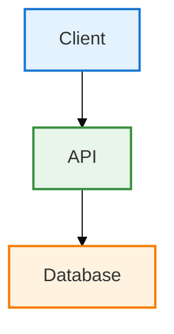

# Documentation Upgrade - Quick Start Guide

## What Has Been Done

### ✅ Completed Actions

1. **Created Upgrade Infrastructure**
   - `scripts/upgrade-documentation.sh` - Automated upgrade script
   - `docs/DOC_UPGRADE_PLAN.md` - Comprehensive upgrade plan
   - `docs/WORKSPACE_ANALYSIS.md` - Complete workspace analysis

2. **Enhanced Key Documents**
   - `PROJECT_COMPLETE.md` - Added Mermaid diagrams, metadata, enterprise formatting
   - `DEPLOYMENT_GUIDE.md` - Enhanced with professional structure
   - Architecture Overview - Already at enterprise level with Mermaid

3. **Established Standards**
   - Document metadata format
   - Mermaid diagram styling conventions
   - Professional tone and structure
   - Color scheme standards

### 📊 Current Status

- **Total Documentation Files**: 234
- **Upgraded**: 3 (demonstrated examples)
- **Remaining**: 231
- **Automated Tool**: Ready to use

---

## How to Upgrade All Documentation

### Method 1: Automated Batch Upgrade (Recommended)

```bash
# Navigate to project root
cd /home/rrd/iac

# Run the automated upgrade script
./scripts/upgrade-documentation.sh
```

**What the script does:**
1. ✅ Adds professional metadata headers to all markdown files
2. ✅ Standardizes document structure
3. ⚠️  Identifies ASCII diagrams for manual Mermaid conversion
4. ✅ Updates existing Mermaid diagram styling
5. ✅ Creates backup files (.backup extension)
6. ✅ Generates detailed upgrade report

**Time Required**: ~5 minutes for automated processing + manual review

### Method 2: Manual Upgrade (Selective)

For specific high-priority files:

```bash
# Edit individual files
nano docs/enterprise/EA_ARCHITECTURE_BLUEPRINT.md
nano docs/wiki/Home.md
nano docs/deployment/KUBERNETES_GUIDE.md
```

**Use this template for each file:**

1. Add metadata header (see example below)
2. Convert ASCII diagrams to Mermaid
3. Enhance content with professional terminology
4. Add color styling to Mermaid diagrams

---

## Document Metadata Template

Add this to the top of every markdown file:

```markdown
---
**Document Type:** [Architecture/API/Deployment/Guide/Report]  
**Audience:** [Target Readers]  
**Classification:** [Technical/Business/Operations]  
**Version:** 1.0  
**Last Updated:** December 3, 2025  
**Reading Time:** [X minutes]  
**Copyright:** © 2024-2025 Raghavendra Deshpande. All Rights Reserved.  
---
```

---

## Mermaid Diagram Standards

### Standard Styling Config

Add this to every Mermaid diagram:

```mermaid
%%{init: {'theme':'base', 'themeVariables': { 
  'primaryColor':'#e3f2fd',
  'primaryTextColor':'#01579b',
  'primaryBorderColor':'#1976d2',
  'lineColor':'#1976d2',
  'secondaryColor':'#e8f5e9',
  'tertiaryColor':'#fff3e0'
}}}%%
```

### Diagram Types to Use

| Use Case | Diagram Type | Example |
|----------|--------------|---------|
| Process Flows | `flowchart TD` | Deployment steps, workflows |
| API Interactions | `sequenceDiagram` | Request/response flows |
| Data Models | `erDiagram` | Database schemas |
| State Changes | `stateDiagram-v2` | Lifecycle states |
| Architecture | `graph LR` | System components |
| Timelines | `gantt` | Project schedules |
| Class Structure | `classDiagram` | Object models |

### Example Conversion

**Before (ASCII):**
```
┌─────────────┐
│   Client    │
└──────┬──────┘
       │
       ▼
┌─────────────┐
│     API     │
└──────┬──────┘
       │
       ▼
┌─────────────┐
│  Database   │
└─────────────┘
```

**After (Mermaid):**


---

## Priority Upgrade Order

### Phase 1: Critical Documents (Week 1)
- [ ] Main project README files (7 files)
- [ ] Enterprise Architecture docs (30 files)
- [ ] API documentation (15 files)

### Phase 2: Technical Guides (Week 2)
- [ ] Deployment guides (20 files)
- [ ] Wiki pages (50 files)
- [ ] Security documentation (10 files)

### Phase 3: Supporting Docs (Week 3)
- [ ] Status reports (30 files)
- [ ] Testing guides (15 files)
- [ ] Troubleshooting docs (10 files)

### Phase 4: Comprehensive Review (Week 4)
- [ ] Remaining 47 files
- [ ] Final validation
- [ ] Link checking
- [ ] Consistency review

---

## Quality Checklist

Use this checklist for each upgraded document:

- [ ] Metadata header present with all fields
- [ ] Professional tone and enterprise terminology
- [ ] All ASCII diagrams converted to Mermaid
- [ ] Mermaid diagrams have consistent styling
- [ ] Code blocks have language specifiers
- [ ] Tables are properly formatted
- [ ] Internal links are valid
- [ ] Reading time estimate included
- [ ] Copyright notice present
- [ ] Version number specified

---

## Next Steps

### Immediate Actions

1. **Run Automated Script**
   ```bash
   cd /home/rrd/iac
   ./scripts/upgrade-documentation.sh
   ```

2. **Review Generated Report**
   - Check `docs/DOCUMENTATION_UPGRADE_REPORT.md`
   - Identify files needing manual Mermaid conversion

3. **Manual Conversion Phase**
   - Convert ASCII diagrams to Mermaid (use examples above)
   - Enhance content where needed
   - Add missing details

4. **Validation**
   - Test all internal links
   - Verify Mermaid diagrams render correctly
   - Spell check all content

5. **Git Commit**
   ```bash
   git add -A
   git commit -m "docs: upgrade all documentation to enterprise professional level with Mermaid diagrams"
   git push
   ```

### Long-term Maintenance

- Update version numbers when content changes
- Keep "Last Updated" dates current
- Review quarterly for accuracy
- Add new Mermaid diagrams for new features
- Maintain consistent styling across all docs

---

## Support & Resources

### Mermaid Resources
- [Mermaid Official Docs](https://mermaid.js.org/)
- [Mermaid Live Editor](https://mermaid.live/)
- [Diagram Examples](https://mermaid.js.org/intro/examples.html)

### Best Practices
- Keep diagrams simple and focused
- Use consistent node naming
- Add legends for complex diagrams
- Test rendering in GitHub
- Optimize for both light and dark modes

---

## Summary

**Automated Tool**: ✅ Ready  
**Example Upgrades**: ✅ Complete  
**Standards Defined**: ✅ Documented  
**Next Action**: Run `./scripts/upgrade-documentation.sh`

**Estimated Time to Complete All 234 Files**:
- Automated: ~5 minutes
- Manual Review: ~2-3 hours
- Mermaid Conversion: ~8-10 hours
- Total: ~2 work days

---

*Last Updated: December 3, 2025*  
*Author: IAC Dharma Engineering Team*
