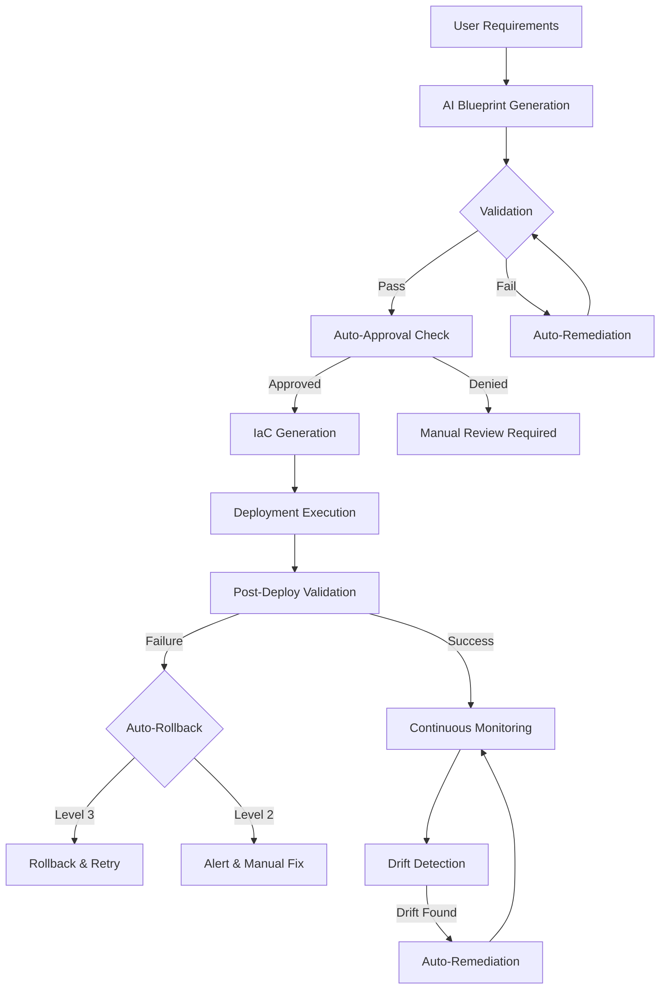

# End-to-End Automation with Auto-Approval

Complete automation solution for IAC DHARMA platform enabling autonomous infrastructure provisioning from requirements to deployment.

## 📋 Table of Contents

- [Overview](#overview)
- [Architecture](#architecture)
- [Automation Levels](#automation-levels)
- [Services](#services)
- [Workflows](#workflows)
- [Auto-Approval Rules](#auto-approval-rules)
- [Deployment](#deployment)
- [Usage](#usage)
- [Monitoring](#monitoring)
- [Troubleshooting](#troubleshooting)

## Overview

The automation solution implements three levels of automation:

1. **Level 1 - Semi-Automated**: AI-assisted with manual approvals
2. **Level 2 - Auto-Approved**: Automated with policy-based approvals
3. **Level 3 - Fully Autonomous**: Complete automation with self-healing

### Key Features

- 🤖 **AI-Powered Design**: Natural language to infrastructure blueprint
- ✅ **Auto-Validation**: Guardrails checking with auto-remediation
- 🎯 **Smart Approval**: Policy-based decision engine
- 🚀 **Automated Deployment**: IaC generation and execution
- 🔄 **Self-Healing**: Drift detection and auto-remediation
- 📊 **Continuous Monitoring**: Health, cost, and compliance tracking

## Architecture

```
┌──────────────────────────────────────────────────────────────┐
│                    End-to-End Automation                      │
├──────────────────────────────────────────────────────────────┤
│                                                               │
│  User Requirements → AI Design → Validate → Approve → Deploy │
│         ↓                ↓           ↓          ↓        ↓   │
│                                                               │
│  ┌──────────────┐   ┌──────────────┐   ┌──────────────┐   │
│  │ Automation   │──>│ Auto-Approval│──>│ Monitoring   │   │
│  │ Engine       │   │ Engine       │   │ Service      │   │
│  └──────────────┘   └──────────────┘   └──────────────┘   │
│         │                   │                   │           │
│         v                   v                   v           │
│  AI Engine          Guardrails          Drift Detection     │
│  Blueprint Svc      Costing Svc         Health Monitor      │
│  IaC Generator      Risk Assessment     Cost Optimizer      │
│  Orchestrator       Compliance Check    Auto-Remediation    │
│                                                               │
└──────────────────────────────────────────────────────────────┘
```

## Automation Levels

### Level 1: Semi-Automated (Learning Mode)

**Use Case**: Development, experimentation, learning

**Process**:
1. User provides requirements
2. AI generates blueprint
3. **Manual review and approval required**
4. User approves IaC generation
5. **Manual deployment approval**
6. Deployment executes

**Approvals**: Manual at every step  
**Best For**: New teams, complex changes, production learning

### Level 2: Auto-Approved (Standard Mode)

**Use Case**: Dev/staging environments, routine changes

**Process**:
1. User provides requirements
2. AI generates blueprint
3. Auto-validation with remediation
4. **Auto-approval if conditions met**
5. IaC generation
6. **Auto-deployment if policies allow**
7. Continuous monitoring

**Approvals**: Automatic if conditions met  
**Best For**: Development, staging, low-risk production changes

### Level 3: Fully Autonomous (Advanced Mode)

**Use Case**: Production with mature governance

**Process**:
1. User provides requirements
2. Complete automation through deployment
3. Continuous monitoring
4. **Auto-remediation on drift**
5. **Self-healing on failures**
6. **Automatic optimization**

**Approvals**: None required  
**Best For**: Mature teams, standard deployments, proven patterns

## Services

### 1. Automation Engine

**Port**: 3006  
**Purpose**: Workflow orchestration and coordination

**Responsibilities**:
- Orchestrate end-to-end workflows
- Manage workflow state
- Coordinate between services
- Handle error recovery

**API Endpoints**:
- `POST /api/automation/start` - Initiate workflow
- `GET /api/automation/status/:id` - Get workflow status
- `POST /api/automation/cancel/:id` - Cancel workflow

### 2. Auto-Approval Engine

**Integrated in**: Automation Engine  
**Purpose**: Policy-based approval decisions

**Responsibilities**:
- Evaluate approval conditions
- Check security scores
- Validate cost budgets
- Assess risk levels
- Apply environment policies

**Decision Factors**:
- Guardrails pass/fail
- Security score threshold
- Cost budget compliance
- Risk level assessment
- Complexity scoring
- Environment-specific rules

### 3. Monitoring Service

**Port**: 3007  
**Purpose**: Continuous monitoring and self-healing

**Responsibilities**:
- Configuration drift detection
- Health monitoring
- Cost anomaly detection
- Compliance validation
- Auto-remediation execution

**Capabilities**:
- Drift detection (5-min intervals)
- Health checks (1-min intervals)
- Cost analysis (hourly)
- Auto-restart unhealthy services
- Auto-fix configuration drift
- Auto-optimize idle resources

## Workflows

### Complete Automation Workflow (Level 2/3)



### Step-by-Step Process

**Step 1: Requirements → Blueprint**
- Input: Natural language requirements
- AI Engine: Generate infrastructure blueprint
- Output: Blueprint with version

**Step 2: Validation**
- Guardrails Engine: Check policies
- Security scan: Vulnerability assessment
- Cost estimate: Budget validation
- Compliance: Regulatory checks
- Auto-fix: Remediate violations

**Step 3: Auto-Approval Decision**
- Check automation level
- Evaluate conditions:
  - ✅ Guardrails passed
  - ✅ Security score ≥ threshold
  - ✅ Cost within budget
  - ✅ Risk level acceptable
  - ✅ Complexity manageable
- Decision: Approve or escalate

**Step 4: IaC Generation**
- IaC Generator: Create Terraform/Bicep/CloudFormation
- Validate syntax
- Plan execution
- Output: Ready-to-deploy code

**Step 5: Deployment**
- Orchestrator: Execute deployment
- Track progress
- Stream logs
- Capture state

**Step 6: Post-Deployment**
- Verify resources created
- Run health checks
- Register for monitoring
- Auto-rollback on failure

**Step 7: Continuous Monitoring**
- Drift detection (every 5 min)
- Health monitoring (every 1 min)
- Cost tracking (hourly)
- Auto-remediation when needed

## Auto-Approval Rules

### Design-Time Rules (All Environments)

```yaml
design_approval:
  required_conditions:
    - guardrails_passed: true
    - security_score: >= 85
    - complexity_score: <= 70
    - cost_within_budget: true
    - critical_vulnerabilities: 0
```

### Deployment Rules by Environment

#### Development
```yaml
dev_deployment:
  automation_level: 2+
  security_score: >= 70
  risk_level: <= 50
  manual_approval: false
```

#### Staging
```yaml
staging_deployment:
  automation_level: 2+
  security_score: >= 80
  risk_level: <= 30
  manual_approval: false
  require_tests: true
```

#### Production
```yaml
prod_deployment:
  automation_level: 3  # Must be Level 3
  security_score: >= 90
  risk_level: <= 20
  manual_approval: false
  require_staging_success: true
  require_compliance_check: true
```

## Deployment

### Docker Compose (Local Development)

```bash
# Start all automation services
docker-compose up -d automation-engine monitoring-service

# Check service health
curl http://localhost:3006/health
curl http://localhost:3007/health

# View logs
docker-compose logs -f automation-engine
docker-compose logs -f monitoring-service
```

### Kubernetes (Production)

```bash
# Apply manifests
kubectl apply -f deployment/kubernetes/prod/automation-engine.yaml
kubectl apply -f deployment/kubernetes/prod/monitoring-service.yaml
kubectl apply -f deployment/kubernetes/prod/rbac.yaml

# Check deployments
kubectl get deployments -n iac-dharma-prod
kubectl get pods -n iac-dharma-prod

# Check HPA status
kubectl get hpa -n iac-dharma-prod

# View logs
kubectl logs -f deployment/automation-engine -n iac-dharma-prod
kubectl logs -f deployment/monitoring-service -n iac-dharma-prod
```

## Usage

### Starting an Automated Workflow

```bash
curl -X POST http://localhost:3006/api/automation/start \
  -H "Content-Type: application/json" \
  -d '{
    "requirements": "Deploy 3-tier web application on Azure with PostgreSQL database, Redis cache, and autoscaling",
    "automationLevel": 2,
    "environment": "dev"
  }'
```

**Response**:
```json
{
  "workflowId": "wf-12345-67890",
  "status": "started",
  "message": "Workflow initiated"
}
```

### Checking Workflow Status

```bash
curl http://localhost:3006/api/automation/status/wf-12345-67890
```

**Response**:
```json
{
  "id": "wf-12345-67890",
  "status": "running",
  "currentStep": "validate",
  "steps": [
    {
      "name": "design",
      "status": "completed",
      "startedAt": "2024-01-15T10:00:00Z",
      "completedAt": "2024-01-15T10:01:30Z",
      "result": {
        "blueprintId": "bp-789",
        "blueprintVersion": "1.0.0"
      }
    },
    {
      "name": "validate",
      "status": "running",
      "startedAt": "2024-01-15T10:01:30Z"
    }
  ],
  "startedAt": "2024-01-15T10:00:00Z"
}
```

### Monitoring a Deployment

```bash
# Register deployment
curl -X POST http://localhost:3007/api/monitoring/register \
  -H "Content-Type: application/json" \
  -d '{
    "deploymentId": "deploy-123",
    "blueprintId": "bp-789",
    "environment": "prod",
    "monitoringConfig": {
      "driftDetection": true,
      "healthChecks": true,
      "costMonitoring": true,
      "complianceMonitoring": true
    }
  }'

# Get monitoring status
curl http://localhost:3007/api/monitoring/deployments/deploy-123

# Get drift report
curl http://localhost:3007/api/monitoring/drift/deploy-123
```

## Monitoring

### Key Metrics

**Automation Engine**:
- Workflow success rate
- Average workflow duration
- Auto-approval acceptance rate
- Failed step distribution

**Auto-Approval**:
- Approval rate by environment
- Rejection reasons distribution
- Average decision time
- Policy violation counts

**Monitoring Service**:
- Drift detection rate
- Auto-remediation success rate
- Health check failure rate
- Cost anomaly detections

### Dashboards

Access Grafana dashboards at http://localhost:3030

- **Automation Overview**: Workflow metrics and trends
- **Approval Analytics**: Approval decisions and patterns
- **Infrastructure Health**: Drift, health, and remediation
- **Cost Optimization**: Spending trends and savings

## Troubleshooting

### Common Issues

#### Workflow Stuck in "Running"

**Symptom**: Workflow doesn't progress  
**Causes**:
- Service dependency unavailable
- API timeout
- Invalid configuration

**Solutions**:
```bash
# Check service health
curl http://localhost:3006/health
curl http://localhost:3001/health  # Blueprint service
curl http://localhost:8000/health  # AI engine

# Check logs
docker-compose logs automation-engine

# Cancel and retry
curl -X POST http://localhost:3006/api/automation/cancel/WORKFLOW_ID
```

#### Auto-Approval Denied

**Symptom**: Workflow requires manual approval unexpectedly  
**Causes**:
- Security score below threshold
- Budget exceeded
- Guardrails failed

**Solutions**:
```bash
# Check approval decision
curl http://localhost:3006/api/automation/status/WORKFLOW_ID

# Review conditions in response
# Fix issues: reduce cost, fix security, pass guardrails

# Retry workflow
```

#### Drift Not Auto-Remediated

**Symptom**: Drift detected but not fixed  
**Causes**:
- Severity too high for auto-fix
- Remediation policy disabled
- Resource locked

**Solutions**:
```bash
# Check drift severity
curl http://localhost:3007/api/monitoring/drift/DEPLOYMENT_ID

# Manual remediation
curl -X POST http://localhost:3007/api/monitoring/remediate/DEPLOYMENT_ID \
  -H "Content-Type: application/json" \
  -d '{"action": "fix-drift", "approve": true}'
```

### Debug Mode

Enable debug logging:

```yaml
# docker-compose.yml
automation-engine:
  environment:
    - LOG_LEVEL=debug

monitoring-service:
  environment:
    - LOG_LEVEL=debug
```

Restart services:
```bash
docker-compose restart automation-engine monitoring-service
```

## References

- [Automation Documentation](../docs/AUTOMATION.md)
- [Architecture Overview](../docs/architecture/README.md)
- [API Gateway](../backend/api-gateway/README.md)
- [Automation Engine](../backend/automation-engine/README.md)
- [Monitoring Service](../backend/monitoring-service/README.md)
