---
**Document Type:** Enterprise Documentation Master Index  
**Classification:** Public - Navigation Hub  
**Version:** 2.0  
**Last Updated:** December 1, 2025  
**Author:** IAC DHARMA Engineering Team  
**Copyright:** © 2024-2025 Raghavendra Deshpande  
---

# 🌸 IAC Dharma Documentation Index

> **Enterprise Documentation Ecosystem**: Complete technical reference for infrastructure as code excellence

---

## 📚 Quick Navigation

- **[Main README](../README.md)** - Project overview and getting started
- **[Quick Navigation](QUICK_NAV.md)** - Fast access to key documents
- **[Wiki](wiki/)** - Comprehensive platform documentation (35 pages)

---

## 🚀 Documentation Journey Flowchart

```mermaid
flowchart TD
    Start[👤 New User] --> A{What's your goal?}
    
    A -->|Learn the platform| B[Getting Started]
    A -->|Deploy to production| C[Deployment]
    A -->|Develop features| D[Development]
    A -->|Troubleshoot issues| E[Operations]
    
    B --> B1[Main README]
    B --> B2[Quick Navigation]
    B --> B3[Wiki Home]
    B1 --> B4[Start Building]
    B2 --> B4
    B3 --> B4
    
    C --> C1[Deployment Guide]
    C --> C2[Kubernetes Guide]
    C --> C3[Production Checklist]
    C1 --> C4[Live System]
    C2 --> C4
    C3 --> C4
    
    D --> D1[API Documentation]
    D --> D2[Architecture Docs]
    D --> D3[Testing Guide]
    D1 --> D4[Build Features]
    D2 --> D4
    D3 --> D4
    
    E --> E1[Monitoring]
    E --> E2[Troubleshooting]
    E --> E3[Performance Tuning]
    E1 --> E4[Healthy System]
    E2 --> E4
    E3 --> E4
    
    style Start fill:#e1f5ff,stroke:#01579b,stroke-width:3px
    style A fill:#fff3e0,stroke:#e65100,stroke-width:2px
    style B4 fill:#c8e6c9,stroke:#2e7d32,stroke-width:2px
    style C4 fill:#c8e6c9,stroke:#2e7d32,stroke-width:2px
    style D4 fill:#c8e6c9,stroke:#2e7d32,stroke-width:2px
    style E4 fill:#c8e6c9,stroke:#2e7d32,stroke-width:2px
```

---
