---
**Document Type:** Enterprise Navigation Hub  
**Classification:** Public - User Reference  
**Version:** 2.0  
**Last Updated:** December 1, 2025  
**Copyright:** © 2024-2025 Raghavendra Deshpande  
---

# 🗺️ IAC DHARMA - Enterprise Quick Navigation Guide

> **Your Strategic Command Center**: Fast access to documentation, scripts, and enterprise features

---

## 🎯 Platform Architecture Navigator

```mermaid
flowchart LR
    A[👤 User] --> B{Role?}
    
    B -->|Developer| C[API Docs]
    B -->|DevOps| D[Deployment]
    B -->|Security| E[Security]
    B -->|QA/Testing| F[Testing]
    
    C --> C1[API Documentation]
    C --> C2[Quick Reference]
    C --> C3[Integration Guide]
    
    D --> D1[Deployment Scripts]
    D --> D2[Kubernetes Guide]
    D --> D3[Monitoring]
    
    E --> E1[DLP Implementation]
    E --> E2[Security Audit]
    E --> E3[Compliance]
    
    F --> F1[Test Scripts]
    F --> F2[Load Testing]
    F --> F3[Validation]
    
    C1 --> G[IAC DHARMA Platform]
    C2 --> G
    C3 --> G
    D1 --> G
    D2 --> G
    D3 --> G
    E1 --> G
    E2 --> G
    E3 --> G
    F1 --> G
    F2 --> G
    F3 --> G
    
    style B fill:#fff3e0,stroke:#e65100,stroke-width:2px
    style G fill:#e8f5e9,stroke:#2e7d32,stroke-width:3px
    style C fill:#e3f2fd,stroke:#01579b,stroke-width:2px
    style D fill:#f3e5f5,stroke:#4a148c,stroke-width:2px
    style E fill:#fce4ec,stroke:#880e4f,stroke-width:2px
    style F fill:#fff9c4,stroke:#f57f17,stroke-width:2px
```



---

> Fast access to commonly needed documentation and scripts

## 🚀 Enterprise Features (NEW)
- **Enterprise Features** → [Complete Guide](ENTERPRISE_FEATURES.md) - Multi-cloud, AI recommendations, SSO, mobile, analytics
- **Quick Start** → [5-Minute Setup](ENTERPRISE_QUICKSTART.md) - Get started with enterprise features
- **Testing Guide** → [Testing Procedures](ENTERPRISE_TESTING_GUIDE.md) - Comprehensive testing (2-3 hours)
- **Deployment Status** → [Real-Time Status](DEPLOYMENT_STATUS.md) - Check deployment progress

## 🎯 I want to...

### Get Started
- **Install the platform** → [Deployment Guide](docs/deployment/DEPLOYMENT_GUIDE.md)
- **Understand the project** → [Main README](README.md)
- **See all documentation** → [Documentation Index](DOCUMENTATION_INDEX.md)
- **Find a specific script** → [Scripts README](scripts/README.md)

### Work with APIs
- **API reference** → [API Documentation](docs/api/API_DOCUMENTATION.md)
- **Rate limits** → [Rate Limiting Guide](docs/guides/RATE_LIMITING_GUIDE.md)
- **Integration** → [UI-Backend Alignment](docs/guides/UI-BACKEND-ALIGNMENT.md)

### Deploy & Configure
- **Deploy platform** → [Deployment Scripts](scripts/deployment/)
- **Deploy to Kubernetes** → [Kubernetes Guide](docs/deployment/KUBERNETES_GUIDE.md)
- **Validate deployment** → [Validation Scripts](scripts/validation/)
- **Configure CI/CD** → [CI/CD Guide](docs/ci-cd/CI_CD_GUIDE.md)

### Work with CMDB
- **CMDB setup** → [CMDB Complete Documentation](docs/cmdb/CMDB_COMPLETE_DOCUMENTATION.md)
- **Install agent** → [Agent User Manual](docs/cmdb/AGENT_USER_MANUAL.md)
- **Seed data** → [Data Scripts](scripts/data/)
- **Monitor agents** → [Monitoring Scripts](scripts/monitoring/)

### Security & DLP
- **Setup DLP** → [DLP Implementation Guide](docs/security/DATA_LEAKAGE_CONTROL_IMPLEMENTATION.md)
- **DLP commands** → [DLP Quick Reference](docs/security/DLP_QUICK_REFERENCE.md)
- **Run security audit** → [Security Scripts](scripts/security/)
- **View audit results** → [Security Audit Report](docs/security/security-audit-report.md)

### Test & Validate
- **Run tests** → [Testing Scripts](scripts/testing/)
- **Load testing** → [Load Testing Report](docs/testing/LOAD_TESTING_REPORT.md)
- **Validate setup** → [Validation Scripts](scripts/validation/)
- **Test coverage** → [Test Summary](docs/testing/TEST_SUMMARY.md)

### Monitor & Debug
- **Check health** → [Monitoring Scripts](scripts/monitoring/)
- **View logs** → `./scripts/monitoring/logs.sh`
- **Performance issues** → [Performance Report](docs/performance/performance-profiling-report.md)
- **Troubleshoot** → [Troubleshooting Guide](docs/troubleshooting/)

### Automate
- **Setup automation** → [Automation Guide](docs/automation/AUTOMATION.md)
- **Complete workflows** → [End-to-End Automation](docs/automation/END_TO_END_AUTOMATION.md)
- **Deployment automation** → [Deployment Scripts](scripts/deployment/)

### Manage Database
- **Backup database** → `./scripts/database/backup-database.sh`
- **Restore database** → `./scripts/database/restore-database.sh`
- **Database schemas** → [Database Directory](database/)

## 🚀 Common Commands

```bash
# Quick start
./scripts/deployment/start-platform.sh
./scripts/deployment/validate-deployment.sh

# Health check
./scripts/monitoring/health-check.sh
./scripts/monitoring/logs.sh [service]

# Testing
./scripts/testing/test-integration.sh
./scripts/testing/test-load.sh

# Security
./scripts/security/security-audit.sh
./scripts/security/test-dlp.sh

# Data management
./scripts/data/seed-all.sh
./scripts/database/backup-database.sh

# Validation
./scripts/validation/verify-ci-cd-setup.sh
./scripts/validation/verify-real-data-only.sh
```

## 📚 Documentation by Role

### Developers
1. [API Documentation](docs/api/API_DOCUMENTATION.md)
2. [Quick Reference](docs/guides/QUICK_REFERENCE.md)
3. [Project Structure](README.md#-project-structure)
4. [All Scripts](scripts/README.md)

### DevOps/Operations
1. [Deployment Guide](docs/deployment/DEPLOYMENT_GUIDE.md)
2. [CMDB Documentation](docs/cmdb/CMDB_COMPLETE_DOCUMENTATION.md)
3. [Monitoring Scripts](scripts/monitoring/)
4. [Kubernetes Guide](docs/deployment/KUBERNETES_GUIDE.md)

### Security Team
1. [DLP Implementation](docs/security/DATA_LEAKAGE_CONTROL_IMPLEMENTATION.md)
2. [Security Audit Report](docs/security/security-audit-report.md)
3. [Security Scripts](scripts/security/)
4. [DLP Quick Reference](docs/security/DLP_QUICK_REFERENCE.md)

### QA/Testing
1. [Test Summary](docs/testing/TEST_SUMMARY.md)
2. [Testing Scripts](scripts/testing/)
3. [Validation Scripts](scripts/validation/)
4. [Load Testing Report](docs/testing/LOAD_TESTING_REPORT.md)

## 🔍 Find Something Specific

| Looking for... | Go to... |
|----------------|----------|
| Installation steps | [Deployment Guide](docs/deployment/DEPLOYMENT_GUIDE.md) |
| API endpoints | [API Documentation](docs/api/API_DOCUMENTATION.md) |
| CMDB setup | [CMDB Complete Documentation](docs/cmdb/CMDB_COMPLETE_DOCUMENTATION.md) |
| Security features | [Security Documentation](docs/security/) |
| Test results | [Testing Documentation](docs/testing/) |
| All scripts | [Scripts README](scripts/README.md) |
| Recent changes | [Reorganization Summary](REORGANIZATION_SUMMARY.md) |
| Project status | [Status Documentation](docs/status/) |
| Troubleshooting | [Troubleshooting Guide](docs/troubleshooting/) |
| Performance | [Performance Report](docs/performance/performance-profiling-report.md) |

## 📖 Master Indexes

- **[DOCUMENTATION_INDEX.md](DOCUMENTATION_INDEX.md)** - Complete documentation index
- **[docs/README.md](docs/README.md)** - Documentation by category
- **[scripts/README.md](scripts/README.md)** - All utility scripts
- **[README.md](README.md)** - Main project overview

---

**💡 Tip**: Use Ctrl+F to search within any documentation file for specific topics.
