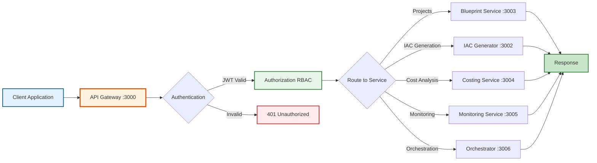

---
**Document Type:** API Reference & Integration Guide  
**Audience:** Developers, Integration Engineers, API Consumers  
**Classification:** Technical - API Documentation  
**Version:** 1.0.0  
**Last Updated:** December 1, 2025  
**API Base URL:** http://localhost:3000  
**Copyright:** © 2024-2025 Raghavendra Deshpande  
---

# 🔌 API Documentation - IAC Dharma Platform

> **RESTful API Excellence**: Comprehensive reference for integrating with IAC DHARMA's powerful infrastructure automation capabilities

**Version:** 1.0.0  
**Documentation URL:** http://localhost:3000/api-docs  
**OpenAPI Spec:** http://localhost:3000/api-docs.json

---

## 🎯 API Architecture Flow



---

## Overview

IAC Dharma provides a comprehensive RESTful API for Infrastructure as Code platform with AI-powered architecture design, automated deployment, and intelligent governance. The API supports role-based access control (RBAC) with five distinct user roles:

- **PM** (Project Manager) - Approvals, budgets, migrations, KPIs
- **SE** (Software Engineer) - Deployments, logs, incidents, health monitoring
- **EA** (Enterprise Architect) - Policies, patterns, compliance, cost optimization
- **TA** (Technical Architect) - IaC templates, guardrails, validation
- **SA** (Solutions Architect) - Blueprint design, AI recommendations

---

## Quick Start

### 1. Authentication

All API endpoints (except `/api/auth/login` and `/health`) require JWT authentication.

**Login:**
```bash
curl -X POST http://localhost:3000/api/auth/login \
  -H "Content-Type: application/json" \
  -d '{
    "email": "sa@test.com",
    "password": "password123"
  }'
```

**Response:**
```json
{
  "token": "eyJhbGciOiJIUzI1NiIsInR5cCI6IkpXVCJ9...",
  "user": {
    "id": "550e8400-e29b-41d4-a716-446655440000",
    "email": "sa@test.com",
    "roles": ["SA", "TA"]
  }
}
```

### 2. Using the Token

Include the JWT token in the `Authorization` header for all subsequent requests:

```bash
curl -X GET http://localhost:3000/api/blueprints \
  -H "Authorization: Bearer YOUR_JWT_TOKEN"
```

### 3. Interactive Documentation

Visit **http://localhost:3000/api-docs** for interactive Swagger UI documentation where you can:

- Browse all available endpoints
- View request/response schemas
- Try out API calls directly from the browser
- See example requests and responses

## API Organization

### Authentication Endpoints
- **POST** `/api/auth/login` - User login with email/password
- **GET** `/api/auth/sso/callback` - SSO authentication callback

### Blueprint Management
- **GET** `/api/blueprints` - List all blueprints
- **POST** `/api/blueprints` - Create new blueprint
- **GET** `/api/blueprints/{id}` - Get blueprint details
- **PUT** `/api/blueprints/{id}` - Update blueprint
- **DELETE** `/api/blueprints/{id}` - Delete blueprint
- **POST** `/api/blueprints/{id}/validate` - Validate blueprint

### AI-Powered Features
- **POST** `/api/ai/generate` - Generate blueprint from natural language
- **GET** `/api/ai/optimize/{blueprintId}` - Get optimization suggestions

### IaC Generation
- **POST** `/api/iac/generate` - Generate IaC code (Terraform, Bicep, CloudFormation)
- **GET** `/api/iac/status/{jobId}` - Check generation job status

### Cost Management
- **POST** `/api/costing/estimate` - Calculate cost estimate
- **POST** `/api/costing/tco` - Calculate Total Cost of Ownership

### PM (Project Manager) Endpoints

#### Approvals
- **GET** `/api/pm/approvals` - List pending deployment approvals
- **POST** `/api/pm/approvals/{id}/approve` - Approve deployment
- **POST** `/api/pm/approvals/{id}/reject` - Reject deployment

#### Budget Management
- **GET** `/api/pm/budget` - List budget allocations
- **POST** `/api/pm/budget` - Create budget allocation
- **GET** `/api/pm/budget/spending` - Get spending analysis
- **POST** `/api/pm/budget/alerts` - Configure budget alerts

#### Cloud Migrations
- **GET** `/api/pm/migrations` - List cloud migration projects
- **POST** `/api/pm/migrations` - Create migration plan
- **PUT** `/api/pm/migrations/{id}` - Update migration status

#### KPI Tracking
- **GET** `/api/pm/kpis` - Get KPI metrics
- **POST** `/api/pm/kpis/targets` - Set KPI targets

### SE (Software Engineer) Endpoints

#### Deployment Execution
- **POST** `/api/se/deployments/{id}/execute` - Execute approved deployment
- **POST** `/api/se/deployments/{id}/rollback` - Rollback deployment
- **GET** `/api/se/deployments/{id}/status` - Get deployment status

#### Deployment Logs
- **GET** `/api/se/deployment-logs` - Get deployment logs
- **GET** `/api/se/deployment-logs/stream` - Stream live logs

#### Incident Management
- **GET** `/api/se/incidents` - List incidents
- **POST** `/api/se/incidents` - Report new incident
- **PUT** `/api/se/incidents/{id}` - Update incident
- **POST** `/api/se/incidents/{id}/resolve` - Resolve incident

#### Health Monitoring
- **GET** `/api/se/health/services` - Get service health status
- **GET** `/api/se/health/metrics` - Get system metrics
- **POST** `/api/se/health/alerts` - Configure health alerts

### EA (Enterprise Architect) Endpoints

#### Governance Policies
- **GET** `/api/ea/policies` - List governance policies
- **POST** `/api/ea/policies` - Create governance policy
- **PUT** `/api/ea/policies/{id}` - Update policy
- **DELETE** `/api/ea/policies/{id}` - Delete policy
- **POST** `/api/ea/policies/{id}/enforce` - Enforce policy

#### Architecture Patterns
- **GET** `/api/ea/patterns` - List architecture patterns
- **POST** `/api/ea/patterns` - Submit new pattern for approval
- **POST** `/api/ea/patterns/{id}/approve` - Approve pattern

#### Compliance Management
- **GET** `/api/ea/compliance` - List compliance frameworks
- **POST** `/api/ea/compliance/assessments` - Run compliance assessment
- **GET** `/api/ea/compliance/violations` - List compliance violations

#### Cost Optimization
- **GET** `/api/ea/cost-optimization/recommendations` - Get optimization recommendations
- **POST** `/api/ea/cost-optimization/implement` - Implement optimization

### TA (Technical Architect) Endpoints

#### IaC Templates
- **GET** `/api/ta/iac/templates` - List IaC templates
- **POST** `/api/ta/iac/templates` - Create IaC template
- **PUT** `/api/ta/iac/templates/{id}` - Update template
- **POST** `/api/ta/iac/templates/{id}/validate` - Validate template

#### Guardrails
- **GET** `/api/ta/guardrails/rules` - List guardrail rules
- **POST** `/api/ta/guardrails/rules` - Create guardrail rule
- **GET** `/api/ta/guardrails/violations` - List violations
- **POST** `/api/ta/guardrails/violations/{id}/override` - Override violation

### SA (Solutions Architect) Endpoints

#### Blueprint Design
- **GET** `/api/sa/blueprints` - List SA blueprints
- **POST** `/api/sa/blueprints` - Create architecture blueprint
- **PUT** `/api/sa/blueprints/{id}` - Update blueprint

#### AI Recommendations
- **GET** `/api/sa/ai-recommendations` - Get AI recommendations
- **POST** `/api/sa/ai-recommendations/feedback` - Submit feedback on recommendations

## Data Models

### Blueprint

```json
{
  "id": "550e8400-e29b-41d4-a716-446655440000",
  "name": "E-commerce Platform",
  "description": "Scalable e-commerce architecture on AWS",
  "category": "web-app",
  "provider": "aws",
  "components": {
    "frontend": {
      "type": "react-app",
      "hosting": "s3-cloudfront"
    },
    "backend": {
      "type": "nodejs-api",
      "hosting": "ecs-fargate"
    },
    "database": {
      "type": "postgresql",
      "hosting": "rds"
    }
  },
  "status": "active",
  "version": "1.0.0",
  "tags": ["ecommerce", "aws", "scalable"],
  "tenantId": "tenant-001",
  "createdBy": "user-123",
  "createdAt": "2025-11-16T10:30:00Z",
  "updatedAt": "2025-11-16T10:30:00Z"
}
```

### Deployment Approval

```json
{
  "id": "approval-001",
  "blueprintId": "550e8400-e29b-41d4-a716-446655440000",
  "requestedBy": "user-se-001",
  "status": "approved",
  "approvedBy": "user-pm-001",
  "comments": "Approved for production deployment",
  "createdAt": "2025-11-16T10:30:00Z"
}
```

### Governance Policy

```json
{
  "id": "policy-001",
  "name": "No Public S3 Buckets",
  "description": "All S3 buckets must have public access blocked",
  "policyType": "security",
  "category": "data-protection",
  "severity": "critical",
  "policyRules": {
    "resourceType": "aws_s3_bucket",
    "conditions": [
      {
        "attribute": "public_access_block",
        "operator": "exists",
        "value": true
      }
    ]
  },
  "enforcementLevel": "mandatory",
  "effectiveFrom": "2025-01-01",
  "tenantId": "tenant-001"
}
```

### Incident

```json
{
  "id": "incident-001",
  "title": "Production API Degraded Performance",
  "description": "API response time increased to 5 seconds",
  "severity": "high",
  "priority": "p1",
  "status": "investigating",
  "affectedServices": {
    "services": ["api-gateway", "backend-service"],
    "users_impacted": 1500
  },
  "detectedBy": "user-se-001",
  "assignedTo": "user-se-lead",
  "createdAt": "2025-11-16T10:30:00Z",
  "resolvedAt": null
}
```

## Security

### Authentication

- JWT-based authentication with 24-hour token expiration
- Tokens obtained via `/api/auth/login`
- SSO integration available via `/api/auth/sso/callback`

### Authorization

Role-Based Access Control (RBAC) with permissions scoped to:

- **Tenant-level:** Access to all resources within the tenant
- **Project-level:** Access to specific project resources
- **Resource-level:** Access to individual resources

### Rate Limiting

- **Rate Limit:** 1000 requests per 15 minutes per IP
- **Headers:**
  - `X-RateLimit-Limit`: Maximum requests allowed
  - `X-RateLimit-Remaining`: Requests remaining
  - `X-RateLimit-Reset`: Time when limit resets

### Security Headers

All responses include security headers via Helmet middleware:
- `X-Frame-Options: DENY`
- `X-Content-Type-Options: nosniff`
- `X-XSS-Protection: 1; mode=block`
- `Strict-Transport-Security: max-age=15552000`

## Error Handling

### Standard Error Response

```json
{
  "error": "Validation Error",
  "message": "Invalid request parameters",
  "details": ["name is required", "category must be one of: web-app, microservices"]
}
```

### HTTP Status Codes

- **200 OK** - Request successful
- **201 Created** - Resource created successfully
- **202 Accepted** - Request accepted for processing
- **204 No Content** - Request successful, no content to return
- **400 Bad Request** - Invalid request parameters
- **401 Unauthorized** - Missing or invalid authentication token
- **403 Forbidden** - Insufficient permissions
- **404 Not Found** - Resource not found
- **429 Too Many Requests** - Rate limit exceeded
- **500 Internal Server Error** - Server error

## Pagination

List endpoints support pagination via query parameters:

```bash
GET /api/blueprints?page=1&limit=20&sort=createdAt&order=desc
```

**Parameters:**
- `page` - Page number (default: 1)
- `limit` - Items per page (default: 20, max: 100)
- `sort` - Field to sort by (default: createdAt)
- `order` - Sort order: asc or desc (default: desc)

**Response:**
```json
{
  "data": [...],
  "pagination": {
    "page": 1,
    "limit": 20,
    "total": 150,
    "totalPages": 8,
    "hasNext": true,
    "hasPrev": false
  }
}
```

## Filtering

List endpoints support filtering via query parameters:

```bash
GET /api/blueprints?status=active&provider=aws&category=web-app
GET /api/pm/approvals?status=pending&projectId=abc123
GET /api/se/incidents?severity=high&status=open
```

## Webhooks

IAC Dharma can send webhook notifications for key events:

**Events:**
- `deployment.started`
- `deployment.completed`
- `deployment.failed`
- `approval.requested`
- `approval.approved`
- `incident.created`
- `incident.resolved`
- `guardrail.violated`
- `budget.exceeded`

**Webhook Payload:**
```json
{
  "event": "deployment.completed",
  "timestamp": "2025-11-16T10:30:00Z",
  "tenantId": "tenant-001",
  "data": {
    "deploymentId": "deploy-001",
    "blueprintId": "blueprint-001",
    "status": "success",
    "duration": 300
  }
}
```

## Code Examples

### JavaScript/TypeScript (Node.js)

```javascript
const axios = require('axios');

// Login
const loginResponse = await axios.post('http://localhost:3000/api/auth/login', {
  email: 'sa@test.com',
  password: 'password123'
});

const token = loginResponse.data.token;

// Create Blueprint
const blueprintResponse = await axios.post(
  'http://localhost:3000/api/blueprints',
  {
    name: 'My E-commerce Platform',
    description: 'Scalable e-commerce architecture',
    category: 'web-app',
    provider: 'aws',
    components: {
      frontend: { type: 'react-app' },
      backend: { type: 'nodejs-api' },
      database: { type: 'postgresql' }
    },
    tags: ['ecommerce', 'scalable']
  },
  {
    headers: {
      'Authorization': `Bearer ${token}`,
      'Content-Type': 'application/json'
    }
  }
);

console.log('Blueprint created:', blueprintResponse.data);
```

### Python

```python
import requests

# Login
login_response = requests.post(
    'http://localhost:3000/api/auth/login',
    json={
        'email': 'sa@test.com',
        'password': 'password123'
    }
)

token = login_response.json()['token']

# List Blueprints
blueprints_response = requests.get(
    'http://localhost:3000/api/blueprints',
    headers={'Authorization': f'Bearer {token}'}
)

blueprints = blueprints_response.json()
print(f'Found {len(blueprints)} blueprints')
```

### cURL

```bash
# Login
TOKEN=$(curl -s -X POST http://localhost:3000/api/auth/login \
  -H "Content-Type: application/json" \
  -d '{"email":"sa@test.com","password":"password123"}' \
  | jq -r '.token')

# Generate Blueprint from Natural Language
curl -X POST http://localhost:3000/api/ai/generate \
  -H "Authorization: Bearer $TOKEN" \
  -H "Content-Type: application/json" \
  -d '{
    "userInput": "Create a scalable e-commerce platform on AWS",
    "targetCloud": "aws",
    "environment": "production",
    "budget": 5000
  }'

# List Incidents
curl -X GET "http://localhost:3000/api/se/incidents?severity=high&status=open" \
  -H "Authorization: Bearer $TOKEN"

# Create Governance Policy
curl -X POST http://localhost:3000/api/ea/policies \
  -H "Authorization: Bearer $TOKEN" \
  -H "Content-Type: application/json" \
  -d '{
    "name": "No Public Databases",
    "policyType": "security",
    "category": "data-protection",
    "severity": "critical",
    "policyRules": {
      "resourceType": "aws_db_instance",
      "conditions": [
        {
          "attribute": "publicly_accessible",
          "operator": "equals",
          "value": false
        }
      ]
    },
    "enforcementLevel": "mandatory"
  }'
```

## Best Practices

### 1. Token Management
- Store tokens securely (e.g., encrypted storage, environment variables)
- Implement token refresh logic before expiration
- Never include tokens in URLs or logs

### 2. Error Handling
```javascript
try {
  const response = await api.createBlueprint(data);
  return response.data;
} catch (error) {
  if (error.response) {
    // Server responded with error status
    console.error('API Error:', error.response.data.message);
    if (error.response.status === 401) {
      // Token expired, re-authenticate
      await refreshToken();
    }
  } else if (error.request) {
    // No response received
    console.error('Network Error:', error.message);
  }
  throw error;
}
```

### 3. Rate Limiting
- Implement exponential backoff for 429 responses
- Cache frequently accessed data
- Use pagination for large datasets

### 4. Idempotency
- Use unique `idempotency-key` header for non-idempotent operations
- Store and check idempotency keys to prevent duplicate processing

## Support

### Documentation
- **Interactive API Docs:** http://localhost:3000/api-docs
- **OpenAPI Spec:** http://localhost:3000/api-docs.json

### Health Check
```bash
curl http://localhost:3000/health
```

**Response:**
```json
{
  "status": "healthy",
  "timestamp": "2025-11-16T10:30:00Z",
  "service": "api-gateway",
  "version": "1.0.0"
}
```

### Contact
- **Email:** support@iacdharma.io
- **Documentation:** https://docs.iacdharma.io
- **GitHub:** https://github.com/iacdharma/platform

---

**Last Updated:** November 16, 2025  
**API Version:** 1.0.0  
**Documentation Generated:** Phase 5, Task 9 - API Documentation Generation
