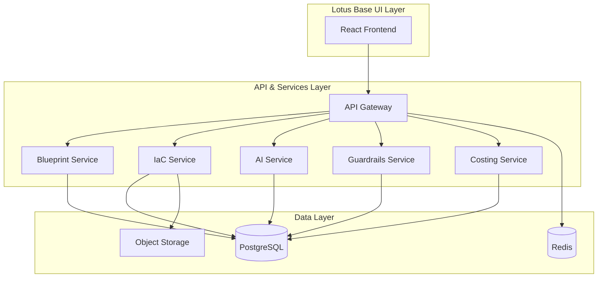

---
**Document Type:** Architecture Documentation Hub  
**Audience:** Solution Architects, Technical Architects, Engineering Teams  
**Classification:** Technical - System Design  
**Version:** 2.0  
**Last Updated:** December 1, 2025  
**Copyright:** © 2024-2025 Raghavendra Deshpande  
---

# 🏛️ IAC Dharma - Enterprise Architecture Documentation

> **System Design Excellence**: Comprehensive architectural blueprints for scalable, secure, and intelligent infrastructure automation

---

## 🎯 Architecture Overview Map

```mermaid
flowchart TD
    A[IAC DHARMA Architecture] --> B[Core Architecture]
    A --> C[Functional Components]
    A --> D[Integration Layer]
    A --> E[Deployment Models]
    
    B --> B1[System Overview]
    B --> B2[Microservices 18+]
    B --> B3[Data Architecture]
    B --> B4[Security Architecture]
    
    C --> C1[Blueprint Designer]
    C --> C2[IAC Generator]
    C --> C3[AI Engine ML/NLP]
    C --> C4[Guardrails Engine]
    C --> C5[Cost Optimization]
    
    D --> D1[Multi-Cloud AWS/Azure/GCP]
    D --> D2[Identity Systems]
    D --> D3[ITSM Integration]
    D --> D4[DevOps Tools]
    
    E --> E1[Cloud Native]
    E --> E2[On-Premises]
    E --> E3[Hybrid Architecture]
    E --> E4[HA & DR]
    
    style A fill:#e1f5ff,stroke:#01579b,stroke-width:3px
    style B fill:#e8f5e9,stroke:#2e7d32,stroke-width:2px
    style C fill:#fff3e0,stroke:#e65100,stroke-width:2px
    style D fill:#f3e5f5,stroke:#4a148c,stroke-width:2px
    style E fill:#fce4ec,stroke:#880e4f,stroke-width:2px
```

---

## System Architecture

This directory contains comprehensive architecture documentation for the IAC Dharma platform.

---

## Documents

### Core Architecture
- [System Overview](./system-overview.md) - High-level architecture and component interactions
- [Microservices Architecture](./microservices.md) - Detailed microservice breakdown
- [Data Architecture](./data-architecture.md) - Database schemas and data flows
- [Security Architecture](./security-architecture.md) - Authentication, authorization, and encryption

### Functional Architecture
- [Blueprint Designer](./functional/blueprint-designer.md) - Blueprint creation and versioning
- [IaC Generator](./functional/iac-generator.md) - Infrastructure-as-Code generation engine
- [AI Engine](./functional/ai-engine.md) - Machine learning and NLP components
- [Guardrails Engine](./functional/guardrails-engine.md) - Policy enforcement and compliance
- [Cost Engine](./functional/cost-engine.md) - Cost estimation and optimization

### Integration Architecture
- [Cloud Providers](./integrations/cloud-providers.md) - AWS, Azure, GCP integrations
- [Identity Systems](./integrations/identity.md) - AD, AAD, LDAP connectors
- [ITSM Systems](./integrations/itsm.md) - ServiceNow, Jira integrations
- [DevOps Tools](./integrations/devops.md) - GitHub, Azure DevOps, GitLab

### Deployment Architecture
- [Cloud Deployment](./deployment/cloud.md) - Cloud-native deployment model
- [On-Premises Deployment](./deployment/on-prem.md) - On-premises installation
- [Hybrid Deployment](./deployment/hybrid.md) - Hybrid architecture patterns
- [High Availability](./deployment/ha-dr.md) - HA and DR strategies

## Diagrams

All architecture diagrams are created using:
- **Mermaid** - For flow charts and sequence diagrams
- **C4 Model** - For system context and container diagrams
- **Draw.io** - For detailed technical diagrams

### Key Diagrams

## Design Principles

### 1. Lotus Base - Simplicity in Complexity
- Clean, intuitive interface design
- Layered information architecture
- Context-aware navigation

### 2. Dharma Governance - Balance through Control
- Policy-as-Code enforcement
- Automated compliance checking
- Transparent audit trails

### 3. Chakra Balance - Dynamic Equilibrium
- Innovation ↔ Control
- Speed ↔ Stability
- Flexibility ↔ Standardization

## Technology Stack

### Backend
- **Runtime**: Node.js 18+, Python 3.11+, Go 1.21+
- **Frameworks**: Express.js, FastAPI, Gin
- **Database**: PostgreSQL 15+, Redis 7+
- **Message Queue**: Kafka / RabbitMQ

### Frontend
- **Framework**: React 18+ with TypeScript
- **Styling**: TailwindCSS (Lotus Base theme)
- **State Management**: Zustand
- **API Client**: Axios, React Query

### AI/ML
- **NLP**: Transformers, LangChain
- **ML**: TensorFlow, PyTorch, Scikit-learn
- **Feature Store**: Feast
- **Model Registry**: MLflow

### DevOps
- **Containers**: Docker
- **Orchestration**: Kubernetes
- **CI/CD**: GitHub Actions, Azure DevOps
- **Monitoring**: Prometheus, Grafana, ELK

## Security Architecture

### Authentication
- SSO (SAML, OIDC)
- Azure AD, ADFS integration
- MFA support

### Authorization
- RBAC (Role-Based Access Control)
- ABAC (Attribute-Based Access Control)
- Fine-grained permissions per role:
  - EA (Enterprise Architect)
  - SA (Solution Architect)
  - TA (Technical Architect)
  - PM (Project Manager)
  - SE (System Engineer)

### Data Security
- TLS 1.3 for data in transit
- AES-256 encryption at rest
- Secrets management (Vault, KMS)
- Regular security scans (Snyk)

## Performance Targets

- **API Latency**: P95 < 300ms
- **UI Responsiveness**: 60 FPS canvas operations
- **Blueprint Load**: < 3s for 1500+ components
- **IaC Generation**: < 10s for 300+ resources
- **Availability**: 99.9% SLA

## Scalability

- Horizontal scaling for all stateless services
- Multi-tenant architecture with isolation
- Support for 100+ tenants
- Handle 10,000+ resource blueprints

## Compliance

- NIST SP 800-53
- CIS Benchmarks
- ISO 27001
- GDPR, SOX ready
- Audit logging for all operations

## References

- [Low-Level Design (LLD)](../lld/README.md)
- [API Documentation](../api/README.md)
- [User Guides](../guides/README.md)
- [Deployment Guide](../deployment/README.md)
