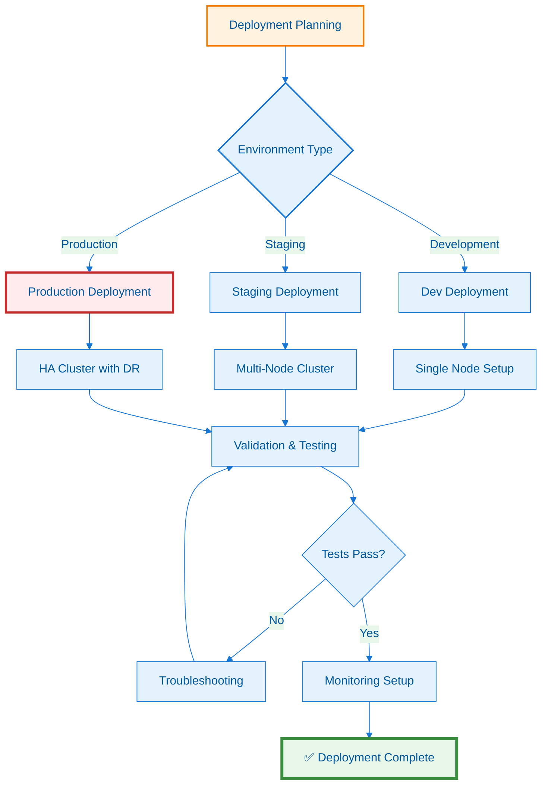

---
**Document Type:** Enterprise Deployment Guide  
**Audience:** DevOps Engineers, System Administrators, Operations Teams  
**Classification:** Operations Manual - Critical  
**Version:** 2.0  
**Last Updated:** December 3, 2025  
**Reading Time:** ~30 minutes  
**Copyright:** © 2024-2025 Raghavendra Deshpande. All Rights Reserved.  
---

# 🚀 IAC Dharma CMDB Agent - Enterprise Deployment Guide

> **Mission-Critical Infrastructure**: Comprehensive deployment procedures for enterprise-scale CMDB agent infrastructure across multi-cloud and hybrid environments



--- 📋 Table of Contents

- [Overview](#overview)
- [Prerequisites](#prerequisites)
- [Quick Start](#quick-start)
- [Deployment Methods](#deployment-methods)
- [Configuration](#configuration)
- [Service Management](#service-management)
- [Troubleshooting](#troubleshooting)

---

## 🎯 Overview

The IAC Dharma CMDB Agent is an enterprise-grade endpoint monitoring and security enforcement platform. This guide covers deployment across all supported platforms:

- 🐧 **Linux** (Ubuntu, RHEL, CentOS, Debian)
- 🪟 **Windows** (10, 11, Server 2016+)
- 🍎 **macOS** (10.15+)
- 📱 **Mobile** (Android, iOS)

---

## ⚙️ Prerequisites

### System Requirements

| Component | Minimum | Recommended |
|-----------|---------|-------------|
| CPU | 2 cores | 4 cores |
| RAM | 2 GB | 4 GB |
| Disk | 1 GB | 5 GB |
| Network | HTTP/HTTPS | Firewall rules configured |

### Software Requirements

- **Node.js** 16.x or higher
- **npm** 8.x or higher
- **TypeScript** 4.x or higher
- **Git** 2.x or higher

### Network Requirements

- Outbound HTTPS to CMDB server
- Ports: 9000 (agent API), 3000 (CMDB API)

---

## 🚀 Quick Start

### 1. Clone Repository

```bash
git clone https://github.com/Raghavendra198902/iac.git
cd iac
```

### 2. Install Dependencies

```bash
./scripts/install-dependencies.sh
```

### 3. Deploy Agent

```bash
sudo ./deploy-cmdb-agent.sh
```

### 4. Verify Installation

```bash
curl http://localhost:9000/health
```

---

## 📦 Deployment Methods

### Method 1: Automated Deployment (Recommended)

**Full system installation with service configuration:**

```bash
sudo ./deploy-cmdb-agent.sh
```

**Options:**
- `--clean` - Clean build artifacts after deployment
- `--install-dir PATH` - Custom installation directory
- `--skip-service` - Skip service installation

**Example:**
```bash
sudo ./deploy-cmdb-agent.sh --install-dir /usr/local/cmdb-agent
```

---

### Method 2: Quick Deploy (Development)

**Fast deployment for testing:**

```bash
./scripts/quick-deploy.sh
```

**Features:**
- No service installation
- Development mode
- Auto-discovery enabled
- Foreground process

---

### Method 3: Manual Deployment

#### Linux/macOS

```bash
# Build agent
cd backend/cmdb-agent
npm install
npm run build

# Create installation directory
sudo mkdir -p /opt/iac-dharma/cmdb-agent
sudo cp -r dist/* /opt/iac-dharma/cmdb-agent/
sudo cp -r node_modules /opt/iac-dharma/cmdb-agent/

# Create configuration
cat > /opt/iac-dharma/cmdb-agent/config.json <<EOF
{
  "version": "1.0.0",
  "agentName": "$(hostname)",
  "apiServerUrl": "http://localhost:3000",
  "autoUpdate": true,
  "monitoring": {
    "processes": true,
    "usb": true,
    "network": true,
    "filesystem": true
  }
}
EOF

# Install systemd service
sudo cp deployment/systemd/cmdb-agent.service /etc/systemd/system/
sudo systemctl daemon-reload
sudo systemctl enable cmdb-agent
sudo systemctl start cmdb-agent
```

#### Windows

```powershell
# Build agent
cd backend\cmdb-agent
npm install
npm run build

# Create installation directory
New-Item -Path "C:\Program Files\IAC Dharma\CMDB Agent" -ItemType Directory -Force
Copy-Item -Path "dist\*" -Destination "C:\Program Files\IAC Dharma\CMDB Agent" -Recurse
Copy-Item -Path "node_modules" -Destination "C:\Program Files\IAC Dharma\CMDB Agent" -Recurse

# Install Windows service
npm install -g node-windows
node scripts/install-windows-service.js
```

---

## ⚙️ Configuration

### Configuration File: `config.json`

```json
{
  "version": "1.0.0",
  "agentName": "hostname",
  "organizationId": "your-org-id",
  "apiServerUrl": "https://cmdb.example.com",
  "autoUpdate": true,
  "updateCheckIntervalHours": 24,
  "monitoring": {
    "processes": true,
    "registry": true,
    "usb": true,
    "network": true,
    "filesystem": true
  },
  "telemetry": {
    "batchSize": 100,
    "flushIntervalSeconds": 60
  }
}
```

### Environment Variables

```bash
# Core settings
export CMDB_API_URL="http://localhost:3000"
export CMDB_API_KEY="your-api-key"
export AGENT_ENVIRONMENT="production"
export AGENT_VERSION="1.0.0"

# Monitoring settings
export SCAN_INTERVAL_MINUTES=5
export AUTO_DISCOVERY_ENABLED=true
export AUTO_UPDATE=true

# Thresholds
export CPU_THRESHOLD_PERCENT=80
export MEMORY_THRESHOLD_PERCENT=85
export DISK_THRESHOLD_PERCENT=90

# Port configuration
export AGENT_PORT=9000
export AGENT_HOST=0.0.0.0
```

---

## 🔧 Service Management

### Linux (systemd)

```bash
# Start service
sudo systemctl start cmdb-agent

# Stop service
sudo systemctl stop cmdb-agent

# Restart service
sudo systemctl restart cmdb-agent

# Check status
sudo systemctl status cmdb-agent

# View logs
journalctl -u cmdb-agent -f

# Enable on boot
sudo systemctl enable cmdb-agent

# Disable on boot
sudo systemctl disable cmdb-agent
```

### macOS (launchd)

```bash
# Start service
sudo launchctl start com.iacdharma.cmdb-agent

# Stop service
sudo launchctl stop com.iacdharma.cmdb-agent

# View logs
tail -f /var/log/cmdb-agent.log
```

### Windows (Service)

```powershell
# Start service
net start "IAC Dharma CMDB Agent"

# Stop service
net stop "IAC Dharma CMDB Agent"

# Check status
sc query "IAC Dharma CMDB Agent"

# View logs
Get-EventLog -LogName Application -Source "CMDB Agent" -Newest 50
```

---

## 🧪 Testing

### Run Test Suite

```bash
./scripts/test-agent.sh
```

### Manual Health Check

```bash
# Health endpoint
curl http://localhost:9000/health

# Status endpoint
curl http://localhost:9000/status

# Security stats
curl http://localhost:9000/security/stats

# Update status
curl http://localhost:9000/updates/status
```

### Trigger Manual Operations

```bash
# Force sync
curl -X POST http://localhost:9000/sync

# Force discovery
curl -X POST http://localhost:9000/discover

# Check for updates
curl http://localhost:9000/updates/check

# Trigger update
curl -X POST http://localhost:9000/updates/trigger
```

---

## 🛠️ Troubleshooting

### Agent Won't Start

**Check logs:**
```bash
# Linux
journalctl -u cmdb-agent -n 100

# macOS
tail -100 /var/log/cmdb-agent.log

# Windows
Get-EventLog -LogName Application -Source "CMDB Agent" -Newest 100
```

**Common issues:**
1. Port 9000 already in use
2. Missing API key
3. Cannot connect to CMDB server
4. Insufficient permissions

### High CPU Usage

**Check monitoring intervals:**
```json
{
  "monitoring": {
    "processes": false  // Disable process monitoring
  }
}
```

### Connection Issues

**Test API connectivity:**
```bash
curl -v http://localhost:3000/api/health
```

**Check firewall rules:**
```bash
# Linux
sudo iptables -L -n

# macOS
sudo pfctl -s rules

# Windows
netsh advfirewall firewall show rule name=all
```

### Auto-Update Failures

**Check update server:**
```bash
curl http://localhost:3000/api/updates/check?version=1.0.0&platform=linux
```

**Manually trigger update:**
```bash
curl -X POST http://localhost:9000/updates/trigger
```

---

## 📊 Monitoring

### Agent Metrics

The agent exposes Prometheus-compatible metrics:

```
# Process count
cmdb_agent_processes_total

# Memory usage
cmdb_agent_memory_bytes

# Telemetry queue size
cmdb_agent_telemetry_queue_size

# Policy triggers
cmdb_agent_policy_triggers_total
```

### Dashboard Integration

Import the Grafana dashboard:
```bash
deployment/monitoring/grafana-dashboard-cmdb-agent.json
```

---

## 🔒 Security

### API Key Management

Store API keys securely:
```bash
# Linux/macOS
export CMDB_API_KEY=$(cat /etc/cmdb-agent/api-key.secret)

# Windows
$env:CMDB_API_KEY = Get-Content "C:\ProgramData\CMDB Agent\api-key.secret"
```

### TLS/SSL Configuration

Enable HTTPS for agent API:
```json
{
  "ssl": {
    "enabled": true,
    "cert": "/etc/cmdb-agent/cert.pem",
    "key": "/etc/cmdb-agent/key.pem"
  }
}
```

---

## 📚 Additional Resources

- [Architecture Overview](docs/architecture/ARCHITECTURE.md)
- [API Documentation](docs/api/API_DOCUMENTATION.md)
- [Security Policies](docs/security/SECURITY_POLICIES.md)
- [Troubleshooting Guide](docs/troubleshooting/TROUBLESHOOTING_GUIDE.md)

---

## 📞 Support

- **Documentation**: https://github.com/Raghavendra198902/iac/wiki
- **Issues**: https://github.com/Raghavendra198902/iac/issues
- **Email**: support@iacdharma.com

---

**Copyright © 2024-2025 Raghavendra Deshpande. All Rights Reserved.**
