---
**Document Type:** Enterprise Architecture Blueprint  
**Audience:** Enterprise Architects, System Designers, C-Level Executives  
**Classification:** Strategic Architecture - Mission Critical  
**Version:** 1.0  
**Date:** November 24, 2025  
**Status:** Active  
**Reading Time:** ~45 minutes  
**Copyright:** © 2024-2025 Raghavendra Deshpande. All Rights Reserved.  
---

# EA - Enterprise Architecture Blueprint
## IAC Dharma Platform

## Executive Summary

A comprehensive enterprise architecture blueprint defining the logical, physical, and integration architecture for IAC Dharma—a mission-critical, multi-cloud Infrastructure as Code platform designed for scale, resilience, and enterprise-grade security.

### Strategic Objectives
- **Multi-Cloud Native:** Seamless AWS, Azure, and GCP integration
- **AI-Powered Intelligence:** Automated optimization and predictive analytics
- **Zero-Trust Security:** Policy enforcement and compliance automation
- **Federated Architecture:** Loosely coupled, independently scalable services
- **Enterprise Integration:** Active Directory, SIEM, ITSM, and monitoring platforms

---

## 🏛️ High-Level Logical Architecture

### Multi-Layer Enterprise Architecture

```mermaid
%%{init: {'theme':'base', 'themeVariables': { 'primaryColor':'#e3f2fd','primaryTextColor':'#01579b','primaryBorderColor':'#1976d2','lineColor':'#1976d2','secondaryColor':'#e8f5e9','tertiaryColor':'#fff3e0'}}}%%
flowchart TD
    subgraph Presentation["<b>PRESENTATION LAYER</b>"]
        WebUI["Web UI<br/>(React)"]
        Mobile["Mobile App<br/>(React Native)"]
        CLI["CLI Tool<br/>(Node.js)"]
    end
    
    subgraph Gateway["<b>API GATEWAY LAYER</b>"]
        APIGW["API Gateway<br/>(Node.js + Express)"]
        Auth["Authentication & Authorization"]
        RateLimit["Rate Limiting & Throttling"]
        Router["Request Routing"]
        Swagger["API Documentation<br/>(Swagger/OpenAPI)"]
        WS["WebSocket Support"]
    end
    
    subgraph Business["<b>BUSINESS LOGIC LAYER</b>"]
        Blueprint["Blueprint<br/>Service"]
        IaCGen["IaC Generator<br/>Service"]
        Guard["Guardrails<br/>Engine (OPA)"]
        AIEngine["AI Engine<br/>(Python)"]
        Orchestrator["Orchestrator<br/>Service"]
        Monitor["Monitoring<br/>Service"]
        Costing["Costing<br/>Service"]
        SSO["SSO<br/>Service"]
        CMDB["CMDB<br/>Agent"]
        Cloud["Cloud Provider<br/>Service"]
        Automation["Automation<br/>Engine"]
    end
    
    subgraph Data["<b>DATA LAYER</b>"]
        Postgres["PostgreSQL<br/>(Primary)"]
        Redis["Redis<br/>(Cache)"]
        Storage["S3/Blob/GCS<br/>(Storage)"]
        Prometheus["Prometheus<br/>(Metrics)"]
        Elastic["Elasticsearch<br/>(Logs)"]
    end
    
    subgraph Integration["<b>INTEGRATION LAYER</b>"]
        AWS["AWS API"]
        Azure["Azure API"]
        GCP["GCP API"]
        AD["Active Directory"]
        SIEM["SIEM"]
        Firewall["Firewalls"]
        Slack["Slack"]
        PagerDuty["PagerDuty"]
        Jira["Jira"]
    end
    
    WebUI --> APIGW
    Mobile --> APIGW
    CLI --> APIGW
    
    APIGW --> Blueprint
    APIGW --> IaCGen
    APIGW --> Guard
    APIGW --> AIEngine
    APIGW --> Orchestrator
    APIGW --> Monitor
    
    Blueprint --> Postgres
    IaCGen --> Postgres
    Guard --> Postgres
    AIEngine --> Redis
    
    Orchestrator --> AWS
    Orchestrator --> Azure
    Orchestrator --> GCP
    
    Monitor --> Prometheus
    Monitor --> Elastic
    
    SSO --> AD
    Monitor --> Slack
    Monitor --> PagerDuty
    
    style Presentation fill:#e3f2fd,stroke:#1976d2,stroke-width:3px
    style Gateway fill:#fff3e0,stroke:#f57c00,stroke-width:3px
    style Business fill:#e8f5e9,stroke:#388e3c,stroke-width:3px
    style Data fill:#f3e5f5,stroke:#7b1fa2,stroke-width:3px
    style Integration fill:#fce4ec,stroke:#c2185b,stroke-width:3px
```

---

## 🔗 Federation of Modules

### Core Modules

#### 1. **Identity & Access Module**
- **Components:** SSO Service, Authentication, Authorization
- **Responsibilities:**
  - User authentication (JWT, SSO, MFA)
  - Role-based access control (RBAC)
  - Multi-tenancy enforcement
  - Session management
- **Interfaces:** REST API, SAML, OAuth2, OIDC
- **Dependencies:** PostgreSQL, Redis, Active Directory

#### 2. **Blueprint Management Module**
- **Components:** Blueprint Service
- **Responsibilities:**
  - Blueprint creation and editing
  - Blueprint validation
  - Pattern application
  - Versioning and history
  - Sharing and collaboration
- **Interfaces:** REST API, GraphQL (optional)
- **Dependencies:** PostgreSQL, S3/Blob storage

#### 3. **IaC Generation Module**
- **Components:** IaC Generator Service
- **Responsibilities:**
  - Generate Terraform/CloudFormation/ARM templates
  - Syntax validation
  - Dependency resolution
  - Multi-cloud support
- **Interfaces:** REST API
- **Dependencies:** Blueprint Service, Cloud Provider Service

#### 4. **Policy Enforcement Module**
- **Components:** Guardrails Engine (OPA)
- **Responsibilities:**
  - Policy definition and management
  - Pre-deployment validation
  - Compliance checking
  - Violation detection and reporting
  - Auto-remediation suggestions
- **Interfaces:** REST API, OPA Rego policies
- **Dependencies:** PostgreSQL, policy repository

#### 5. **AI & ML Module**
- **Components:** AI Engine Service, ML Models
- **Responsibilities:**
  - Blueprint optimization recommendations
  - Pattern recognition
  - Anomaly detection
  - Cost forecasting
  - Predictive analytics
- **Interfaces:** REST API (Python FastAPI)
- **Dependencies:** PostgreSQL, ML model storage

#### 6. **Orchestration Module**
- **Components:** Orchestrator Service
- **Responsibilities:**
  - Workflow management
  - Deployment orchestration
  - State management
  - Rollback coordination
  - Event coordination
- **Interfaces:** REST API, Message Queue
- **Dependencies:** All services, Redis, PostgreSQL

#### 7. **Cloud Provider Module**
- **Components:** Cloud Provider Service
- **Responsibilities:**
  - Multi-cloud abstraction
  - Cloud API integration
  - Resource discovery
  - Credential management
  - Quota tracking
- **Interfaces:** REST API
- **Dependencies:** AWS/Azure/GCP SDKs

#### 8. **Cost Management Module**
- **Components:** Costing Service
- **Responsibilities:**
  - Cost estimation
  - Cost tracking
  - Cost forecasting
  - Budget management
  - Cost optimization recommendations
- **Interfaces:** REST API
- **Dependencies:** Cloud Provider Service, AI Engine

#### 9. **Monitoring & Observability Module**
- **Components:** Monitoring Service, Prometheus, Grafana
- **Responsibilities:**
  - Metrics collection
  - Health monitoring
  - Alerting
  - Dashboard visualization
  - Performance tracking
- **Interfaces:** Prometheus API, Grafana API
- **Dependencies:** All services, Prometheus, Redis

#### 10. **Audit & Compliance Module**
- **Components:** Audit logging, Compliance reporting
- **Responsibilities:**
  - Complete audit trail
  - Compliance reporting
  - Forensic analysis
  - Evidence collection
  - Retention management
- **Interfaces:** REST API
- **Dependencies:** PostgreSQL, Elasticsearch (optional)

---

## 🔄 Enterprise Interoperability

### Internal Interoperability

#### Service-to-Service Communication
- **Protocol:** RESTful APIs (HTTP/HTTPS)
- **Format:** JSON
- **Authentication:** JWT tokens, service accounts
- **Rate Limiting:** Token bucket algorithm
- **Timeout:** 30 seconds default
- **Retry Policy:** Exponential backoff (3 retries)

#### Event-Driven Communication
- **Message Broker:** Redis Pub/Sub or RabbitMQ/Kafka (future)
- **Events:**
  - Blueprint created/updated/deleted
  - Deployment started/completed/failed
  - Policy violation detected
  - Alert triggered
  - Approval required
- **Pattern:** Publish-Subscribe
- **Guarantee:** At-least-once delivery

#### Shared Data Access
- **Primary Database:** PostgreSQL (shared schemas)
- **Cache:** Redis (shared cache)
- **File Storage:** S3/Blob/GCS (shared buckets)
- **Locking:** Redis distributed locks
- **Transactions:** Database transactions, compensating transactions

---

### External Interoperability

#### 1. **Active Directory Integration**
- **Purpose:** User authentication and authorization
- **Protocol:** LDAP, LDAPS
- **Integration Points:**
  - User authentication
  - Group membership sync
  - User provisioning/deprovisioning
- **Sync Frequency:** Every 15 minutes
- **Fallback:** Local authentication if AD unavailable

#### 2. **SIEM Integration**
- **Purpose:** Security event correlation
- **Protocol:** Syslog, HTTP/REST
- **Data Sent:**
  - Authentication events
  - Authorization decisions
  - Policy violations
  - Security alerts
  - Audit logs
- **Format:** CEF (Common Event Format), JSON
- **Frequency:** Real-time streaming

#### 3. **Firewall Integration**
- **Purpose:** Network security rule automation
- **Protocol:** REST API, SSH
- **Supported Firewalls:**
  - Palo Alto Networks
  - Cisco ASA
  - Fortinet FortiGate
  - Check Point
- **Operations:**
  - Rule creation
  - Rule validation
  - Change approval workflow
- **Frequency:** On-demand

#### 4. **Cloud Provider Integration**
- **Providers:** AWS, Azure, GCP
- **Protocol:** Cloud-native SDKs, REST APIs
- **Authentication:** API keys, service principals, IAM roles
- **Operations:**
  - Resource provisioning
  - Resource discovery
  - Cost retrieval
  - Health monitoring
  - Configuration management
- **Frequency:** Real-time (on-demand), periodic polling

#### 5. **Monitoring Platform Integration**
- **Platforms:** Datadog, New Relic, Dynatrace, Splunk
- **Protocol:** Agent-based, REST API
- **Data Sent:**
  - Application metrics
  - Infrastructure metrics
  - Traces
  - Logs
- **Format:** Platform-specific
- **Frequency:** Real-time

#### 6. **Ticketing System Integration**
- **Systems:** Jira, ServiceNow, Remedy
- **Protocol:** REST API, webhooks
- **Operations:**
  - Incident creation
  - Change request creation
  - Approval workflows
  - Status updates
- **Sync:** Bidirectional
- **Frequency:** Real-time (event-driven)

#### 7. **Communication Platform Integration**
- **Platforms:** Slack, Microsoft Teams, PagerDuty
- **Protocol:** Webhooks, REST API
- **Notifications:**
  - Deployment status
  - Policy violations
  - Alerts
  - Approval requests
  - Incident escalations
- **Format:** Markdown, cards/adaptive cards
- **Frequency:** Real-time

#### 8. **CI/CD Integration**
- **Platforms:** Jenkins, GitLab CI, GitHub Actions, Azure DevOps
- **Protocol:** REST API, webhooks
- **Operations:**
  - Trigger deployments
  - Receive build status
  - Automated testing integration
  - Artifact management
- **Sync:** Event-driven
- **Frequency:** Real-time

---

## 🔌 Integration Patterns

### 1. **API Gateway Pattern**
- **Purpose:** Centralized API management
- **Benefits:**
  - Single entry point
  - Authentication/authorization centralization
  - Rate limiting
  - API versioning
  - Request/response transformation

### 2. **Backend for Frontend (BFF) Pattern**
- **Purpose:** Optimize API for specific client types
- **Clients:**
  - Web UI BFF
  - Mobile App BFF
  - CLI BFF
- **Benefits:**
  - Client-specific optimization
  - Reduced chattiness
  - Simplified client code

### 3. **Event-Driven Architecture**
- **Purpose:** Asynchronous, loosely-coupled communication
- **Components:**
  - Event producers
  - Event broker (Redis Pub/Sub)
  - Event consumers
- **Benefits:**
  - Scalability
  - Resilience
  - Real-time processing

### 4. **CQRS (Command Query Responsibility Segregation)**
- **Purpose:** Separate read and write operations
- **Implementation:**
  - Write operations: PostgreSQL
  - Read operations: Redis cache + PostgreSQL
- **Benefits:**
  - Performance optimization
  - Scalability
  - Flexibility

### 5. **Circuit Breaker Pattern**
- **Purpose:** Prevent cascading failures
- **Implementation:** Timeout + retry logic
- **States:** Closed, Open, Half-Open
- **Benefits:**
  - Resilience
  - Graceful degradation
  - Fast failure

### 6. **Saga Pattern**
- **Purpose:** Distributed transactions
- **Type:** Choreography-based
- **Use Cases:**
  - Multi-step deployments
  - Multi-service workflows
- **Compensation:** Rollback on failure

---

## 🏗️ Deployment Architecture

### Containerization
- **Container Runtime:** Docker
- **Orchestration:** Kubernetes (production), Docker Compose (dev)
- **Images:** Stored in private registry (ECR, ACR, GCR)

### Service Deployment

#### Microservices
- **API Gateway:** 3+ replicas
- **Blueprint Service:** 2+ replicas
- **IaC Generator:** 2+ replicas
- **Guardrails Engine (OPA):** 2+ replicas
- **AI Engine:** 2+ replicas (GPU-enabled)
- **Orchestrator:** 2+ replicas
- **Monitoring Service:** 2+ replicas
- **Costing Service:** 2+ replicas
- **Cloud Provider Service:** 2+ replicas
- **SSO Service:** 2+ replicas

#### Data Services
- **PostgreSQL:** Primary + 2 read replicas
- **Redis:** 3-node cluster with Sentinel
- **Prometheus:** 2 instances (HA pair)
- **Grafana:** 2 instances (behind load balancer)

### Load Balancing
- **External:** Cloud load balancer (ALB, Azure LB, GCP LB)
- **Internal:** Kubernetes Service or Nginx
- **Algorithm:** Round-robin, least connections

### High Availability
- **Multi-AZ:** All services deployed across 3 availability zones
- **Auto-Scaling:** Horizontal pod autoscaling based on CPU/memory
- **Health Checks:** Liveness and readiness probes
- **Failover:** Automatic failover for databases

---

## 🔒 Security Architecture

### Defense in Depth

#### Layer 1: Network Security
- VPC/VNet isolation
- Private subnets for backend services
- Security groups/NSGs
- WAF for external APIs
- DDoS protection

#### Layer 2: Identity & Access
- Multi-factor authentication
- Role-based access control
- Least privilege principle
- API key rotation
- JWT token expiration

#### Layer 3: Application Security
- Input validation
- Output encoding
- SQL injection prevention (parameterized queries)
- XSS protection
- CSRF protection

#### Layer 4: Data Security
- Encryption at rest (AES-256)
- Encryption in transit (TLS 1.3)
- Secrets management (KMS, Key Vault, Vault)
- Data classification
- Data masking

#### Layer 5: Monitoring & Audit
- Complete audit logging
- Security event monitoring
- Anomaly detection
- Compliance tracking
- Incident response

---

## 📊 Architecture Principles

### 1. **Scalability**
- Horizontal scaling preferred
- Stateless services
- Distributed caching
- Async processing for long-running tasks

### 2. **Resilience**
- No single point of failure
- Circuit breakers
- Graceful degradation
- Retry logic with backoff

### 3. **Observability**
- Comprehensive logging
- Distributed tracing
- Metrics collection
- Health checks

### 4. **Security**
- Security by design
- Defense in depth
- Zero trust architecture
- Regular security audits

### 5. **Maintainability**
- Clean code principles
- Comprehensive documentation
- Automated testing
- CI/CD pipelines

### 6. **Performance**
- Response time < 200ms (API)
- Throughput > 10K requests/second
- Cache-first strategy
- Database query optimization

---

## Next Steps
1. ✅ Enterprise Understanding Complete
2. ✅ Domain Mapping Complete
3. ✅ Capability Mapping Complete
4. ✅ Data Architecture Complete
5. ✅ Enterprise Architecture Blueprint Complete
6. ⏭️ Enterprise Constraints documentation

---

**Document Owner:** Enterprise Architecture Team  
**Last Updated:** November 24, 2025  
**Next Review:** January 24, 2026
