---
**Document Type:** CLI Command Reference  
**Audience:** Developers, DevOps Engineers, Power Users  
**Classification:** Technical - Command Line Interface  
**Version:** 1.0.0  
**Last Updated:** December 1, 2025  
**Copyright:** © 2024-2025 Raghavendra Deshpande  
---

# 💻 CLI Reference - IAC Dharma Platform

> **Command Line Power**: Complete CLI reference for managing IAC Dharma from terminal

---

## 🎯 CLI Command Structure

```mermaid
flowchart TD
    A[iac-dharma] --> B[init]
    A --> C[start]
    A --> D[stop]
    A --> E[status]
    A --> F[logs]
    A --> G[config]
    A --> H[db]
    A --> I[deploy]
    
    B --> B1[Initialize project]
    
    C --> C1[Start all services]
    C --> C2[Start specific service]
    
    D --> D1[Stop all services]
    D --> D2[Stop specific service]
    
    E --> E1[Show service status]
    E --> E2[Health checks]
    
    F --> F1[View logs]
    F --> F2[Follow logs]
    F --> F3[Filter logs]
    
    G --> G1[Show config]
    G --> G2[Set config]
    G --> G3[Validate config]
    
    H --> H1[Migrate]
    H --> H2[Backup]
    H --> H3[Restore]
    H --> H4[Seed data]
    
    I --> I1[Deploy to K8s]
    I --> I2[Deploy to Cloud]
    
    style A fill:#e1f5ff,stroke:#01579b,stroke-width:4px
    style B fill:#e8f5e9,stroke:#2e7d32,stroke-width:2px
    style C fill:#fff3e0,stroke:#e65100,stroke-width:2px
    style H fill:#f3e5f5,stroke:#4a148c,stroke-width:2px
    style I fill:#fce4ec,stroke:#880e4f,stroke-width:2px
```



---

# CLI Reference

Complete command-line interface reference for IAC Dharma CLI (`@raghavendra198902/iac-dharma`).

---

## Table of Contents

| Section | Description | Time to Read |
|---------|-------------|--------------|
| [Installation](#installation) | CLI installation and setup | 2 min |
| [Global Options](#global-options) | Options available for all commands | 2 min |
| [Core Commands](#core-commands) | Essential CLI commands | 10 min |
| [Service Management](#service-management) | Start, stop, restart services | 5 min |
| [Monitoring & Debugging](#monitoring--debugging) | Logs, health checks, diagnostics | 8 min |
| [Configuration](#configuration) | Configuration management | 5 min |
| [Database Operations](#database-operations) | Migrations, backups, restore | 6 min |
| [Development Tools](#development-tools) | Development workflows | 4 min |
| [Advanced Commands](#advanced-commands) | Advanced CLI operations | 8 min |
| [Environment Variables](#environment-variables) | CLI environment configuration | 3 min |
| [Configuration Files](#configuration-files) | CLI configuration reference | 4 min |
| [Exit Codes](#exit-codes) | Exit code reference | 2 min |
| [Scripting & Automation](#scripting--automation) | CLI automation examples | 5 min |
| [Troubleshooting](#troubleshooting) | Common CLI issues | 5 min |

---

## Installation

### npm Installation

```bash
# Global installation (recommended)
npm install -g @raghavendra198902/iac-dharma

# Verify installation
iac-dharma --version
# Output: 1.0.0

# Check installation location
which iac-dharma
# Output: /usr/local/bin/iac-dharma (or similar)

# View help
iac-dharma --help
```

### Local Installation

```bash
# Install as project dependency
npm install @raghavendra198902/iac-dharma

# Use with npx
npx iac-dharma --version

# Add to package.json scripts
# package.json:
{
  "scripts": {
    "iac": "iac-dharma",
    "iac:start": "iac-dharma start",
    "iac:stop": "iac-dharma stop"
  }
}

# Run via npm
npm run iac -- --version
```

### Updating

```bash
# Check for updates
npm outdated -g @raghavendra198902/iac-dharma

# Update to latest version
npm update -g @raghavendra198902/iac-dharma

# Install specific version
npm install -g @raghavendra198902/iac-dharma@1.0.0

# View changelog
iac-dharma changelog
```

### Uninstallation

```bash
# Uninstall global CLI
npm uninstall -g @raghavendra198902/iac-dharma

# Clean cache if needed
npm cache clean --force
```

---

## Global Options

Available for all commands:

### Common Options

```bash
--version, -v          Show version number
--help, -h            Show help information
--verbose             Enable verbose logging with debug output
--quiet, -q           Suppress all output except errors
--config <path>       Use custom config file (default: ./iac-dharma.config.js)
--env <file>          Use custom .env file (default: ./.env)
--no-color            Disable colored output
--json                Output in JSON format
--timeout <seconds>   Command timeout in seconds (default: 300)
```

### Examples

```bash
# Verbose mode with debug information
iac-dharma start --verbose

# Quiet mode (only errors)
iac-dharma status --quiet

# Custom configuration file
iac-dharma start --config /path/to/config.js

# JSON output for scripting
iac-dharma status --json

# Disable colors (for CI/CD)
iac-dharma logs --no-color

# Custom timeout for long operations
iac-dharma start --timeout 600
```

---

## Core Commands

### `iac-dharma init`

Initialize a new IAC Dharma project with interactive wizard.

#### Usage

```bash
iac-dharma init [options]
```

#### Options

| Option | Description | Default |
|--------|-------------|---------|
| `--name <name>` | Project name (required) | - |
| `--template <template>` | Project template (aws, azure, gcp, multi-cloud, minimal) | `multi-cloud` |
| `--directory <path>` | Target directory | Current directory |
| `--no-git` | Skip git initialization | false |
| `--skip-install` | Skip npm dependency installation | false |
| `--skip-env` | Skip .env file creation | false |
| `--port <port>` | API Gateway port | 3000 |
| `--database <type>` | Database type (postgres, mysql) | postgres |

#### Templates

**AWS Template** (`--template aws`):
- Pre-configured for AWS services (EC2, S3, RDS, Lambda)
- AWS CDK blueprints included
- Terraform AWS modules
- Cost optimization rules for AWS

**Azure Template** (`--template azure`):
- Azure Resource Manager (ARM) blueprints
- Terraform Azure modules
- Azure DevOps integration
- Azure-specific compliance rules

**GCP Template** (`--template gcp`):
- Google Cloud Deployment Manager blueprints
- Terraform GCP modules
- BigQuery, Cloud Run configurations
- GCP cost analysis

**Multi-Cloud Template** (`--template multi-cloud`) (default):
- Support for all major cloud providers
- Vendor-agnostic blueprints
- Multi-cloud cost comparison
- Cross-cloud migration tools

**Minimal Template** (`--template minimal`):
- Lightweight setup
- Core services only (API Gateway, IAC Generator, Database)
- No monitoring stack
- Quick start for testing

#### Examples

```bash
# Interactive initialization
iac-dharma init
# Prompts:
# ? Project name: my-infrastructure
# ? Template: multi-cloud
# ? Initialize git repository? Yes
# ? Install dependencies? Yes
# ? Create .env file? Yes

# Basic initialization with name
iac-dharma init --name my-project

# AWS-specific project
iac-dharma init --name aws-infra --template aws

# Development setup (no git, no install)
iac-dharma init --name dev-test --no-git --skip-install

# Custom directory and port
iac-dharma init --name prod-infra --directory /opt/infra --port 8080

# Minimal setup for testing
iac-dharma init --name test-env --template minimal --skip-install

# Complete custom setup
iac-dharma init \
  --name enterprise-infra \
  --template multi-cloud \
  --directory ./infrastructure \
  --port 3000 \
  --database postgres
```

#### Output

```
✓ Creating project directory: my-infrastructure
✓ Initializing git repository
✓ Creating configuration files
  - .env (environment variables)
  - docker-compose.yml (service definitions)
  - iac-dharma.config.js (CLI configuration)
  - .gitignore
✓ Installing dependencies
  - 18 services configured
  - 156 npm packages installed
✓ Setting up database schema
✓ Configuring monitoring stack

🎉 Project initialized successfully!

Next steps:
  1. cd my-infrastructure
  2. Review and edit .env file
  3. iac-dharma start
  4. Open http://localhost:3000

Documentation: https://github.com/Raghavendra198902/iac/wiki
```

---

### `iac-dharma start`

Start all IAC Dharma services using Docker Compose.

#### Usage

```bash
iac-dharma start [options]
```

#### Options

| Option | Description | Default |
|--------|-------------|---------|
| `--detach, -d` | Run services in background | true |
| `--build` | Rebuild Docker images before starting | false |
| `--force-recreate` | Recreate containers even if config unchanged | false |
| `--scale <service=count>` | Scale specific service | - |
| `--timeout <seconds>` | Startup timeout | 300 |
| `--wait` | Wait for services to be healthy | true |
| `--no-deps` | Don't start dependent services | false |
| `--remove-orphans` | Remove containers for services not in compose file | false |

#### Examples

```bash
# Start all services (default detached mode)
iac-dharma start

# Start with full output (attached mode)
iac-dharma start --no-detach

# Start with fresh build
iac-dharma start --build

# Force recreate all containers
iac-dharma start --force-recreate

# Scale API Gateway to 3 instances
iac-dharma start --scale api-gateway=3

# Scale multiple services
iac-dharma start --scale api-gateway=3 --scale blueprint-service=2

# Start with cleanup of orphaned containers
iac-dharma start --remove-orphans

# Start specific services only
iac-dharma start api-gateway blueprint-service postgres redis

# Start without waiting for health checks
iac-dharma start --no-wait

# Increase startup timeout for slow systems
iac-dharma start --timeout 600
```

#### Output

```
Starting IAC Dharma services...

✓ Network iac-dharma-network created
✓ Volume iac-dharma-postgres-data created
✓ Volume iac-dharma-redis-data created

Services starting:
  ✓ postgres (5432)          healthy in 3.2s
  ✓ redis (6379)             healthy in 2.1s
  ✓ api-gateway (3000)       healthy in 8.5s
  ✓ blueprint-service (3001) healthy in 7.2s
  ✓ iac-generator (3002)     healthy in 9.1s
  ✓ cloud-provider (3003)    healthy in 6.8s
  ✓ automation-engine (3004) healthy in 10.2s
  ✓ ai-engine (3005)         healthy in 12.5s
  ✓ monitoring (3006)        healthy in 5.4s
  ✓ prometheus (9090)        healthy in 4.3s
  ✓ grafana (3030)           healthy in 6.7s
  ✓ loki (3100)              healthy in 5.1s
  ✓ jaeger (16686)           healthy in 7.8s

All 18 services started successfully in 45.2s

Access points:
  API Gateway:  http://localhost:3000
  Frontend:     http://localhost:80
  Grafana:      http://localhost:3030 (admin/admin)
  Prometheus:   http://localhost:9090
  Jaeger:       http://localhost:16686

Logs: iac-dharma logs -f
Status: iac-dharma status
```

---

### `iac-dharma stop`

Stop all running IAC Dharma services.

#### Usage

```bash
iac-dharma stop [services...] [options]
```

#### Options

| Option | Description | Default |
|--------|-------------|---------|
| `--timeout <seconds>` | Shutdown timeout before force kill | 10 |
| `--volumes, -v` | Remove named volumes | false |
| `--remove-orphans` | Remove containers for services not in compose file | false |

#### Examples

```bash
# Stop all services
iac-dharma stop

# Stop specific services
iac-dharma stop api-gateway blueprint-service

# Stop with volume cleanup
iac-dharma stop --volumes

# Immediate shutdown (timeout 0)
iac-dharma stop --timeout 0

# Stop and remove orphaned containers
iac-dharma stop --remove-orphans

# Graceful shutdown with longer timeout
iac-dharma stop --timeout 30
```

#### Output

```
Stopping IAC Dharma services...

  ✓ api-gateway stopped (2.1s)
  ✓ blueprint-service stopped (1.8s)
  ✓ iac-generator stopped (2.3s)
  ✓ ai-engine stopped (3.5s)
  ✓ postgres stopped (5.2s)
  ✓ redis stopped (1.2s)
  ✓ prometheus stopped (2.0s)
  ✓ grafana stopped (2.4s)

All services stopped successfully in 10.5s
```

---

### `iac-dharma restart`

Restart services (equivalent to stop + start).

#### Usage

```bash
iac-dharma restart [services...] [options]
```

#### Options

| Option | Description | Default |
|--------|-------------|---------|
| `--timeout <seconds>` | Restart timeout | 10 |
| `--build` | Rebuild images | false |

#### Examples

```bash
# Restart all services
iac-dharma restart

# Restart specific service
iac-dharma restart api-gateway

# Restart with rebuild
iac-dharma restart --build

# Restart multiple services
iac-dharma restart api-gateway blueprint-service postgres
```

---

## Service Management

### `iac-dharma status`

Show detailed status of all services.

#### Usage

```bash
iac-dharma status [options]
```

#### Options

| Option | Description | Default |
|--------|-------------|---------|
| `--format <format>` | Output format (table, json, yaml, csv) | table |
| `--watch, -w` | Watch status in real-time | false |
| `--refresh <seconds>` | Refresh interval for watch mode | 2 |
| `--service <name>` | Show specific service only | - |
| `--filter <state>` | Filter by state (running, stopped, unhealthy) | - |

#### Examples

```bash
# Show status table
iac-dharma status

# JSON output for scripting
iac-dharma status --format json

# YAML output
iac-dharma status --format yaml

# CSV for reports
iac-dharma status --format csv > status.csv

# Watch status in real-time
iac-dharma status --watch

# Custom refresh interval (every 5 seconds)
iac-dharma status --watch --refresh 5

# Show specific service
iac-dharma status --service api-gateway

# Filter running services only
iac-dharma status --filter running

# Filter unhealthy services
iac-dharma status --filter unhealthy
```

#### Output (Table Format)

```
SERVICE                 STATUS    PORTS           UPTIME     CPU     MEMORY      RESTARTS
api-gateway            running   3000            2h 15m     2.5%    156MB       0
blueprint-service      running   3001            2h 15m     1.8%    142MB       0
iac-generator          running   3002            2h 14m     3.2%    198MB       0
cloud-provider         running   3003            2h 14m     1.5%    128MB       0
automation-engine      running   3004            2h 13m     2.1%    165MB       0
ai-engine              running   3005            2h 12m     4.5%    512MB       0
ai-recommendations     running   3007            2h 12m     2.8%    210MB       0
orchestrator           running   3008            2h 11m     1.9%    145MB       0
monitoring             running   3006            2h 15m     1.2%    98MB        0
guardrails             running   3009            2h 10m     1.6%    132MB       0
costing                running   3010            2h 10m     2.3%    178MB       0
sso-service            running   3011            2h 09m     1.4%    112MB       0
postgres               running   5432            2h 16m     3.8%    256MB       0
redis                  running   6379            2h 16m     0.8%    45MB        0
prometheus             running   9090            2h 15m     2.2%    189MB       0
grafana                running   3030            2h 15m     1.5%    134MB       0
loki                   running   3100            2h 14m     1.8%    167MB       0
jaeger                 running   16686,14268     2h 13m     2.1%    201MB       0

Summary: 18 running, 0 stopped, 0 unhealthy
Total Resources: CPU 38.9%, Memory 3.1GB
```

#### JSON Output Example

```json
{
  "services": [
    {
      "name": "api-gateway",
      "status": "running",
      "health": "healthy",
      "ports": ["3000:3000"],
      "uptime": "2h 15m 32s",
      "cpu_percent": 2.5,
      "memory_usage": "156MB",
      "memory_limit": "512MB",
      "restarts": 0,
      "pid": 12345,
      "container_id": "abc123def456"
    }
  ],
  "summary": {
    "total": 18,
    "running": 18,
    "stopped": 0,
    "unhealthy": 0,
    "cpu_total": 38.9,
    "memory_total": "3.1GB"
  }
}
```

---

### `iac-dharma scale`

Scale services horizontally by adjusting replica count.

#### Usage

```bash
iac-dharma scale <service=count> [service2=count2...] [options]
```

#### Options

| Option | Description | Default |
|--------|-------------|---------|
| `--timeout <seconds>` | Scaling timeout | 60 |
| `--no-recreate` | Don't recreate existing containers | false |

#### Scalable Services

- `api-gateway` - API Gateway (recommended: 2-5 replicas)
- `blueprint-service` - Blueprint Service (recommended: 2-3 replicas)
- `iac-generator` - IAC Generator (recommended: 2-4 replicas)
- `ai-engine` - AI Engine (resource-intensive, 1-2 replicas)
- `cloud-provider` - Cloud Provider Service
- `automation-engine` - Automation Engine
- `costing-service` - Costing Service

**Note**: Database and monitoring services (postgres, redis, prometheus) cannot be scaled horizontally via CLI.

#### Examples

```bash
# Scale API Gateway to 3 replicas
iac-dharma scale api-gateway=3

# Scale multiple services
iac-dharma scale api-gateway=3 blueprint-service=2 iac-generator=2

# Scale down to single instance
iac-dharma scale api-gateway=1

# High-load configuration
iac-dharma scale \
  api-gateway=5 \
  blueprint-service=3 \
  iac-generator=4 \
  cloud-provider=2
```

#### Output

```
Scaling services...

api-gateway:
  Current replicas: 1
  Target replicas: 3
  ✓ Creating api-gateway-2... started
  ✓ Creating api-gateway-3... started
  ✓ Scaled to 3 replicas in 8.2s

blueprint-service:
  Current replicas: 1
  Target replicas: 2
  ✓ Creating blueprint-service-2... started
  ✓ Scaled to 2 replicas in 6.5s

Scaling complete. New status:
  api-gateway: 3 replicas (load balanced)
  blueprint-service: 2 replicas (load balanced)
```


---

## Monitoring & Debugging

### `iac-dharma logs`

View and follow service logs with filtering and formatting.

#### Usage

```bash
iac-dharma logs [service] [options]
```

#### Options

| Option | Description | Default |
|--------|-------------|---------|
| `--follow, -f` | Follow log output in real-time | false |
| `--tail <lines>` | Number of lines to show from end | 100 |
| `--since <time>` | Show logs since timestamp (e.g., 1h, 30m, 2023-01-01) | - |
| `--until <time>` | Show logs until timestamp | - |
| `--timestamps, -t` | Show timestamps | false |
| `--no-color` | Disable colored output | false |
| `--grep <pattern>` | Filter logs by pattern (regex) | - |
| `--level <level>` | Filter by log level (error, warn, info, debug) | - |

#### Examples

```bash
# View last 100 lines from all services
iac-dharma logs

# Follow API Gateway logs in real-time
iac-dharma logs api-gateway --follow

# Follow all services with timestamps
iac-dharma logs --follow --timestamps

# Last 50 lines from blueprint service
iac-dharma logs blueprint-service --tail 50

# Logs from last hour
iac-dharma logs --since 1h

# Logs from specific time range
iac-dharma logs --since "2025-11-22 08:00" --until "2025-11-22 09:00"

# Filter for errors only
iac-dharma logs --level error

# Follow and filter errors
iac-dharma logs -f --level error

# Search for pattern in logs
iac-dharma logs --grep "database connection"

# Combined: errors from last 30 minutes
iac-dharma logs --level error --since 30m

# Multiple services
iac-dharma logs api-gateway blueprint-service -f

# Export logs to file
iac-dharma logs --since 24h > app-logs.txt
```

#### Output

```
[2025-11-22 08:45:23] [api-gateway] INFO: Starting API Gateway on port 3000
[2025-11-22 08:45:24] [api-gateway] INFO: Connected to PostgreSQL database
[2025-11-22 08:45:24] [api-gateway] INFO: Connected to Redis cache
[2025-11-22 08:45:25] [api-gateway] INFO: Health check endpoint ready at /health
[2025-11-22 08:45:26] [blueprint-service] INFO: Blueprint Service started on port 3001
[2025-11-22 08:45:27] [iac-generator] INFO: IAC Generator initialized
```

---

### `iac-dharma health`

Comprehensive health check for all services with detailed diagnostics.

#### Usage

```bash
iac-dharma health [options]
```

#### Options

| Option | Description | Default |
|--------|-------------|---------|
| `--service <name>` | Check specific service | - |
| `--timeout <seconds>` | Health check timeout per service | 5 |
| `--detailed` | Show detailed health information | false |
| `--json` | Output in JSON format | false |
| `--fail-fast` | Exit immediately on first unhealthy service | false |

#### Examples

```bash
# Check all services
iac-dharma health

# Check specific service
iac-dharma health --service api-gateway

# Detailed health report
iac-dharma health --detailed

# JSON output for monitoring tools
iac-dharma health --json

# Quick check (exit code 1 if any unhealthy)
iac-dharma health --fail-fast

# Custom timeout for slow health checks
iac-dharma health --timeout 10
```

#### Output (Basic)

```
Checking service health...

✓ api-gateway      healthy   (response: 142ms)
✓ blueprint-service healthy  (response: 98ms)
✓ iac-generator    healthy   (response: 156ms)
✓ cloud-provider   healthy   (response: 102ms)
✓ postgres         healthy   (response: 23ms)
✓ redis            healthy   (response: 12ms)
✓ prometheus       healthy   (response: 67ms)
✓ grafana          healthy   (response: 89ms)
✗ ai-engine        unhealthy (error: Connection refused)

Overall Status: 8/9 healthy (88.9%)
Exit Code: 1
```

#### Output (Detailed)

```
=== Service Health Report ===

api-gateway:
  Status: healthy
  Response Time: 142ms
  Uptime: 2h 34m
  Memory: 168MB / 512MB (32.8%)
  CPU: 2.3%
  Checks:
    ✓ HTTP endpoint responding
    ✓ Database connection active
    ✓ Redis connection active
    ✓ Disk space sufficient (85GB available)

postgres:
  Status: healthy
  Response Time: 23ms
  Connections: 12/100
  Database Size: 2.3GB
  Queries/sec: 145
  Checks:
    ✓ Accepting connections
    ✓ Replication lag: 0ms
    ✓ Disk space: 85GB available

ai-engine:
  Status: unhealthy
  Error: Connection refused (port 3005)
  Last Seen: 15m ago
  Restart Attempts: 3
  Troubleshooting:
    - Check if container is running: docker ps
    - View logs: iac-dharma logs ai-engine --tail 100
    - Restart service: iac-dharma restart ai-engine
```

---

### `iac-dharma exec`

Execute commands inside service containers.

#### Usage

```bash
iac-dharma exec [options] <service> <command> [args...]
```

#### Options

| Option | Description | Default |
|--------|-------------|---------|
| `--interactive, -i` | Keep STDIN open (for interactive commands) | false |
| `--tty, -t` | Allocate pseudo-TTY | false |
| `--user <user>` | Run as specific user | - |
| `--workdir <path>` | Working directory inside container | - |
| `--env <KEY=VALUE>` | Set environment variable | - |

#### Examples

```bash
# Open shell in API Gateway container
iac-dharma exec -it api-gateway sh

# Run bash shell
iac-dharma exec -it api-gateway bash

# Execute single command
iac-dharma exec api-gateway ls -la /app

# Database operations
iac-dharma exec -it postgres psql -U postgres -d iac_dharma

# Redis CLI
iac-dharma exec -it redis redis-cli

# Check Node.js version
iac-dharma exec api-gateway node --version

# Interactive Node.js REPL
iac-dharma exec -it api-gateway node

# Run npm command
iac-dharma exec api-gateway npm list

# View process list
iac-dharma exec api-gateway ps aux

# Check disk space
iac-dharma exec api-gateway df -h

# Network diagnostics
iac-dharma exec api-gateway netstat -tulpn

# Run as different user
iac-dharma exec --user root api-gateway apt-get update

# Set environment variable
iac-dharma exec --env DEBUG=true api-gateway npm test

# Custom working directory
iac-dharma exec --workdir /app/src api-gateway ls -la
```

#### Common Database Operations

```bash
# PostgreSQL
# Connect to database
iac-dharma exec -it postgres psql -U postgres -d iac_dharma

# List databases
iac-dharma exec postgres psql -U postgres -c '\l'

# List tables
iac-dharma exec postgres psql -U postgres -d iac_dharma -c '\dt'

# Run SQL query
iac-dharma exec postgres psql -U postgres -d iac_dharma -c 'SELECT COUNT(*) FROM users;'

# Database backup
iac-dharma exec postgres pg_dump -U postgres iac_dharma > backup.sql

# Redis
# Ping Redis
iac-dharma exec redis redis-cli ping

# Get all keys
iac-dharma exec redis redis-cli KEYS '*'

# Get key value
iac-dharma exec redis redis-cli GET user:123

# Flush all data (CAUTION!)
iac-dharma exec redis redis-cli FLUSHALL

# Memory stats
iac-dharma exec redis redis-cli INFO memory
```

---

### `iac-dharma inspect`

Inspect service container configuration and state.

#### Usage

```bash
iac-dharma inspect <service> [options]
```

#### Options

| Option | Description | Default |
|--------|-------------|---------|
| `--format <template>` | Go template format | - |
| `--json` | Output in JSON format | false |
| `--size` | Display container size | false |

#### Examples

```bash
# Inspect API Gateway
iac-dharma inspect api-gateway

# JSON output
iac-dharma inspect api-gateway --json

# Show container size
iac-dharma inspect api-gateway --size

# Get specific property (IP address)
iac-dharma inspect --format '{{.NetworkSettings.IPAddress}}' api-gateway

# Get all environment variables
iac-dharma inspect --format '{{json .Config.Env}}' api-gateway

# Get container labels
iac-dharma inspect --format '{{json .Config.Labels}}' api-gateway
```

---

## Configuration

### `iac-dharma config`

Manage IAC Dharma configuration.

#### Usage

```bash
iac-dharma config <command> [options]
```

#### Subcommands

| Command | Description |
|---------|-------------|
| `get <key>` | Get configuration value |
| `set <key> <value>` | Set configuration value |
| `unset <key>` | Remove configuration value |
| `list` | List all configuration values |
| `edit` | Open config file in editor |
| `validate` | Validate configuration |
| `export` | Export configuration |
| `import <file>` | Import configuration |

#### Examples

```bash
# List all configuration
iac-dharma config list

# Get specific value
iac-dharma config get database.host
# Output: postgres

# Set value
iac-dharma config set api.port 3001

# Set nested value
iac-dharma config set services.apiGateway.replicas 3

# Unset value (revert to default)
iac-dharma config unset api.port

# Edit config file in default editor
iac-dharma config edit

# Edit with specific editor
EDITOR=nano iac-dharma config edit

# Validate configuration
iac-dharma config validate
# Output:
# ✓ Configuration is valid
# ✓ All required fields present
# ✓ Environment variables defined

# Export config to JSON
iac-dharma config export > config-backup.json

# Export to YAML
iac-dharma config export --format yaml > config.yaml

# Import configuration
iac-dharma config import config-backup.json

# Show configuration with sensitive data masked
iac-dharma config list --mask-secrets
```

#### Configuration Keys

```
# Project
project.name
project.version
project.environment

# API
api.host
api.port
api.basePath
api.timeout

# Services
services.apiGateway.port
services.apiGateway.replicas
services.blueprint.enabled
services.iacGenerator.enabled

# Database
database.type
database.host
database.port
database.name
database.maxConnections

# Monitoring
monitoring.enabled
monitoring.prometheus.enabled
monitoring.grafana.enabled
monitoring.jaeger.enabled

# Security
security.jwtSecret
security.sessionSecret
security.corsOrigins
```

---

## Database Operations

### `iac-dharma migrate`

Manage database migrations.

#### Usage

```bash
iac-dharma migrate [direction] [options]
```

#### Directions

- `up` - Apply pending migrations (default)
- `down` - Rollback last migration
- `status` - Show migration status
- `create <name>` - Create new migration file

#### Options

| Option | Description | Default |
|--------|-------------|---------|
| `--to <version>` | Migrate to specific version | - |
| `--dry-run` | Show what would be executed | false |
| `--force` | Force migration (skip confirmation) | false |

#### Examples

```bash
# Check migration status
iac-dharma migrate status
# Output:
# ✓ 20250101_initial_schema.js (applied)
# ✓ 20250102_add_users_table.js (applied)
# ✓ 20250103_add_indexes.js (applied)
# ⏳ 20250104_add_audit_log.js (pending)

# Run pending migrations
iac-dharma migrate up

# Dry run (show SQL without executing)
iac-dharma migrate up --dry-run

# Rollback last migration
iac-dharma migrate down

# Rollback specific number of migrations
iac-dharma migrate down --steps 3

# Migrate to specific version
iac-dharma migrate --to 20250102_add_users_table

# Force migration (skip warnings)
iac-dharma migrate up --force

# Create new migration
iac-dharma migrate create add_projects_table
# Output: Created migration file: migrations/20251122_add_projects_table.js
```

#### Migration Output

```
Running migrations...

⏳ Executing: 20250104_add_audit_log.js
  ✓ CREATE TABLE audit_log
  ✓ CREATE INDEX idx_audit_timestamp
  ✓ CREATE INDEX idx_audit_user
  ✓ Completed in 342ms

Migration successful!
  Applied: 1 migration
  Time: 342ms
  Current version: 20250104_add_audit_log
```

---

### `iac-dharma backup`

Create backup of databases and critical data.

#### Usage

```bash
iac-dharma backup [options]
```

#### Options

| Option | Description | Default |
|--------|-------------|---------|
| `--output <path>` | Backup output directory | `./backups` |
| `--compress` | Compress backup files (gzip) | false |
| `--encrypt` | Encrypt backup with password | false |
| `--password <pass>` | Encryption password | - |
| `--include <items>` | Items to backup (database, redis, config, files) | all |
| `--exclude <items>` | Items to exclude | - |

#### Examples

```bash
# Full backup
iac-dharma backup

# Backup to specific directory
iac-dharma backup --output /backups

# Compressed backup
iac-dharma backup --compress

# Encrypted backup
iac-dharma backup --encrypt --password "secure-password"

# Backup database only
iac-dharma backup --include database

# Backup everything except files
iac-dharma backup --exclude files

# Combined: compressed and encrypted
iac-dharma backup --compress --encrypt --password "strong-pass"
```

#### Output

```
Creating backup...

✓ Stopping write operations
✓ Backing up PostgreSQL database (2.3GB)
  - Schema: iac_dharma
  - Tables: 45
  - Rows: 1,245,678
✓ Backing up Redis data (128MB)
✓ Backing up configuration files
✓ Backing up uploaded files (512MB)
✓ Compressing backup (3.2GB → 1.1GB)
✓ Encrypting backup
✓ Resuming normal operations

Backup complete!
  File: /backups/iac-dharma-backup-20251122-084523.tar.gz.enc
  Size: 1.1GB (compressed, encrypted)
  Time: 2m 34s
  Checksum: sha256:abc123...

To restore: iac-dharma restore /backups/iac-dharma-backup-20251122-084523.tar.gz.enc
```

---

### `iac-dharma restore`

Restore from backup file.

#### Usage

```bash
iac-dharma restore <backup-file> [options]
```

#### Options

| Option | Description | Default |
|--------|-------------|---------|
| `--password <pass>` | Decryption password | - |
| `--force` | Skip confirmation prompts | false |
| `--partial <items>` | Restore specific items only | all |
| `--no-restart` | Don't restart services after restore | false |

#### Examples

```bash
# Restore from backup
iac-dharma restore backup-20251122-084523.tar.gz

# Restore encrypted backup
iac-dharma restore backup.tar.gz.enc --password "secure-password"

# Force restore without confirmation
iac-dharma restore backup.tar.gz --force

# Restore database only
iac-dharma restore backup.tar.gz --partial database

# Restore without automatic restart
iac-dharma restore backup.tar.gz --no-restart
```

#### Output

```
⚠️  WARNING: Restore will overwrite existing data!

Backup Information:
  File: iac-dharma-backup-20251122-084523.tar.gz.enc
  Date: 2025-11-22 08:45:23
  Size: 1.1GB
  Contents:
    - PostgreSQL database (2.3GB)
    - Redis data (128MB)
    - Configuration files
    - Uploaded files (512MB)

? Continue with restore? (y/N) y

Restoring backup...

✓ Stopping services
✓ Decrypting backup
✓ Extracting backup files
✓ Restoring PostgreSQL database
  - Dropped existing schema
  - Restored 45 tables
  - Restored 1,245,678 rows
✓ Restoring Redis data
✓ Restoring configuration files
✓ Restoring uploaded files
✓ Starting services

Restore complete!
  Time: 3m 12s
  Services: All healthy

Access: http://localhost:3000
```

---

## Development Tools

### `iac-dharma dev`

Start development environment with hot-reload and debugging.

#### Usage

```bash
iac-dharma dev [services...] [options]
```

#### Options

| Option | Description | Default |
|--------|-------------|---------|
| `--debug` | Enable debugging (inspect protocol) | false |
| `--debug-port <port>` | Debug port | 9229 |
| `--watch` | Enable file watching and auto-reload | true |
| `--logs` | Follow logs in terminal | true |

#### Examples

```bash
# Start all services in development mode
iac-dharma dev

# Start specific services
iac-dharma dev api-gateway blueprint-service

# Enable debugging
iac-dharma dev api-gateway --debug

# Custom debug port
iac-dharma dev api-gateway --debug --debug-port 9230

# Disable auto-reload
iac-dharma dev --no-watch
```

---

### `iac-dharma test`

Run tests across services.

#### Usage

```bash
iac-dharma test [type] [options]
```

#### Test Types

- `unit` - Unit tests
- `integration` - Integration tests
- `e2e` - End-to-end tests
- `all` - All tests (default)

#### Options

| Option | Description | Default |
|--------|-------------|---------|
| `--service <name>` | Test specific service | all |
| `--coverage` | Generate coverage report | false |
| `--watch` | Watch mode | false |

#### Examples

```bash
# Run all tests
iac-dharma test

# Unit tests only
iac-dharma test unit

# Integration tests
iac-dharma test integration

# E2E tests
iac-dharma test e2e

# Test specific service
iac-dharma test --service api-gateway

# With coverage
iac-dharma test --coverage

# Watch mode
iac-dharma test unit --watch
```

---

### `iac-dharma generate`

Generate code from templates.

#### Usage

```bash
iac-dharma generate <type> <name> [options]
```

#### Types

- `service` - Microservice boilerplate
- `migration` - Database migration file
- `test` - Test file
- `model` - Data model
- `controller` - API controller

#### Examples

```bash
# Generate new service
iac-dharma generate service billing-service

# Generate migration
iac-dharma generate migration add_invoices_table

# Generate test file
iac-dharma generate test api-gateway/auth

# Generate data model
iac-dharma generate model Invoice
```

---

## Advanced Commands

### `iac-dharma doctor`

Diagnose common problems and verify system health.

#### Usage

```bash
iac-dharma doctor [options]
```

#### Options

| Option | Description | Default |
|--------|-------------|---------|
| `--fix` | Automatically fix issues | false |
| `--verbose` | Show detailed diagnostics | false |

#### Examples

```bash
# Run diagnostics
iac-dharma doctor

# Verbose output
iac-dharma doctor --verbose

# Auto-fix issues
iac-dharma doctor --fix
```

#### Output

```
Running diagnostics...

System Requirements:
  ✓ Node.js 20.10.0 (>= 18.0.0 required)
  ✓ Docker 24.0.7 (>= 20.0.0 required)
  ✓ Docker Compose 2.23.0 (>= 2.0.0 required)
  ✓ Available RAM: 16GB (8GB required)
  ✓ Available Disk: 85GB (20GB required)

Configuration:
  ✓ .env file present
  ✓ All required environment variables set
  ✓ docker-compose.yml valid
  ✓ Port 3000 available
  ⚠️  Port 5432 in use by another process

Services:
  ✓ All 18 services running
  ✓ All health checks passing
  ✓ Database migrations up-to-date

Network:
  ✓ Docker network created
  ✓ Service DNS resolution working
  ✓ Internet connectivity available

Performance:
  ⚠️  High CPU usage (85%)
  ✓ Memory usage normal (45%)
  ⚠️  Disk space low (15GB remaining)

Issues Found: 3 warnings, 0 errors

Recommendations:
  1. Port 5432 conflict - stop competing process or change DB_PORT
  2. High CPU - consider scaling API Gateway service
  3. Low disk space - clean up old logs and backups

Run with --fix to automatically resolve fixable issues.
```

---

### `iac-dharma ps`

List all running containers with detailed information.

#### Usage

```bash
iac-dharma ps [options]
```

#### Options

| Option | Description | Default |
|--------|-------------|---------|
| `--all, -a` | Show all containers (including stopped) | false |
| `--quiet, -q` | Only show container IDs | false |
| `--format <template>` | Custom output format | - |

#### Examples

```bash
# Show running containers
iac-dharma ps

# Show all containers
iac-dharma ps --all

# Show only IDs
iac-dharma ps --quiet
```

---

### `iac-dharma top`

Display running processes for services.

#### Usage

```bash
iac-dharma top [service]
```

#### Examples

```bash
# Show processes for all services
iac-dharma top

# Show processes for specific service
iac-dharma top api-gateway
```

---

### `iac-dharma port`

Display port mappings.

#### Usage

```bash
iac-dharma port [service] [private-port]
```

#### Examples

```bash
# Show all port mappings
iac-dharma port

# Show ports for specific service
iac-dharma port api-gateway

# Show mapping for specific port
iac-dharma port api-gateway 3000
```

---

## Environment Variables

CLI-specific environment variables:

```bash
# CLI Configuration
IAC_DHARMA_HOME         # CLI configuration directory (default: ~/.iac-dharma)
IAC_DHARMA_CONFIG       # Path to config file
IAC_DHARMA_LOG_LEVEL    # Logging level (error, warn, info, debug)
IAC_DHARMA_NO_COLOR     # Disable colored output
IAC_DHARMA_TIMEOUT      # Default command timeout (seconds)

# Docker Configuration
IAC_DHARMA_COMPOSE_FILE # Custom docker-compose file path
IAC_DHARMA_PROJECT_NAME # Docker Compose project name

# API Configuration
IAC_DHARMA_API_URL      # API Gateway URL (for remote deployments)
IAC_DHARMA_API_KEY      # API authentication key

# Development
IAC_DHARMA_DEV_MODE     # Enable development features
IAC_DHARMA_DEBUG        # Enable debug logging
```

### Example Usage

```bash
# Custom timeout
export IAC_DHARMA_TIMEOUT=600
iac-dharma start

# Disable colors
export IAC_DHARMA_NO_COLOR=1
iac-dharma status

# Debug mode
export IAC_DHARMA_DEBUG=1
iac-dharma start --verbose

# Custom compose file
export IAC_DHARMA_COMPOSE_FILE=./docker-compose.prod.yml
iac-dharma start
```

---

## Configuration Files

### `iac-dharma.config.js`

Primary configuration file for CLI behavior.

```javascript
module.exports = {
  // Project Information
  project: {
    name: 'my-infrastructure',
    version: '1.0.0',
    environment: 'production'
  },

  // Service Configuration
  services: {
    apiGateway: {
      port: 3000,
      replicas: 2,
      resources: {
        cpu: '1',
        memory: '512M'
      }
    },
    blueprint: {
      enabled: true,
      port: 3001,
      replicas: 1
    },
    iacGenerator: {
      enabled: true,
      port: 3002,
      replicas: 2
    },
    aiEngine: {
      enabled: true,
      port: 3005,
      replicas: 1,
      resources: {
        cpu: '2',
        memory: '2G'
      }
    }
  },

  // Database Configuration
  database: {
    type: 'postgres',
    version: '15',
    host: 'postgres',
    port: 5432,
    name: 'iac_dharma',
    maxConnections: 100,
    poolSize: 20
  },

  // Redis Configuration
  redis: {
    host: 'redis',
    port: 6379,
    maxRetries: 3
  },

  // Monitoring Configuration
  monitoring: {
    enabled: true,
    prometheus: {
      enabled: true,
      port: 9090,
      retention: '15d'
    },
    grafana: {
      enabled: true,
      port: 3030,
      defaultDashboards: true
    },
    jaeger: {
      enabled: true,
      port: 16686,
      samplingRate: 0.1
    },
    loki: {
      enabled: true,
      port: 3100,
      retention: '7d'
    }
  },

  // Security Configuration
  security: {
    corsOrigins: ['http://localhost:3000'],
    jwtExpiration: '24h',
    sessionTimeout: '1h',
    maxLoginAttempts: 5
  },

  // Backup Configuration
  backup: {
    enabled: true,
    schedule: '0 2 * * *',  // Daily at 2 AM
    retention: 30,  // Keep 30 days
    compress: true,
    encrypt: true,
    destination: './backups'
  },

  // Logging Configuration
  logging: {
    level: 'info',
    format: 'json',
    timestampFormat: 'ISO8601'
  }
};
```

### `.env` File

Environment-specific configuration (secrets, credentials).

```bash
# Application
NODE_ENV=production
APP_NAME=iac-dharma
APP_VERSION=1.0.0

# Database
DB_HOST=postgres
DB_PORT=5432
DB_NAME=iac_dharma
DB_USER=dharma_admin
DB_PASSWORD=your_secure_password

# Redis
REDIS_HOST=redis
REDIS_PORT=6379
REDIS_PASSWORD=

# JWT
JWT_SECRET=your-jwt-secret-min-32-chars
JWT_EXPIRATION=24h
SESSION_SECRET=your-session-secret-min-32-chars

# Cloud Providers
AWS_ACCESS_KEY_ID=
AWS_SECRET_ACCESS_KEY=
AWS_REGION=us-east-1

AZURE_SUBSCRIPTION_ID=
AZURE_TENANT_ID=
AZURE_CLIENT_ID=
AZURE_CLIENT_SECRET=

GCP_PROJECT_ID=
GCP_KEY_FILE=./gcp-key.json

# Monitoring
PROMETHEUS_PORT=9090
GRAFANA_PORT=3030
GRAFANA_ADMIN_USER=admin
GRAFANA_ADMIN_PASSWORD=admin
JAEGER_PORT=16686
LOKI_PORT=3100

# Email (Optional)
SMTP_HOST=
SMTP_PORT=587
SMTP_USER=
SMTP_PASSWORD=
SMTP_FROM=noreply@iac-dharma.com

# SSO (Optional)
SSO_ENABLED=false
OAUTH_CLIENT_ID=
OAUTH_CLIENT_SECRET=
OAUTH_CALLBACK_URL=

# Feature Flags
ENABLE_AI_RECOMMENDATIONS=true
ENABLE_COST_OPTIMIZATION=true
ENABLE_COMPLIANCE_CHECKS=true
```

---

## Exit Codes

CLI commands return standard exit codes:

| Exit Code | Meaning | Description |
|-----------|---------|-------------|
| `0` | Success | Command completed successfully |
| `1` | General Error | Unspecified error occurred |
| `2` | Invalid Usage | Invalid command or arguments |
| `3` | Service Not Found | Specified service does not exist |
| `4` | Configuration Error | Invalid or missing configuration |
| `5` | Network Error | Network connectivity issue |
| `6` | Timeout | Operation exceeded timeout |
| `7` | Permission Denied | Insufficient permissions |
| `8` | Service Unhealthy | Health check failed |
| `9` | Migration Error | Database migration failed |
| `10` | Backup/Restore Error | Backup or restore operation failed |
| `130` | Interrupted | Process interrupted (Ctrl+C) |

### Using Exit Codes in Scripts

```bash
# Check if services are healthy
if iac-dharma health --fail-fast; then
  echo "All services healthy"
else
  echo "Some services unhealthy (exit code: $?)"
  iac-dharma logs --level error
fi

# Start services with error handling
iac-dharma start
if [ $? -eq 0 ]; then
  echo "Services started successfully"
elif [ $? -eq 6 ]; then
  echo "Startup timeout - increase with --timeout"
elif [ $? -eq 5 ]; then
  echo "Network error - check Docker network"
else
  echo "Failed to start services"
  exit 1
fi
```

---

## Scripting & Automation

### Automation Examples

#### Daily Health Check

```bash
#!/bin/bash
# daily-health-check.sh

LOG_FILE="/var/log/iac-dharma/health-$(date +%Y%m%d).log"

{
  echo "=== Health Check: $(date) ==="
  
  if iac-dharma health --detailed; then
    echo "✓ All services healthy"
  else
    echo "✗ Health check failed"
    echo "Attempting auto-recovery..."
    
    # Restart unhealthy services
    iac-dharma restart
    
    sleep 30
    
    # Verify recovery
    if iac-dharma health; then
      echo "✓ Services recovered"
    else
      echo "✗ Recovery failed - manual intervention required"
      # Send alert (email, Slack, PagerDuty, etc.)
    fi
  fi
  
  echo ""
} | tee -a "$LOG_FILE"
```

#### Automated Backup

```bash
#!/bin/bash
# automated-backup.sh

BACKUP_DIR="/backups/iac-dharma"
RETENTION_DAYS=30
DATE=$(date +%Y%m%d-%H%M%S)
BACKUP_FILE="$BACKUP_DIR/backup-$DATE.tar.gz"

# Create backup
echo "Starting backup..."
iac-dharma backup \
  --output "$BACKUP_DIR" \
  --compress \
  --encrypt \
  --password "$BACKUP_PASSWORD"

# Verify backup
if [ $? -eq 0 ]; then
  echo "✓ Backup successful: $BACKUP_FILE"
  
  # Delete old backups
  find "$BACKUP_DIR" -name "backup-*.tar.gz" -mtime +$RETENTION_DAYS -delete
  echo "✓ Cleaned up backups older than $RETENTION_DAYS days"
else
  echo "✗ Backup failed"
  exit 1
fi
```

#### Load-Based Scaling

```bash
#!/bin/bash
# auto-scale.sh

# Get current CPU usage
CPU_USAGE=$(iac-dharma status --format json | jq '.summary.cpu_total')

# Scale based on load
if (( $(echo "$CPU_USAGE > 70" | bc -l) )); then
  echo "High CPU usage ($CPU_USAGE%) - scaling up"
  iac-dharma scale api-gateway=3 iac-generator=3
elif (( $(echo "$CPU_USAGE < 30" | bc -l) )); then
  echo "Low CPU usage ($CPU_USAGE%) - scaling down"
  iac-dharma scale api-gateway=1 iac-generator=1
else
  echo "CPU usage normal ($CPU_USAGE%)"
fi
```

#### CI/CD Integration

```yaml
# .github/workflows/deploy.yml
name: Deploy IAC Dharma

on:
  push:
    branches: [main]

jobs:
  deploy:
    runs-on: ubuntu-latest
    steps:
      - uses: actions/checkout@v3
      
      - name: Install IAC Dharma CLI
        run: npm install -g @raghavendra198902/iac-dharma
      
      - name: Stop existing services
        run: iac-dharma stop
      
      - name: Pull latest images
        run: docker-compose pull
      
      - name: Start services
        run: iac-dharma start --build --timeout 600
      
      - name: Run migrations
        run: iac-dharma migrate up
      
      - name: Health check
        run: iac-dharma health --fail-fast
      
      - name: Run tests
        run: iac-dharma test e2e
      
      - name: Notify on failure
        if: failure()
        run: |
          iac-dharma logs --level error > error-logs.txt
          # Send notification with error logs
```

---

## Troubleshooting

### Common Issues

#### 1. **CLI Command Not Found**

**Problem**: `iac-dharma: command not found`

**Solutions**:
```bash
# Check if installed globally
npm list -g @raghavendra198902/iac-dharma

# Reinstall globally
npm install -g @raghavendra198902/iac-dharma

# Check npm global bin path
npm config get prefix
# Add to PATH: export PATH="$(npm config get prefix)/bin:$PATH"

# Verify installation
which iac-dharma
```

---

#### 2. **Services Won't Start**

**Problem**: `iac-dharma start` fails or times out

**Solutions**:
```bash
# Check Docker is running
docker info

# Check for port conflicts
iac-dharma doctor

# View detailed logs
iac-dharma start --verbose

# Increase timeout
iac-dharma start --timeout 600

# Force recreate containers
iac-dharma start --force-recreate --build

# Check specific service logs
iac-dharma logs api-gateway --tail 100
```

---

#### 3. **Permission Denied Errors**

**Problem**: Permission errors when running CLI commands

**Solutions**:
```bash
# Add user to docker group (Linux)
sudo usermod -aG docker $USER
newgrp docker

# Fix file permissions
sudo chown -R $USER:$USER ~/.iac-dharma

# Run with sudo (not recommended)
sudo iac-dharma start
```

---

#### 4. **Database Connection Failures**

**Problem**: Services can't connect to database

**Solutions**:
```bash
# Check if PostgreSQL is running
iac-dharma status --service postgres

# View PostgreSQL logs
iac-dharma logs postgres --tail 100

# Check database credentials in .env
iac-dharma config get database.password

# Restart database
iac-dharma restart postgres

# Test connection manually
iac-dharma exec -it postgres psql -U postgres

# Reset database (CAUTION: deletes all data)
iac-dharma stop --volumes
iac-dharma start --build
iac-dharma migrate up
```

---

#### 5. **Out of Memory Errors**

**Problem**: Services crashing with OOM errors

**Solutions**:
```bash
# Check current resource usage
iac-dharma status

# Increase Docker memory limit
# Docker Desktop: Settings → Resources → Memory (set to 8GB+)

# Reduce service replicas
iac-dharma scale api-gateway=1 iac-generator=1

# Configure resource limits in iac-dharma.config.js
# services.apiGateway.resources.memory = '512M'

# Disable resource-intensive services
# Set services.aiEngine.enabled = false in config
```

---

#### 6. **Slow Performance**

**Problem**: CLI commands or services running slowly

**Solutions**:
```bash
# Run diagnostics
iac-dharma doctor --verbose

# Check system resources
iac-dharma top

# Optimize database
iac-dharma exec postgres psql -U postgres -d iac_dharma -c 'VACUUM ANALYZE;'

# Clear Redis cache
iac-dharma exec redis redis-cli FLUSHALL

# Check for resource bottlenecks
docker stats

# Scale services horizontally
iac-dharma scale api-gateway=3 iac-generator=2
```

---

#### 7. **Configuration Issues**

**Problem**: Configuration errors or invalid settings

**Solutions**:
```bash
# Validate configuration
iac-dharma config validate

# List all configuration
iac-dharma config list

# Reset to defaults
mv iac-dharma.config.js iac-dharma.config.js.backup
iac-dharma init --name my-project --skip-install

# Check environment variables
iac-dharma config list --show-env

# Edit configuration
iac-dharma config edit
```

---

#### 8. **Network Issues**

**Problem**: Services can't communicate or reach external resources

**Solutions**:
```bash
# Check Docker network
docker network ls
docker network inspect iac-dharma-network

# Recreate network
iac-dharma stop
docker network rm iac-dharma-network
iac-dharma start

# Test service connectivity
iac-dharma exec api-gateway ping postgres
iac-dharma exec api-gateway curl http://blueprint-service:3001/health

# Check DNS resolution
iac-dharma exec api-gateway nslookup postgres

# Test internet connectivity
iac-dharma exec api-gateway curl -I https://www.google.com
```

---

### Getting Help

```bash
# General help
iac-dharma --help

# Command-specific help
iac-dharma start --help
iac-dharma config --help

# View version and system info
iac-dharma --version
iac-dharma info

# Run diagnostics
iac-dharma doctor --verbose

# View changelog
iac-dharma changelog

# Open documentation
iac-dharma docs
```

---

## See Also

- [Installation Guide](Installation-Guide) - Complete installation instructions
- [Quick Start](Quick-Start) - Get started quickly
- [Configuration](Configuration) - Environment and service configuration
- [Docker Compose](Docker-Compose) - Docker Compose reference
- [Deployment Guide](Deployment-Guide) - Production deployment
- [API Reference](API-Reference) - REST API documentation
- [Troubleshooting](Troubleshooting-Guide) - Common problems and solutions

---

**Last Updated**: November 22, 2025  
**Version**: 1.0.0  
**CLI Package**: [@raghavendra198902/iac-dharma](https://www.npmjs.com/package/@raghavendra198902/iac-dharma)

[← Back to Home](Home)
