---
**Document Type:** Cost Management & Optimization Guide  
**Audience:** Financial Operations, Cloud Architects, Engineering Teams  
**Classification:** Strategic - Financial Operations  
**Version:** 2.0  
**Last Updated:** December 3, 2025  
**Reading Time:** ~30 minutes  
**Copyright:** © 2024-2025 Raghavendra Deshpande. All Rights Reserved.  
---

# 💰 Cost Optimization - IAC Dharma Platform

> **Financial Excellence**: AI-powered cost optimization achieving 30-40% cloud savings through intelligent analysis and automated recommendations

---

## 🎯 Cost Optimization Journey

```mermaid
%%{init: {'theme':'base', 'themeVariables': { 'primaryColor':'#e3f2fd','primaryTextColor':'#01579b','primaryBorderColor':'#1976d2','lineColor':'#1976d2','secondaryColor':'#e8f5e9','tertiaryColor':'#fff3e0'}}}%%
flowchart TD
    A[📊 Usage Analysis] --> B[AI Engine Processing]
    
    B --> C{Cost Patterns}
    
    C --> D[Right-Sizing]
    C --> E[Reserved Instances]
    C --> F[Spot Instances]
    C --> G[Storage Optimization]
    C --> H[Network Optimization]
    
    D --> D1[💡 Downsize Over-Provisioned]
    E --> E1[💡 RI Recommendations]
    F --> F1[💡 Spot for Batch Jobs]
    G --> G1[💡 S3 Lifecycle Policies]
    H --> H1[💡 CDN & VPC Endpoints]
    
    D1 --> I[Implementation]
    E1 --> I
    F1 --> I
    G1 --> I
    H1 --> I
    
    I --> J[Monitor Savings]
    J --> K[📈 30-40% Reduction]
    K --> L[Continuous Optimization]
    L --> A
    
    style A fill:#e3f2fd,stroke:#1976d2,stroke-width:2px
    style B fill:#fff3e0,stroke:#f57c00,stroke-width:3px
    style K fill:#c8e6c9,stroke:#2e7d32,stroke-width:4px
    style C fill:#f3e5f5,stroke:#7b1fa2,stroke-width:2px
```



---

## 📊 Overview

IAC Dharma provides intelligent cost optimization capabilities that can reduce your cloud spending by 30-40% through:

- **AI-Powered Analysis**: Machine learning models analyze your usage patterns
- **Real-Time Recommendations**: Actionable suggestions with estimated savings
- **Automated Right-Sizing**: Continuous optimization of resource allocations
- **Reserved Instance Management**: Optimal RI purchasing strategies
- **Cost Anomaly Detection**: Identify unusual spending patterns early

---

## 🎯 Quick Start

### Enable Cost Optimization

```bash
# Enable cost optimization in docker-compose.yml
AI_ENGINE_COST_OPTIMIZATION_ENABLED=true

# Configure cost thresholds
AI_ENGINE_COST_THRESHOLD=10000  # Monthly budget in USD
AI_ENGINE_ANOMALY_DETECTION=true
```

### Get Cost Recommendations

```bash
# Via API
curl -X POST http://localhost:3005/api/recommendations/cost \
  -H "Content-Type: application/json" \
  -d '{
    "accountId": "aws-123456",
    "timeRange": "30d"
  }'

# Via CLI
iac-dharma cost analyze --account aws-123456 --days 30
```

---

## 💰 Cost Optimization Strategies

### 1. Right-Sizing

**What It Does**: Matches instance sizes to actual usage patterns

**How It Works**:
- Monitors CPU, memory, network, and disk utilization
- Analyzes peak usage over 30-day periods
- Recommends optimal instance types
- Considers performance headroom (20% buffer)

**Configuration**:
```yaml
# config/cost-optimization.yml
right_sizing:
  enabled: true
  analysis_period: 30d
  min_utilization_threshold: 20%  # Flag under-utilized
  max_utilization_threshold: 80%  # Flag over-utilized
  performance_buffer: 20%  # Headroom for spikes
  recommendation_confidence: 75%  # Minimum confidence
```

**Example Recommendations**:
```json
{
  "resource": "i-1234567890abcdef0",
  "currentType": "m5.2xlarge",
  "recommendedType": "m5.xlarge",
  "currentCost": "$280/month",
  "estimatedCost": "$140/month",
  "savings": "$140/month (50%)",
  "reason": "CPU avg: 15%, Memory avg: 22%",
  "confidence": 92
}
```

### 2. Reserved Instances

**What It Does**: Optimizes RI purchasing for predictable workloads

**How It Works**:
- Analyzes historical usage patterns
- Identifies stable, long-running instances
- Recommends optimal RI terms (1-year vs 3-year)
- Calculates breakeven points and ROI

**RI Recommendation Types**:

**Standard RIs** (Up to 72% savings):
- Best for: Consistent, predictable workloads
- Terms: 1-year or 3-year
- Payment: All upfront, partial upfront, no upfront
- Flexibility: Limited to instance family in region

**Convertible RIs** (Up to 54% savings):
- Best for: Workloads that may change
- Terms: 1-year or 3-year
- Flexibility: Change instance family, OS, tenancy
- Trade-off: Lower discount than Standard RIs

**Savings Plans** (Up to 72% savings):
- Best for: Flexible compute usage
- Commitment: Dollar amount per hour
- Flexibility: Any instance family, region, OS
- Coverage: EC2, Fargate, Lambda

**Configuration**:
```yaml
reserved_instances:
  enabled: true
  min_runtime_days: 90  # Must run 90+ days
  utilization_threshold: 80%  # Must be 80%+ utilized
  preferred_term: 1year  # or 3year
  payment_option: partial_upfront
  auto_purchase: false  # Requires manual approval
```

### 3. Spot Instances

**What It Does**: Identifies workloads suitable for spot instances

**Suitable Workloads**:
- Batch processing jobs
- CI/CD build agents
- Data analysis pipelines
- Stateless web services (with fallback)
- Machine learning training

**Not Suitable**:
- Databases (primary)
- Critical production services
- Long-running stateful processes

**Configuration**:
```yaml
spot_instances:
  enabled: true
  max_price_percentage: 70  # % of on-demand price
  interruption_tolerance: high
  fallback_on_demand: true  # Fallback if spot unavailable
  diversification:
    instance_types: 3  # Use 3 different types
    availability_zones: 2  # Spread across 2 AZs
```

**Spot Fleet Strategy**:
```json
{
  "targetCapacity": 10,
  "onDemandTargetCapacity": 2,
  "spotTargetCapacity": 8,
  "instancePools": [
    {"type": "m5.large", "weight": 1},
    {"type": "m5a.large", "weight": 1},
    {"type": "m5n.large", "weight": 1}
  ],
  "allocationStrategy": "lowestPrice"
}
```

### 4. Storage Optimization

**S3 Lifecycle Policies**:
```yaml
s3_optimization:
  lifecycle_policies:
    - name: "Archive old logs"
      enabled: true
      transitions:
        - days: 30
          storage_class: STANDARD_IA  # Infrequent Access
        - days: 90
          storage_class: GLACIER
        - days: 365
          storage_class: DEEP_ARCHIVE
      expiration_days: 2555  # 7 years
    
    - name: "Delete temp files"
      enabled: true
      prefix: "temp/"
      expiration_days: 7
```

**EBS Volume Optimization**:
```yaml
ebs_optimization:
  # Delete unattached volumes
  cleanup_unattached: true
  retention_days: 7
  
  # Identify over-provisioned volumes
  right_size_volumes:
    enabled: true
    utilization_threshold: 50%  # Flag if <50% used
  
  # Convert gp2 to gp3 (20% cost savings)
  gp2_to_gp3_conversion:
    enabled: true
    auto_convert: false  # Requires approval
```

**Database Storage**:
```yaml
rds_optimization:
  # Enable storage autoscaling
  autoscaling:
    enabled: true
    max_allocated_storage: 1000  # GB
    
  # Optimize backup retention
  backup_retention:
    production: 30  # days
    staging: 7
    development: 1
```

### 5. Compute Optimization

**Auto-Scaling Configuration**:
```yaml
autoscaling:
  # Scale based on actual demand
  policies:
    - name: "Scale on CPU"
      metric: CPUUtilization
      target_value: 70
      scale_out_cooldown: 60  # seconds
      scale_in_cooldown: 300
    
    - name: "Scale on requests"
      metric: RequestCountPerTarget
      target_value: 1000
  
  # Predictive scaling
  predictive_scaling:
    enabled: true
    mode: ForecastAndScale
    max_capacity_buffer: 10  # %
```

**Container Optimization**:
```yaml
ecs_optimization:
  # Fargate Spot (70% savings)
  fargate_spot:
    enabled: true
    percentage: 80  # 80% spot, 20% on-demand
  
  # Right-size containers
  container_insights:
    enabled: true
    recommendations: true
```

### 6. Network Cost Optimization

**Data Transfer Costs**:
```yaml
network_optimization:
  # Use CloudFront CDN
  cloudfront:
    enabled: true
    price_class: PriceClass_100  # US, Europe, Israel
  
  # VPC Endpoints (avoid NAT gateway costs)
  vpc_endpoints:
    - s3
    - dynamodb
    - ecr
  
  # Consolidate data transfer
  regional_consolidation:
    enabled: true
    preferred_region: us-east-1
```

---

## 🤖 AI-Powered Recommendations

### Cost Prediction Model

**LSTM Neural Network**:
- **Input**: Historical cost data (90 days)
- **Output**: 30-day forecast with confidence intervals
- **Accuracy**: 85-95% for stable workloads
- **Retraining**: Weekly with latest data

**API Example**:
```bash
curl -X POST http://localhost:3005/api/ai/cost-forecast \
  -H "Content-Type: application/json" \
  -d '{
    "accountId": "aws-123456",
    "forecastDays": 30,
    "includeRecommendations": true
  }'
```

**Response**:
```json
{
  "currentMonthCost": 12500,
  "forecastedCost": 13200,
  "confidence": 92,
  "trend": "increasing",
  "recommendations": [
    {
      "type": "right_sizing",
      "impact": "high",
      "savings": 1800,
      "effort": "low"
    }
  ]
}
```

### Anomaly Detection

**Isolation Forest Algorithm**:
- Detects unusual spending patterns
- Alerts on cost spikes (>20% deviation)
- Identifies root causes (new resources, usage spikes)

**Configuration**:
```yaml
anomaly_detection:
  enabled: true
  sensitivity: medium  # low, medium, high
  threshold: 20  # % deviation
  notification:
    channels:
      - email
      - slack
    recipients:
      - finops@company.com
```

### Recommendation Engine

**Scoring System**:
```python
recommendation_score = (
    savings_amount * 0.4 +      # 40% weight
    confidence * 0.3 +            # 30% weight
    ease_of_implementation * 0.2 + # 20% weight
    risk_level * 0.1              # 10% weight (inverse)
)
```

**Priority Levels**:
- **Critical** (Score 90-100): Immediate action, high savings
- **High** (Score 75-89): Action within 1 week
- **Medium** (Score 50-74): Action within 1 month
- **Low** (Score <50): Consider for next quarter

---

## 📈 Cost Monitoring

### Real-Time Dashboards

**Grafana Dashboard** (http://localhost:3030):

**Cost Overview Panel**:
- Current month spend vs. budget
- Daily cost trend (30 days)
- Cost breakdown by service
- Top 10 most expensive resources

**Savings Opportunities**:
- Estimated monthly savings
- Number of active recommendations
- Savings by category (compute, storage, network)

**Budget Alerts**:
- Budget consumption (%)
- Forecast vs. budget
- Days until budget exceeded

### Cost Allocation Tags

**Tagging Strategy**:
```yaml
required_tags:
  - Environment  # prod, staging, dev
  - Project      # project-name
  - Owner        # team-name
  - CostCenter   # department
  - Application  # app-name

tag_enforcement:
  enabled: true
  block_untagged: true  # Prevent creating untagged resources
```

**Cost Reports by Tag**:
```bash
# Generate cost report
iac-dharma cost report \
  --group-by Project \
  --start-date 2025-10-01 \
  --end-date 2025-10-31 \
  --format csv \
  --output october-costs.csv
```

### Budget Management

**Budget Configuration**:
```yaml
budgets:
  - name: "Production"
    amount: 10000  # USD/month
    alerts:
      - threshold: 80
        type: ACTUAL
        notification: email
      - threshold: 100
        type: FORECASTED
        notification: slack
  
  - name: "Development"
    amount: 2000
    auto_shutdown:
      enabled: true
      threshold: 95  # Stop dev resources at 95%
```

---

## 🎯 Best Practices

### 1. Regular Reviews

**Weekly**:
- Review cost anomalies
- Check budget consumption
- Validate auto-scaling effectiveness

**Monthly**:
- Review all recommendations
- Implement high-priority optimizations
- Update RI strategy
- Analyze cost trends

**Quarterly**:
- Comprehensive cost audit
- Review tagging compliance
- Update cost allocation models
- Forecast next quarter

### 2. Governance Policies

**Resource Limits**:
```yaml
governance:
  instance_limits:
    max_instance_size: m5.4xlarge
    approved_instance_families:
      - m5  # General purpose
      - c5  # Compute optimized
      - r5  # Memory optimized
  
  storage_limits:
    max_volume_size: 1000  # GB
    require_encryption: true
  
  spending_limits:
    per_deployment: 5000  # USD
    approval_threshold: 10000
```

### 3. Cost-Aware Architecture

**Design Principles**:
- **Serverless First**: Lambda, Fargate, managed services
- **Event-Driven**: Reduce always-on compute
- **Multi-Tier Storage**: Hot/warm/cold data strategy
- **Caching**: Reduce API calls and compute
- **Regional Optimization**: Deploy in lowest-cost regions

### 4. Chargeback/Showback

**Chargeback Model** (Actual billing):
```yaml
chargeback:
  enabled: true
  frequency: monthly
  allocation_method: tag_based
  report_recipients:
    - finance@company.com
    - team-leads@company.com
```

**Showback Model** (Informational):
```yaml
showback:
  enabled: true
  frequency: weekly
  visibility: all_teams
  include_recommendations: true
```

---

## 🔧 Implementation Guide

### Step 1: Enable Cost Tracking

```bash
# Update docker-compose.yml
AI_ENGINE_COST_OPTIMIZATION_ENABLED=true
COSTING_SERVICE_ENABLED=true

# Configure cloud credentials
AWS_ACCESS_KEY_ID=your_key
AWS_SECRET_ACCESS_KEY=your_secret

# Restart services
docker-compose restart costing-service ai-engine
```

### Step 2: Configure Cost Policies

Create `config/cost-policies.yml`:
```yaml
cost_optimization:
  enabled: true
  
  right_sizing:
    enabled: true
    min_days_analysis: 30
  
  reserved_instances:
    enabled: true
    auto_recommend: true
  
  spot_instances:
    enabled: true
    suitable_workloads:
      - batch-processing
      - ci-cd
      - data-analysis
  
  storage:
    s3_lifecycle: true
    ebs_cleanup: true
    snapshot_retention: 30
```

### Step 3: Set Up Alerts

```yaml
alerting:
  cost_spike:
    enabled: true
    threshold: 20  # % increase
    notification: slack
  
  budget_alert:
    enabled: true
    thresholds: [50, 75, 90, 100]
    notification: email
  
  unused_resources:
    enabled: true
    scan_frequency: daily
    notification: slack
```

### Step 4: Schedule Optimization

```bash
# Cron job for daily optimization scan
0 2 * * * /usr/local/bin/iac-dharma cost optimize --auto-approve-low-risk

# Weekly RI recommendations
0 9 * * 1 /usr/local/bin/iac-dharma cost ri-recommendations --email

# Monthly cost report
0 10 1 * * /usr/local/bin/iac-dharma cost report --email
```

---

## 📊 Cost Savings Examples

### Real-World Case Studies

**Case 1: E-commerce Platform**
- **Before**: $45,000/month
- **After**: $28,000/month
- **Savings**: $17,000/month (38%)
- **Actions**: Right-sizing (50%), RIs (30%), Storage optimization (20%)

**Case 2: SaaS Application**
- **Before**: $23,000/month
- **After**: $15,500/month
- **Savings**: $7,500/month (33%)
- **Actions**: Auto-scaling (40%), Spot instances (35%), Network optimization (25%)

**Case 3: Data Analytics**
- **Before**: $62,000/month
- **After**: $38,000/month
- **Savings**: $24,000/month (39%)
- **Actions**: Spot for EMR (60%), S3 lifecycle (25%), Right-sizing (15%)

---

## 🔍 Troubleshooting

### High Costs Not Decreasing

**Check**:
1. Verify recommendations are being implemented
2. Check if new resources are being created
3. Review auto-scaling configurations
4. Validate RI/Savings Plan coverage

**Command**:
```bash
iac-dharma cost audit --detailed --output report.html
```

### Inaccurate Recommendations

**Causes**:
- Insufficient historical data (need 30+ days)
- Seasonal workload variations
- Recent architecture changes

**Solution**:
```bash
# Increase analysis period
iac-dharma config set cost.analysis_period 90d

# Adjust confidence threshold
iac-dharma config set cost.min_confidence 85
```

### Cost Spikes Not Detected

**Check Alert Configuration**:
```yaml
anomaly_detection:
  enabled: true
  sensitivity: high  # Try increasing
  threshold: 15  # Lower threshold (was 20)
```

---

## 📚 Additional Resources

- [AWS Cost Optimization Best Practices](https://aws.amazon.com/pricing/cost-optimization/)
- [Azure Cost Management](https://docs.microsoft.com/azure/cost-management/)
- [GCP Cost Optimization](https://cloud.google.com/cost-management)
- [FinOps Foundation](https://www.finops.org/)

---

## 🤝 Related Documentation

- [Multi-Cloud Support](Multi-Cloud-Support) - Cloud provider configuration
- [Observability](Observability) - Cost monitoring dashboards
- [API Reference](API-Reference) - Cost optimization APIs
- [Performance Tuning](Performance-Tuning) - Performance vs. cost trade-offs

---

**Next Steps**: Review [Compliance-and-Governance](Compliance-and-Governance) for cost policy enforcement.
