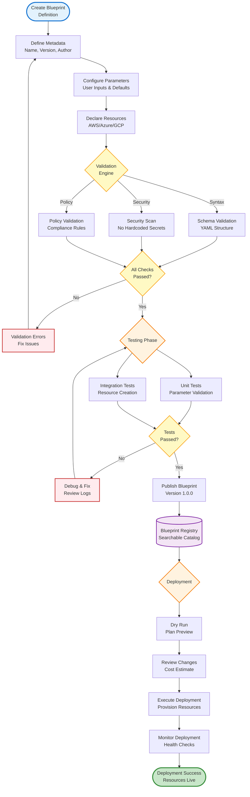

# Custom Blueprints

Complete guide to creating, managing, and validating custom infrastructure blueprints in IAC Dharma.

---

## 📋 Overview

IAC Dharma blueprints are reusable infrastructure templates with:

- **YAML-based definitions**: Simple, human-readable format
- **Multi-cloud support**: AWS, Azure, GCP compatible
- **Validation engine**: Schema validation and security checks
- **Versioning**: Git-based version control
- **Parameterization**: Dynamic values with defaults
- **Composition**: Nested and referenced blueprints
- **CI/CD integration**: Automated testing and deployment

---

## 🔄 Blueprint Lifecycle



---

## 🏗️ Blueprint Structure

### Basic Blueprint

```yaml
# blueprints/custom/simple-web-app.yml
apiVersion: v1
kind: Blueprint
metadata:
  name: simple-web-app
  version: 1.0.0
  description: "Simple web application with load balancer and auto-scaling"
  author: "DevOps Team"
  tags:
    - web
    - autoscaling
    - highly-available
  category: application

spec:
  # Parameters (user inputs)
  parameters:
    - name: environment
      type: string
      description: "Deployment environment"
      required: true
      allowed_values:
        - dev
        - staging
        - production
      default: dev
    
    - name: instance_type
      type: string
      description: "EC2 instance type"
      required: true
      default: t3.medium
      constraints:
        pattern: "^t3\\.(small|medium|large|xlarge)$"
    
    - name: min_instances
      type: integer
      description: "Minimum number of instances"
      required: false
      default: 2
      constraints:
        min: 1
        max: 10
    
    - name: max_instances
      type: integer
      description: "Maximum number of instances"
      required: false
      default: 6
      constraints:
        min: 2
        max: 20
  
  # Resources to create
  resources:
    # VPC
    - name: vpc
      type: aws::vpc
      properties:
        cidr_block: 10.0.0.0/16
        enable_dns_hostnames: true
        enable_dns_support: true
        tags:
          Name: "{{ parameters.environment }}-vpc"
          Environment: "{{ parameters.environment }}"
    
    # Public Subnets
    - name: public_subnet_1
      type: aws::subnet
      properties:
        vpc_id: "{{ resources.vpc.id }}"
        cidr_block: 10.0.1.0/24
        availability_zone: "{{ provider.region }}a"
        map_public_ip_on_launch: true
        tags:
          Name: "{{ parameters.environment }}-public-1"
    
    - name: public_subnet_2
      type: aws::subnet
      properties:
        vpc_id: "{{ resources.vpc.id }}"
        cidr_block: 10.0.2.0/24
        availability_zone: "{{ provider.region }}b"
        map_public_ip_on_launch: true
        tags:
          Name: "{{ parameters.environment }}-public-2"
    
    # Internet Gateway
    - name: igw
      type: aws::internet_gateway
      properties:
        vpc_id: "{{ resources.vpc.id }}"
        tags:
          Name: "{{ parameters.environment }}-igw"
    
    # Application Load Balancer
    - name: alb
      type: aws::application_load_balancer
      properties:
        name: "{{ parameters.environment }}-alb"
        subnets:
          - "{{ resources.public_subnet_1.id }}"
          - "{{ resources.public_subnet_2.id }}"
        security_groups:
          - "{{ resources.alb_sg.id }}"
        tags:
          Environment: "{{ parameters.environment }}"
    
    # Target Group
    - name: target_group
      type: aws::lb_target_group
      properties:
        name: "{{ parameters.environment }}-tg"
        port: 80
        protocol: HTTP
        vpc_id: "{{ resources.vpc.id }}"
        health_check:
          enabled: true
          path: /health
          interval: 30
          timeout: 5
          healthy_threshold: 2
          unhealthy_threshold: 3
    
    # Auto Scaling Group
    - name: asg
      type: aws::autoscaling_group
      properties:
        name: "{{ parameters.environment }}-asg"
        min_size: "{{ parameters.min_instances }}"
        max_size: "{{ parameters.max_instances }}"
        desired_capacity: "{{ parameters.min_instances }}"
        health_check_type: ELB
        health_check_grace_period: 300
        vpc_zone_identifier:
          - "{{ resources.public_subnet_1.id }}"
          - "{{ resources.public_subnet_2.id }}"
        target_group_arns:
          - "{{ resources.target_group.arn }}"
        launch_template:
          launch_template_id: "{{ resources.launch_template.id }}"
          version: "$Latest"
        tags:
          - key: Environment
            value: "{{ parameters.environment }}"
            propagate_at_launch: true
    
    # Launch Template
    - name: launch_template
      type: aws::launch_template
      properties:
        name: "{{ parameters.environment }}-lt"
        image_id: "{{ data.aws_ami.ubuntu.id }}"
        instance_type: "{{ parameters.instance_type }}"
        key_name: "{{ parameters.environment }}-key"
        user_data: "{{ files.user_data_sh | base64encode }}"
        iam_instance_profile:
          arn: "{{ resources.instance_profile.arn }}"
        network_interfaces:
          - associate_public_ip_address: true
            security_groups:
              - "{{ resources.instance_sg.id }}"
    
    # Security Groups
    - name: alb_sg
      type: aws::security_group
      properties:
        name: "{{ parameters.environment }}-alb-sg"
        description: "ALB security group"
        vpc_id: "{{ resources.vpc.id }}"
        ingress:
          - from_port: 80
            to_port: 80
            protocol: tcp
            cidr_blocks:
              - 0.0.0.0/0
          - from_port: 443
            to_port: 443
            protocol: tcp
            cidr_blocks:
              - 0.0.0.0/0
        egress:
          - from_port: 0
            to_port: 0
            protocol: -1
            cidr_blocks:
              - 0.0.0.0/0
    
    - name: instance_sg
      type: aws::security_group
      properties:
        name: "{{ parameters.environment }}-instance-sg"
        description: "Instance security group"
        vpc_id: "{{ resources.vpc.id }}"
        ingress:
          - from_port: 80
            to_port: 80
            protocol: tcp
            security_groups:
              - "{{ resources.alb_sg.id }}"
        egress:
          - from_port: 0
            to_port: 0
            protocol: -1
            cidr_blocks:
              - 0.0.0.0/0
  
  # Outputs (exported values)
  outputs:
    - name: alb_dns_name
      description: "Load balancer DNS name"
      value: "{{ resources.alb.dns_name }}"
    
    - name: alb_url
      description: "Load balancer URL"
      value: "http://{{ resources.alb.dns_name }}"
    
    - name: asg_name
      description: "Auto Scaling Group name"
      value: "{{ resources.asg.name }}"
```

---

## 🔧 Blueprint Components

### 1. Metadata

```yaml
metadata:
  name: my-blueprint
  version: 2.1.0  # Semantic versioning
  description: "Detailed description"
  author: "Your Name <email@company.com>"
  license: MIT
  
  # Categorization
  tags:
    - kubernetes
    - monitoring
    - prometheus
  category: monitoring  # application, database, networking, monitoring, security
  
  # Requirements
  min_platform_version: 1.0.0
  cloud_providers:
    - aws
    - azure
  
  # Links
  documentation: https://docs.company.com/blueprints/my-blueprint
  repository: https://github.com/company/blueprints
  icon: https://company.com/icons/my-blueprint.png
```

### 2. Parameters

```yaml
parameters:
  # String parameter
  - name: app_name
    type: string
    description: "Application name"
    required: true
    default: my-app
    constraints:
      pattern: "^[a-z][a-z0-9-]{2,30}$"
      min_length: 3
      max_length: 30
  
  # Integer parameter
  - name: replica_count
    type: integer
    description: "Number of replicas"
    required: false
    default: 3
    constraints:
      min: 1
      max: 10
  
  # Number (float) parameter
  - name: cpu_limit
    type: number
    description: "CPU limit in cores"
    required: false
    default: 1.5
    constraints:
      min: 0.5
      max: 8.0
  
  # Boolean parameter
  - name: enable_monitoring
    type: boolean
    description: "Enable Prometheus monitoring"
    required: false
    default: true
  
  # Array parameter
  - name: allowed_ips
    type: array
    description: "Allowed IP addresses"
    required: false
    default:
      - 10.0.0.0/8
      - 172.16.0.0/12
    constraints:
      min_items: 1
      max_items: 10
      item_type: string
      item_pattern: "^\\d{1,3}\\.\\d{1,3}\\.\\d{1,3}\\.\\d{1,3}/\\d{1,2}$"
  
  # Object parameter
  - name: database_config
    type: object
    description: "Database configuration"
    required: true
    default:
      engine: postgres
      version: "15"
      instance_class: db.t3.medium
    constraints:
      required_fields:
        - engine
        - version
  
  # Enum parameter
  - name: environment
    type: string
    description: "Deployment environment"
    required: true
    allowed_values:
      - dev
      - staging
      - production
    default: dev
```

### 3. Resources

```yaml
resources:
  # AWS EC2 Instance
  - name: web_server
    type: aws::ec2::instance
    properties:
      instance_type: t3.medium
      ami_id: "{{ data.aws_ami.ubuntu.id }}"
      subnet_id: "{{ resources.subnet.id }}"
      tags:
        Name: Web Server
    
    # Dependencies
    depends_on:
      - subnet
      - security_group
    
    # Conditions
    condition: "{{ parameters.environment == 'production' }}"
  
  # Azure Virtual Machine
  - name: vm
    type: azure::compute::virtual_machine
    properties:
      resource_group: "{{ resources.resource_group.name }}"
      location: eastus
      vm_size: Standard_D2s_v3
      admin_username: azureuser
      image:
        publisher: Canonical
        offer: UbuntuServer
        sku: "20.04-LTS"
        version: latest
  
  # GCP Compute Instance
  - name: instance
    type: gcp::compute::instance
    properties:
      name: web-server
      machine_type: n1-standard-2
      zone: us-central1-a
      boot_disk:
        initialize_params:
          image: debian-cloud/debian-11
  
  # Kubernetes Deployment
  - name: app_deployment
    type: kubernetes::apps/v1::deployment
    properties:
      metadata:
        name: "{{ parameters.app_name }}"
        namespace: default
      spec:
        replicas: "{{ parameters.replica_count }}"
        selector:
          match_labels:
            app: "{{ parameters.app_name }}"
        template:
          metadata:
            labels:
              app: "{{ parameters.app_name }}"
          spec:
            containers:
              - name: app
                image: "{{ parameters.container_image }}"
                ports:
                  - container_port: 8080
                resources:
                  limits:
                    cpu: "{{ parameters.cpu_limit }}"
                    memory: 1Gi
                  requests:
                    cpu: 0.5
                    memory: 512Mi
```

---

## 🔄 Template Variables

### Built-in Variables

```yaml
# Provider information
{{ provider.type }}          # aws, azure, gcp
{{ provider.region }}        # us-east-1, eastus, us-central1
{{ provider.account_id }}    # Cloud account ID

# Resource references
{{ resources.vpc.id }}       # VPC resource ID
{{ resources.alb.dns_name }} # ALB DNS name
{{ resources.db.endpoint }}  # Database endpoint

# Parameter values
{{ parameters.environment }}  # User-provided parameter
{{ parameters.instance_type }}

# Data sources
{{ data.aws_ami.ubuntu.id }}  # AMI lookup result
{{ data.aws_vpc.main.cidr }}  # VPC data

# Files
{{ files.user_data_sh }}           # Read file content
{{ files.config_json | fromjson }} # Parse JSON

# Environment
{{ env.AWS_REGION }}    # Environment variable
{{ env.HOME }}
```

### Filters

```yaml
# String filters
{{ parameters.app_name | upper }}         # UPPERCASE
{{ parameters.app_name | lower }}         # lowercase
{{ parameters.app_name | title }}         # Title Case
{{ parameters.app_name | replace('-', '_') }}  # Replace chars

# Encoding
{{ files.user_data_sh | base64encode }}   # Base64 encode
{{ resources.config | tojson }}           # Convert to JSON
{{ resources.config | toyaml }}           # Convert to YAML

# Lists
{{ parameters.subnets | join(',') }}      # Join with comma
{{ parameters.cidrs | first }}            # First item
{{ parameters.cidrs | last }}             # Last item
{{ parameters.zones | length }}           # List length

# Math
{{ parameters.min_instances | add(1) }}   # Addition
{{ parameters.memory_gb | multiply(1024) }} # Convert GB to MB

# Conditionals
{{ parameters.enable_ssl | ternary('443', '80') }}  # If true: 443, else: 80
```

### Conditional Blocks

```yaml
# If condition

resources:
  - name: monitoring
    type: aws::cloudwatch::alarm
    properties:
      alarm_name: high-cpu


# If-else

ingress:
  - from_port: 443
    to_port: 443
    protocol: tcp

ingress:
  - from_port: 80
    to_port: 80
    protocol: tcp


# For loop

  - name: "subnet_{{ loop.index }}"
    type: aws::subnet
    properties:
      availability_zone: "{{ zone }}"
      cidr_block: "10.0.{{ loop.index }}.0/24"

```

---

## 📦 Blueprint Composition

### Nested Blueprints

```yaml
# Parent blueprint
apiVersion: v1
kind: Blueprint
metadata:
  name: full-stack-app
  version: 1.0.0

spec:
  parameters:
    - name: environment
      type: string
      required: true
  
  # Include other blueprints
  includes:
    # Network layer
    - blueprint: networking/vpc-with-subnets
      version: 2.0.0
      parameters:
        environment: "{{ parameters.environment }}"
        cidr_block: 10.0.0.0/16
      outputs_as: network
    
    # Database layer
    - blueprint: database/postgres-cluster
      version: 1.5.0
      parameters:
        environment: "{{ parameters.environment }}"
        vpc_id: "{{ network.vpc_id }}"
        subnet_ids: "{{ network.private_subnet_ids }}"
      outputs_as: database
    
    # Application layer
    - blueprint: application/web-app
      version: 3.0.0
      parameters:
        environment: "{{ parameters.environment }}"
        vpc_id: "{{ network.vpc_id }}"
        subnet_ids: "{{ network.public_subnet_ids }}"
        database_endpoint: "{{ database.endpoint }}"
      outputs_as: application
  
  outputs:
    - name: app_url
      value: "{{ application.url }}"
    
    - name: db_endpoint
      value: "{{ database.endpoint }}"
```

### Blueprint References

```yaml
# Reference external blueprint
resources:
  - name: shared_vpc
    type: blueprint::reference
    properties:
      blueprint_id: vpc-12345
      version: 1.0.0
      # Use outputs from referenced blueprint
      outputs:
        - vpc_id
        - subnet_ids
  
  # Use referenced outputs
  - name: instance
    type: aws::ec2::instance
    properties:
      vpc_id: "{{ resources.shared_vpc.outputs.vpc_id }}"
      subnet_id: "{{ resources.shared_vpc.outputs.subnet_ids[0] }}"
```

---

## ✅ Blueprint Validation

### Schema Validation

```bash
# Validate blueprint syntax
iac-dharma blueprint validate blueprints/custom/my-blueprint.yml

# Output:
✓ Syntax valid
✓ All required fields present
✓ Parameter types correct
✓ Resource types supported
✓ Template variables valid
! Warning: Resource 'my_bucket' has no tags
✓ Validation passed with 1 warning
```

### Security Validation

```bash
# Security checks
iac-dharma blueprint validate \
  --security \
  blueprints/custom/my-blueprint.yml

# Checks:
# - No hardcoded secrets
# - Security groups not too open (0.0.0.0/0)
# - Encryption enabled
# - IAM policies follow least privilege
# - Public access reviewed
```

### Custom Validation Rules

```yaml
# .iac-dharma/validation-rules.yml
rules:
  # Require encryption
  - id: s3-encryption-required
    resource_type: aws::s3::bucket
    condition: properties.encryption.enabled == true
    severity: error
    message: "S3 buckets must have encryption enabled"
  
  # Tag requirements
  - id: required-tags
    resource_type: "*"
    condition: |
      tags.Environment != null &&
      tags.Owner != null &&
      tags.CostCenter != null
    severity: warning
    message: "Resources should have Environment, Owner, and CostCenter tags"
  
  # Instance size limits
  - id: instance-size-limit
    resource_type: aws::ec2::instance
    condition: |
      properties.instance_type not in [
        't3.2xlarge', 't3.xlarge', 'm5.2xlarge'
      ]
    severity: warning
    message: "Large instance types require approval"
```

---

## 🧪 Blueprint Testing

### Unit Tests

```yaml
# tests/blueprints/my-blueprint.test.yml
apiVersion: v1
kind: BlueprintTest
metadata:
  name: test-simple-web-app
  blueprint: simple-web-app
  version: 1.0.0

tests:
  # Test with minimal parameters
  - name: minimal-config
    description: "Test with default values"
    parameters:
      environment: dev
      instance_type: t3.medium
    
    assertions:
      - type: resource_created
        resource: vpc
      
      - type: resource_property
        resource: asg
        property: min_size
        expected: 2
      
      - type: output_exists
        output: alb_dns_name
  
  # Test production environment
  - name: production-config
    description: "Test production setup"
    parameters:
      environment: production
      instance_type: t3.large
      min_instances: 4
      max_instances: 10
    
    assertions:
      - type: resource_property
        resource: asg
        property: min_size
        expected: 4
      
      - type: resource_count
        resource_type: aws::subnet
        expected: 2
      
      - type: tag_present
        resource: vpc
        tag: Environment
        value: production
```

### Integration Tests

```bash
# Run blueprint tests
iac-dharma blueprint test \
  --blueprint simple-web-app \
  --test-file tests/blueprints/my-blueprint.test.yml

# Dry-run deployment
iac-dharma blueprint deploy \
  --blueprint simple-web-app \
  --dry-run \
  --param environment=staging
```

---

## 📚 Blueprint Library

### Publishing Blueprints

```bash
# Initialize blueprint repository
iac-dharma blueprint init my-blueprint
cd my-blueprint

# Add blueprint files
# - blueprint.yml (main definition)
# - README.md (documentation)
# - files/ (scripts, configs)
# - tests/ (test cases)

# Validate
iac-dharma blueprint validate blueprint.yml

# Publish to registry
iac-dharma blueprint publish \
  --registry https://blueprints.company.com \
  --version 1.0.0
```

### Using Published Blueprints

```bash
# Search blueprints
iac-dharma blueprint search web-app

# Install blueprint
iac-dharma blueprint install \
  --name simple-web-app \
  --version 1.0.0

# List installed blueprints
iac-dharma blueprint list

# Deploy blueprint
iac-dharma blueprint deploy \
  --blueprint simple-web-app \
  --param environment=production \
  --param instance_type=t3.large
```

---

## 🔍 Troubleshooting

### Common Issues

**Validation Errors**:
```bash
# Check specific validation rule
iac-dharma blueprint validate \
  --rule s3-encryption-required \
  blueprint.yml

# Skip warnings
iac-dharma blueprint validate \
  --no-warnings \
  blueprint.yml
```

**Template Rendering Issues**:
```bash
# Debug template rendering
iac-dharma blueprint render \
  --blueprint my-blueprint \
  --param environment=dev \
  --debug

# Output rendered template
iac-dharma blueprint render \
  --blueprint my-blueprint \
  --output rendered.yml
```

---

## 📚 Related Documentation

- [Terraform-Templates](Terraform-Templates) - Terraform module templates
- [API Reference](API-Reference) - Blueprint API endpoints
- [Development-Setup](Development-Setup) - Local blueprint development
- [Testing-Guide](Testing-Guide) - Blueprint testing strategies

---

**Next Steps**: Explore [Terraform-Templates](Terraform-Templates) for IaC patterns.
