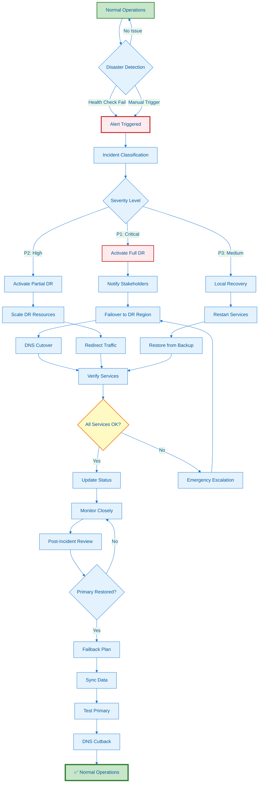

---
**Document Type:** Disaster Recovery & Business Continuity Plan  
**Audience:** SREs, Infrastructure Teams, Business Continuity Managers  
**Classification:** Critical - Business Continuity  
**Version:** 2.0  
**Last Updated:** December 3, 2025  
**Reading Time:** ~45 minutes  
**Copyright:** © 2024-2025 Raghavendra Deshpande. All Rights Reserved.  
---

# 🚨 Disaster Recovery - IAC Dharma Platform

> **Business Continuity Assurance**: Enterprise disaster recovery with multi-region failover, 99.99% availability, RTO < 1 hour, RPO < 15 minutes

---

## 🎯 Disaster Recovery Workflow



---

# Disaster Recovery

Comprehensive guide to disaster recovery planning, backup strategies, and business continuity for IAC Dharma.

---

## 📋 Overview

IAC Dharma provides enterprise-grade disaster recovery (DR) capabilities:

- **Multi-Region Failover**: Automated failover to secondary regions
- **Backup & Restore**: Comprehensive backup strategies
- **RPO/RTO Targets**: 15-minute RPO, 1-hour RTO
- **DR Testing**: Regular DR drills and validation
- **Business Continuity**: 99.99% availability target

---

## 🎯 DR Strategy

### Recovery Objectives

**Recovery Point Objective (RPO)**:
- **Critical Systems**: 15 minutes (maximum acceptable data loss)
- **Standard Systems**: 1 hour
- **Non-Critical Systems**: 24 hours

**Recovery Time Objective (RTO)**:
- **Critical Systems**: 1 hour (maximum acceptable downtime)
- **Standard Systems**: 4 hours
- **Non-Critical Systems**: 8 hours

**Service Tier Classification**:
```yaml
service_tiers:
  tier_1_critical:
    services:
      - api-gateway
      - authentication
      - database
    rpo: 15_minutes
    rto: 1_hour
    availability_target: 99.99%
  
  tier_2_standard:
    services:
      - blueprint-service
      - iac-generator
      - monitoring
    rpo: 1_hour
    rto: 4_hours
    availability_target: 99.9%
  
  tier_3_non_critical:
    services:
      - reporting
      - analytics
      - batch-jobs
    rpo: 24_hours
    rto: 8_hours
    availability_target: 99.5%
```

### DR Patterns

**1. Backup and Restore** (Lowest cost, highest RTO):
- Regular backups to S3
- Restore when needed
- RTO: 4-8 hours, RPO: 1-24 hours
- Cost: $

**2. Pilot Light** (Minimal resources running):
- Core components running in DR region
- Scale up when needed
- RTO: 1-4 hours, RPO: 15 minutes - 1 hour
- Cost: $$

**3. Warm Standby** (Scaled-down version running):
- Fully functional but smaller capacity
- Scale up for full load
- RTO: 30 minutes - 1 hour, RPO: 15 minutes
- Cost: $$$

**4. Multi-Site Active/Active** (Zero downtime):
- Full capacity in multiple regions
- Traffic distributed across all sites
- RTO: < 1 minute, RPO: Near-zero
- Cost: $$$$

**IAC Dharma Strategy**: **Warm Standby** (balanced cost/RTO)

---

## 🏗️ Multi-Region Architecture

### Primary Region (us-east-1)

```
┌─────────────────────────────────────────────────────────────┐
│                    Primary Region (us-east-1)                │
├─────────────────────────────────────────────────────────────┤
│                                                              │
│  ┌──────────────────────────────────────────────────────┐  │
│  │  Route 53 (Primary)                                  │  │
│  │  Health Check: Enabled                               │  │
│  │  Failover: PRIMARY                                   │  │
│  └──────────────────────────────────────────────────────┘  │
│                            │                                 │
│  ┌──────────────────────────────────────────────────────┐  │
│  │  CloudFront (Primary Origin)                         │  │
│  └──────────────────────────────────────────────────────┘  │
│                            │                                 │
│  ┌──────────────────────────────────────────────────────┐  │
│  │  Application Load Balancer                           │  │
│  │  Targets: 6 instances (3 per AZ)                     │  │
│  └──────────────────────────────────────────────────────┘  │
│                            │                                 │
│  ┌──────────────────────────────────────────────────────┐  │
│  │  Application Servers                                 │  │
│  │  • API Gateway (3 replicas)                          │  │
│  │  • Blueprint Service (3 replicas)                    │  │
│  │  • IAC Generator (3 replicas)                        │  │
│  └──────────────────────────────────────────────────────┘  │
│                            │                                 │
│  ┌──────────────────────────────────────────────────────┐  │
│  │  RDS PostgreSQL (Primary)                            │  │
│  │  • Multi-AZ: Enabled                                 │  │
│  │  • Read Replicas: 2                                  │  │
│  │  • Cross-Region Replica: us-west-2                   │  │
│  │  • Automated Backups: Enabled (15-min intervals)     │  │
│  └──────────────────────────────────────────────────────┘  │
│                            │                                 │
│                            │ Continuous Replication          │
│                            ▼                                 │
└─────────────────────────────────────────────────────────────┘
```

### DR Region (us-west-2)

```
┌─────────────────────────────────────────────────────────────┐
│                     DR Region (us-west-2)                    │
├─────────────────────────────────────────────────────────────┤
│                                                              │
│  ┌──────────────────────────────────────────────────────┐  │
│  │  Route 53 (Secondary)                                │  │
│  │  Health Check: Monitoring Primary                    │  │
│  │  Failover: SECONDARY                                 │  │
│  └──────────────────────────────────────────────────────┘  │
│                            │                                 │
│  ┌──────────────────────────────────────────────────────┐  │
│  │  CloudFront (Secondary Origin - standby)             │  │
│  └──────────────────────────────────────────────────────┘  │
│                            │                                 │
│  ┌──────────────────────────────────────────────────────┐  │
│  │  Application Load Balancer (Standby)                 │  │
│  │  Targets: 2 instances (1 per AZ) - scaled down      │  │
│  └──────────────────────────────────────────────────────┘  │
│                            │                                 │
│  ┌──────────────────────────────────────────────────────┐  │
│  │  Application Servers (Warm Standby)                  │  │
│  │  • API Gateway (1 replica) - can scale to 3         │  │
│  │  • Blueprint Service (1 replica) - can scale to 3   │  │
│  │  • IAC Generator (1 replica) - can scale to 3       │  │
│  └──────────────────────────────────────────────────────┘  │
│                            │                                 │
│  ┌──────────────────────────────────────────────────────┐  │
│  │  RDS PostgreSQL (Cross-Region Replica)               │  │
│  │  • Multi-AZ: Enabled                                 │  │
│  │  • Read-Only: Yes (until promoted)                   │  │
│  │  • Automated Backups: Enabled                        │  │
│  │  • Can be promoted to primary in < 5 minutes         │  │
│  └──────────────────────────────────────────────────────┘  │
│                                                              │
└─────────────────────────────────────────────────────────────┘
```

### Terraform Configuration

**Route 53 Failover**:
```hcl
# Primary record
resource "aws_route53_record" "primary" {
  zone_id = aws_route53_zone.main.zone_id
  name    = "app.iac-dharma.com"
  type    = "A"

  set_identifier  = "primary"
  failover_routing_policy {
    type = "PRIMARY"
  }

  alias {
    name                   = aws_lb.primary.dns_name
    zone_id                = aws_lb.primary.zone_id
    evaluate_target_health = true
  }

  health_check_id = aws_route53_health_check.primary.id
}

# Secondary record
resource "aws_route53_record" "secondary" {
  zone_id = aws_route53_zone.main.zone_id
  name    = "app.iac-dharma.com"
  type    = "A"

  set_identifier  = "secondary"
  failover_routing_policy {
    type = "SECONDARY"
  }

  alias {
    name                   = aws_lb.secondary.dns_name
    zone_id                = aws_lb.secondary.zone_id
    evaluate_target_health = true
  }
}

# Health check for primary
resource "aws_route53_health_check" "primary" {
  fqdn              = "app-primary.iac-dharma.com"
  port              = 443
  type              = "HTTPS"
  resource_path     = "/health"
  failure_threshold = 3
  request_interval  = 30

  tags = {
    Name = "iac-dharma-primary-health"
  }
}
```

**Cross-Region RDS Replica**:
```hcl
# Primary database
resource "aws_db_instance" "primary" {
  provider             = aws.us_east_1
  identifier           = "iac-dharma-primary"
  engine               = "postgres"
  engine_version       = "15.4"
  instance_class       = "db.r6g.xlarge"
  allocated_storage    = 100
  storage_type         = "gp3"
  storage_encrypted    = true
  
  multi_az             = true
  backup_retention_period = 30
  backup_window        = "03:00-04:00"
  
  enabled_cloudwatch_logs_exports = ["postgresql", "upgrade"]
  
  tags = {
    Name = "iac-dharma-primary-db"
  }
}

# Cross-region read replica
resource "aws_db_instance" "replica" {
  provider                = aws.us_west_2
  identifier              = "iac-dharma-replica"
  replicate_source_db     = aws_db_instance.primary.arn
  instance_class          = "db.r6g.large"  # Smaller for cost
  storage_encrypted       = true
  
  multi_az                = true
  backup_retention_period = 7
  
  # Can be promoted to standalone
  skip_final_snapshot = false
  
  tags = {
    Name = "iac-dharma-replica-db"
  }
}
```

---

## 💾 Backup Strategy

### Database Backups

**Automated Backups**:
```yaml
database_backups:
  postgresql:
    method: rds_automated
    frequency: continuous  # Transaction log shipping
    retention:
      automated: 30_days
      manual_snapshots: 90_days
    
    snapshot_schedule:
      - time: "02:00 UTC"
        frequency: daily
        type: automated
      
      - time: "Sunday 01:00 UTC"
        frequency: weekly
        type: manual
        tag: weekly_backup
    
    cross_region_copy:
      enabled: true
      destination: us-west-2
      retention: 30_days
    
    encryption:
      enabled: true
      kms_key: arn:aws:kms:us-east-1:123456789012:key/12345678
```

**Manual Backup Script**:
```bash
#!/bin/bash
# manual-db-backup.sh

TIMESTAMP=$(date +%Y%m%d_%H%M%S)
BACKUP_DIR="/backups/postgresql"
S3_BUCKET="s3://iac-dharma-backups"

# Create backup
pg_dump -h $DB_HOST -U $DB_USER -d $DB_NAME \
  --format=custom \
  --compress=9 \
  --file="$BACKUP_DIR/db_backup_$TIMESTAMP.dump"

# Encrypt backup
openssl enc -aes-256-cbc -salt \
  -in "$BACKUP_DIR/db_backup_$TIMESTAMP.dump" \
  -out "$BACKUP_DIR/db_backup_$TIMESTAMP.dump.enc" \
  -pass pass:$ENCRYPTION_KEY

# Upload to S3
aws s3 cp "$BACKUP_DIR/db_backup_$TIMESTAMP.dump.enc" \
  "$S3_BUCKET/postgresql/manual/" \
  --storage-class STANDARD_IA

# Cleanup local files older than 7 days
find $BACKUP_DIR -name "*.dump*" -mtime +7 -delete

echo "Backup completed: db_backup_$TIMESTAMP.dump.enc"
```

### Application State Backups

**Redis Persistence**:
```yaml
redis_backup:
  persistence:
    rdb:
      enabled: true
      save_rules:
        - "900 1"    # Save after 900 sec if 1 key changed
        - "300 10"   # Save after 300 sec if 10 keys changed
        - "60 10000" # Save after 60 sec if 10000 keys changed
      filename: dump.rdb
      compression: yes
    
    aof:
      enabled: true
      filename: appendonly.aof
      fsync: everysec  # every write, everysec, no
      auto_aof_rewrite_percentage: 100
      auto_aof_rewrite_min_size: 64mb
  
  backup_schedule:
    - time: "03:00 UTC"
      frequency: daily
      destination: s3://iac-dharma-backups/redis/
      retention: 7_days
```

### Configuration Backups

**Backup Critical Configurations**:
```bash
#!/bin/bash
# backup-configs.sh

BACKUP_DIR="/backups/configs"
TIMESTAMP=$(date +%Y%m%d_%H%M%S)

# Backup environment variables
env > "$BACKUP_DIR/env_$TIMESTAMP.txt"

# Backup Docker Compose files
cp docker-compose*.yml "$BACKUP_DIR/"

# Backup Kubernetes manifests
kubectl get all --all-namespaces -o yaml > "$BACKUP_DIR/k8s_all_$TIMESTAMP.yaml"

# Backup Terraform state
cd /infrastructure/terraform
terraform state pull > "$BACKUP_DIR/terraform_state_$TIMESTAMP.json"

# Create archive
tar -czf "$BACKUP_DIR/configs_$TIMESTAMP.tar.gz" "$BACKUP_DIR"/*_$TIMESTAMP.*

# Upload to S3
aws s3 cp "$BACKUP_DIR/configs_$TIMESTAMP.tar.gz" \
  s3://iac-dharma-backups/configs/
```

---

## 🚨 Failover Procedures

### Automated Failover

**Health Check Monitoring**:
```yaml
health_checks:
  primary_region:
    endpoint: https://app.iac-dharma.com/health
    interval: 30_seconds
    timeout: 10_seconds
    unhealthy_threshold: 3
    healthy_threshold: 2
    
    actions:
      on_failure:
        - notify: ["ops-team@company.com", "slack-channel"]
        - trigger: automated_failover
        - wait: 60_seconds  # Grace period
        - execute: promote_dr_region
```

**Automated Failover Script**:
```bash
#!/bin/bash
# automated-failover.sh

set -e

echo "=== Automated Failover Initiated ==="
echo "Timestamp: $(date)"

# 1. Verify primary is down
echo "Step 1: Verifying primary region failure..."
PRIMARY_HEALTH=$(curl -s -o /dev/null -w "%{http_code}" https://app-primary.iac-dharma.com/health)

if [ "$PRIMARY_HEALTH" != "200" ]; then
  echo "Primary region unhealthy (HTTP $PRIMARY_HEALTH)"
else
  echo "Primary region appears healthy. Aborting failover."
  exit 1
fi

# 2. Promote RDS replica
echo "Step 2: Promoting RDS replica in us-west-2..."
aws rds promote-read-replica \
  --db-instance-identifier iac-dharma-replica \
  --region us-west-2

# Wait for promotion
echo "Waiting for database promotion..."
aws rds wait db-instance-available \
  --db-instance-identifier iac-dharma-replica \
  --region us-west-2

# 3. Scale up application servers
echo "Step 3: Scaling up application servers..."
aws autoscaling set-desired-capacity \
  --auto-scaling-group-name iac-dharma-asg-dr \
  --desired-capacity 6 \
  --region us-west-2

# 4. Update Route 53 (manual verification recommended)
echo "Step 4: Route 53 should automatically failover"
echo "Health check will detect primary failure"

# 5. Verify DR region health
echo "Step 5: Verifying DR region..."
sleep 60  # Wait for services to stabilize

DR_HEALTH=$(curl -s -o /dev/null -w "%{http_code}" https://app.iac-dharma.com/health)
if [ "$DR_HEALTH" == "200" ]; then
  echo "✅ DR region is healthy"
else
  echo "❌ DR region health check failed (HTTP $DR_HEALTH)"
  exit 1
fi

# 6. Notifications
echo "Step 6: Sending notifications..."
aws sns publish \
  --topic-arn arn:aws:sns:us-east-1:123456789012:dr-notifications \
  --subject "Failover Complete" \
  --message "IAC Dharma has failed over to DR region (us-west-2). Primary region (us-east-1) is offline."

echo "=== Failover Complete ==="
echo "DR region is now serving traffic"
```

### Manual Failover

**Manual Failover Checklist**:
```markdown
# Manual Failover Procedure

## Pre-Failover (15 minutes)
- [ ] Declare incident and notify stakeholders
- [ ] Verify primary region is truly unavailable
- [ ] Assemble incident response team
- [ ] Check DR region health status
- [ ] Review recent backups

## Failover Execution (30 minutes)
- [ ] Stop application traffic to primary (if possible)
- [ ] Promote RDS replica in DR region
- [ ] Verify database promotion successful
- [ ] Scale up ASG in DR region to full capacity
- [ ] Update application configuration (DB endpoints)
- [ ] Restart application services with new config
- [ ] Verify application health in DR region
- [ ] Update Route 53 to point to DR region
- [ ] Verify DNS propagation

## Post-Failover (15 minutes)
- [ ] Monitor application metrics and logs
- [ ] Test critical user workflows
- [ ] Notify users of temporary disruption (if any)
- [ ] Document incident timeline
- [ ] Schedule post-mortem meeting

## Estimated Total Time: 60 minutes (within 1-hour RTO)
```

---

## 🔄 Failback Procedures

### Planned Failback

**After Primary Region Recovery**:
```bash
#!/bin/bash
# planned-failback.sh

set -e

echo "=== Planned Failback to Primary Region ==="
echo "Timestamp: $(date)"

# 1. Verify primary region is healthy
echo "Step 1: Verifying primary region..."
PRIMARY_HEALTH=$(curl -s https://app-primary.iac-dharma.com/health)
echo "Primary health: $PRIMARY_HEALTH"

# 2. Sync data from DR to Primary
echo "Step 2: Syncing data..."
# Promote current primary (DR) to writable
# Create new replica in original primary region
# Wait for replication to catch up

# 3. Maintenance window notification
echo "Step 3: Notifying users of maintenance window..."
aws sns publish \
  --topic-arn arn:aws:sns:us-east-1:123456789012:maintenance-notifications \
  --subject "Scheduled Maintenance: Failback to Primary Region" \
  --message "IAC Dharma will undergo maintenance for 15 minutes starting at $(date -d '+1 hour')"

# 4. Wait for maintenance window
echo "Waiting for maintenance window..."
sleep 3600  # 1 hour

# 5. Switch traffic back to primary
echo "Step 4: Switching traffic to primary region..."
# Update Route 53 to point back to us-east-1
# Use weighted routing for gradual cutover

# 6. Monitor for issues
echo "Step 5: Monitoring..."
# Monitor for 30 minutes
# Roll back if issues detected

# 7. Scale down DR region to warm standby
echo "Step 6: Scaling down DR region..."
aws autoscaling set-desired-capacity \
  --auto-scaling-group-name iac-dharma-asg-dr \
  --desired-capacity 2 \
  --region us-west-2

echo "=== Failback Complete ==="
```

---

## 🧪 DR Testing

### DR Drill Schedule

```yaml
dr_testing:
  schedule:
    - name: "Quarterly Full DR Test"
      frequency: quarterly
      scope: full_failover
      duration: 4_hours
      participants:
        - engineering
        - operations
        - management
      
    - name: "Monthly Backup Restore Test"
      frequency: monthly
      scope: backup_restore
      duration: 2_hours
      participants:
        - operations
      
    - name: "Weekly Health Check Validation"
      frequency: weekly
      scope: monitoring_validation
      duration: 30_minutes
      participants:
        - operations
```

**DR Test Procedure**:
```markdown
# Quarterly DR Test Procedure

## Preparation (1 hour)
1. Schedule test during low-traffic period
2. Notify all stakeholders
3. Verify DR environment is up-to-date
4. Document current system state

## Execution (2 hours)
1. Simulate primary region failure
2. Execute automated failover
3. Verify application availability in DR region
4. Test critical user workflows
5. Measure RTO/RPO
6. Document any issues

## Failback (30 minutes)
1. Restore primary region
2. Execute failback procedure
3. Verify application availability in primary region
4. Validate data consistency

## Post-Test (30 minutes)
1. Review test results
2. Document lessons learned
3. Update DR procedures
4. Create action items for improvements
```

---

## 📊 DR Metrics & Monitoring

### Key Metrics

```yaml
dr_metrics:
  availability:
    - name: "Regional Availability"
      target: 99.99%
      measurement: uptime_checks
    
    - name: "Failover Success Rate"
      target: 100%
      measurement: successful_failovers / total_failover_attempts
  
  performance:
    - name: "RTO Achievement"
      target: "< 1 hour"
      measurement: actual_recovery_time
    
    - name: "RPO Achievement"
      target: "< 15 minutes"
      measurement: data_loss_duration
    
    - name: "Replication Lag"
      target: "< 30 seconds"
      measurement: primary_to_replica_delay
  
  backup:
    - name: "Backup Success Rate"
      target: 100%
      measurement: successful_backups / total_backup_attempts
    
    - name: "Restore Success Rate"
      target: 100%
      measurement: successful_restores / total_restore_attempts
```

### Grafana Dashboard

**DR Monitoring Panel**:
- Primary region health status
- DR region health status
- Replication lag (database, cache)
- Last successful backup timestamp
- Failover history
- RTO/RPO trending

---

## 📚 Related Documentation

- [Backup and Recovery](Backup-and-Recovery) - Detailed backup procedures
- [Database Management](Database-Management) - Database replication
- [Advanced Networking](Advanced-Networking) - Multi-region networking
- [Observability](Observability) - DR monitoring

---

**Next Steps**: Review [Database-Management](Database-Management) for database-specific DR strategies.
