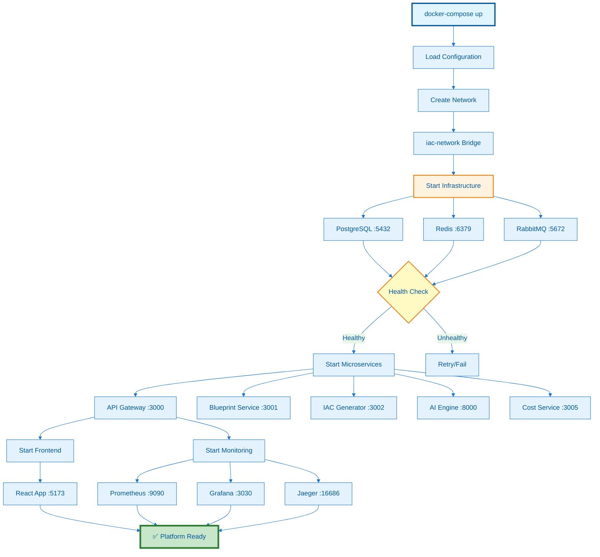

---
**Document Type:** Container Orchestration Guide  
**Audience:** Developers, DevOps Engineers, Container Administrators  
**Classification:** Technical - Container Management  
**Version:** 2.0  
**Last Updated:** December 3, 2025  
**Reading Time:** ~45 minutes  
**Copyright:** © 2024-2025 Raghavendra Deshpande. All Rights Reserved.  
---

# 🐳 Docker Compose - IAC Dharma Platform

> **Container Orchestration Made Simple** - Complete guide to running IAC Dharma with Docker Compose for development, testing, and production deployments

---

## 🎯 Docker Compose Service Architecture



---

[](https://www.docker.com/)
[](https://docs.docker.com/compose/)
[](https://github.com/compose-spec/compose-spec)

---

## 🎯 Quick Navigation

| 🚀 **Getting Started** | 🔧 **Configuration** | 📊 **Operations** | 🛠️ **Advanced** |
|----------------------|-------------------|----------------|---------------|
| [Quick Start](#quick-start) | [Environment Files](#environment-files) | [Service Management](#service-management) | [Multi-Stage Builds](#multi-stage-builds) |
| [Installation](#installation-requirements) | [Service Configuration](#service-configuration) | [Scaling](#scaling-services) | [Custom Networks](#custom-networking) |
| [Basic Commands](#basic-commands) | [Resource Limits](#resource-limits-and-quotas) | [Monitoring](#monitoring-and-health-checks) | [Volume Management](#advanced-volume-management) |
| [Architecture](#service-architecture) | [Health Checks](#health-check-configuration) | [Logging](#logging-strategies) | [Security Hardening](#security-best-practices) |

---

## 📚 Table of Contents

- [Overview](#overview)
- [Installation Requirements](#installation-requirements)
- [Quick Start](#quick-start)
- [Service Architecture](#service-architecture)
- [Environment Configurations](#environment-configurations)
  - [Development Environment](#development-environment)
  - [Staging Environment](#staging-environment)
  - [Production Environment](#production-environment)
- [Environment Files](#environment-files)
- [Service Configuration](#service-configuration)
- [Complete docker-compose.yml Reference](#complete-docker-composeyml-reference)
- [Basic Commands](#basic-commands)
- [Service Management](#service-management)
  - [Starting and Stopping](#starting-and-stopping-services)
  - [Viewing Logs](#viewing-logs)
  - [Service Health](#service-health-checks)
- [Scaling Services](#scaling-services)
- [Networking](#networking)
  - [Default Network](#default-network-behavior)
  - [Custom Networks](#custom-networking)
  - [Service Discovery](#service-discovery)
- [Volume Management](#volume-management)
  - [Named Volumes](#named-volumes)
  - [Bind Mounts](#bind-mounts)
  - [Volume Backup](#volume-backup-and-restore)
- [Resource Limits and Quotas](#resource-limits-and-quotas)
- [Health Check Configuration](#health-check-configuration)
- [Logging Strategies](#logging-strategies)
- [Debugging and Troubleshooting](#debugging-and-troubleshooting)
  - [Container Issues](#common-container-issues)
  - [Network Issues](#network-troubleshooting)
  - [Performance Issues](#performance-troubleshooting)
- [Security Best Practices](#security-best-practices)
- [Multi-Stage Builds](#multi-stage-builds)
- [Docker Compose Profiles](#docker-compose-profiles)
- [Integration with CI/CD](#integration-with-cicd)
- [Migration to Production](#migration-to-production)
- [Performance Optimization](#performance-optimization)
- [See Also](#see-also)

---

## Overview

Docker Compose is a tool for defining and running multi-container Docker applications. For **IAC Dharma**, it orchestrates 18+ microservices, databases, caching, and monitoring stack with a single configuration file.

### 🎯 Why Docker Compose for IAC Dharma?

| Advantage | Benefit |
|-----------|---------|
| **Single Command** | Start entire platform with `docker-compose up` |
| **Environment Consistency** | Identical setup across dev/staging/prod |
| **Service Dependencies** | Automatic ordering with `depends_on` |
| **Zero Configuration** | Default networking and service discovery |
| **Resource Control** | CPU/memory limits per service |
| **Hot Reload** | Code changes reflected instantly in development |
| **Easy Debugging** | Access logs, exec into containers, inspect state |

### 📊 Deployment Suitability

| Environment | Recommendation | Max Users | Max Services | Best For |
|-------------|----------------|-----------|--------------|----------|
| **Development** | ⭐⭐⭐⭐⭐ Excellent | N/A | Unlimited | Local development, testing |
| **Staging** | ⭐⭐⭐⭐ Good | <500 | <30 | Pre-production testing |
| **Small Production** | ⭐⭐⭐ Fair | <1000 | <20 | Startups, MVPs |
| **Large Production** | ⭐ Not Recommended | N/A | N/A | Use Kubernetes instead |

---

## Installation Requirements

### Docker Engine

```bash
# Ubuntu/Debian
curl -fsSL https://get.docker.com | sh
sudo usermod -aG docker $USER

# Verify installation
docker --version  # Docker version 20.10+ required
```

### Docker Compose

```bash
# Linux (recommended method)
sudo curl -L "https://github.com/docker/compose/releases/download/v2.23.0/docker-compose-$(uname -s)-$(uname -m)" -o /usr/local/bin/docker-compose
sudo chmod +x /usr/local/bin/docker-compose

# Verify installation
docker-compose --version  # Docker Compose version 2.0+ required
```

### System Requirements

| Environment | CPU | RAM | Disk | Services |
|-------------|-----|-----|------|----------|
| **Minimal Dev** | 2 cores | 4GB | 20GB | 5-8 services |
| **Full Dev** | 4 cores | 8GB | 50GB | All 18 services |
| **Staging** | 8 cores | 16GB | 100GB | All + monitoring |
| **Production** | 16+ cores | 32GB+ | 500GB+ | All + redundancy |

---

## Quick Start

### 1. Clone Repository

```bash
git clone https://github.com/Raghavendra198902/iac.git
cd iac
```

### 2. Configure Environment

```bash
# Copy environment template
cp .env.example .env

# Edit configuration (use your preferred editor)
nano .env

# Minimum required variables:
# DATABASE_PASSWORD=your-secure-password
# JWT_SECRET=your-jwt-secret-key
# REDIS_PASSWORD=your-redis-password
```

### 3. Start All Services

```bash
# Start in detached mode
docker-compose up -d

# Or start with live logs
docker-compose up

# Start specific services only
docker-compose up -d postgres redis api-gateway
```

### 4. Verify Deployment

```bash
# Check service status
docker-compose ps

# View logs
docker-compose logs -f

# Test API Gateway
curl http://localhost:3000/health

# Access Grafana
open http://localhost:3030  # admin/admin
```

### 5. Stop Services

```bash
# Stop all services (keep data)
docker-compose stop

# Stop and remove containers (keep volumes)
docker-compose down

# Stop and remove everything including volumes
docker-compose down -v
```

---

## Service Architecture

IAC Dharma consists of multiple interconnected microservices:

```yaml
┌─────────────────────────────────────────────────────────────┐
│                     Frontend (React + Vite)                  │
│                        Port: 5173                            │
└──────────────────────────┬──────────────────────────────────┘
                           │
┌──────────────────────────▼──────────────────────────────────┐
│                     API Gateway (Node.js)                    │
│                        Port: 3000                            │
└──────────┬───────┬──────┬───────┬─────────┬────────┬────────┘
           │       │      │       │         │        │
    ┌──────▼───┐ ┌▼──────▼───┐  ┌▼─────────▼────┐  ┌▼─────────┐
    │Blueprint │ │IAC        │  │Guardrails    │  │Costing   │
    │Service   │ │Generator  │  │Engine        │  │Service   │
    │:3001     │ │:3002      │  │:3003         │  │:3004     │
    └──────────┘ └───────────┘  └──────────────┘  └──────────┘
    
    ┌──────────┐ ┌───────────┐  ┌──────────────┐  ┌──────────┐
    │Orchestr. │ │Automation │  │Monitoring    │  │SSO       │
    │:3005     │ │:3006      │  │:3007         │  │:3012     │
    └──────────┘ └───────────┘  └──────────────┘  └──────────┘
    
    ┌──────────┐ ┌───────────┐  ┌──────────────┐  ┌──────────┐
    │Cloud     │ │AI Recom.  │  │AI Engine     │  │CMDB      │
    │Provider  │ │:3011      │  │:8000         │  │Agent     │
    │:3010     │ └───────────┘  └──────────────┘  └──────────┘
    └──────────┘
           │                             │
    ┌──────▼──────┐             ┌────────▼────────┐
    │PostgreSQL   │             │Redis Cache      │
    │:5432        │             │:6379            │
    └─────────────┘             └─────────────────┘
    
    Monitoring Stack:
    ┌─────────────┐  ┌──────────────┐  ┌──────────────┐
    │Prometheus   │  │Grafana       │  │Jaeger        │
    │:9090        │  │:3030         │  │:16686        │
    └─────────────┘  └──────────────┘  └──────────────┘
```

### Service Port Mapping

| Service | Internal Port | External Port | Protocol | Description |
|---------|--------------|---------------|----------|-------------|
| **API Gateway** | 3000 | 3000 | HTTP | Main API endpoint |
| **Blueprint Service** | 3001 | 3001 | HTTP | Blueprint management |
| **IAC Generator** | 3002 | 3002 | HTTP | Infrastructure code generation |
| **Guardrails Engine** | 3003 | 3003 | HTTP | Policy enforcement |
| **Costing Service** | 3004 | 3004 | HTTP | Cost estimation |
| **Orchestrator** | 3005 | 3005 | HTTP | Workflow orchestration |
| **Automation Engine** | 3006 | 3006 | HTTP | Automation tasks |
| **Monitoring Service** | 3007 | 3007 | HTTP | Metrics collection |
| **Cloud Provider** | 3010 | 3010 | HTTP | Cloud integrations |
| **AI Recommendations** | 3011 | 3011 | HTTP | AI-powered suggestions |
| **SSO Service** | 3012 | 3012 | HTTP | Authentication |
| **AI Engine** | 8000 | 8000 | HTTP | ML model serving |
| **PostgreSQL** | 5432 | 5432 | TCP | Primary database |
| **Redis** | 6379 | 6379 | TCP | Caching layer |
| **Prometheus** | 9090 | 9090 | HTTP | Metrics storage |
| **Grafana** | 3000 | 3030 | HTTP | Dashboards |
| **Jaeger** | 16686 | 16686 | HTTP | Distributed tracing |
| **Frontend** | 5173 | 5173 | HTTP | React application |

---

## Environment Configurations

### Development Environment

**Purpose**: Local development with hot-reload and debugging enabled

```yaml
# docker-compose.dev.yml
version: '3.8'

services:
  api-gateway:
    build:
      context: ./backend/api-gateway
      dockerfile: Dockerfile.dev
    volumes:
      - ./backend/api-gateway:/app
      - /app/node_modules
    environment:
      - NODE_ENV=development
      - LOG_LEVEL=debug
      - HOT_RELOAD=true
    ports:
      - "3000:3000"
      - "9229:9229"  # Node.js debugger
    command: npm run dev

  postgres:
    image: postgres:14-alpine
    environment:
      - POSTGRES_DB=iac_dharma_dev
      - POSTGRES_USER=dev_user
      - POSTGRES_PASSWORD=dev_password
    ports:
      - "5432:5432"
    volumes:
      - postgres-dev-data:/var/lib/postgresql/data

volumes:
  postgres-dev-data:
```

**Usage**:
```bash
# Start development environment
docker-compose -f docker-compose.dev.yml up

# Rebuild after dependency changes
docker-compose -f docker-compose.dev.yml up --build

# Attach debugger
# VS Code: Use launch.json with remoteRoot: /app
```

### Staging Environment

**Purpose**: Pre-production testing with production-like configuration

```yaml
# docker-compose.staging.yml
version: '3.8'

services:
  api-gateway:
    image: iacdharma/api-gateway:staging-latest
    environment:
      - NODE_ENV=staging
      - LOG_LEVEL=info
    env_file:
      - .env.staging
    deploy:
      resources:
        limits:
          cpus: '1'
          memory: 1G
        reservations:
          cpus: '0.5'
          memory: 512M
    healthcheck:
      test: ["CMD", "curl", "-f", "http://localhost:3000/health"]
      interval: 30s
      timeout: 10s
      retries: 3
    logging:
      driver: "json-file"
      options:
        max-size: "50m"
        max-file: "3"

  postgres:
    image: postgres:14-alpine
    environment:
      - POSTGRES_DB=${DATABASE_NAME}
      - POSTGRES_USER=${DATABASE_USER}
      - POSTGRES_PASSWORD=${DATABASE_PASSWORD}
    volumes:
      - postgres-staging-data:/var/lib/postgresql/data
    deploy:
      resources:
        limits:
          cpus: '2'
          memory: 2G

volumes:
  postgres-staging-data:
    driver: local
```

**Usage**:
```bash
# Deploy to staging
docker-compose -f docker-compose.staging.yml up -d

# Monitor logs
docker-compose -f docker-compose.staging.yml logs -f

# Run smoke tests
./scripts/run-smoke-tests.sh staging
```

### Production Environment

**Purpose**: Production deployment with resource limits, health checks, and monitoring

```yaml
# docker-compose.prod.yml
version: '3.8'

services:
  api-gateway:
    image: iacdharma/api-gateway:1.0.0
    restart: always
    environment:
      - NODE_ENV=production
      - LOG_LEVEL=warn
    env_file:
      - .env.production
    ports:
      - "3000:3000"
    deploy:
      resources:
        limits:
          cpus: '2'
          memory: 2G
        reservations:
          cpus: '1'
          memory: 1G
    healthcheck:
      test: ["CMD", "curl", "-f", "http://localhost:3000/health"]
      interval: 30s
      timeout: 10s
      retries: 3
      start_period: 40s
    logging:
      driver: "json-file"
      options:
        max-size: "100m"
        max-file: "5"
    networks:
      - iac-network

  nginx:
    image: nginx:alpine
    restart: always
    ports:
      - "80:80"
      - "443:443"
    volumes:
      - ./nginx/nginx.conf:/etc/nginx/nginx.conf:ro
      - ./nginx/ssl:/etc/nginx/ssl:ro
      - nginx-cache:/var/cache/nginx
    depends_on:
      - api-gateway
    networks:
      - iac-network

  postgres:
    image: postgres:14-alpine
    restart: always
    environment:
      POSTGRES_DB: ${DATABASE_NAME}
      POSTGRES_USER: ${DATABASE_USER}
      POSTGRES_PASSWORD: ${DATABASE_PASSWORD}
      POSTGRES_INITDB_ARGS: "-E UTF8 --locale=en_US.UTF-8"
    volumes:
      - postgres-prod-data:/var/lib/postgresql/data
      - ./database/init:/docker-entrypoint-initdb.d
    deploy:
      resources:
        limits:
          cpus: '4'
          memory: 4G
    healthcheck:
      test: ["CMD-SHELL", "pg_isready -U ${DATABASE_USER}"]
      interval: 10s
      timeout: 5s
      retries: 5
    networks:
      - iac-network

  redis:
    image: redis:7-alpine
    restart: always
    command: >
      redis-server
      --requirepass ${REDIS_PASSWORD}
      --maxmemory 512mb
      --maxmemory-policy allkeys-lru
      --save 900 1
      --save 300 10
      --save 60 10000
    volumes:
      - redis-prod-data:/data
    deploy:
      resources:
        limits:
          cpus: '1'
          memory: 1G
    healthcheck:
      test: ["CMD", "redis-cli", "--no-auth-warning", "-a", "${REDIS_PASSWORD}", "ping"]
      interval: 10s
      timeout: 5s
      retries: 5
    networks:
      - iac-network

volumes:
  postgres-prod-data:
    driver: local
  redis-prod-data:
    driver: local
  nginx-cache:
    driver: local

networks:
  iac-network:
    driver: bridge
    ipam:
      config:
        - subnet: 172.28.0.0/16
          gateway: 172.28.0.1
```

**Usage**:
```bash
# Production deployment
docker-compose -f docker-compose.prod.yml up -d

# Zero-downtime update
docker-compose -f docker-compose.prod.yml pull
docker-compose -f docker-compose.prod.yml up -d --no-deps --build api-gateway

# Health check
curl http://localhost:3000/health
```

---

## Environment Files

### .env.example Template

```bash
# ======================================
# IAC Dharma Environment Configuration
# ======================================

# Application
NODE_ENV=development
LOG_LEVEL=info
API_BASE_URL=http://localhost:3000

# Database
DATABASE_HOST=postgres
DATABASE_PORT=5432
DATABASE_NAME=iac_dharma
DATABASE_USER=iac_user
DATABASE_PASSWORD=CHANGE_ME_SECURE_PASSWORD
DATABASE_SSL=false
DATABASE_POOL_MIN=2
DATABASE_POOL_MAX=10

# Redis
REDIS_HOST=redis
REDIS_PORT=6379
REDIS_PASSWORD=CHANGE_ME_REDIS_PASSWORD
REDIS_DB=0
REDIS_TTL=3600

# Authentication
JWT_SECRET=CHANGE_ME_JWT_SECRET_KEY
JWT_EXPIRATION=24h
JWT_REFRESH_EXPIRATION=7d
SESSION_SECRET=CHANGE_ME_SESSION_SECRET

# OAuth (optional)
OAUTH_GOOGLE_CLIENT_ID=
OAUTH_GOOGLE_CLIENT_SECRET=
OAUTH_GITHUB_CLIENT_ID=
OAUTH_GITHUB_CLIENT_SECRET=

# AWS (if using AWS services)
AWS_REGION=us-east-1
AWS_ACCESS_KEY_ID=
AWS_SECRET_ACCESS_KEY=
S3_BUCKET_NAME=iac-dharma-storage

# Azure (if using Azure services)
AZURE_SUBSCRIPTION_ID=
AZURE_TENANT_ID=
AZURE_CLIENT_ID=
AZURE_CLIENT_SECRET=

# GCP (if using GCP services)
GCP_PROJECT_ID=
GCP_KEY_FILE_PATH=/secrets/gcp-key.json

# Monitoring
PROMETHEUS_ENABLED=true
GRAFANA_ENABLED=true
JAEGER_ENABLED=true

# Feature Flags
ENABLE_AI_RECOMMENDATIONS=true
ENABLE_COST_OPTIMIZATION=true
ENABLE_GUARDRAILS=true
ENABLE_DEBUG_ENDPOINTS=false

# Email (optional)
SMTP_HOST=smtp.gmail.com
SMTP_PORT=587
SMTP_USER=
SMTP_PASSWORD=
SMTP_FROM=noreply@iacdharma.com

# Sentry (optional)
SENTRY_DSN=
SENTRY_ENVIRONMENT=development

# Rate Limiting
RATE_LIMIT_WINDOW_MS=60000
RATE_LIMIT_MAX_REQUESTS=100
```

### Environment-Specific Files

```bash
# Development
.env.development
- Debug logging
- Hot reload enabled
- Relaxed security
- Mock external services

# Staging
.env.staging
- Info logging
- Production-like config
- Real integrations
- Lower resource limits

# Production
.env.production
- Warn/error logging only
- Strict security
- Full monitoring
- Optimized resources
```

---

## Service Configuration

### Complete Service Configuration Example

```yaml
# Example: API Gateway with all options
api-gateway:
  image: iacdharma/api-gateway:1.0.0
  build:
    context: ./backend/api-gateway
    dockerfile: Dockerfile
    args:
      NODE_VERSION: 18
      BUILD_DATE: ${BUILD_DATE}
  container_name: iac_api_gateway
  hostname: api-gateway
  restart: unless-stopped
  ports:
    - "3000:3000"
  expose:
    - "3000"
  environment:
    NODE_ENV: production
    LOG_LEVEL: info
  env_file:
    - .env.production
  volumes:
    - ./logs:/app/logs
    - ./config:/app/config:ro
  depends_on:
    postgres:
      condition: service_healthy
    redis:
      condition: service_healthy
  healthcheck:
    test: ["CMD", "curl", "-f", "http://localhost:3000/health"]
    interval: 30s
    timeout: 10s
    retries: 3
    start_period: 40s
  deploy:
    resources:
      limits:
        cpus: '2'
        memory: 2G
      reservations:
        cpus: '1'
        memory: 1G
  networks:
    - iac-network
  logging:
    driver: "json-file"
    options:
      max-size: "100m"
      max-file: "5"
      labels: "service=api-gateway"
  labels:
    com.iacdharma.service: "api-gateway"
    com.iacdharma.version: "1.0.0"
```

---

## Basic Commands

### Service Lifecycle

```bash
# Start all services
docker-compose up

# Start in detached mode (background)
docker-compose up -d

# Start specific services
docker-compose up api-gateway postgres redis

# Stop all services (containers remain)
docker-compose stop

# Stop specific service
docker-compose stop api-gateway

# Restart service
docker-compose restart api-gateway

# Restart all services
docker-compose restart

# Pause services (freeze processes)
docker-compose pause

# Unpause services
docker-compose unpause

# Remove stopped containers
docker-compose rm

# Stop and remove containers, networks, images, volumes
docker-compose down

# Down and remove volumes
docker-compose down -v

# Down and remove images
docker-compose down --rmi all
```

### Building and Pulling

```bash
# Build all services
docker-compose build

# Build specific service
docker-compose build api-gateway

# Build without cache
docker-compose build --no-cache

# Build with parallel execution
docker-compose build --parallel

# Pull latest images
docker-compose pull

# Pull specific service
docker-compose pull api-gateway

# Push images to registry
docker-compose push
```

### Viewing Information

```bash
# List running containers
docker-compose ps

# List all containers (including stopped)
docker-compose ps -a

# View service configuration
docker-compose config

# Validate compose file
docker-compose config --quiet

# View container processes
docker-compose top

# View resource usage
docker-compose stats

# View service logs
docker-compose logs

# Follow logs in real-time
docker-compose logs -f

# View logs from specific service
docker-compose logs api-gateway

# View last N lines
docker-compose logs --tail=100 api-gateway

# View logs with timestamps
docker-compose logs --timestamps
```

---

## Service Management

### Starting and Stopping Services

**Sequential Start with Dependencies**:
```bash
# Start database first, then app services
docker-compose up -d postgres redis
sleep 5
docker-compose up -d api-gateway blueprint-service

# Or use depends_on with condition
# (in docker-compose.yml)
api-gateway:
  depends_on:
    postgres:
      condition: service_healthy
```

**Graceful Shutdown**:
```bash
# Stop with 10-second timeout
docker-compose stop -t 10

# Force stop immediately
docker-compose kill

# Send specific signal
docker-compose kill -s SIGTERM api-gateway
```

### Viewing Logs

**Real-time Monitoring**:
```bash
# Follow all logs
docker-compose logs -f

# Follow specific services
docker-compose logs -f api-gateway postgres

# Follow with grep filter
docker-compose logs -f | grep ERROR

# Tail last 100 lines and follow
docker-compose logs -f --tail=100

# Show logs since timestamp
docker-compose logs --since 2024-01-01T00:00:00

# Show logs until timestamp
docker-compose logs --until 2024-01-01T23:59:59
```

**Log Analysis**:
```bash
# Export logs to file
docker-compose logs > logs.txt

# Search for errors
docker-compose logs | grep -i "error\|exception"

# Count log entries per service
docker-compose logs --no-color | awk '{print $2}' | sort | uniq -c

# Monitor log size
docker inspect --format='{{.LogPath}}' iac_api_gateway_1 | xargs du -h
```

### Service Health Checks

**Check Health Status**:
```bash
# View health status
docker-compose ps

# Inspect specific service health
docker inspect --format='{{.State.Health.Status}}' iac_api_gateway_1

# View health check logs
docker inspect --format='{{range .State.Health.Log}}{{.Output}}{{end}}' iac_api_gateway_1

# Wait for healthy status
until [ "$(docker inspect --format='{{.State.Health.Status}}' iac_api_gateway_1)" == "healthy" ]; do
  echo "Waiting for service to become healthy..."
  sleep 2
done
echo "Service is healthy!"
```

---

## Scaling Services

### Horizontal Scaling

```bash
# Scale API Gateway to 3 instances
docker-compose up -d --scale api-gateway=3

# Scale multiple services
docker-compose up -d \
  --scale api-gateway=5 \
  --scale blueprint-service=3 \
  --scale iac-generator=3

# View scaled instances
docker-compose ps api-gateway

# Scale down to 1 instance
docker-compose up -d --scale api-gateway=1
```

### Load Balancing with Nginx

```yaml
# nginx/nginx.conf
upstream api_gateway {
    least_conn;
    server api-gateway-1:3000;
    server api-gateway-2:3000;
    server api-gateway-3:3000;
}

server {
    listen 80;
    
    location / {
        proxy_pass http://api_gateway;
        proxy_set_header Host $host;
        proxy_set_header X-Real-IP $remote_addr;
    }
}
```

### Auto-Scaling Strategy

While Docker Compose doesn't support native auto-scaling, you can implement basic monitoring:

```bash
#!/bin/bash
# auto-scale.sh

CPU_THRESHOLD=80
CURRENT_REPLICAS=$(docker-compose ps -q api-gateway | wc -l)
CPU_USAGE=$(docker stats --no-stream --format "{{.CPUPerc}}" iac_api_gateway_1 | sed 's/%//')

if (( $(echo "$CPU_USAGE > $CPU_THRESHOLD" | bc -l) )); then
    NEW_REPLICAS=$((CURRENT_REPLICAS + 1))
    echo "Scaling up to $NEW_REPLICAS replicas"
    docker-compose up -d --scale api-gateway=$NEW_REPLICAS
elif (( $(echo "$CPU_USAGE < 20" | bc -l) )) && [ $CURRENT_REPLICAS -gt 1 ]; then
    NEW_REPLICAS=$((CURRENT_REPLICAS - 1))
    echo "Scaling down to $NEW_REPLICAS replicas"
    docker-compose up -d --scale api-gateway=$NEW_REPLICAS
fi
```

---

## Networking

### Default Network Behavior

Docker Compose creates a default network automatically:

```yaml
# Automatic network creation
services:
  api-gateway:
    # Accessible at: http://api-gateway:3000
  postgres:
    # Accessible at: http://postgres:5432
```

### Custom Networking

```yaml
version: '3.8'

services:
  api-gateway:
    networks:
      - frontend
      - backend
  
  postgres:
    networks:
      - backend

networks:
  frontend:
    driver: bridge
  backend:
    driver: bridge
    internal: true  # No external access
```

### Network Isolation

```yaml
networks:
  public:
    driver: bridge
  private:
    driver: bridge
    internal: true
  dmz:
    driver: bridge
    ipam:
      config:
        - subnet: 172.25.0.0/16
          gateway: 172.25.0.1
```

### Service Discovery

```bash
# Services communicate via service names
# From api-gateway container:
curl http://postgres:5432
curl http://redis:6379
curl http://blueprint-service:3001/health

# View DNS resolution
docker-compose exec api-gateway nslookup postgres

# Test connectivity
docker-compose exec api-gateway ping -c 3 redis
```

### External Networks

```yaml
# Use existing external network
networks:
  existing_network:
    external: true
    name: my_existing_network

services:
  api-gateway:
    networks:
      - existing_network
```

---

## Volume Management

### Named Volumes

```yaml
volumes:
  postgres_data:
    driver: local
    driver_opts:
      type: none
      device: /mnt/data/postgres
      o: bind
  
  redis_data:
    driver: local
  
  app_logs:
    driver: local
    labels:
      com.iacdharma.description: "Application logs"
```

### Bind Mounts

```yaml
services:
  api-gateway:
    volumes:
      # Read-only config
      - ./config:/app/config:ro
      
      # Read-write logs
      - ./logs:/app/logs:rw
      
      # Exclude node_modules
      - ./backend/api-gateway:/app
      - /app/node_modules
```

### Volume Backup and Restore

**Backup Volumes**:
```bash
# Backup PostgreSQL data volume
docker run --rm \
  -v iac_postgres_data:/data \
  -v $(pwd)/backups:/backup \
  alpine tar czf /backup/postgres-$(date +%Y%m%d).tar.gz -C /data .

# Backup all volumes
for volume in $(docker volume ls --filter name=iac_ -q); do
  docker run --rm \
    -v $volume:/data \
    -v $(pwd)/backups:/backup \
    alpine tar czf /backup/${volume}-$(date +%Y%m%d).tar.gz -C /data .
done
```

**Restore Volumes**:
```bash
# Restore PostgreSQL data
docker run --rm \
  -v iac_postgres_data:/data \
  -v $(pwd)/backups:/backup \
  alpine sh -c "rm -rf /data/* && tar xzf /backup/postgres-20241122.tar.gz -C /data"

# Verify restore
docker-compose up -d postgres
docker-compose exec postgres psql -U postgres -c "\l"
```

**Copy Between Volumes**:
```bash
# Copy data from one volume to another
docker run --rm \
  -v iac_postgres_data_old:/source:ro \
  -v iac_postgres_data_new:/dest \
  alpine sh -c "cp -a /source/. /dest/"
```

---

## Resource Limits and Quotas

### CPU Limits

```yaml
services:
  api-gateway:
    deploy:
      resources:
        limits:
          cpus: '2.0'  # Maximum 2 CPUs
        reservations:
          cpus: '1.0'  # Minimum 1 CPU guaranteed
    
    # Alternative syntax (deprecated but still works)
    cpus: 2.0
    cpu_shares: 1024
    cpu_quota: 50000
    cpu_period: 100000
```

### Memory Limits

```yaml
services:
  api-gateway:
    deploy:
      resources:
        limits:
          memory: 2G  # Hard limit
        reservations:
          memory: 1G  # Soft limit (guaranteed)
    
    # Alternative syntax
    mem_limit: 2g
    memswap_limit: 4g
    mem_reservation: 1g
```

### Disk I/O Limits

```yaml
services:
  postgres:
    blkio_config:
      weight: 1000
      device_read_bps:
        - path: /dev/sda
          rate: '50mb'
      device_write_bps:
        - path: /dev/sda
          rate: '20mb'
```

### PID Limits

```yaml
services:
  api-gateway:
    pids_limit: 100  # Maximum number of processes
```

### Ulimits

```yaml
services:
  api-gateway:
    ulimits:
      nproc: 65535
      nofile:
        soft: 20000
        hard: 40000
```

---

## Health Check Configuration

### HTTP Health Checks

```yaml
services:
  api-gateway:
    healthcheck:
      test: ["CMD", "curl", "-f", "http://localhost:3000/health"]
      interval: 30s
      timeout: 10s
      retries: 3
      start_period: 40s
```

### TCP Health Checks

```yaml
services:
  postgres:
    healthcheck:
      test: ["CMD-SHELL", "pg_isready -U postgres"]
      interval: 10s
      timeout: 5s
      retries: 5
```

### Custom Health Checks

```yaml
services:
  redis:
    healthcheck:
      test: ["CMD", "redis-cli", "--raw", "incr", "ping"]
      interval: 10s
```

### Disable Health Checks

```yaml
services:
  api-gateway:
    healthcheck:
      disable: true
```

---

## Logging Strategies

### JSON File Logging

```yaml
services:
  api-gateway:
    logging:
      driver: "json-file"
      options:
        max-size: "100m"
        max-file: "5"
        compress: "true"
        labels: "service=api-gateway,env=production"
```

### Syslog Logging

```yaml
services:
  api-gateway:
    logging:
      driver: "syslog"
      options:
        syslog-address: "tcp://192.168.0.42:123"
        tag: "api-gateway"
```

### Gelf Logging (Graylog)

```yaml
services:
  api-gateway:
    logging:
      driver: "gelf"
      options:
        gelf-address: "udp://localhost:12201"
        tag: "api-gateway"
```

### Fluentd Logging

```yaml
services:
  api-gateway:
    logging:
      driver: "fluentd"
      options:
        fluentd-address: "localhost:24224"
        tag: "docker.{{.Name}}"
```

---

## Debugging and Troubleshooting

### Common Container Issues

**Container Exits Immediately**:
```bash
# Check exit code
docker-compose ps

# View logs
docker-compose logs api-gateway

# Run interactively
docker-compose run --rm api-gateway sh

# Check entrypoint
docker-compose config | grep -A 5 api-gateway

# Override command
docker-compose run --rm --entrypoint sh api-gateway
```

**Port Already in Use**:
```bash
# Find process using port
lsof -i :3000
netstat -tulpn | grep 3000

# Kill process
kill -9 $(lsof -t -i:3000)

# Use different port
API_GATEWAY_PORT=3001 docker-compose up
```

**Permission Denied**:
```bash
# Fix volume permissions
docker-compose run --rm --user root api-gateway chown -R node:node /app

# Run as specific user
docker-compose run --rm --user 1000:1000 api-gateway sh
```

**Out of Memory**:
```bash
# Check memory usage
docker stats

# Increase memory limit
docker-compose up -d -m 4g api-gateway

# Clear unused images/containers
docker system prune -a
```

### Network Troubleshooting

```bash
# Inspect network
docker network inspect iac_default

# Test connectivity
docker-compose exec api-gateway ping postgres
docker-compose exec api-gateway telnet redis 6379
docker-compose exec api-gateway curl http://blueprint-service:3001/health

# Check DNS resolution
docker-compose exec api-gateway nslookup postgres

# View network traffic
docker-compose exec api-gateway tcpdump -i any -n
```

### Performance Troubleshooting

```bash
# Real-time stats
docker stats

# Container resource usage
docker-compose exec api-gateway top

# Disk usage
docker system df
docker volume ls --format "{{.Name}}: {{.Size}}"

# Check slow queries (PostgreSQL)
docker-compose exec postgres psql -U postgres -c \
  "SELECT query, calls, total_time FROM pg_stat_statements ORDER BY total_time DESC LIMIT 10;"
```

---

## Security Best Practices

### Run as Non-Root User

```dockerfile
# Dockerfile
FROM node:18-alpine

# Create app user
RUN addgroup -g 1001 -S nodejs && adduser -S nodejs -u 1001

USER nodejs

WORKDIR /app
COPY --chown=nodejs:nodejs . .

CMD ["node", "index.js"]
```

```yaml
# docker-compose.yml
services:
  api-gateway:
    user: "1001:1001"
    security_opt:
      - no-new-privileges:true
```

### Read-Only Root Filesystem

```yaml
services:
  api-gateway:
    read_only: true
    tmpfs:
      - /tmp
      - /var/run
```

### Limit Capabilities

```yaml
services:
  api-gateway:
    cap_drop:
      - ALL
    cap_add:
      - NET_BIND_SERVICE
```

### Secrets Management

```yaml
# Using Docker secrets (Swarm mode)
secrets:
  db_password:
    file: ./secrets/db_password.txt

services:
  api-gateway:
    secrets:
      - db_password

# Or use environment variable encryption
services:
  api-gateway:
    environment:
      DB_PASSWORD_FILE: /run/secrets/db_password
```

### Network Security

```yaml
services:
  api-gateway:
    networks:
      - frontend
  
  postgres:
    networks:
      - backend  # No direct external access

networks:
  frontend:
    driver: bridge
  backend:
    driver: bridge
    internal: true
```

---

## See Also

- [Deployment Guide](Deployment-Guide) - Full deployment strategies
- [Kubernetes Deployment](Kubernetes-Deployment) - Kubernetes alternative
- [Configuration](Configuration) - Environment configuration
- [Monitoring](Observability) - Monitoring and observability
- [Troubleshooting](Troubleshooting) - Common issues and solutions
- [Docker Official Documentation](https://docs.docker.com/compose/)

---

Last Updated: November 22, 2024 | [Back to Home](Home)
