---
**Document Type:** Installation & Setup Guide  
**Audience:** Developers, DevOps Engineers, System Administrators  
**Classification:** Public - Getting Started  
**Version:** 2.0  
**Last Updated:** December 1, 2025  
**Estimated Time:** 30-45 minutes  
**Copyright:** © 2024-2025 Raghavendra Deshpande  
---

# 🚀 Installation Guide - IAC Dharma Platform

> **Enterprise Installation Excellence**: Complete step-by-step guide to installing, configuring, and verifying IAC Dharma across all platforms and environments

---

## 📊 Installation Journey Flow

```mermaid
flowchart TD
    A[Start Installation] --> B{Choose Method}
    
    B -->|Quick Start| C[npm Install]
    B -->|Full Control| D[Git Clone]
    B -->|Container| E[Docker]
    B -->|Production| F[Kubernetes]
    
    C --> C1[npm install -g]
    C1 --> C2[iac-dharma init]
    
    D --> D1[git clone]
    D1 --> D2[npm install]
    D2 --> D3[Configure .env]
    
    E --> E1[docker-compose up]
    E1 --> E2[Verify containers]
    
    F --> F1[kubectl apply]
    F1 --> F2[Ingress setup]
    F2 --> F3[Monitoring]
    
    C2 --> G[Health Check]
    D3 --> G
    E2 --> G
    F3 --> G
    
    G --> H{All Services OK?}
    H -->|Yes| I[✅ Ready to Use]
    H -->|No| J[Troubleshoot]
    J --> G
    
    style A fill:#e1f5ff,stroke:#01579b,stroke-width:3px
    style I fill:#c8e6c9,stroke:#2e7d32,stroke-width:3px
    style B fill:#fff3e0,stroke:#e65100,stroke-width:2px
    style H fill:#fff9c4,stroke:#f57f17,stroke-width:2px
```



---

## Quick Navigation

| Section | Description | Time |
|---------|-------------|------|
| [Prerequisites](#prerequisites) | System requirements and dependencies | 5 min |
| [Installation Methods](#installation-methods) | npm, Git, Docker, Kubernetes | 10 min |
| [Configuration](#configuration) | Environment setup and customization | 15 min |
| [Verification](#verification) | Health checks and testing | 5 min |
| [Troubleshooting](#troubleshooting) | Common issues and solutions | - |
| [Platform-Specific](#platform-specific-instructions) | OS-specific instructions | 10 min |

---

## Prerequisites

### System Requirements

#### Minimum Configuration (Development/Testing)
```
CPU:    2 cores (Intel/AMD x64)
RAM:    4GB (8GB swap recommended)
Disk:   20GB free space (SSD recommended)
OS:     Linux (Ubuntu 20.04+), macOS 12+, Windows 10+ with WSL2
```

#### Recommended Configuration (Production)
```
CPU:    4+ cores (Intel Xeon, AMD EPYC)
RAM:    8GB+ (16GB for high traffic)
Disk:   50GB+ SSD (NVMe preferred)
OS:     Linux (Ubuntu 22.04 LTS, RHEL 9, Debian 12)
Network: 1Gbps+ connection
```

#### High-Availability Configuration (Enterprise)
```
CPU:    8+ cores per node (3+ nodes)
RAM:    16GB+ per node
Disk:   100GB+ NVMe SSD per node
Load Balancer: NGINX, HAProxy, or cloud LB
Database: PostgreSQL cluster (primary + 2 replicas)
Cache:  Redis Cluster (3+ nodes)
K8s:    1.28+ (for orchestration)
```

### Required Software

| Software | Minimum Version | Recommended | Purpose |
|----------|----------------|-------------|---------|
| **Node.js** | 18.0.0 | 20.x LTS | Runtime for microservices |
| **npm** | 9.0.0 | 10.x | Package manager |
| **Docker** | 20.10.0 | 24.x | Containerization |
| **Docker Compose** | 2.0.0 | 2.23+ | Local orchestration |
| **Git** | 2.30+ | 2.43+ | Version control |

**Optional (for specific use cases)**:
- **Kubernetes**: 1.28+ (for K8s deployment)
- **kubectl**: 1.28+ (K8s CLI)
- **Helm**: 3.12+ (K8s package manager)
- **Terraform**: 1.6+ (for testing IaC generation)
- **Python**: 3.11+ (for AI engine development)
- **PostgreSQL Client**: 15+ (for database management)
- **Redis CLI**: 7+ (for cache debugging)

### Verify Prerequisites

Run this comprehensive check script:

```bash
#!/bin/bash
# check-prerequisites.sh

echo "🔍 Checking IAC Dharma Prerequisites..."
echo "========================================"

# Check Node.js
echo -n "Node.js:        "
if command -v node &> /dev/null; then
    NODE_VERSION=$(node --version)
    NODE_MAJOR=$(echo $NODE_VERSION | cut -d'.' -f1 | sed 's/v//')
    if [ "$NODE_MAJOR" -ge 18 ]; then
        echo "✅ $NODE_VERSION"
    else
        echo "❌ $NODE_VERSION (need 18.0.0+)"
    fi
else
    echo "❌ Not installed"
fi

# Check npm
echo -n "npm:            "
if command -v npm &> /dev/null; then
    NPM_VERSION=$(npm --version)
    echo "✅ $NPM_VERSION"
else
    echo "❌ Not installed"
fi

# Check Docker
echo -n "Docker:         "
if command -v docker &> /dev/null; then
    DOCKER_VERSION=$(docker --version | awk '{print $3}' | sed 's/,//')
    echo "✅ $DOCKER_VERSION"
    
    # Check Docker is running
    if docker ps &> /dev/null; then
        echo "                ✅ Docker daemon is running"
    else
        echo "                ❌ Docker daemon is not running"
    fi
else
    echo "❌ Not installed"
fi

# Check Docker Compose
echo -n "Docker Compose: "
if docker compose version &> /dev/null; then
    COMPOSE_VERSION=$(docker compose version --short)
    echo "✅ $COMPOSE_VERSION"
elif command -v docker-compose &> /dev/null; then
    COMPOSE_VERSION=$(docker-compose --version | awk '{print $4}' | sed 's/,//')
    echo "✅ $COMPOSE_VERSION (standalone)"
else
    echo "❌ Not installed"
fi

# Check Git
echo -n "Git:            "
if command -v git &> /dev/null; then
    GIT_VERSION=$(git --version | awk '{print $3}')
    echo "✅ $GIT_VERSION"
else
    echo "❌ Not installed"
fi

# Check system resources
echo ""
echo "System Resources:"
echo "----------------"

# CPU cores
CPU_CORES=$(nproc 2>/dev/null || sysctl -n hw.ncpu 2>/dev/null || echo "unknown")
echo "CPU Cores:      $CPU_CORES"
if [ "$CPU_CORES" != "unknown" ] && [ "$CPU_CORES" -ge 2 ]; then
    echo "                ✅ Sufficient (2+ required)"
else
    echo "                ⚠️  Limited (2+ recommended)"
fi

# RAM
if command -v free &> /dev/null; then
    RAM_GB=$(free -g | awk '/^Mem:/{print $2}')
    echo "RAM:            ${RAM_GB}GB"
    if [ "$RAM_GB" -ge 4 ]; then
        echo "                ✅ Sufficient (4GB+ required)"
    else
        echo "                ❌ Insufficient (4GB+ required)"
    fi
elif command -v sysctl &> /dev/null; then
    RAM_BYTES=$(sysctl -n hw.memsize 2>/dev/null || echo 0)
    RAM_GB=$((RAM_BYTES / 1024 / 1024 / 1024))
    echo "RAM:            ${RAM_GB}GB"
    if [ "$RAM_GB" -ge 4 ]; then
        echo "                ✅ Sufficient (4GB+ required)"
    else
        echo "                ❌ Insufficient (4GB+ required)"
    fi
fi

# Disk space
DISK_FREE=$(df -BG . | awk 'NR==2 {print $4}' | sed 's/G//')
echo "Disk Space:     ${DISK_FREE}GB free"
if [ "$DISK_FREE" -ge 20 ]; then
    echo "                ✅ Sufficient (20GB+ required)"
else
    echo "                ⚠️  Limited (20GB+ recommended)"
fi

echo ""
echo "========================================"
echo "Prerequisites check complete!"
```

Save and run:
```bash
chmod +x check-prerequisites.sh
./check-prerequisites.sh
```

### Install Missing Dependencies

#### Node.js and npm

**Ubuntu/Debian**:
```bash
# Install Node.js 20.x LTS
curl -fsSL https://deb.nodesource.com/setup_20.x | sudo -E bash -
sudo apt-get install -y nodejs

# Verify
node --version
npm --version
```

**macOS**:
```bash
# Using Homebrew
brew install node@20

# Verify
node --version
npm --version
```

**Windows (WSL2)**:
```bash
# Install NVM first
curl -o- https://raw.githubusercontent.com/nvm-sh/nvm/v0.39.0/install.sh | bash

# Install Node.js
nvm install 20
nvm use 20

# Verify
node --version
npm --version
```

#### Docker and Docker Compose

**Ubuntu/Debian**:
```bash
# Remove old versions
sudo apt-get remove docker docker-engine docker.io containerd runc

# Install dependencies
sudo apt-get update
sudo apt-get install -y ca-certificates curl gnupg lsb-release

# Add Docker GPG key
sudo mkdir -p /etc/apt/keyrings
curl -fsSL https://download.docker.com/linux/ubuntu/gpg | sudo gpg --dearmor -o /etc/apt/keyrings/docker.gpg

# Add Docker repository
echo \
  "deb [arch=$(dpkg --print-architecture) signed-by=/etc/apt/keyrings/docker.gpg] https://download.docker.com/linux/ubuntu \
  $(lsb_release -cs) stable" | sudo tee /etc/apt/sources.list.d/docker.list > /dev/null

# Install Docker
sudo apt-get update
sudo apt-get install -y docker-ce docker-ce-cli containerd.io docker-compose-plugin

# Add user to docker group
sudo usermod -aG docker $USER

# Logout and login again, then verify
docker --version
docker compose version
```

**macOS**:
```bash
# Download and install Docker Desktop from:
# https://docs.docker.com/desktop/install/mac-install/

# Or using Homebrew
brew install --cask docker

# Start Docker Desktop and verify
docker --version
docker compose version
```

**Windows**:
```bash
# Download and install Docker Desktop from:
# https://docs.docker.com/desktop/install/windows-install/

# Ensure WSL2 is enabled
# Restart and verify in WSL2 terminal:
docker --version
docker compose version
```

---

## Installation Methods

### Method 1: npm Installation (Recommended)

**Best for**: Quick start, development, single-user setups

#### 1. Install IAC Dharma CLI

```bash
# Install globally
npm install -g @raghavendra198902/iac-dharma

# Verify installation
iac-dharma --version
# Expected output: 1.0.0

# View help
iac-dharma --help
```

#### 2. Initialize New Project

```bash
# Create project with interactive wizard
iac-dharma init

# Or with options
iac-dharma init \
  --name my-infrastructure \
  --provider aws \
  --region us-east-1 \
  --output ./my-project

# Navigate to project
cd my-infrastructure

# Review generated structure
tree -L 2
```

#### 3. Start Services

```bash
# Start all 18 microservices
iac-dharma start

# Start in detached mode
iac-dharma start -d

# Start with specific services
iac-dharma start --services api-gateway,blueprint-service

# View logs
iac-dharma logs -f
```

#### 4. Verify Installation

```bash
# Check status
iac-dharma status

# Health check
iac-dharma health

# Test API
curl http://localhost:3000/health/ready
```

**CLI Commands Summary**:
```bash
iac-dharma init        # Initialize new project
iac-dharma start       # Start all services
iac-dharma stop        # Stop all services
iac-dharma restart     # Restart services
iac-dharma status      # Check service status
iac-dharma logs        # View logs
iac-dharma health      # Run health checks
iac-dharma update      # Update to latest version
iac-dharma uninstall   # Remove installation
```

### Method 2: Git Clone (Development)

**Best for**: Contributing, customization, development

#### 1. Clone Repository

```bash
# Clone via HTTPS
git clone https://github.com/Raghavendra198902/iac.git
cd iac

# Or via SSH (if configured)
git clone git@github.com:Raghavendra198902/iac.git
cd iac

# Check current version
git describe --tags
```

#### 2. Setup Environment

```bash
# Copy environment template
cp .env.example .env

# Edit environment variables
nano .env  # or vim, code, etc.

# Key variables to configure:
# - DB_PASSWORD
# - JWT_SECRET
# - REDIS_PASSWORD (if production)
# - Cloud provider credentials
```

#### 3. Install Dependencies

```bash
# Install backend dependencies
npm install

# Install frontend dependencies
cd frontend
npm install
cd ..

# Install AI engine dependencies (optional)
cd backend/ai-engine
python3 -m venv venv
source venv/bin/activate
pip install -r requirements.txt
cd ../..
```

#### 4. Start Development Environment

```bash
# Start all services with Docker Compose
docker compose up -d

# Wait for services (20-30 seconds)
sleep 30

# Check status
docker compose ps

# View logs
docker compose logs -f api-gateway
```

#### 5. Run Database Migrations

```bash
# Run migrations
docker compose exec api-gateway npm run migrate:latest

# Verify
docker compose exec api-gateway npm run migrate:status

# Seed sample data (optional)
docker compose exec api-gateway npm run db:seed
```

### Method 3: Docker Compose (Standalone)

**Best for**: Quick deployment, testing, no npm installation needed

#### 1. Download Docker Compose File

```bash
# Create project directory
mkdir iac-dharma && cd iac-dharma

# Download docker-compose.yml
curl -O https://raw.githubusercontent.com/Raghavendra198902/iac/master/docker-compose.yml

# Download environment template
curl -O https://raw.githubusercontent.com/Raghavendra198902/iac/master/.env.example
mv .env.example .env

# Edit environment
nano .env
```

#### 2. Configure Environment

Minimal required configuration in `.env`:

```bash
# Database (change password in production)
DB_PASSWORD=secure_password_here

# JWT Secret (generate strong secret)
JWT_SECRET=$(openssl rand -base64 32)

# Optional: Cloud provider credentials
AWS_ACCESS_KEY_ID=your_key
AWS_SECRET_ACCESS_KEY=your_secret
```

#### 3. Start Services

```bash
# Pull images
docker compose pull

# Start services
docker compose up -d

# Monitor startup
docker compose logs -f

# Press Ctrl+C to exit logs
```

#### 4. Verify Deployment

```bash
# Check running services
docker compose ps

# Test API
curl http://localhost:3000/health/ready

# Access frontend
open http://localhost:5173
```

### Method 4: Kubernetes (Production)

**Best for**: Production, high-availability, enterprise deployments

#### Prerequisites
- Kubernetes cluster 1.28+ (EKS, GKE, AKS, or self-hosted)
- kubectl configured
- Helm 3.12+
- Ingress controller installed
- Cert-manager (optional, for TLS)

#### 1. Add Helm Repository

```bash
# Add IAC Dharma Helm repo (if published)
helm repo add iac-dharma https://raghavendra198902.github.io/iac-helm-charts
helm repo update

# Or clone repo for local charts
git clone https://github.com/Raghavendra198902/iac.git
cd iac/k8s/helm
```

#### 2. Create Namespace

```bash
# Create dedicated namespace
kubectl create namespace iac-dharma

# Set as default (optional)
kubectl config set-context --current --namespace=iac-dharma
```

#### 3. Create Secrets

```bash
# Database credentials
kubectl create secret generic db-credentials \
  --from-literal=username=dharma_admin \
  --from-literal=password=$(openssl rand -base64 32) \
  -n iac-dharma

# JWT secret
kubectl create secret generic jwt-secret \
  --from-literal=secret=$(openssl rand -base64 32) \
  -n iac-dharma

# Cloud provider credentials (AWS example)
kubectl create secret generic aws-credentials \
  --from-literal=access-key-id=YOUR_KEY \
  --from-literal=secret-access-key=YOUR_SECRET \
  -n iac-dharma
```

#### 4. Configure Values

Create `values.yaml`:

```yaml
# values.yaml
global:
  environment: production
  domain: iac-dharma.example.com

replicaCount:
  apiGateway: 3
  blueprintService: 2
  iacGenerator: 2
  
resources:
  apiGateway:
    requests:
      memory: "512Mi"
      cpu: "250m"
    limits:
      memory: "1Gi"
      cpu: "500m"

postgresql:
  enabled: true
  auth:
    existingSecret: db-credentials
  primary:
    persistence:
      size: 50Gi
  readReplicas:
    replicaCount: 2

redis:
  enabled: true
  auth:
    enabled: true
    existingSecret: redis-secret
  master:
    persistence:
      size: 10Gi
  replica:
    replicaCount: 2

ingress:
  enabled: true
  className: nginx
  annotations:
    cert-manager.io/cluster-issuer: letsencrypt-prod
  tls:
    - secretName: iac-dharma-tls
      hosts:
        - iac-dharma.example.com

monitoring:
  prometheus:
    enabled: true
  grafana:
    enabled: true
    adminPassword: <strong-password>
```

#### 5. Install with Helm

```bash
# Install release
helm install iac-dharma ./iac-dharma \
  --namespace iac-dharma \
  --values values.yaml \
  --timeout 10m

# Watch deployment
kubectl get pods -n iac-dharma -w

# Check status
helm status iac-dharma -n iac-dharma
```

#### 6. Verify Kubernetes Deployment

```bash
# Check all resources
kubectl get all -n iac-dharma

# Check pods
kubectl get pods -n iac-dharma

# Check services
kubectl get svc -n iac-dharma

# Check ingress
kubectl get ingress -n iac-dharma

# View logs
kubectl logs -f deployment/api-gateway -n iac-dharma
```

#### 7. Access Services

```bash
# If using LoadBalancer
kubectl get svc api-gateway -n iac-dharma
# Note the EXTERNAL-IP

# If using Ingress
# Access via domain: https://iac-dharma.example.com

# Port-forward for testing (alternative)
kubectl port-forward svc/api-gateway 3000:3000 -n iac-dharma
```

---

## Configuration

### Environment Variables

Complete environment configuration reference:

```bash
# .env file
# =========

# ===== Application =====
NODE_ENV=production              # development | staging | production
APP_VERSION=1.0.0
LOG_LEVEL=info                   # error | warn | info | debug | trace

# ===== Database (PostgreSQL) =====
DB_HOST=postgres
DB_PORT=5432
DB_NAME=iac_dharma
DB_USER=dharma_admin
DB_PASSWORD=change_in_production_REQUIRED
DB_SSL=false                     # true for production
DB_POOL_MIN=2
DB_POOL_MAX=10
DB_CONNECTION_TIMEOUT=30000
DB_IDLE_TIMEOUT=10000

# ===== Cache (Redis) =====
REDIS_HOST=redis
REDIS_PORT=6379
REDIS_PASSWORD=                  # Set for production
REDIS_DB=0
REDIS_TTL=3600
REDIS_MAX_RETRIES=3

# ===== Authentication =====
JWT_SECRET=change_this_to_secure_random_string_REQUIRED
JWT_EXPIRY=24h
JWT_ALGORITHM=RS256              # HS256 | RS256
REFRESH_TOKEN_EXPIRY=7d
SESSION_SECRET=another_secure_random_string
SESSION_MAX_AGE=86400000         # 24 hours in ms

# ===== Cloud Providers =====
# AWS
AWS_ACCESS_KEY_ID=
AWS_SECRET_ACCESS_KEY=
AWS_DEFAULT_REGION=us-east-1
AWS_SESSION_TOKEN=               # Optional for temporary credentials

# Azure
AZURE_SUBSCRIPTION_ID=
AZURE_TENANT_ID=
AZURE_CLIENT_ID=
AZURE_CLIENT_SECRET=
AZURE_REGION=eastus

# GCP
GCP_PROJECT_ID=
GCP_KEY_FILE=/path/to/service-account.json
GCP_REGION=us-central1

# ===== Feature Flags =====
FEATURE_FLAGS_ENABLED=true
FEATURE_FLAGS_PROVIDER=redis     # redis | database | file
FEATURE_FLAGS_CACHE_TTL=300

# ===== Monitoring =====
# Jaeger Tracing
JAEGER_ENABLED=true
JAEGER_ENDPOINT=http://jaeger:14268/api/traces
JAEGER_SAMPLING_RATE=0.1         # 10% sampling

# Prometheus
PROMETHEUS_ENABLED=true
PROMETHEUS_PORT=9090

# Logging
LOG_FORMAT=json                  # json | text
LOG_OUTPUT=stdout                # stdout | file | both
LOG_FILE_PATH=/var/log/iac-dharma/app.log

# ===== Email (Optional) =====
SMTP_HOST=smtp.gmail.com
SMTP_PORT=587
SMTP_SECURE=false
SMTP_USER=
SMTP_PASSWORD=
EMAIL_FROM=noreply@example.com

# ===== Webhooks (Optional) =====
WEBHOOK_ENABLED=false
WEBHOOK_SECRET=webhook_secret_key
WEBHOOK_TIMEOUT=30000

# ===== SSO (Optional) =====
SSO_ENABLED=false
SAML_ENTRY_POINT=https://idp.example.com/saml/login
SAML_ISSUER=iac-dharma
SAML_CERT=
OAUTH_CLIENT_ID=
OAUTH_CLIENT_SECRET=
OAUTH_CALLBACK_URL=http://localhost:3000/auth/callback

# ===== Security =====
CORS_ORIGIN=http://localhost:5173
CORS_CREDENTIALS=true
RATE_LIMIT_ENABLED=true
RATE_LIMIT_MAX=100               # requests per window
RATE_LIMIT_WINDOW=900000         # 15 minutes in ms
HELMET_ENABLED=true
```

### Generate Secure Secrets

```bash
# Generate JWT secret
openssl rand -base64 64

# Generate session secret
openssl rand -hex 32

# Generate database password
openssl rand -base64 32 | tr -d "=+/" | cut -c1-25

# Generate webhook secret
openssl rand -hex 16
```

### Port Configuration

Default service ports (modify in `docker-compose.yml` if needed):

| Service | Internal Port | External Port | Protocol |
|---------|--------------|---------------|----------|
| Frontend | 5173 | 5173 | HTTP |
| API Gateway | 3000 | 3000 | HTTP |
| Blueprint Service | 3001 | - | HTTP (internal) |
| IAC Generator | 3002 | - | HTTP (internal) |
| Automation Engine | 3003 | - | HTTP (internal) |
| Guardrails Engine | 3004 | - | HTTP (internal) |
| Costing Service | 3005 | - | HTTP (internal) |
| SSO Service | 3006 | - | HTTP (internal) |
| Monitoring Service | 3007 | - | HTTP (internal) |
| Orchestrator | 3008 | - | HTTP (internal) |
| Cloud Provider | 3010 | - | HTTP (internal) |
| AI Engine | 8000 | - | HTTP (internal) |
| AI Recommendations | 3011 | - | HTTP (internal) |
| CMDB Agent | 3012 | - | HTTP (internal) |
| PostgreSQL | 5432 | 5432 | TCP |
| Redis | 6379 | 6379 | TCP |
| Grafana | 3030 | 3030 | HTTP |
| Prometheus | 9090 | 9090 | HTTP |
| Jaeger UI | 16686 | 16686 | HTTP |
| Jaeger Collector | 14268 | - | HTTP (internal) |
| Loki | 3100 | - | HTTP (internal) |

### Advanced Configuration

#### SSL/TLS Configuration

For production with HTTPS:

```yaml
# docker-compose.override.yml
services:
  api-gateway:
    environment:
      SSL_ENABLED: "true"
      SSL_CERT_PATH: "/certs/server.crt"
      SSL_KEY_PATH: "/certs/server.key"
    volumes:
      - ./certs:/certs:ro
```

Generate self-signed certificate (testing only):
```bash
openssl req -x509 -nodes -days 365 -newkey rsa:2048 \
  -keyout server.key -out server.crt \
  -subj "/C=US/ST=State/L=City/O=Organization/CN=localhost"
```

#### Resource Limits

Configure in `docker-compose.yml`:

```yaml
services:
  api-gateway:
    deploy:
      resources:
        limits:
          cpus: '1.0'
          memory: 1G
        reservations:
          cpus: '0.5'
          memory: 512M
```

---

## Verification

### Comprehensive Health Check Script

```bash
#!/bin/bash
# verify-installation.sh

echo "🏥 IAC Dharma Installation Verification"
echo "========================================="

# Colors
GREEN='\033[0;32m'
RED='\033[0;31m'
YELLOW='\033[1;33m'
NC='\033[0m'

# Check Docker services
echo ""
echo "📦 Checking Docker Services..."
echo "-------------------------------"

SERVICES=(
  "frontend:5173"
  "api-gateway:3000"
  "blueprint-service:3001"
  "iac-generator:3002"
  "postgres:5432"
  "redis:6379"
  "grafana:3030"
  "prometheus:9090"
  "jaeger:16686"
)

for service in "${SERVICES[@]}"; do
  name="${service%:*}"
  port="${service#*:}"
  
  if docker ps | grep -q "$name"; then
    echo -e "${GREEN}✅${NC} $name is running"
    
    # Check if port is accessible
    if curl -s -o /dev/null -w "%{http_code}" http://localhost:$port >/dev/null 2>&1; then
      echo -e "   ${GREEN}✅${NC} Port $port is accessible"
    else
      echo -e "   ${YELLOW}⚠️${NC}  Port $port may not be ready yet"
    fi
  else
    echo -e "${RED}❌${NC} $name is not running"
  fi
done

# Check API health
echo ""
echo "🔍 Checking API Health..."
echo "-------------------------"

API_HEALTH=$(curl -s http://localhost:3000/health/ready | jq -r '.status' 2>/dev/null || echo "error")
if [ "$API_HEALTH" = "healthy" ]; then
  echo -e "${GREEN}✅${NC} API Gateway is healthy"
else
  echo -e "${RED}❌${NC} API Gateway health check failed"
fi

# Check database connection
echo ""
echo "💾 Checking Database..."
echo "-----------------------"

DB_STATUS=$(docker exec dharma-postgres pg_isready -U dharma_admin 2>/dev/null)
if echo "$DB_STATUS" | grep -q "accepting connections"; then
  echo -e "${GREEN}✅${NC} PostgreSQL is accepting connections"
else
  echo -e "${RED}❌${NC} PostgreSQL is not ready"
fi

# Check Redis
echo ""
echo "🗄️  Checking Redis..."
echo "---------------------"

REDIS_STATUS=$(docker exec dharma-redis redis-cli ping 2>/dev/null || echo "error")
if [ "$REDIS_STATUS" = "PONG" ]; then
  echo -e "${GREEN}✅${NC} Redis is responding"
else
  echo -e "${RED}❌${NC} Redis is not responding"
fi

# Check Prometheus targets
echo ""
echo "📊 Checking Monitoring..."
echo "-------------------------"

PROM_TARGETS=$(curl -s http://localhost:9090/api/v1/targets | jq -r '.data.activeTargets | length' 2>/dev/null || echo "0")
echo "Prometheus targets: $PROM_TARGETS"
if [ "$PROM_TARGETS" -gt 0 ]; then
  echo -e "${GREEN}✅${NC} Prometheus is scraping targets"
else
  echo -e "${YELLOW}⚠️${NC}  Prometheus has no active targets"
fi

# Check Jaeger services
echo ""
JAEGER_SERVICES=$(curl -s http://localhost:16686/api/services | jq -r '.data | length' 2>/dev/null || echo "0")
echo "Jaeger traced services: $JAEGER_SERVICES"
if [ "$JAEGER_SERVICES" -gt 0 ]; then
  echo -e "${GREEN}✅${NC} Jaeger is collecting traces"
else
  echo -e "${YELLOW}⚠️${NC}  No traced services yet (normal on first start)"
fi

# Test API endpoints
echo ""
echo "🧪 Testing API Endpoints..."
echo "---------------------------"

ENDPOINTS=(
  "GET:http://localhost:3000/health:Health check"
  "GET:http://localhost:3000/metrics:Metrics endpoint"
  "GET:http://localhost:3000/api/feature-flags:Feature flags"
)

for endpoint in "${ENDPOINTS[@]}"; do
  METHOD="${endpoint%%:*}"
  REST="${endpoint#*:}"
  URL="${REST%%:*}"
  DESC="${REST#*:}"
  
  HTTP_CODE=$(curl -s -o /dev/null -w "%{http_code}" -X "$METHOD" "$URL")
  
  if [ "$HTTP_CODE" = "200" ]; then
    echo -e "${GREEN}✅${NC} $DESC (HTTP $HTTP_CODE)"
  else
    echo -e "${RED}❌${NC} $DESC (HTTP $HTTP_CODE)"
  fi
done

# Summary
echo ""
echo "========================================="
echo "🎉 Verification Complete!"
echo ""
echo "Access Points:"
echo "  Frontend:    http://localhost:5173"
echo "  API Docs:    http://localhost:3000/api-docs"
echo "  Grafana:     http://localhost:3030 (admin/admin)"
echo "  Jaeger:      http://localhost:16686"
echo "  Prometheus:  http://localhost:9090"
echo ""
```

Save and run:
```bash
chmod +x verify-installation.sh
./verify-installation.sh
```

### Manual Verification Steps

#### 1. Check Service Status

```bash
# Docker Compose
docker compose ps

# Expected output: All services "Up" status

# Check specific service
docker compose logs api-gateway --tail 50

# Check all logs
docker compose logs --tail 100
```

#### 2. Test API Endpoints

```bash
# Health check
curl http://localhost:3000/health

# Readiness check
curl http://localhost:3000/health/ready

# Liveness check
curl http://localhost:3000/health/live

# Metrics
curl http://localhost:3000/metrics

# API info
curl http://localhost:3000/api/info
```

#### 3. Access Web Interfaces

Open in browser:
- **Frontend**: http://localhost:5173
- **API Documentation**: http://localhost:3000/api-docs
- **Grafana**: http://localhost:3030 (login: admin/admin)
- **Jaeger**: http://localhost:16686
- **Prometheus**: http://localhost:9090

#### 4. Database Verification

```bash
# Connect to PostgreSQL
docker exec -it dharma-postgres psql -U dharma_admin -d iac_dharma

# List tables
\dt

# Check migrations
SELECT * FROM knex_migrations ORDER BY id DESC LIMIT 5;

# Exit
\q
```

#### 5. Redis Verification

```bash
# Connect to Redis
docker exec -it dharma-redis redis-cli

# Test connection
PING
# Should return: PONG

# Check keys
KEYS *

# Exit
EXIT
```

---

## Troubleshooting

### Common Issues

#### Services Won't Start

**Problem**: `docker compose up -d` fails

**Solutions**:
```bash
# 1. Check Docker is running
docker ps
# If error: Start Docker Desktop or Docker daemon

# 2. Check logs for specific error
docker compose logs

# 3. Remove old containers
docker compose down -v

# 4. Rebuild images
docker compose build --no-cache

# 5. Start again
docker compose up -d

# 6. Check disk space
df -h
# Need at least 10GB free
```

#### Port Already in Use

**Problem**: `Error: bind: address already in use`

**Solutions**:
```bash
# Find process using port (Linux/macOS)
sudo lsof -i :3000

# Find process (Windows)
netstat -ano | findstr :3000

# Kill process (if safe)
sudo kill -9 <PID>

# Or change port in docker-compose.yml
services:
  api-gateway:
    ports:
      - "3001:3000"  # Use 3001 externally
```

#### Database Connection Failed

**Problem**: `ECONNREFUSED` or `password authentication failed`

**Solutions**:
```bash
# 1. Check PostgreSQL is running
docker ps | grep postgres

# 2. Check logs
docker logs dharma-postgres

# 3. Verify credentials in .env
cat .env | grep DB_

# 4. Restart database
docker compose restart postgres

# 5. Wait and restart dependent services
sleep 10
docker compose restart api-gateway blueprint-service

# 6. Reset database (⚠️ deletes data)
docker compose down -v
docker compose up -d
```

#### Out of Memory

**Problem**: Containers crash with OOM errors

**Solutions**:
```bash
# 1. Increase Docker memory limit
# Docker Desktop: Settings → Resources → Memory (set to 4GB+)

# 2. Adjust service limits in docker-compose.yml
services:
  api-gateway:
    mem_limit: 512m
    memswap_limit: 1g

# 3. Reduce number of services
# Comment out non-essential services temporarily

# 4. Check system memory
free -h  # Linux
vm_stat  # macOS
```

#### Permission Denied

**Problem**: Permission errors accessing files

**Solutions**:
```bash
# Fix file ownership
sudo chown -R $USER:$USER .

# Fix directory permissions
chmod -R 755 .

# Add user to docker group
sudo usermod -aG docker $USER

# Logout and login again
```

#### Frontend Not Loading

**Problem**: Blank page or `ERR_CONNECTION_REFUSED`

**Solutions**:
```bash
# 1. Check frontend is running
docker logs dharma-frontend

# 2. Verify port 5173 is accessible
curl http://localhost:5173

# 3. Check API Gateway connection
# Open browser console (F12) for errors

# 4. Rebuild frontend
docker compose build frontend
docker compose up -d frontend

# 5. Check CORS settings in .env
CORS_ORIGIN=http://localhost:5173
```

#### Slow Performance

**Problem**: Services responding slowly

**Solutions**:
```bash
# 1. Check resource usage
docker stats

# 2. Increase Docker resources
# Docker Desktop: Settings → Resources

# 3. Optimize database
docker exec dharma-postgres psql -U dharma_admin -d iac_dharma -c "VACUUM ANALYZE;"

# 4. Clear Redis cache
docker exec dharma-redis redis-cli FLUSHALL

# 5. Restart services
docker compose restart

# 6. Check disk I/O
iostat -x 1 5  # Linux
```

### Advanced Troubleshooting

#### Collect Diagnostic Information

```bash
#!/bin/bash
# collect-diagnostics.sh

echo "Collecting diagnostics..."

mkdir -p diagnostics
cd diagnostics

# Docker info
docker compose ps > docker-ps.txt
docker compose logs > docker-logs.txt
docker stats --no-stream > docker-stats.txt

# System info
uname -a > system-info.txt
free -h > memory-info.txt
df -h > disk-info.txt

# Service health
curl -s http://localhost:3000/health > api-health.json
curl -s http://localhost:9090/api/v1/targets > prometheus-targets.json

# Create tarball
cd ..
tar -czf diagnostics.tar.gz diagnostics/

echo "Diagnostics saved to diagnostics.tar.gz"
```

---

## Platform-Specific Instructions

### Ubuntu/Debian Linux

```bash
# Update system
sudo apt update && sudo apt upgrade -y

# Install Node.js 20.x
curl -fsSL https://deb.nodesource.com/setup_20.x | sudo -E bash -
sudo apt-get install -y nodejs

# Install Docker
curl -fsSL https://get.docker.com -o get-docker.sh
sudo sh get-docker.sh
sudo usermod -aG docker $USER

# Logout and login

# Install IAC Dharma
npm install -g @raghavendra198902/iac-dharma
```

### RHEL/CentOS/Fedora

```bash
# Update system
sudo dnf update -y

# Install Node.js 20.x
curl -fsSL https://rpm.nodesource.com/setup_20.x | sudo bash -
sudo dnf install -y nodejs

# Install Docker
sudo dnf install -y docker-ce docker-ce-cli containerd.io
sudo systemctl start docker
sudo systemctl enable docker
sudo usermod -aG docker $USER

# Logout and login

# Install IAC Dharma
npm install -g @raghavendra198902/iac-dharma
```

### macOS

```bash
# Install Homebrew (if not installed)
/bin/bash -c "$(curl -fsSL https://raw.githubusercontent.com/Homebrew/install/HEAD/install.sh)"

# Install Node.js
brew install node@20

# Install Docker Desktop
brew install --cask docker

# Start Docker Desktop from Applications

# Install IAC Dharma
npm install -g @raghavendra198902/iac-dharma
```

### Windows (WSL2)

```powershell
# 1. Enable WSL2
wsl --install

# 2. Install Ubuntu from Microsoft Store

# 3. Install Docker Desktop for Windows
# Download from: https://docs.docker.com/desktop/install/windows-install/

# 4. In WSL2 terminal:
# Install Node.js
curl -fsSL https://deb.nodesource.com/setup_20.x | sudo -E bash -
sudo apt-get install -y nodejs

# Install IAC Dharma
npm install -g @raghavendra198902/iac-dharma
```

---

## Post-Installation

### 1. Configure Cloud Providers

Edit `.env` with your cloud credentials:

```bash
# AWS
AWS_ACCESS_KEY_ID=AKIA...
AWS_SECRET_ACCESS_KEY=secret...
AWS_DEFAULT_REGION=us-east-1

# Azure
AZURE_SUBSCRIPTION_ID=uuid...
AZURE_TENANT_ID=uuid...
AZURE_CLIENT_ID=uuid...
AZURE_CLIENT_SECRET=secret...

# GCP
GCP_PROJECT_ID=my-project
GCP_KEY_FILE=/path/to/key.json
```

Restart services:
```bash
docker compose restart
```

### 2. Create First User

```bash
# Using API
curl -X POST http://localhost:3000/api/users \
  -H "Content-Type: application/json" \
  -d '{
    "email": "admin@example.com",
    "password": "SecurePassword123!",
    "role": "admin"
  }'

# Or using CLI
iac-dharma user create \
  --email admin@example.com \
  --password SecurePassword123! \
  --role admin
```

### 3. Configure Monitoring

Access Grafana (http://localhost:3030):
1. Login with admin/admin
2. Change default password
3. Navigate to Dashboards
4. Verify pre-configured dashboards

### 4. Review Security

```bash
# Generate strong secrets
./scripts/generate-secrets.sh

# Update .env with new secrets
nano .env

# Restart services
docker compose restart
```

---

## Uninstallation

### Remove Services

```bash
# Stop services
docker compose down

# Remove volumes (⚠️ deletes all data)
docker compose down -v

# Remove images
docker compose down --rmi all
```

### Remove npm Package

```bash
npm uninstall -g @raghavendra198902/iac-dharma
```

### Clean Up

```bash
# Remove project directory
rm -rf /path/to/iac-dharma

# Clean Docker system (optional)
docker system prune -a --volumes
```

---

## Next Steps

✅ **Installation complete!** Continue with:

- 📖 [Quick Start Guide](Quick-Start) - Deploy your first infrastructure (5 min)
- ⚙️ [Configuration Guide](Configuration) - Advanced configuration options
- 🏗️ [Architecture Overview](Architecture-Overview) - Understand the system
- 🧪 [Testing Guide](Testing-Guide) - Run tests and validate
- 🚀 [Deployment Guide](Deployment-Guide) - Deploy to production

---

## Getting Help

- **Documentation**: [Wiki Home](Home)
- **GitHub Issues**: https://github.com/Raghavendra198902/iac/issues
- **Discussions**: https://github.com/Raghavendra198902/iac/discussions
- **Email**: raghavendra198902@gmail.com

---

Last Updated: November 22, 2024 | [Back to Home](Home)
