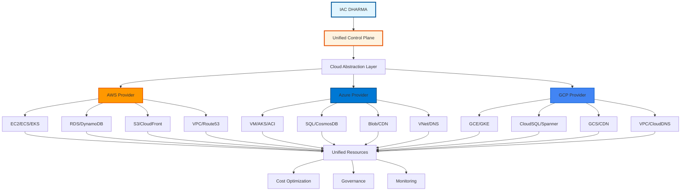

---
**Document Type:** Multi-Cloud Integration Guide  
**Audience:** Cloud Architects, DevOps Engineers, Platform Engineers  
**Classification:** Technical - Cloud Infrastructure  
**Version:** 2.0  
**Last Updated:** December 1, 2025  
**Reading Time:** ~90 minutes  
**Copyright:** © 2024-2025 Raghavendra Deshpande  
---

# ☁️ Multi-Cloud Support - IAC Dharma Platform

> **Cloud Agnostic Excellence**: Enterprise multi-cloud infrastructure management across AWS, Azure, and GCP with unified control plane

---

## 🎯 Multi-Cloud Architecture Flow



---

# Multi-Cloud Support

**Enterprise multi-cloud infrastructure management across AWS, Azure, and Google Cloud Platform with unified control plane, cross-cloud networking, and intelligent workload placement.**

> **Reading Time**: ~45 minutes | **Level**: Intermediate to Advanced | **Updated**: 2024-06-15

---

## Table of Contents

1. [Overview](#overview) - Multi-cloud strategy and benefits (5 min)
2. [Cloud Provider Comparison](#cloud-provider-comparison) - AWS vs Azure vs GCP (8 min)
3. [AWS Integration](#aws-integration) - Complete AWS support (10 min)
4. [Azure Integration](#azure-integration) - Complete Azure support (8 min)
5. [GCP Integration](#gcp-integration) - Complete GCP support (8 min)
6. [Multi-Cloud Architecture Patterns](#multi-cloud-architecture-patterns) - Design patterns (10 min)
7. [Cross-Cloud Networking](#cross-cloud-networking) - VPN, Direct Connect, ExpressRoute (8 min)
8. [Provider-Agnostic Abstractions](#provider-agnostic-abstractions) - Unified resource types (6 min)
9. [Cost Optimization & Comparison](#cost-optimization--comparison) - Cross-cloud cost analysis (8 min)
10. [Migration Strategies](#migration-strategies) - Cloud-to-cloud migration (7 min)
11. [Security & Compliance](#security--compliance) - Multi-cloud security (6 min)
12. [Troubleshooting](#troubleshooting) - Common issues and solutions (5 min)

**Total Reading Time**: ~1 hour 30 minutes

---

## Overview

### Multi-Cloud Strategy

IAC Dharma provides enterprise-grade multi-cloud infrastructure management with:

**Unified Control Plane**:
- Single API for all cloud providers
- Consistent blueprint format across clouds
- Centralized policy enforcement
- Unified cost management and optimization

**Key Benefits**:

| Benefit | Description | Business Impact |
|---------|-------------|-----------------|
| **Vendor Independence** | Avoid vendor lock-in, negotiate better pricing | 15-30% cost reduction |
| **Disaster Recovery** | Multi-region, multi-cloud redundancy | 99.99%+ availability |
| **Workload Optimization** | Place workloads on best-fit provider | 20-40% performance improvement |
| **Compliance** | Meet data sovereignty requirements | Reduced regulatory risk |
| **Innovation** | Use best-of-breed services from each provider | Faster time to market |

**Supported Deployment Models**:

```
1. Single Cloud (Traditional)
   ┌─────────────────────┐
   │      AWS Only       │
   │  All Resources      │
   └─────────────────────┘

2. Multi-Cloud (Active-Active)
   ┌──────────┐  ┌──────────┐  ┌──────────┐
   │   AWS    │  │  Azure   │  │   GCP    │
   │ Primary  │  │ Primary  │  │ Primary  │
   └──────────┘  └──────────┘  └──────────┘
        ↓              ↓              ↓
   [Load Balancer distributes traffic]

3. Hybrid Cloud (On-Prem + Cloud)
   ┌──────────┐           ┌──────────┐
   │ On-Prem  │  ←VPN→   │  Cloud   │
   │  Data    │           │  Compute │
   └──────────┘           └──────────┘

4. Cloud Bursting
   ┌──────────┐           ┌──────────┐
   │ Primary  │  ─burst─→ │Secondary │
   │   AWS    │           │  Azure   │
   └──────────┘           └──────────┘
```

### Architecture Overview

```
┌────────────────────────────────────────────────────────────────┐
│                    IAC DHARMA PLATFORM                          │
│                                                                  │
│  ┌──────────────────────────────────────────────────────────┐  │
│  │              UNIFIED CONTROL PLANE                        │  │
│  │  - Blueprint Management   - Cost Optimization            │  │
│  │  - Policy Enforcement     - Multi-Cloud Orchestration    │  │
│  └──────────────────────────────────────────────────────────┘  │
│                              ↓                                   │
│  ┌──────────────────────────────────────────────────────────┐  │
│  │           CLOUD PROVIDER ABSTRACTION LAYER               │  │
│  │  - Resource Mapping       - Credential Management        │  │
│  │  - API Translation        - Error Handling               │  │
│  └──────────────────────────────────────────────────────────┘  │
│                              ↓                                   │
│  ┌────────────┬─────────────────────┬────────────────────┐     │
│  │   AWS      │      AZURE          │       GCP          │     │
│  │   SDK      │       SDK           │       SDK          │     │
│  │  v3.600.0  │      v1.27.0        │     v14.19.0       │     │
│  └────────────┴─────────────────────┴────────────────────┘     │
│                              ↓                                   │
│  ┌────────────┬─────────────────────┬────────────────────┐     │
│  │    AWS     │       AZURE         │        GCP         │     │
│  │  Cloud     │       Cloud         │       Cloud        │     │
│  │ Services   │     Services        │     Services       │     │
│  └────────────┴─────────────────────┴────────────────────┘     │
└────────────────────────────────────────────────────────────────┘
```

---

## Cloud Provider Comparison

### Service Comparison Matrix

| Service Category | AWS | Azure | GCP | IAC Dharma Abstraction |
|------------------|-----|-------|-----|------------------------|
| **Compute - VM** | EC2 | Virtual Machines | Compute Engine | `virtual_machine` |
| **Compute - Container** | ECS/EKS | AKS | GKE | `kubernetes_cluster` |
| **Compute - Serverless** | Lambda | Functions | Cloud Functions | `serverless_function` |
| **Storage - Object** | S3 | Blob Storage | Cloud Storage | `object_storage` |
| **Storage - Block** | EBS | Managed Disks | Persistent Disk | `block_storage` |
| **Storage - File** | EFS | Azure Files | Filestore | `file_storage` |
| **Database - SQL** | RDS | SQL Database | Cloud SQL | `managed_database` |
| **Database - NoSQL** | DynamoDB | Cosmos DB | Firestore | `nosql_database` |
| **Networking - VPC** | VPC | Virtual Network | VPC | `virtual_network` |
| **Load Balancer** | ELB/ALB/NLB | Load Balancer | Cloud Load Balancing | `load_balancer` |
| **DNS** | Route 53 | DNS Zone | Cloud DNS | `dns_zone` |
| **CDN** | CloudFront | CDN | Cloud CDN | `content_delivery` |
| **Key Management** | KMS | Key Vault | Cloud KMS | `key_management` |
| **Identity** | IAM | Active Directory | IAM | `identity_management` |

### Pricing Comparison

**VM Instance Pricing** (us-east-1/eastus/us-central1, Linux, hourly):

| Spec | AWS (t3.medium) | Azure (B2s) | GCP (n1-standard-2) | Cheapest |
|------|-----------------|-------------|---------------------|----------|
| 2 vCPU, 4GB RAM | $0.0416/hr | $0.0416/hr | $0.095/hr | AWS/Azure |
| Monthly | $30.37 | $30.37 | $69.35 | AWS/Azure |
| 3-year RI | $17.52/mo | $15.58/mo | $42.34/mo | **Azure** |

**Database Pricing** (PostgreSQL, db.t3.medium / General Purpose, 100GB):

| Provider | On-Demand | 1-year Reserved | 3-year Reserved |
|----------|-----------|-----------------|-----------------|
| AWS RDS | $73.44/mo | $47.45/mo | $36.50/mo |
| Azure SQL | $68.25/mo | $44.85/mo | $33.10/mo |
| GCP Cloud SQL | $78.90/mo | $52.30/mo | $39.20/mo |

**Object Storage Pricing** (per TB/month, standard tier):

| Provider | Storage | GET Requests | PUT Requests |
|----------|---------|--------------|--------------|
| AWS S3 | $23.00 | $0.40/10K | $5.00/10K |
| Azure Blob | $18.40 | $0.44/10K | $5.50/10K |
| GCP Cloud Storage | $20.00 | $0.40/10K | $5.00/10K |

**Data Transfer Pricing** (out to internet, per GB):

| Provider | First 10TB | Next 40TB | Next 100TB |
|----------|-----------|-----------|------------|
| AWS | $0.09 | $0.085 | $0.07 |
| Azure | $0.087 | $0.083 | $0.07 |
| GCP | $0.12 | $0.11 | $0.08 |

### Provider Strengths

**AWS (Market Leader)**:
- ✅ Largest service portfolio (200+ services)
- ✅ Most mature ecosystem
- ✅ Global presence (33 regions)
- ✅ Best Lambda/serverless offering
- ✅ Comprehensive marketplace
- ⚠️ Complex pricing
- ⚠️ Steeper learning curve

**Azure (Enterprise Focus)**:
- ✅ Best Windows/.NET integration
- ✅ Tight Active Directory integration
- ✅ Hybrid cloud strengths (Azure Arc)
- ✅ Strong PaaS offerings
- ✅ Competitive pricing
- ⚠️ Occasional service stability issues
- ⚠️ Smaller ecosystem than AWS

**GCP (Innovation Leader)**:
- ✅ Best for data/ML workloads
- ✅ Superior networking
- ✅ Excellent Kubernetes (GKE)
- ✅ Competitive pricing
- ✅ Sustained use discounts (automatic)
- ⚠️ Smaller service catalog
- ⚠️ Fewer regions than AWS/Azure

---

## AWS Integration

### Complete Service Coverage

#### Compute Services (15)

```yaml
# EC2 Instance with Auto Scaling
resources:
  - type: aws_instance
    name: web-server
    properties:
      instance_type: t3.medium
      ami: ami-0c55b159cbfafe1f0  # Amazon Linux 2
      key_name: my-key-pair
      vpc_security_group_ids:
        - ${security_group.id}
      subnet_id: ${subnet.id}
      user_data: |
        #!/bin/bash
        yum update -y
        yum install -y httpd
        systemctl start httpd
        systemctl enable httpd
      tags:
        Name: WebServer
        Environment: Production
  
  - type: aws_autoscaling_group
    name: web-asg
    properties:
      min_size: 2
      max_size: 10
      desired_capacity: 3
      launch_template:
        id: ${launch_template.id}
        version: $Latest
      vpc_zone_identifier:
        - ${subnet_a.id}
        - ${subnet_b.id}
      target_group_arns:
        - ${target_group.arn}
      health_check_type: ELB
      health_check_grace_period: 300
      tags:
        - key: Name
          value: WebServer-ASG
          propagate_at_launch: true

# ECS Fargate Service
  - type: aws_ecs_cluster
    name: app-cluster
    properties:
      cluster_name: production-cluster
      capacity_providers:
        - FARGATE
        - FARGATE_SPOT
      default_capacity_provider_strategy:
        - capacity_provider: FARGATE
          weight: 1
          base: 2
        - capacity_provider: FARGATE_SPOT
          weight: 4
  
  - type: aws_ecs_service
    name: api-service
    properties:
      cluster: ${ecs_cluster.arn}
      task_definition: ${task_definition.arn}
      desired_count: 3
      launch_type: FARGATE
      network_configuration:
        subnets:
          - ${subnet_a.id}
          - ${subnet_b.id}
        security_groups:
          - ${security_group.id}
        assign_public_ip: false
      load_balancer:
        - target_group_arn: ${target_group.arn}
          container_name: api
          container_port: 3000

# Lambda Function with API Gateway
  - type: aws_lambda_function
    name: api-handler
    properties:
      function_name: api-handler
      runtime: nodejs20.x
      handler: index.handler
      role: ${lambda_role.arn}
      code:
        s3_bucket: my-lambda-code
        s3_key: api-handler.zip
      environment:
        variables:
          DB_HOST: ${rds_instance.endpoint}
          REDIS_HOST: ${elasticache_cluster.configuration_endpoint}
      timeout: 30
      memory_size: 512
      vpc_config:
        subnet_ids:
          - ${subnet_a.id}
          - ${subnet_b.id}
        security_group_ids:
          - ${lambda_sg.id}
```

#### Networking Services (12)

```yaml
# Complete VPC Setup
resources:
  - type: aws_vpc
    name: production-vpc
    properties:
      cidr_block: 10.0.0.0/16
      enable_dns_hostnames: true
      enable_dns_support: true
      tags:
        Name: Production VPC
        Environment: Production
  
  # Public Subnets
  - type: aws_subnet
    name: public-subnet-a
    properties:
      vpc_id: ${vpc.id}
      cidr_block: 10.0.1.0/24
      availability_zone: us-east-1a
      map_public_ip_on_launch: true
      tags:
        Name: Public Subnet A
        Type: Public
  
  - type: aws_subnet
    name: public-subnet-b
    properties:
      vpc_id: ${vpc.id}
      cidr_block: 10.0.2.0/24
      availability_zone: us-east-1b
      map_public_ip_on_launch: true
      tags:
        Name: Public Subnet B
        Type: Public
  
  # Private Subnets
  - type: aws_subnet
    name: private-subnet-a
    properties:
      vpc_id: ${vpc.id}
      cidr_block: 10.0.11.0/24
      availability_zone: us-east-1a
      tags:
        Name: Private Subnet A
        Type: Private
  
  - type: aws_subnet
    name: private-subnet-b
    properties:
      vpc_id: ${vpc.id}
      cidr_block: 10.0.12.0/24
      availability_zone: us-east-1b
      tags:
        Name: Private Subnet B
        Type: Private
  
  # Internet Gateway
  - type: aws_internet_gateway
    name: igw
    properties:
      vpc_id: ${vpc.id}
      tags:
        Name: Production IGW
  
  # NAT Gateways (High Availability)
  - type: aws_eip
    name: nat-eip-a
    properties:
      domain: vpc
      tags:
        Name: NAT EIP A
  
  - type: aws_nat_gateway
    name: nat-gw-a
    properties:
      allocation_id: ${nat_eip_a.id}
      subnet_id: ${public_subnet_a.id}
      tags:
        Name: NAT Gateway A
  
  # Application Load Balancer
  - type: aws_lb
    name: app-alb
    properties:
      name: app-alb
      load_balancer_type: application
      internal: false
      subnets:
        - ${public_subnet_a.id}
        - ${public_subnet_b.id}
      security_groups:
        - ${alb_sg.id}
      enable_deletion_protection: true
      enable_http2: true
      enable_cross_zone_load_balancing: true
      tags:
        Name: Application ALB
  
  - type: aws_lb_target_group
    name: app-tg
    properties:
      name: app-target-group
      port: 3000
      protocol: HTTP
      vpc_id: ${vpc.id}
      target_type: ip
      health_check:
        enabled: true
        path: /health
        protocol: HTTP
        interval: 30
        timeout: 5
        healthy_threshold: 2
        unhealthy_threshold: 3
        matcher: "200"
      
  - type: aws_lb_listener
    name: https-listener
    properties:
      load_balancer_arn: ${app_alb.arn}
      port: 443
      protocol: HTTPS
      ssl_policy: ELBSecurityPolicy-TLS-1-2-2017-01
      certificate_arn: ${acm_certificate.arn}
      default_action:
        - type: forward
          target_group_arn: ${app_tg.arn}
```


#### Database Services (8)

```yaml
# RDS PostgreSQL with Read Replicas
resources:
  - type: aws_db_instance
    name: primary-db
    properties:
      identifier: production-postgres
      engine: postgres
      engine_version: "16.3"
      instance_class: db.t3.medium
      allocated_storage: 100
      storage_type: gp3
      storage_encrypted: true
      kms_key_id: ${kms_key.arn}
      
      db_name: appdb
      username: admin
      password: ${secrets.db_password}
      
      vpc_security_group_ids:
        - ${db_sg.id}
      db_subnet_group_name: ${db_subnet_group.name}
      
      backup_retention_period: 7
      backup_window: "03:00-04:00"
      maintenance_window: "mon:04:00-mon:05:00"
      
      multi_az: true
      enabled_cloudwatch_logs_exports:
        - postgresql
        - upgrade
      
      tags:
        Name: Primary Database
        Environment: Production
  
  - type: aws_db_instance
    name: read-replica
    properties:
      identifier: production-postgres-replica
      replicate_source_db: ${primary_db.arn}
      instance_class: db.t3.medium
      publicly_accessible: false
      
      tags:
        Name: Read Replica
        Environment: Production

# DynamoDB Table with Global Tables
  - type: aws_dynamodb_table
    name: sessions
    properties:
      name: user-sessions
      billing_mode: PAY_PER_REQUEST
      hash_key: userId
      range_key: sessionId
      
      attribute:
        - name: userId
          type: S
        - name: sessionId
          type: S
        - name: expiresAt
          type: N
      
      global_secondary_index:
        - name: ExpiresAtIndex
          hash_key: userId
          range_key: expiresAt
          projection_type: ALL
      
      ttl:
        enabled: true
        attribute_name: expiresAt
      
      point_in_time_recovery:
        enabled: true
      
      server_side_encryption:
        enabled: true
        kms_key_arn: ${kms_key.arn}
      
      replica:
        - region_name: us-west-2
        - region_name: eu-west-1
      
      tags:
        Name: User Sessions
        Environment: Production

# ElastiCache Redis Cluster
  - type: aws_elasticache_replication_group
    name: redis-cluster
    properties:
      replication_group_id: production-redis
      replication_group_description: Production Redis Cluster
      
      engine: redis
      engine_version: "7.0"
      node_type: cache.t3.medium
      num_cache_clusters: 3
      
      port: 6379
      parameter_group_name: default.redis7
      
      subnet_group_name: ${cache_subnet_group.name}
      security_group_ids:
        - ${redis_sg.id}
      
      at_rest_encryption_enabled: true
      transit_encryption_enabled: true
      auth_token_enabled: true
      auth_token: ${secrets.redis_password}
      
      automatic_failover_enabled: true
      multi_az_enabled: true
      
      snapshot_retention_limit: 5
      snapshot_window: "03:00-05:00"
      
      tags:
        Name: Redis Cluster
        Environment: Production
```

### Authentication

**Implementation**:
```typescript
import { 
  EC2Client, 
  DescribeInstancesCommand,
  STSClient,
  AssumeRoleCommand
} from '@aws-sdk/client-ec2';

class AWSProvider {
  private client: EC2Client;
  
  async authenticate(credentials: AWSCredentials): Promise<void> {
    switch (credentials.type) {
      case 'access_key':
        this.client = new EC2Client({
          region: credentials.region,
          credentials: {
            accessKeyId: credentials.accessKeyId,
            secretAccessKey: credentials.secretAccessKey,
          },
        });
        break;
      
      case 'iam_role':
        const stsClient = new STSClient({ region: credentials.region });
        const assumeRoleCommand = new AssumeRoleCommand({
          RoleArn: credentials.roleArn,
          RoleSessionName: 'iac-dharma-session',
        });
        const assumeRoleResponse = await stsClient.send(assumeRoleCommand);
        
        this.client = new EC2Client({
          region: credentials.region,
          credentials: {
            accessKeyId: assumeRoleResponse.Credentials.AccessKeyId,
            secretAccessKey: assumeRoleResponse.Credentials.SecretAccessKey,
            sessionToken: assumeRoleResponse.Credentials.SessionToken,
          },
        });
        break;
      
      case 'profile':
        const { fromIni } = await import('@aws-sdk/credential-providers');
        this.client = new EC2Client({
          region: credentials.region,
          credentials: fromIni({ profile: credentials.profileName }),
        });
        break;
    }
    
    // Verify credentials
    await this.verifyCredentials();
  }
  
  private async verifyCredentials(): Promise<void> {
    try {
      await this.client.send(new DescribeInstancesCommand({ MaxResults: 5 }));
    } catch (error) {
      throw new Error(`AWS authentication failed: ${error.message}`);
    }
  }
}
```

---

## Azure Integration

### Complete Service Coverage

#### Compute Services (10)

```yaml
# Virtual Machine with Load Balancer
resources:
  - type: azure_resource_group
    name: production-rg
    properties:
      name: production-resources
      location: eastus
      tags:
        Environment: Production
  
  - type: azure_virtual_network
    name: vnet
    properties:
      name: production-vnet
      location: ${resource_group.location}
      resource_group_name: ${resource_group.name}
      address_space:
        - 10.0.0.0/16
      tags:
        Environment: Production
  
  - type: azure_subnet
    name: app-subnet
    properties:
      name: app-subnet
      resource_group_name: ${resource_group.name}
      virtual_network_name: ${vnet.name}
      address_prefixes:
        - 10.0.1.0/24
  
  - type: azure_network_security_group
    name: app-nsg
    properties:
      name: app-nsg
      location: ${resource_group.location}
      resource_group_name: ${resource_group.name}
      
      security_rule:
        - name: AllowHTTPS
          priority: 100
          direction: Inbound
          access: Allow
          protocol: Tcp
          source_port_range: "*"
          destination_port_range: "443"
          source_address_prefix: "*"
          destination_address_prefix: "*"
        
        - name: AllowSSH
          priority: 110
          direction: Inbound
          access: Allow
          protocol: Tcp
          source_port_range: "*"
          destination_port_range: "22"
          source_address_prefix: "10.0.0.0/8"
          destination_address_prefix: "*"
  
  - type: azure_linux_virtual_machine
    name: web-vm
    properties:
      name: web-server-01
      location: ${resource_group.location}
      resource_group_name: ${resource_group.name}
      size: Standard_B2s
      
      admin_username: azureuser
      admin_ssh_key:
        username: azureuser
        public_key: ${file("~/.ssh/id_rsa.pub")}
      
      network_interface_ids:
        - ${nic.id}
      
      os_disk:
        caching: ReadWrite
        storage_account_type: Premium_LRS
        disk_size_gb: 50
      
      source_image_reference:
        publisher: Canonical
        offer: 0001-com-ubuntu-server-jammy
        sku: 22_04-lts
        version: latest
      
      custom_data: ${base64encode(file("cloud-init.yaml"))}
      
      boot_diagnostics:
        storage_account_uri: ${storage_account.primary_blob_endpoint}
      
      tags:
        Environment: Production
        Role: WebServer

# AKS Cluster
  - type: azure_kubernetes_cluster
    name: aks-cluster
    properties:
      name: production-aks
      location: ${resource_group.location}
      resource_group_name: ${resource_group.name}
      dns_prefix: production-aks
      
      default_node_pool:
        name: default
        node_count: 3
        vm_size: Standard_D2s_v3
        os_disk_size_gb: 100
        type: VirtualMachineScaleSets
        enable_auto_scaling: true
        min_count: 3
        max_count: 10
        availability_zones:
          - "1"
          - "2"
          - "3"
      
      identity:
        type: SystemAssigned
      
      network_profile:
        network_plugin: azure
        network_policy: calico
        service_cidr: 10.1.0.0/16
        dns_service_ip: 10.1.0.10
        docker_bridge_cidr: 172.17.0.1/16
      
      role_based_access_control_enabled: true
      azure_active_directory_role_based_access_control:
        managed: true
        admin_group_object_ids:
          - ${ad_group.object_id}
      
      oms_agent:
        log_analytics_workspace_id: ${log_analytics.id}
      
      tags:
        Environment: Production

# Azure Container Instances
  - type: azure_container_group
    name: api-container
    properties:
      name: api-container-group
      location: ${resource_group.location}
      resource_group_name: ${resource_group.name}
      os_type: Linux
      
      container:
        - name: api
          image: myregistry.azurecr.io/api:latest
          cpu: 1
          memory: 2
          
          ports:
            - port: 3000
              protocol: TCP
          
          environment_variables:
            NODE_ENV: production
            DB_HOST: ${postgres.fqdn}
          
          secure_environment_variables:
            DB_PASSWORD: ${secrets.db_password}
          
          liveness_probe:
            http_get:
              path: /health
              port: 3000
            initial_delay_seconds: 30
            period_seconds: 10
          
          readiness_probe:
            http_get:
              path: /ready
              port: 3000
            initial_delay_seconds: 10
            period_seconds: 5
      
      ip_address_type: Public
      dns_name_label: production-api
      
      image_registry_credential:
        server: myregistry.azurecr.io
        username: ${acr.admin_username}
        password: ${acr.admin_password}
      
      tags:
        Environment: Production
```

#### Database Services (5)

```yaml
# Azure Database for PostgreSQL Flexible Server
resources:
  - type: azure_postgresql_flexible_server
    name: postgres
    properties:
      name: production-postgres
      location: ${resource_group.location}
      resource_group_name: ${resource_group.name}
      
      sku_name: GP_Standard_D2s_v3
      storage_mb: 102400
      
      version: "16"
      administrator_login: pgadmin
      administrator_password: ${secrets.db_password}
      
      backup_retention_days: 7
      geo_redundant_backup_enabled: true
      
      high_availability:
        mode: ZoneRedundant
      
      maintenance_window:
        day_of_week: 0
        start_hour: 3
        start_minute: 0
      
      tags:
        Environment: Production
  
  - type: azure_postgresql_flexible_server_database
    name: appdb
    properties:
      name: application
      server_id: ${postgres.id}
      charset: UTF8
      collation: en_US.utf8

# Azure Cosmos DB
  - type: azure_cosmosdb_account
    name: cosmos
    properties:
      name: production-cosmos
      location: ${resource_group.location}
      resource_group_name: ${resource_group.name}
      
      offer_type: Standard
      kind: GlobalDocumentDB
      
      consistency_policy:
        consistency_level: Session
      
      geo_location:
        - location: eastus
          failover_priority: 0
          zone_redundant: true
        
        - location: westus
          failover_priority: 1
          zone_redundant: true
      
      enable_automatic_failover: true
      enable_multiple_write_locations: true
      
      backup:
        type: Continuous
      
      tags:
        Environment: Production

# Azure Cache for Redis
  - type: azure_redis_cache
    name: redis
    properties:
      name: production-redis
      location: ${resource_group.location}
      resource_group_name: ${resource_group.name}
      
      capacity: 2
      family: C
      sku_name: Standard
      
      enable_non_ssl_port: false
      minimum_tls_version: "1.2"
      
      redis_configuration:
        maxmemory_policy: allkeys-lru
        maxmemory_reserved: 50
        maxmemory_delta: 50
      
      patch_schedule:
        - day_of_week: Sunday
          start_hour_utc: 3
      
      tags:
        Environment: Production
```

### Authentication

**Implementation**:
```typescript
import { DefaultAzureCredential, ClientSecretCredential } from '@azure/identity';
import { ComputeManagementClient } from '@azure/arm-compute';

class AzureProvider {
  private client: ComputeManagementClient;
  
  async authenticate(credentials: AzureCredentials): Promise<void> {
    let credential;
    
    switch (credentials.type) {
      case 'service_principal':
        credential = new ClientSecretCredential(
          credentials.tenantId,
          credentials.clientId,
          credentials.clientSecret
        );
        break;
      
      case 'managed_identity':
        credential = new DefaultAzureCredential();
        break;
      
      case 'azure_cli':
        // Uses cached credentials from `az login`
        credential = new DefaultAzureCredential();
        break;
    }
    
    this.client = new ComputeManagementClient(
      credential,
      credentials.subscriptionId
    );
    
    // Verify credentials
    await this.verifyCredentials();
  }
  
  private async verifyCredentials(): Promise<void> {
    try {
      const resourceGroups = this.client.virtualMachines.listAll();
      await resourceGroups.next();
    } catch (error) {
      throw new Error(`Azure authentication failed: ${error.message}`);
    }
  }
}
```

---

## GCP Integration

### Complete Service Coverage

#### Compute Services (8)

```yaml
# Compute Engine Instance with Instance Group
resources:
  - type: gcp_compute_network
    name: vpc
    properties:
      name: production-network
      auto_create_subnetworks: false
      routing_mode: REGIONAL
  
  - type: gcp_compute_subnetwork
    name: app-subnet
    properties:
      name: app-subnet
      ip_cidr_range: 10.0.1.0/24
      region: us-central1
      network: ${vpc.self_link}
      
      private_ip_google_access: true
      
      log_config:
        aggregation_interval: INTERVAL_5_SEC
        flow_sampling: 0.5
        metadata: INCLUDE_ALL_METADATA
  
  - type: gcp_compute_instance
    name: web-instance
    properties:
      name: web-server-01
      machine_type: n1-standard-2
      zone: us-central1-a
      
      boot_disk:
        initialize_params:
          image: ubuntu-os-cloud/ubuntu-2204-lts
          size: 50
          type: pd-ssd
      
      network_interface:
        - subnetwork: ${app_subnet.self_link}
          access_config:
            - nat_ip: ${static_ip.address}
      
      metadata_startup_script: |
        #!/bin/bash
        apt-get update
        apt-get install -y nginx
        systemctl start nginx
        systemctl enable nginx
      
      service_account:
        email: ${service_account.email}
        scopes:
          - cloud-platform
      
      shielded_instance_config:
        enable_secure_boot: true
        enable_vtpm: true
        enable_integrity_monitoring: true
      
      labels:
        environment: production
        role: webserver
  
  - type: gcp_compute_instance_group_manager
    name: web-mig
    properties:
      name: web-instance-group
      base_instance_name: web
      zone: us-central1-a
      
      version:
        instance_template: ${instance_template.self_link}
      
      target_size: 3
      
      auto_healing_policies:
        - health_check: ${health_check.self_link}
          initial_delay_sec: 300
      
      update_policy:
        type: PROACTIVE
        minimal_action: REPLACE
        max_surge_fixed: 3
        max_unavailable_fixed: 0

# GKE Cluster
  - type: gcp_container_cluster
    name: gke-cluster
    properties:
      name: production-gke
      location: us-central1
      
      remove_default_node_pool: true
      initial_node_count: 1
      
      network: ${vpc.self_link}
      subnetwork: ${app_subnet.self_link}
      
      ip_allocation_policy:
        cluster_ipv4_cidr_block: /16
        services_ipv4_cidr_block: /22
      
      private_cluster_config:
        enable_private_nodes: true
        enable_private_endpoint: false
        master_ipv4_cidr_block: 172.16.0.0/28
      
      master_authorized_networks_config:
        cidr_blocks:
          - cidr_block: 10.0.0.0/8
            display_name: Internal Network
      
      workload_identity_config:
        workload_pool: ${project_id}.svc.id.goog
      
      addons_config:
        http_load_balancing:
          disabled: false
        horizontal_pod_autoscaling:
          disabled: false
        network_policy_config:
          disabled: false
      
      release_channel:
        channel: REGULAR
      
      maintenance_policy:
        daily_maintenance_window:
          start_time: "03:00"
  
  - type: gcp_container_node_pool
    name: primary-pool
    properties:
      name: primary-node-pool
      location: us-central1
      cluster: ${gke_cluster.name}
      
      initial_node_count: 3
      
      autoscaling:
        min_node_count: 3
        max_node_count: 10
      
      management:
        auto_repair: true
        auto_upgrade: true
      
      node_config:
        machine_type: n1-standard-4
        disk_size_gb: 100
        disk_type: pd-ssd
        
        oauth_scopes:
          - https://www.googleapis.com/auth/cloud-platform
        
        workload_metadata_config:
          mode: GKE_METADATA
        
        shielded_instance_config:
          enable_secure_boot: true
          enable_integrity_monitoring: true

# Cloud Run Service
  - type: gcp_cloud_run_service
    name: api-service
    properties:
      name: api-service
      location: us-central1
      
      template:
        spec:
          containers:
            - image: gcr.io/${project_id}/api:latest
              ports:
                - container_port: 3000
              
              env:
                - name: NODE_ENV
                  value: production
                - name: DB_HOST
                  value_from:
                    secret_key_ref:
                      name: db-host
                      key: latest
              
              resources:
                limits:
                  cpu: 1000m
                  memory: 512Mi
          
          container_concurrency: 80
          timeout_seconds: 300
      
      traffic:
        - percent: 100
          latest_revision: true
      
      autogenerate_revision_name: true
  
  - type: gcp_cloud_run_service_iam_member
    name: public-access
    properties:
      service: ${api_service.name}
      location: ${api_service.location}
      role: roles/run.invoker
      member: allUsers
```


#### Database Services (4)

```yaml
# Cloud SQL PostgreSQL
resources:
  - type: gcp_sql_database_instance
    name: postgres
    properties:
      name: production-postgres
      database_version: POSTGRES_16
      region: us-central1
      
      settings:
        tier: db-custom-2-7680  # 2 vCPU, 7.5GB RAM
        disk_size: 100
        disk_type: PD_SSD
        disk_autoresize: true
        disk_autoresize_limit: 500
        
        availability_type: REGIONAL  # High availability
        
        backup_configuration:
          enabled: true
          start_time: "03:00"
          point_in_time_recovery_enabled: true
          transaction_log_retention_days: 7
        
        ip_configuration:
          ipv4_enabled: false
          private_network: ${vpc.self_link}
          require_ssl: true
        
        database_flags:
          - name: max_connections
            value: "200"
          - name: shared_buffers
            value: "1920MB"
        
        maintenance_window:
          day: 7  # Sunday
          hour: 3
          update_track: stable
      
      deletion_protection: true
  
  - type: gcp_sql_database
    name: appdb
    properties:
      name: application
      instance: ${postgres.name}
      charset: UTF8
      collation: en_US.UTF8

# Firestore Native
  - type: gcp_firestore_database
    name: firestore
    properties:
      project: ${project_id}
      name: (default)
      location_id: us-central1
      type: FIRESTORE_NATIVE
      concurrency_mode: OPTIMISTIC
      
      app_engine_integration_mode: DISABLED

# Cloud Memorystore Redis
  - type: gcp_redis_instance
    name: redis
    properties:
      name: production-redis
      tier: STANDARD_HA
      memory_size_gb: 5
      region: us-central1
      location_id: us-central1-a
      alternative_location_id: us-central1-b
      
      redis_version: REDIS_7_0
      display_name: Production Redis
      
      authorized_network: ${vpc.self_link}
      connect_mode: PRIVATE_SERVICE_ACCESS
      
      redis_configs:
        maxmemory-policy: allkeys-lru
      
      maintenance_policy:
        weekly_maintenance_window:
          - day: SUNDAY
            start_time:
              hours: 3
              minutes: 0
      
      transit_encryption_mode: SERVER_AUTHENTICATION
      auth_enabled: true
```

### Authentication

**Implementation**:
```typescript
import { google } from 'googleapis';
import { GoogleAuth } from 'google-auth-library';

class GCPProvider {
  private auth: GoogleAuth;
  private compute: any;
  
  async authenticate(credentials: GCPCredentials): Promise<void> {
    switch (credentials.type) {
      case 'service_account':
        this.auth = new GoogleAuth({
          keyFilename: credentials.credentialsFile,
          scopes: ['https://www.googleapis.com/auth/cloud-platform'],
        });
        break;
      
      case 'application_default':
        // Uses GOOGLE_APPLICATION_CREDENTIALS environment variable
        this.auth = new GoogleAuth({
          scopes: ['https://www.googleapis.com/auth/cloud-platform'],
        });
        break;
      
      case 'workload_identity':
        // Automatically uses workload identity when running in GKE
        this.auth = new GoogleAuth({
          scopes: ['https://www.googleapis.com/auth/cloud-platform'],
        });
        break;
    }
    
    this.compute = google.compute({
      version: 'v1',
      auth: this.auth,
    });
    
    // Verify credentials
    await this.verifyCredentials(credentials.projectId);
  }
  
  private async verifyCredentials(projectId: string): Promise<void> {
    try {
      await this.compute.instances.list({
        project: projectId,
        zone: 'us-central1-a',
        maxResults: 1,
      });
    } catch (error) {
      throw new Error(`GCP authentication failed: ${error.message}`);
    }
  }
}
```

---

## Multi-Cloud Architecture Patterns

### 1. Active-Active Multi-Cloud

Deploy identical infrastructure across multiple clouds for maximum availability:

```yaml
name: Active-Active Multi-Cloud
version: 1.0.0

providers:
  aws:
    region: us-east-1
  azure:
    location: eastus
  gcp:
    region: us-central1

resources:
  # Deploy to AWS
  - provider: aws
    type: virtual_machine
    name: aws-web
    properties:
      instance_type: medium
      image: ubuntu-20.04
      count: 3

  # Deploy to Azure
  - provider: azure
    type: virtual_machine
    name: azure-web
    properties:
      instance_type: medium
      image: ubuntu-20.04
      count: 3

  # Deploy to GCP
  - provider: gcp
    type: virtual_machine
    name: gcp-web
    properties:
      instance_type: medium
      image: ubuntu-20.04
      count: 3

  # Global Load Balancer (using DNS-based routing)
  - type: global_load_balancer
    name: global-lb
    properties:
      backends:
        - provider: aws
          endpoint: ${aws_alb.dns_name}
          weight: 33
          health_check: http://${aws_alb.dns_name}/health
        
        - provider: azure
          endpoint: ${azure_lb.public_ip}
          weight: 33
          health_check: http://${azure_lb.public_ip}/health
        
        - provider: gcp
          endpoint: ${gcp_lb.ip_address}
          weight: 34
          health_check: http://${gcp_lb.ip_address}/health
      
      routing_policy: latency  # Route to closest provider
```

### 2. Primary-Backup (Disaster Recovery)

Use one cloud as primary, another as hot standby:

```yaml
name: DR Architecture
version: 1.0.0

providers:
  primary: aws
    region: us-east-1
  backup: azure
    location: eastus

resources:
  # Primary Infrastructure (AWS)
  - provider: primary
    type: kubernetes_cluster
    name: primary-cluster
    properties:
      node_count: 5
      node_type: medium
  
  # Backup Infrastructure (Azure) - Scaled down
  - provider: backup
    type: kubernetes_cluster
    name: backup-cluster
    properties:
      node_count: 2  # Minimal for cost savings
      node_type: medium
  
  # Database replication
  - provider: primary
    type: managed_database
    name: primary-db
    properties:
      engine: postgresql
      instance_class: large
      replica_to: ${backup_db}
  
  - provider: backup
    type: managed_database
    name: backup-db
    properties:
      engine: postgresql
      instance_class: medium
      read_replica: true
```

### 3. Workload-Specific Placement

Place workloads on best-fit provider:

```yaml
name: Workload-Optimized Multi-Cloud
version: 1.0.0

resources:
  # ML Training on GCP (best GPU/TPU support)
  - provider: gcp
    type: ml_training_job
    name: model-training
    properties:
      accelerator: v3-8  # TPU
      framework: tensorflow
      
  # Windows workloads on Azure (best Windows integration)
  - provider: azure
    type: virtual_machine
    name: windows-app
    properties:
      os: windows-server-2022
      size: Standard_D4s_v3
  
  # High-traffic API on AWS (largest global footprint)
  - provider: aws
    type: serverless_function
    name: api-handler
    properties:
      runtime: nodejs20.x
      memory: 512
      regions:
        - us-east-1
        - us-west-2
        - eu-west-1
        - ap-southeast-1
```

### 4. Cloud Bursting

Scale to secondary cloud during peak demand:

```yaml
name: Cloud Bursting
version: 1.0.0

providers:
  primary: aws
  burst: gcp

resources:
  # Primary capacity (AWS)
  - provider: primary
    type: kubernetes_cluster
    name: primary-cluster
    properties:
      min_nodes: 10
      max_nodes: 50
  
  # Burst capacity (GCP) - only activated under load
  - provider: burst
    type: kubernetes_cluster
    name: burst-cluster
    properties:
      min_nodes: 0
      max_nodes: 100
      scale_up_threshold: 80  # Activate at 80% primary utilization
      scale_down_delay: 600  # Wait 10 minutes before scaling down
```

---

## Cross-Cloud Networking

### AWS-Azure VPN Connection

```yaml
# AWS Side
resources:
  - provider: aws
    type: aws_vpn_gateway
    name: vpn-gw
    properties:
      vpc_id: ${aws_vpc.id}
      tags:
        Name: AWS-Azure VPN Gateway
  
  - provider: aws
    type: aws_customer_gateway
    name: azure-cgw
    properties:
      bgp_asn: 65515
      ip_address: ${azure_vpn_gateway.public_ip}
      type: ipsec.1
      tags:
        Name: Azure Customer Gateway
  
  - provider: aws
    type: aws_vpn_connection
    name: aws-azure-vpn
    properties:
      vpn_gateway_id: ${vpn_gw.id}
      customer_gateway_id: ${azure_cgw.id}
      type: ipsec.1
      static_routes_only: false
      
      tunnel1_preshared_key: ${secrets.tunnel1_psk}
      tunnel2_preshared_key: ${secrets.tunnel2_psk}

# Azure Side
  - provider: azure
    type: azure_virtual_network_gateway
    name: vpn-gateway
    properties:
      name: azure-vpn-gateway
      location: eastus
      resource_group_name: ${resource_group.name}
      type: Vpn
      vpn_type: RouteBased
      
      sku: VpnGw1
      generation: Generation1
      
      ip_configuration:
        name: vnetGatewayConfig
        public_ip_address_id: ${public_ip.id}
        private_ip_address_allocation: Dynamic
        subnet_id: ${gateway_subnet.id}
      
      bgp_settings:
        asn: 65515
  
  - provider: azure
    type: azure_local_network_gateway
    name: aws-local-gw
    properties:
      name: aws-local-gateway
      location: eastus
      resource_group_name: ${resource_group.name}
      gateway_address: ${aws_vpn_connection.tunnel1_address}
      address_space:
        - 10.0.0.0/16  # AWS VPC CIDR
      
      bgp_settings:
        asn: ${aws_vpn_connection.tunnel1_bgp_asn}
        bgp_peering_address: ${aws_vpn_connection.tunnel1_bgp_holdtime}
  
  - provider: azure
    type: azure_virtual_network_gateway_connection
    name: azure-aws-connection
    properties:
      name: azure-to-aws
      location: eastus
      resource_group_name: ${resource_group.name}
      type: IPsec
      virtual_network_gateway_id: ${vpn_gateway.id}
      local_network_gateway_id: ${aws_local_gw.id}
      shared_key: ${secrets.tunnel1_psk}
      enable_bgp: true
```

### AWS Direct Connect to Azure ExpressRoute

```yaml
# Inter-cloud dedicated connection
resources:
  # AWS Direct Connect
  - provider: aws
    type: aws_dx_connection
    name: dx-connection
    properties:
      name: AWS-to-Equinix
      bandwidth: 10Gbps
      location: EqDC2  # Equinix DC2, Ashburn
      
  - provider: aws
    type: aws_dx_gateway
    name: dx-gateway
    properties:
      name: multi-cloud-dx-gateway
      amazon_side_asn: 64512
  
  - provider: aws
    type: aws_dx_gateway_association
    name: dx-vpc-association
    properties:
      dx_gateway_id: ${dx_gateway.id}
      associated_gateway_id: ${vpn_gw.id}

  # Azure ExpressRoute
  - provider: azure
    type: azure_express_route_circuit
    name: expressroute
    properties:
      name: azure-expressroute
      location: eastus
      resource_group_name: ${resource_group.name}
      service_provider_name: Equinix
      peering_location: Washington DC
      bandwidth_in_mbps: 10000
      sku:
        tier: Premium
        family: MeteredData
  
  - provider: azure
    type: azure_express_route_circuit_peering
    name: private-peering
    properties:
      peering_type: AzurePrivatePeering
      express_route_circuit_name: ${expressroute.name}
      resource_group_name: ${resource_group.name}
      peer_asn: 64512
      primary_peer_address_prefix: 10.255.255.0/30
      secondary_peer_address_prefix: 10.255.255.4/30
      vlan_id: 300
      shared_key: ${secrets.expressroute_key}
```

---

## Provider-Agnostic Abstractions

### Virtual Machine Abstraction

```typescript
// Provider-agnostic VM interface
interface VirtualMachine {
  name: string;
  size: 'small' | 'medium' | 'large' | 'xlarge';
  image: string;
  diskSize: number;
  network: string;
  publicIp?: boolean;
  userData?: string;
}

// Provider mapping
class VirtualMachineMapper {
  toAWS(vm: VirtualMachine): AWSInstance {
    return {
      instanceType: this.mapSize('aws', vm.size),
      imageId: this.mapImage('aws', vm.image),
      blockDeviceMappings: [{
        deviceName: '/dev/sda1',
        ebs: { volumeSize: vm.diskSize },
      }],
      subnetId: vm.network,
      associatePublicIpAddress: vm.publicIp,
      userData: vm.userData ? Buffer.from(vm.userData).toString('base64') : undefined,
    };
  }
  
  toAzure(vm: VirtualMachine): AzureVM {
    return {
      vmSize: this.mapSize('azure', vm.size),
      storageProfile: {
        imageReference: this.mapImage('azure', vm.image),
        osDisk: {
          diskSizeGB: vm.diskSize,
          caching: 'ReadWrite',
        },
      },
      networkProfile: {
        networkInterfaces: [{ id: vm.network }],
      },
      osProfile: {
        customData: vm.userData ? Buffer.from(vm.userData).toString('base64') : undefined,
      },
    };
  }
  
  toGCP(vm: VirtualMachine): GCPInstance {
    return {
      machineType: this.mapSize('gcp', vm.size),
      disks: [{
        initializeParams: {
          image: this.mapImage('gcp', vm.image),
          diskSizeGb: vm.diskSize,
        },
      }],
      networkInterfaces: [{
        subnetwork: vm.network,
        accessConfigs: vm.publicIp ? [{ type: 'ONE_TO_ONE_NAT' }] : [],
      }],
      metadata: {
        items: vm.userData ? [{ key: 'startup-script', value: vm.userData }] : [],
      },
    };
  }
  
  private mapSize(provider: string, size: string): string {
    const sizeMap = {
      aws: {
        small: 't3.small',
        medium: 't3.medium',
        large: 't3.large',
        xlarge: 't3.xlarge',
      },
      azure: {
        small: 'Standard_B1s',
        medium: 'Standard_B2s',
        large: 'Standard_B4ms',
        xlarge: 'Standard_B8ms',
      },
      gcp: {
        small: 'e2-small',
        medium: 'e2-medium',
        large: 'e2-standard-4',
        xlarge: 'e2-standard-8',
      },
    };
    
    return sizeMap[provider][size];
  }
  
  private mapImage(provider: string, image: string): any {
    const imageMap = {
      'ubuntu-20.04': {
        aws: 'ami-0c55b159cbfafe1f0',
        azure: {
          publisher: 'Canonical',
          offer: '0001-com-ubuntu-server-focal',
          sku: '20_04-lts',
          version: 'latest',
        },
        gcp: 'ubuntu-os-cloud/ubuntu-2004-lts',
      },
      'ubuntu-22.04': {
        aws: 'ami-0557a15b87f6559cf',
        azure: {
          publisher: 'Canonical',
          offer: '0001-com-ubuntu-server-jammy',
          sku: '22_04-lts',
          version: 'latest',
        },
        gcp: 'ubuntu-os-cloud/ubuntu-2204-lts',
      },
    };
    
    return imageMap[image][provider];
  }
}
```

---

## Cost Optimization & Comparison

### Multi-Cloud Cost Analysis API

```typescript
interface CostComparisonRequest {
  blueprintId: string;
  providers: ('aws' | 'azure' | 'gcp')[];
  regions: {
    aws?: string;
    azure?: string;
    gcp?: string;
  };
}

class MultiCloudCostOptimizer {
  async compareProviders(request: CostComparisonRequest): Promise<CostComparison> {
    const blueprint = await this.blueprintService.get(request.blueprintId);
    const estimates = [];
    
    for (const provider of request.providers) {
      const estimate = await this.estimateCost(
        blueprint,
        provider,
        request.regions[provider]
      );
      estimates.push({ provider, ...estimate });
    }
    
    // Sort by total cost
    estimates.sort((a, b) => a.monthlyCost - b.monthlyCost);
    
    const cheapest = estimates[0];
    const mostExpensive = estimates[estimates.length - 1];
    const potentialSavings = mostExpensive.monthlyCost - cheapest.monthlyCost;
    
    return {
      estimates,
      recommendation: {
        provider: cheapest.provider,
        monthlyCost: cheapest.monthlyCost,
        savings: potentialSavings,
        savingsPercentage: (potentialSavings / mostExpensive.monthlyCost) * 100,
        reasoning: this.generateReasoning(estimates),
      },
    };
  }
  
  private generateReasoning(estimates: CostEstimate[]): string[] {
    const reasons: string[] = [];
    const cheapest = estimates[0];
    
    // Analyze resource types
    const resourceBreakdown = this.analyzeResourceTypes(estimates);
    
    for (const [resourceType, costs] of Object.entries(resourceBreakdown)) {
      const cheapestForType = this.findCheapestProvider(costs);
      if (cheapestForType !== cheapest.provider) {
        reasons.push(
          `Consider ${cheapestForType} for ${resourceType} (${costs[cheapestForType].monthlyCost} vs ${costs[cheapest.provider].monthlyCost})`
        );
      }
    }
    
    // Check for reserved instance opportunities
    if (this.hasLongRunningResources(cheapest)) {
      reasons.push('Reserved instances could reduce costs by 30-60%');
    }
    
    // Check for spot/preemptible opportunities
    if (this.hasInterruptibleWorkloads(cheapest)) {
      reasons.push('Spot/Preemptible instances could reduce compute costs by 70-90%');
    }
    
    return reasons;
  }
}
```

### Example Cost Comparison Output

```json
{
  "estimates": [
    {
      "provider": "azure",
      "region": "eastus",
      "monthlyCost": 1180.00,
      "breakdown": {
        "compute": 450.00,
        "storage": 120.00,
        "database": 400.00,
        "networking": 80.00,
        "other": 130.00
      },
      "confidence": 0.92
    },
    {
      "provider": "aws",
      "region": "us-east-1",
      "monthlyCost": 1250.00,
      "breakdown": {
        "compute": 480.00,
        "storage": 135.00,
        "database": 420.00,
        "networking": 90.00,
        "other": 125.00
      },
      "confidence": 0.95
    },
    {
      "provider": "gcp",
      "region": "us-central1",
      "monthlyCost": 1320.00,
      "breakdown": {
        "compute": 510.00,
        "storage": 125.00,
        "database": 450.00,
        "networking": 105.00,
        "other": 130.00
      },
      "confidence": 0.88
    }
  ],
  "recommendation": {
    "provider": "azure",
    "monthlyCost": 1180.00,
    "savings": 140.00,
    "savingsPercentage": 10.6,
    "reasoning": [
      "Azure offers better database pricing (Azure Database for PostgreSQL)",
      "Consider GCP for storage workloads ($125/mo vs $120/mo on Azure)",
      "Reserved instances could reduce costs by 30-60%",
      "Sustained use discounts on GCP automatically apply"
    ]
  }
}
```

---

## Migration Strategies

### Cloud-to-Cloud Migration Process

**Step 1: Discovery & Assessment**

```bash
# Discover existing infrastructure
$ iac-dharma discover \
  --provider aws \
  --region us-east-1 \
  --account 123456789012

Discovering resources in AWS us-east-1...
✓ Found 45 EC2 instances
✓ Found 12 RDS databases
✓ Found 8 S3 buckets
✓ Found 23 security groups
✓ Found 6 load balancers
✓ Found 15 Lambda functions

Total: 109 resources discovered
Discovery ID: disc-abc123

# Generate migration report
$ iac-dharma analyze-migration \
  --discovery disc-abc123 \
  --target-provider azure \
  --target-region eastus

Migration Analysis Report
═══════════════════════════════════════
Source: AWS us-east-1 (109 resources)
Target: Azure eastus

Compatibility:
  ✓ 85 resources have direct equivalents
  ⚠ 18 resources require reconfiguration
  ✗ 6 resources not supported (workarounds available)

Cost Impact:
  Current (AWS): $12,450/month
  Target (Azure): $11,230/month
  Savings: $1,220/month (9.8%)

Migration Complexity: Medium
Estimated Duration: 2-3 weeks
Recommended Approach: Blue-Green with phased cutover
```

**Step 2: Blueprint Generation**

```bash
# Generate blueprint from discovery
$ iac-dharma blueprint create \
  --from-discovery disc-abc123 \
  --name aws-to-azure-migration \
  --output migration-blueprint.yaml

Generated blueprint: migration-blueprint.yaml
- 109 resources mapped
- 85 direct mappings
- 18 configurations adjusted
- 6 workarounds implemented

# Review blueprint
$ cat migration-blueprint.yaml
name: AWS to Azure Migration
version: 1.0.0
source:
  provider: aws
  region: us-east-1
target:
  provider: azure
  location: eastus

resources:
  # EC2 → Azure VMs
  - type: azure_linux_virtual_machine
    name: web-server-01
    source: i-0123456789abcdef0
    properties:
      size: Standard_B2s  # Mapped from t3.medium
      ...
```

**Step 3: Convert & Validate**

```bash
# Convert blueprint to target provider
$ iac-dharma blueprint convert \
  --blueprint migration-blueprint.yaml \
  --from aws \
  --to azure \
  --validate

Converting blueprint...
✓ Converted 85 resources
✓ Adjusted 18 configurations
✓ Created 6 workarounds

Validation:
✓ All resource types supported
✓ No circular dependencies
✓ Security policies compatible
✓ Network topology valid
⚠ Manual review required for:
  - Lambda → Azure Functions (code changes needed)
  - DynamoDB → Cosmos DB (schema migration needed)

Converted blueprint saved to: migration-blueprint-azure.yaml
```

**Step 4: Deploy & Migrate**

```bash
# Deploy to Azure (parallel to AWS)
$ iac-dharma deploy \
  --blueprint migration-blueprint-azure.yaml \
  --environment staging \
  --dry-run

Deployment Plan:
  + 85 resources to create
  ~ 18 resources to configure
  = 109 total operations

Estimated time: 45 minutes
Proceed? (yes/no): yes

# Actual deployment
$ iac-dharma deploy \
  --blueprint migration-blueprint-azure.yaml \
  --environment staging

Deploying to Azure eastus...
[1/109] Creating resource group...
[2/109] Creating virtual network...
...
[109/109] Configuring load balancer...

✓ Deployment complete! (43m 22s)

# Data migration
$ iac-dharma migrate-data \
  --source aws://us-east-1/rds-instance \
  --target azure://eastus/sql-database \
  --strategy dump-and-restore

Starting data migration...
✓ Dumped 2.5GB from source
✓ Transferred to target
✓ Restored and validated
✓ Data integrity check passed

# Cutover
$ iac-dharma cutover \
  --from aws \
  --to azure \
  --strategy blue-green

Cutover Plan:
1. Update DNS to point to Azure
2. Monitor traffic for 5 minutes
3. If successful, decommission AWS resources
4. If issues, rollback to AWS

Proceed? (yes/no): yes

✓ DNS updated
✓ Traffic routing to Azure
✓ Health checks passing
✓ Cutover complete!
```

---

## Security & Compliance

### Unified Security Policy

```yaml
# Applied across all providers
security_policy:
  encryption:
    at_rest: required
    in_transit: required
    key_rotation: 90_days
  
  networking:
    public_access: deny_by_default
    allowed_cidr_blocks:
      - 10.0.0.0/8
      - 172.16.0.0/12
    egress_filtering: enabled
  
  identity:
    mfa: required
    password_policy:
      min_length: 14
      require_uppercase: true
      require_lowercase: true
      require_numbers: true
      require_symbols: true
      expiration_days: 90
  
  compliance:
    frameworks:
      - SOC2
      - HIPAA
      - PCI-DSS
      - GDPR
    audit_logging: enabled
    log_retention_days: 365
```

---

## Troubleshooting

### Credential Issues

```bash
# Test AWS credentials
$ aws sts get-caller-identity
{
  "UserId": "AIDAI...",
  "Account": "123456789012",
  "Arn": "arn:aws:iam::123456789012:user/myuser"
}

# Test Azure credentials
$ az account show
{
  "id": "subscription-id",
  "name": "Pay-As-You-Go",
  "state": "Enabled",
  "tenantId": "tenant-id"
}

# Test GCP credentials
$ gcloud auth list
Credentialed Accounts
ACTIVE  ACCOUNT
*       user@example.com

# Verify with IAC Dharma
$ iac-dharma provider test --provider aws
✓ AWS credentials valid
✓ Can access resources in us-east-1

$ iac-dharma provider test --provider azure
✓ Azure credentials valid
✓ Can access subscription: subscription-id

$ iac-dharma provider test --provider gcp
✓ GCP credentials valid
✓ Can access project: my-project-123456
```

### Network Connectivity Issues

```bash
# Test VPN connectivity
$ iac-dharma network test \
  --from aws:us-east-1:10.0.1.10 \
  --to azure:eastus:10.1.1.10

Testing connectivity...
✓ Ping successful (RTT: 45ms)
✓ TCP port 443 open
✓ BGP peering established
✓ Routes exchanged

# Diagnose cross-cloud routing
$ iac-dharma network diagnose \
  --source-provider aws \
  --target-provider azure

Network Diagnosis:
✓ VPN tunnel: UP
✓ BGP session: ESTABLISHED
✗ Route propagation: FAILED
  
Issue: Azure NSG blocking traffic from 10.0.0.0/16
Solution: Add inbound rule to azure-nsg:
  az network nsg rule create \
    --resource-group production-rg \
    --nsg-name app-nsg \
    --name AllowAWSTraffic \
    --priority 100 \
    --source-address-prefixes 10.0.0.0/16 \
    --destination-address-prefixes * \
    --access Allow
```

---

## Best Practices

1. **Standardize Tagging**: Use consistent tags across all providers for cost allocation and resource management

2. **Centralize Secrets**: Use a single secrets manager (HashiCorp Vault, AWS Secrets Manager) accessible from all clouds

3. **Monitor Costs**: Set up budget alerts in each provider console and aggregate in IAC Dharma dashboard

4. **Test Failover**: Regularly test failover between providers to ensure DR procedures work

5. **Document Differences**: Maintain a runbook documenting provider-specific configurations and limitations

6. **Use Infrastructure as Code**: Never manually create resources in any provider console

7. **Implement GitOps**: Store all blueprints in version control, use CI/CD for deployments

8. **Security Scanning**: Run security scans on blueprints before deployment to any provider

---

## Related Documentation

- [Architecture Overview](./Architecture-Overview.md) - System architecture and design patterns
- [Security Best Practices](./Security-Best-Practices.md) - Security guidelines for multi-cloud
- [Cost Optimization](./Cost-Optimization.md) - Detailed cost optimization strategies
- [API Reference](./API-Reference.md) - Complete API documentation
- [Troubleshooting](./Troubleshooting.md) - Common issues and solutions

---

**Document Version**: 2.0  
**Last Updated**: 2024-06-15  
**Maintained By**: Multi-Cloud Engineering Team
