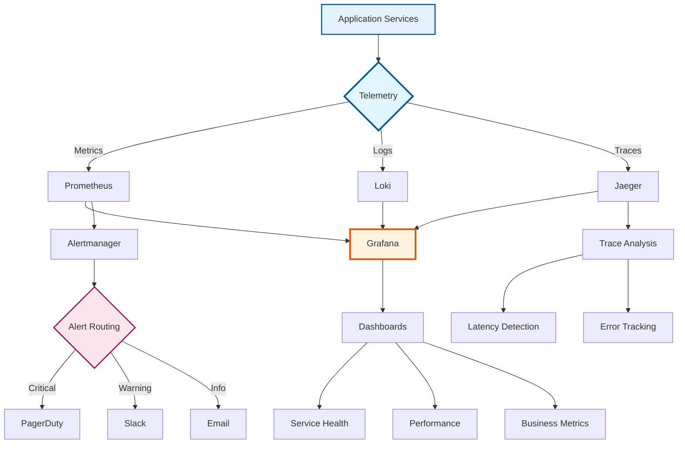

---
**Document Type:** Observability & Monitoring Guide  
**Audience:** SREs, DevOps Engineers, Operations Teams  
**Classification:** Technical - Operations  
**Version:** 2.0  
**Last Updated:** December 1, 2025  
**Copyright:** © 2024-2025 Raghavendra Deshpande  
---

# 🔍 Observability - IAC Dharma Platform

> **Complete Visibility**: Comprehensive monitoring, logging, tracing, and alerting for production-grade operations

---

## 🎯 Observability Stack Architecture



---

# Observability

Comprehensive monitoring, logging, tracing, and alerting for IAC Dharma platform.

---

## Quick Navigation

| Section | Description | Tools |
|---------|-------------|-------|
| [Metrics](#metrics-prometheus) | Performance monitoring and alerting | Prometheus |
| [Logs](#logging-loki) | Centralized log aggregation | Loki, Grafana |
| [Tracing](#distributed-tracing-jaeger) | Distributed request tracing | Jaeger, OpenTelemetry |
| [Dashboards](#dashboards-grafana) | Visualization and analytics | Grafana |
| [Alerts](#alerts-and-notifications) | Alerting and incident management | Alertmanager |
| [Best Practices](#best-practices) | Observability patterns | - |

---

## Overview

IAC Dharma uses a comprehensive observability stack to ensure system reliability, performance, and troubleshooting capability.

### Observability Pillars

| Pillar | Tool | Port | Purpose |
|--------|------|------|---------|
| **Metrics** | Prometheus | 9090 | Time-series data, performance metrics |
| **Logs** | Loki | 3100 | Log aggregation and querying |
| **Traces** | Jaeger | 16686 | Distributed request tracing |
| **Dashboards** | Grafana | 3030 | Unified visualization |
| **Alerts** | Alertmanager | 9093 | Alert routing and deduplication |

### Architecture Diagram

```
┌──────────────────────────────────────────────────┐
│          Application Services Layer              │
│  ┌─────────┐ ┌─────────┐ ┌─────────┐ ┌────────┐ │
│  │   API   │ │Blueprint│ │IAC Gen  │ │ CMDB   │ │
│  │ Gateway │ │ Service │ │ Service │ │ Agent  │ │
│  └────┬────┘ └────┬────┘ └────┬────┘ └───┬────┘ │
└───────┼──────────┼──────────┼──────────┼────────┘
        │          │          │          │
    Metrics    Logs      Traces    Events
        │          │          │          │
        ▼          ▼          ▼          ▼
┌───────────────────────────────────────────────────┐
│         Observability Collection Layer            │
│  ┌──────────┐  ┌──────────┐  ┌──────────┐       │
│  │Prometheus│  │  Loki    │  │  Jaeger  │       │
│  │ Scraper  │  │Aggregator│  │Collector │       │
│  │  :9090   │  │  :3100   │  │  :16686  │       │
│  └────┬─────┘  └────┬─────┘  └────┬─────┘       │
└───────┼─────────────┼──────────────┼─────────────┘
        │             │              │
        └─────────────┼──────────────┘
                      ▼
         ┌────────────────────────┐
         │   Grafana Dashboard    │
         │    Unified Viewing     │
         │        :3030           │
         └────────────────────────┘
                      │
                      ▼
         ┌────────────────────────┐
         │    Alertmanager        │
         │  Alert Routing         │
         │        :9093           │
         └────────────────────────┘
```

---

## Metrics (Prometheus)

### Accessing Prometheus

**Web UI**:
```
URL: http://localhost:9090
```

**API**:
```bash
# Query API
curl 'http://localhost:9090/api/v1/query?query=up'

# Query range
curl 'http://localhost:9090/api/v1/query_range?query=rate(http_requests_total[5m])&start=2024-01-01T00:00:00Z&end=2024-01-01T01:00:00Z&step=15s'

# Get targets
curl http://localhost:9090/api/v1/targets

# Get alerts
curl http://localhost:9090/api/v1/alerts
```

### Prometheus Configuration

```yaml
# monitoring/prometheus/prometheus.yml
global:
  scrape_interval: 15s
  evaluation_interval: 15s
  external_labels:
    cluster: 'iac-dharma'
    environment: 'production'

alerting:
  alertmanagers:
    - static_configs:
        - targets:
          - alertmanager:9093

rule_files:
  - "/etc/prometheus/rules/*.yml"

scrape_configs:
  # API Gateway
  - job_name: 'api-gateway'
    static_configs:
      - targets: ['api-gateway:3000']
    metrics_path: '/metrics'
    scrape_interval: 10s

  # Blueprint Service
  - job_name: 'blueprint-service'
    static_configs:
      - targets: ['blueprint-service:3001']

  # IAC Generator
  - job_name: 'iac-generator'
    static_configs:
      - targets: ['iac-generator:3002']

  # Database
  - job_name: 'postgres'
    static_configs:
      - targets: ['postgres-exporter:9187']

  # Redis
  - job_name: 'redis'
    static_configs:
      - targets: ['redis-exporter:9121']

  # Kubernetes (if deployed to k8s)
  - job_name: 'kubernetes-nodes'
    kubernetes_sd_configs:
      - role: node
    relabel_configs:
      - action: labelmap
        regex: __meta_kubernetes_node_label_(.+)
```

### Key Metrics by Category

#### Application Metrics

```promql
# Request rate (requests per second)
rate(http_requests_total[5m])

# Success rate
sum(rate(http_requests_total{status=~"2.."}[5m])) / sum(rate(http_requests_total[5m]))

# Error rate percentage
sum(rate(http_requests_total{status=~"5.."}[5m])) / sum(rate(http_requests_total[5m])) * 100

# Request duration P50, P95, P99
histogram_quantile(0.50, rate(http_request_duration_seconds_bucket[5m]))
histogram_quantile(0.95, rate(http_request_duration_seconds_bucket[5m]))
histogram_quantile(0.99, rate(http_request_duration_seconds_bucket[5m]))

# Throughput by endpoint
sum by (endpoint) (rate(http_requests_total[1m]))

# Requests by method
sum by (method) (rate(http_requests_total[5m]))

# Active connections
http_server_active_connections
```

#### System Metrics

```promql
# CPU usage
rate(process_cpu_seconds_total[5m])

# Memory usage (bytes)
process_resident_memory_bytes

# Memory usage (percentage)
(process_resident_memory_bytes / node_memory_MemTotal_bytes) * 100

# Goroutines/Threads
go_goroutines

# File descriptors
process_open_fds

# Uptime
process_uptime_seconds
```

#### Database Metrics

```promql
# Active connections
pg_stat_database_numbackends

# Connection pool usage
pg_stat_activity_count / pg_settings_max_connections * 100

# Query rate
rate(pg_stat_database_xact_commit[5m])

# Query duration average
rate(pg_stat_statements_mean_exec_time_seconds[5m])

# Slow queries (>100ms)
sum(rate(pg_stat_statements_calls{mean_exec_time > 0.1}[5m]))

# Cache hit ratio
pg_stat_database_blks_hit / (pg_stat_database_blks_hit + pg_stat_database_blks_read)

# Database size
pg_database_size_bytes

# Transaction rate
rate(pg_stat_database_xact_commit[5m])

# Deadlocks
rate(pg_stat_database_deadlocks[5m])
```

#### Business Metrics

```promql
# Blueprints created
rate(blueprints_created_total[5m])

# Deployments initiated
rate(deployments_initiated_total[5m])

# Deployments succeeded
rate(deployments_succeeded_total[5m])

# Deployment success rate
sum(rate(deployments_succeeded_total[5m])) / sum(rate(deployments_initiated_total[5m])) * 100

# Active users
active_users

# IAC generation time
histogram_quantile(0.95, rate(iac_generation_duration_seconds_bucket[5m]))

# Cost estimation requests
rate(cost_estimations_total[5m])
```

### Recording Rules

```yaml
# monitoring/prometheus/rules/recording-rules.yml
groups:
  - name: application_aggregations
    interval: 30s
    rules:
      # Aggregate request rate across all services
      - record: job:http_requests:rate5m
        expr: sum by (job) (rate(http_requests_total[5m]))

      # Aggregate error rate
      - record: job:http_errors:rate5m
        expr: sum by (job) (rate(http_requests_total{status=~"5.."}[5m]))

      # Calculate error percentage
      - record: job:http_error_percentage:rate5m
        expr: |
          100 * (
            sum by (job) (rate(http_requests_total{status=~"5.."}[5m]))
            /
            sum by (job) (rate(http_requests_total[5m]))
          )

      # P95 latency by service
      - record: job:http_request_duration_p95:5m
        expr: histogram_quantile(0.95, sum by (job, le) (rate(http_request_duration_seconds_bucket[5m])))

  - name: resource_aggregations
    interval: 30s
    rules:
      # Total CPU usage across services
      - record: instance:cpu_usage:rate5m
        expr: rate(process_cpu_seconds_total[5m])

      # Total memory usage
      - record: instance:memory_usage_bytes
        expr: process_resident_memory_bytes
```

### Alerting Rules

```yaml
# monitoring/prometheus/rules/alerts.yml
groups:
  - name: api_alerts
    rules:
      - alert: HighErrorRate
        expr: job:http_error_percentage:rate5m > 5
        for: 5m
        labels:
          severity: critical
          component: api
        annotations:
          summary: "High error rate on {{ $labels.job }}"
          description: "Error rate is {{ $value | humanizePercentage }} (threshold: 5%)"

      - alert: HighResponseTime
        expr: job:http_request_duration_p95:5m > 1
        for: 5m
        labels:
          severity: warning
          component: api
        annotations:
          summary: "High response time on {{ $labels.job }}"
          description: "P95 response time is {{ $value }}s (threshold: 1s)"

      - alert: ServiceDown
        expr: up{job=~".*-service"} == 0
        for: 1m
        labels:
          severity: critical
          component: infrastructure
        annotations:
          summary: "Service {{ $labels.job }} is down"
          description: "{{ $labels.instance }} has been down for more than 1 minute"

      - alert: LowRequestRate
        expr: job:http_requests:rate5m < 1
        for: 10m
        labels:
          severity: warning
          component: api
        annotations:
          summary: "Low request rate on {{ $labels.job }}"
          description: "Request rate is {{ $value }} req/s (threshold: 1 req/s)"

  - name: resource_alerts
    rules:
      - alert: HighCPUUsage
        expr: instance:cpu_usage:rate5m > 0.8
        for: 10m
        labels:
          severity: warning
          component: infrastructure
        annotations:
          summary: "High CPU usage on {{ $labels.instance }}"
          description: "CPU usage is {{ $value | humanizePercentage }} (threshold: 80%)"

      - alert: HighMemoryUsage
        expr: (instance:memory_usage_bytes / 1073741824) > 4
        for: 5m
        labels:
          severity: warning
          component: infrastructure
        annotations:
          summary: "High memory usage on {{ $labels.instance }}"
          description: "Memory usage is {{ $value }}GB (threshold: 4GB)"

      - alert: DiskSpaceLow
        expr: (node_filesystem_avail_bytes / node_filesystem_size_bytes) < 0.1
        for: 5m
        labels:
          severity: critical
          component: infrastructure
        annotations:
          summary: "Low disk space on {{ $labels.instance }}"
          description: "Available disk space is {{ $value | humanizePercentage }} (threshold: 10%)"

  - name: database_alerts
    rules:
      - alert: HighDatabaseConnections
        expr: pg_stat_activity_count / pg_settings_max_connections > 0.8
        for: 5m
        labels:
          severity: warning
          component: database
        annotations:
          summary: "High database connection usage"
          description: "Connection pool is {{ $value | humanizePercentage }} full (threshold: 80%)"

      - alert: SlowDatabaseQueries
        expr: rate(pg_stat_statements_mean_exec_time_seconds[5m]) > 0.5
        for: 5m
        labels:
          severity: warning
          component: database
        annotations:
          summary: "Slow database queries detected"
          description: "Average query time is {{ $value }}s (threshold: 0.5s)"

      - alert: DatabaseDeadlocks
        expr: rate(pg_stat_database_deadlocks[5m]) > 0
        for: 1m
        labels:
          severity: critical
          component: database
        annotations:
          summary: "Database deadlocks detected"
          description: "Deadlock rate: {{ $value }} per second"
```

---

## Logging (Loki)

### Accessing Loki

**Via Grafana**:
1. Open Grafana → Explore
2. Select "Loki" data source
3. Enter LogQL query

**API**:
```bash
# Query logs
curl -G -s 'http://localhost:3100/loki/api/v1/query' \
  --data-urlencode 'query={container="api-gateway"}'

# Query range
curl -G -s 'http://localhost:3100/loki/api/v1/query_range' \
  --data-urlencode 'query={container="api-gateway"}' \
  --data-urlencode 'start=2024-01-01T00:00:00Z' \
  --data-urlencode 'end=2024-01-01T01:00:00Z'

# Get labels
curl http://localhost:3100/loki/api/v1/labels

# Get label values
curl http://localhost:3100/loki/api/v1/label/container/values
```

### LogQL Query Examples

**Basic Filtering**:
```logql
# All logs from API Gateway
{container="api-gateway"}

# Logs from multiple services
{container=~"api-gateway|blueprint-service"}

# Logs from production environment
{environment="production"}

# Combine multiple labels
{container="api-gateway", environment="production"}
```

**Text Search**:
```logql
# Logs containing "error"
{container="api-gateway"} |= "error"

# Logs not containing "health"
{container="api-gateway"} != "health"

# Case-insensitive search
{container="api-gateway"} |~ "(?i)error"

# Regex search
{container="api-gateway"} |~ "error|exception|fatal"
```

**JSON Parsing**:
```logql
# Parse JSON and filter
{container="api-gateway"} | json | level="error"

# Extract specific field
{container="api-gateway"} | json | user_id="123"

# Multiple field filters
{container="api-gateway"} | json | level="error" | status_code="500"
```

**Aggregations**:
```logql
# Count logs per minute
count_over_time({container="api-gateway"}[1m])

# Rate of error logs
rate({container="api-gateway"} |= "error" [5m])

# Count by log level
sum by (level) (count_over_time({container="api-gateway"} | json [5m]))

# Bytes processed per second
sum(rate({container="api-gateway"} | unwrap bytes_processed [5m]))
```

**Advanced Queries**:
```logql
# Top 10 error messages
topk(10, sum by (error_message) (count_over_time({container="api-gateway"} | json | level="error" [1h])))

# P95 request duration
quantile_over_time(0.95, {container="api-gateway"} | json | unwrap duration [5m])

# Average response size
avg_over_time({container="api-gateway"} | json | unwrap response_size [5m])
```

### Structured Logging Best Practices

**Node.js (Winston)**:
```typescript
// src/utils/logger.ts
import winston from 'winston';

const logger = winston.createLogger({
  level: process.env.LOG_LEVEL || 'info',
  format: winston.format.combine(
    winston.format.timestamp(),
    winston.format.errors({ stack: true }),
    winston.format.json()
  ),
  defaultMeta: {
    service: 'api-gateway',
    environment: process.env.NODE_ENV,
    version: process.env.APP_VERSION
  },
  transports: [
    new winston.transports.Console(),
    new winston.transports.File({ filename: 'logs/error.log', level: 'error' }),
    new winston.transports.File({ filename: 'logs/combined.log' })
  ]
});

// Usage
logger.info('Blueprint created', {
  blueprintId: '123',
  userId: 'user-456',
  provider: 'aws',
  resourceCount: 5
});

logger.error('Failed to create blueprint', {
  error: error.message,
  stack: error.stack,
  blueprintData: data
});
```

**Log Levels**:
```
ERROR   - Critical failures requiring immediate action
WARN    - Warning messages, degraded functionality
INFO    - Normal operational messages
DEBUG   - Detailed debugging information
TRACE   - Very detailed trace information
```

---

## Distributed Tracing (Jaeger)

### Accessing Jaeger

**Web UI**:
```
URL: http://localhost:16686
```

**API**:
```bash
# Get services
curl http://localhost:16686/api/services

# Get operations for a service
curl http://localhost:16686/api/services/api-gateway/operations

# Search traces
curl 'http://localhost:16686/api/traces?service=api-gateway&limit=20'

# Get specific trace
curl http://localhost:16686/api/traces/<trace-id>
```

### OpenTelemetry Instrumentation

**Node.js Setup**:
```typescript
// src/tracing.ts
import { NodeSDK } from '@opentelemetry/sdk-node';
import { getNodeAutoInstrumentations } from '@opentelemetry/auto-instrumentations-node';
import { JaegerExporter } from '@opentelemetry/exporter-jaeger';
import { Resource } from '@opentelemetry/resources';
import { SemanticResourceAttributes } from '@opentelemetry/semantic-conventions';

const jaegerExporter = new JaegerExporter({
  endpoint: process.env.JAEGER_ENDPOINT || 'http://jaeger:14268/api/traces',
});

const sdk = new NodeSDK({
  resource: new Resource({
    [SemanticResourceAttributes.SERVICE_NAME]: 'api-gateway',
    [SemanticResourceAttributes.SERVICE_VERSION]: process.env.APP_VERSION,
    [SemanticResourceAttributes.DEPLOYMENT_ENVIRONMENT]: process.env.NODE_ENV,
  }),
  traceExporter: jaegerExporter,
  instrumentations: [
    getNodeAutoInstrumentations({
      '@opentelemetry/instrumentation-fs': { enabled: false },
    }),
  ],
});

sdk.start();

// Graceful shutdown
process.on('SIGTERM', () => {
  sdk.shutdown().finally(() => process.exit(0));
});
```

**Custom Spans**:
```typescript
import { trace } from '@opentelemetry/api';

const tracer = trace.getTracer('api-gateway');

async function createBlueprint(data: BlueprintData) {
  const span = tracer.startSpan('createBlueprint');
  
  try {
    // Add attributes
    span.setAttribute('user.id', data.userId);
    span.setAttribute('blueprint.provider', data.provider);
    span.setAttribute('blueprint.resourceCount', data.resources.length);
    
    // Add events
    span.addEvent('Validating blueprint data');
    await validateBlueprintData(data);
    
    span.addEvent('Saving to database');
    const blueprint = await repository.create(data);
    
    span.addEvent('Blueprint created successfully');
    return blueprint;
  } catch (error) {
    span.recordException(error);
    span.setStatus({ code: SpanStatusCode.ERROR, message: error.message });
    throw error;
  } finally {
    span.end();
  }
}
```

### Trace Context Propagation

```typescript
// Automatic context propagation via HTTP headers
import { context, propagation } from '@opentelemetry/api';

// Extract context from incoming request
const extractedContext = propagation.extract(context.active(), req.headers);

// Run downstream operations in extracted context
context.with(extractedContext, () => {
  // All operations here will be part of the same trace
  await serviceA.call();
  await serviceB.call();
});

// Inject context into outgoing requests
const headers = {};
propagation.inject(context.active(), headers);
await fetch('http://other-service/api', { headers });
```

### Sampling Configuration

```yaml
# docker-compose.yml
jaeger:
  environment:
    # Probabilistic sampling: 10% of traces
    SAMPLING_STRATEGIES_FILE: /etc/jaeger/sampling.json

# sampling.json
{
  "service_strategies": [
    {
      "service": "api-gateway",
      "type": "probabilistic",
      "param": 0.1
    },
    {
      "service": "blueprint-service",
      "type": "probabilistic",
      "param": 0.2
    }
  ],
  "default_strategy": {
    "type": "probabilistic",
    "param": 0.05
  }
}
```

---

## Dashboards (Grafana)

### Accessing Grafana

**Web UI**:
```
URL: http://localhost:3030
Default Login: admin / admin
```

**API**:
```bash
# Get API key
curl -X POST http://localhost:3030/api/auth/keys \
  -H "Content-Type: application/json" \
  -d '{"name":"api-key","role":"Admin"}'

# Create dashboard
curl -X POST http://localhost:3030/api/dashboards/db \
  -H "Authorization: Bearer <API-KEY>" \
  -H "Content-Type: application/json" \
  -d @dashboard.json

# Export dashboard
curl -H "Authorization: Bearer <API-KEY>" \
  http://localhost:3030/api/dashboards/uid/abc123

# Get all dashboards
curl -H "Authorization: Bearer <API-KEY>" \
  http://localhost:3030/api/search?query=&type=dash-db
```

### Pre-configured Dashboards

#### 1. System Overview Dashboard

```json
{
  "dashboard": {
    "title": "IAC Dharma - System Overview",
    "panels": [
      {
        "title": "Request Rate",
        "targets": [
          {
            "expr": "sum(rate(http_requests_total[5m]))",
            "legendFormat": "Total Requests"
          }
        ],
        "type": "graph"
      },
      {
        "title": "Error Rate",
        "targets": [
          {
            "expr": "sum(rate(http_requests_total{status=~\"5..\"}[5m])) * 100",
            "legendFormat": "Errors %"
          }
        ],
        "type": "graph"
      },
      {
        "title": "P95 Response Time",
        "targets": [
          {
            "expr": "histogram_quantile(0.95, rate(http_request_duration_seconds_bucket[5m]))",
            "legendFormat": "P95 Latency"
          }
        ],
        "type": "graph"
      },
      {
        "title": "Active Services",
        "targets": [
          {
            "expr": "up",
            "legendFormat": "{{job}}"
          }
        ],
        "type": "stat"
      }
    ]
  }
}
```

#### 2. API Performance Dashboard

Key panels:
- Request rate by endpoint
- Response time percentiles (P50, P90, P95, P99)
- Error rate by service
- Throughput heatmap
- Active connections
- Request/response size distribution

#### 3. Infrastructure Dashboard

Key panels:
- CPU usage per container
- Memory usage per container
- Network I/O
- Disk usage
- Container restarts
- Pod status (Kubernetes)

#### 4. Database Dashboard

Key panels:
- Active connections
- Connection pool usage
- Query performance (avg, P95, P99)
- Slow query count
- Cache hit ratio
- Transaction rate
- Deadlock count
- Database size

### Creating Custom Dashboard

```bash
# 1. Create dashboard JSON
cat > my-dashboard.json << 'EOF'
{
  "dashboard": {
    "title": "Custom Dashboard",
    "panels": [
      {
        "title": "My Metric",
        "targets": [
          {
            "expr": "my_custom_metric",
            "legendFormat": "{{label}}"
          }
        ],
        "type": "graph"
      }
    ],
    "tags": ["custom"],
    "timezone": "browser",
    "schemaVersion": 16
  },
  "overwrite": false
}
EOF

# 2. Import via API
curl -X POST http://localhost:3030/api/dashboards/db \
  -H "Authorization: Bearer $API_KEY" \
  -H "Content-Type: application/json" \
  -d @my-dashboard.json
```

---

## Alerts and Notifications

### Alertmanager Configuration

```yaml
# monitoring/alertmanager/config.yml
global:
  resolve_timeout: 5m

route:
  group_by: ['alertname', 'cluster', 'service']
  group_wait: 10s
  group_interval: 10s
  repeat_interval: 12h
  receiver: 'default'
  
  routes:
    # Critical alerts to PagerDuty
    - match:
        severity: critical
      receiver: 'pagerduty'
      continue: true
    
    # Warning alerts to Slack
    - match:
        severity: warning
      receiver: 'slack'
    
    # Database alerts to dedicated channel
    - match:
        component: database
      receiver: 'database-alerts'

inhibit_rules:
  # Inhibit warning if critical is firing
  - source_match:
      severity: 'critical'
    target_match:
      severity: 'warning'
    equal: ['alertname', 'instance']

receivers:
  - name: 'default'
    email_configs:
      - to: 'alerts@example.com'

  - name: 'slack'
    slack_configs:
      - api_url: 'https://hooks.slack.com/services/YOUR/WEBHOOK/URL'
        channel: '#alerts'
        title: '{{ .GroupLabels.alertname }}'
        text: '{{ range .Alerts }}{{ .Annotations.description }}{{ end }}'

  - name: 'pagerduty'
    pagerduty_configs:
      - service_key: 'YOUR_PAGERDUTY_KEY'
        description: '{{ .GroupLabels.alertname }}'

  - name: 'database-alerts'
    slack_configs:
      - api_url: 'https://hooks.slack.com/services/YOUR/WEBHOOK/URL'
        channel: '#database-alerts'
```

### Silencing Alerts

```bash
# Create silence via API
curl -X POST http://localhost:9093/api/v2/silences \
  -H "Content-Type: application/json" \
  -d '{
    "matchers": [
      {
        "name": "alertname",
        "value": "HighCPUUsage",
        "isRegex": false
      }
    ],
    "startsAt": "2024-01-01T10:00:00Z",
    "endsAt": "2024-01-01T12:00:00Z",
    "comment": "Planned maintenance",
    "createdBy": "admin"
  }'

# List silences
curl http://localhost:9093/api/v2/silences

# Delete silence
curl -X DELETE http://localhost:9093/api/v2/silence/<silence-id>
```

---

## Health Checks

### Service Health Endpoints

**Endpoint Structure**:
```typescript
// src/routes/health.ts
import express from 'express';

const router = express.Router();

router.get('/health', async (req, res) => {
  const checks = {
    database: await checkDatabase(),
    redis: await checkRedis(),
    externalApi: await checkExternalApi()
  };

  const healthy = Object.values(checks).every(check => check === 'healthy');

  res.status(healthy ? 200 : 503).json({
    status: healthy ? 'healthy' : 'unhealthy',
    timestamp: new Date().toISOString(),
    uptime: process.uptime(),
    checks,
    version: process.env.APP_VERSION
  });
});

router.get('/ready', async (req, res) => {
  // Check if service is ready to accept traffic
  const ready = await isServiceReady();
  res.status(ready ? 200 : 503).json({ ready });
});

router.get('/live', (req, res) => {
  // Basic liveness check
  res.status(200).json({ alive: true });
});

export default router;
```

**Check All Services**:
```bash
#!/bin/bash
# scripts/check-health.sh

services=(
  "api-gateway:3000"
  "blueprint-service:3001"
  "iac-generator:3002"
  "cmdb-agent:3003"
)

for service in "${services[@]}"; do
  name="${service%:*}"
  port="${service#*:}"
  
  response=$(curl -s -o /dev/null -w "%{http_code}" http://localhost:$port/health)
  
  if [ "$response" -eq 200 ]; then
    echo "✅ $name is healthy"
  else
    echo "❌ $name is unhealthy (HTTP $response)"
  fi
done
```

---

## Troubleshooting

### Prometheus Issues

**No Metrics Appearing**:
```bash
# 1. Check Prometheus targets
curl http://localhost:9090/api/v1/targets | jq '.data.activeTargets[] | {job, health, lastError}'

# 2. Verify service exposes metrics
curl http://localhost:3000/metrics

# 3. Check Prometheus logs
docker logs prometheus

# 4. Test scrape config
docker exec prometheus promtool check config /etc/prometheus/prometheus.yml

# 5. Reload configuration
curl -X POST http://localhost:9090/-/reload
```

**High Cardinality Metrics**:
```promql
# Find metrics with high cardinality
topk(10, count by (__name__)({__name__=~".+"}))

# Drop high cardinality labels
metric_relabel_configs:
  - source_labels: [user_id]
    action: labeldrop
```

### Grafana Issues

**Dashboard Not Loading**:
```bash
# 1. Check data source connection
curl -X POST http://localhost:3030/api/datasources/proxy/1/api/v1/query \
  -H "Authorization: Bearer $API_KEY" \
  -d 'query=up'

# 2. Check Grafana logs
docker logs grafana

# 3. Test query directly in Prometheus
curl 'http://localhost:9090/api/v1/query?query=up'

# 4. Verify time range (common issue)
# Grafana UI: Top-right time picker
```

**Permission Denied**:
```bash
# Check user permissions
curl http://localhost:3030/api/user \
  -H "Authorization: Bearer $API_KEY"

# Reset admin password
docker exec -it grafana grafana-cli admin reset-admin-password newpassword
```

### Jaeger Issues

**No Traces Appearing**:
```bash
# 1. Check Jaeger services
docker ps | grep jaeger

# 2. Verify trace export in app logs
docker logs api-gateway | grep -i trace

# 3. Check sampling rate
echo $JAEGER_SAMPLING_RATE

# 4. Test Jaeger API
curl http://localhost:16686/api/services

# 5. Check collector health
curl http://localhost:14269/
```

**Incomplete Traces**:
- Verify context propagation headers (traceparent, tracestate)
- Check network connectivity between services
- Ensure all services use compatible OpenTelemetry versions
- Review sampling configuration

### Loki Issues

**Logs Not Appearing**:
```bash
# 1. Check Loki health
curl http://localhost:3100/ready

# 2. Verify log labels
curl http://localhost:3100/loki/api/v1/labels

# 3. Check log driver configuration
docker inspect api-gateway | jq '.[].HostConfig.LogConfig'

# 4. Test query
curl -G http://localhost:3100/loki/api/v1/query \
  --data-urlencode 'query={container="api-gateway"}'

# 5. Check Loki logs
docker logs loki
```

**Query Performance Issues**:
- Use specific label filters: `{container="specific"}`
- Add time range limits
- Avoid regex when possible
- Use recording rules for common queries
- Increase Loki query timeout

---

## Best Practices

### 1. Metric Naming Conventions

```
# Good metric names
http_requests_total           # Counter with _total suffix
http_request_duration_seconds # Histogram with _seconds suffix
active_connections           # Gauge without suffix

# Bad metric names
httpRequests                 # Use snake_case, not camelCase
request_time                 # Ambiguous unit
http_errors                  # Use _total suffix for counters
```

### 2. Label Cardinality

```yaml
# ❌ Bad: High cardinality (millions of unique values)
http_requests_total{user_id="123"}

# ✅ Good: Low cardinality (predefined values)
http_requests_total{endpoint="/api/blueprints", method="GET", status="200"}
```

### 3. Structured Logging

```typescript
// ❌ Bad: Unstructured logs
logger.info(`User ${userId} created blueprint ${blueprintId}`);

// ✅ Good: Structured logs
logger.info('Blueprint created', {
  userId,
  blueprintId,
  provider,
  timestamp: new Date()
});
```

### 4. Alert Fatigue Prevention

- Set meaningful thresholds based on SLIs
- Use `for` clause to avoid flapping
- Implement proper alert routing
- Create runbooks for each alert
- Use inhibition rules
- Set up alert silences for maintenance

### 5. SLO/SLI Definition

```yaml
# Example SLIs (Service Level Indicators)
slis:
  availability:
    sli: sum(rate(http_requests_total{status!~"5.."}[5m])) / sum(rate(http_requests_total[5m]))
    target: 99.9%
  
  latency:
    sli: histogram_quantile(0.95, rate(http_request_duration_seconds_bucket[5m]))
    target: < 500ms
  
  error_rate:
    sli: sum(rate(http_requests_total{status=~"5.."}[5m])) / sum(rate(http_requests_total[5m]))
    target: < 0.1%
```

### 6. Trace Sampling Strategy

```
Development: 100% sampling
Staging: 50% sampling
Production: 5-10% sampling
High traffic: 1% sampling
Debug mode: 100% sampling with tag-based selection
```

### 7. Dashboard Organization

- Create role-based dashboards (SRE, Dev, Business)
- Use consistent time ranges
- Add annotations for deployments
- Include SLI/SLO indicators
- Add links to runbooks
- Use template variables for flexibility

---

## See Also

- [Performance Tuning](Performance-Tuning) - Performance optimization
- [Troubleshooting](Troubleshooting) - Common issues and solutions
- [Deployment Guide](Deployment-Guide) - Production deployment
- [Security Best Practices](Security-Best-Practices) - Security monitoring
- [Kubernetes Deployment](Kubernetes-Deployment) - K8s monitoring

---

Last Updated: November 22, 2024 | [Back to Home](Home)
