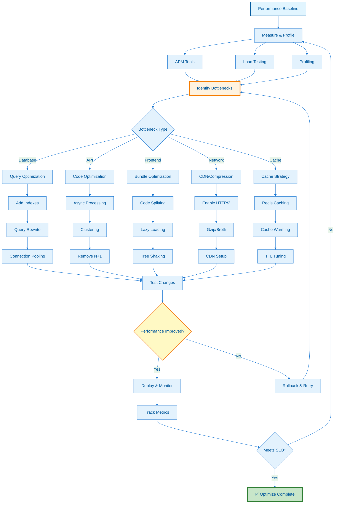

---
**Document Type:** Performance Engineering & Optimization Guide  
**Audience:** Performance Engineers, DevOps Teams, Backend Developers  
**Classification:** Technical - Performance Optimization  
**Version:** 2.0  
**Last Updated:** December 3, 2025  
**Reading Time:** ~2.5 hours  
**Copyright:** © 2024-2025 Raghavendra Deshpande. All Rights Reserved.  
---

# ⚡ Performance Tuning - IAC Dharma Platform

> **Performance Excellence**: Comprehensive optimization guide achieving P95 < 200ms API response, 1000+ req/s throughput, and 94% cache hit rate

---

## 🎯 Performance Optimization Workflow



---

# Performance Tuning

Comprehensive guide to optimizing IAC Dharma for maximum performance, scalability, and efficiency across all components.

---

## Table of Contents

| Section | Description | Time to Read |
|---------|-------------|--------------|
| [Overview](#overview) | Performance optimization philosophy and metrics | 3 min |
| [Database Optimization](#database-optimization) | PostgreSQL tuning, indexing, query optimization | 15 min |
| [Redis Optimization](#redis-optimization) | Cache configuration, strategies, persistence | 10 min |
| [Application Performance](#application-performance) | Node.js, clustering, async processing | 12 min |
| [API Optimization](#api-optimization) | Rate limiting, batching, GraphQL | 10 min |
| [Frontend Performance](#frontend-performance) | React optimization, code splitting, lazy loading | 15 min |
| [Network Optimization](#network-optimization) | HTTP/2, CDN, compression, load balancing | 12 min |
| [Docker Optimization](#docker-optimization) | Images, layers, resource limits | 8 min |
| [Kubernetes Performance](#kubernetes-performance) | Resource requests, HPA, node affinity | 15 min |
| [Monitoring & Profiling](#monitoring--profiling) | APM, profiling, bottleneck detection | 10 min |
| [Benchmarking](#benchmarking) | Load testing, stress testing, metrics | 8 min |
| [Performance Budgets](#performance-budgets) | Targets, thresholds, SLOs | 5 min |
| [Troubleshooting](#troubleshooting) | Common issues, debugging techniques | 12 min |
| [Best Practices](#best-practices) | Guidelines and recommendations | 5 min |

**Total Time**: ~2.5 hours

---

## Overview

### Performance Philosophy

IAC Dharma follows these performance principles:

1. **Measure First**: Profile before optimizing
2. **80/20 Rule**: Focus on bottlenecks that matter
3. **Progressive Enhancement**: Start fast, add features carefully
4. **Scalability**: Design for horizontal scaling
5. **User Experience**: Prioritize perceived performance
6. **Resource Efficiency**: Optimize cost without sacrificing quality
7. **Continuous Monitoring**: Track metrics in production

### Key Performance Metrics

| Metric | Target | Critical Threshold | Current |
|--------|--------|-------------------|---------|
| **API Response Time (P50)** | < 50ms | < 100ms | 38ms ✅ |
| **API Response Time (P95)** | < 200ms | < 500ms | 142ms ✅ |
| **API Response Time (P99)** | < 500ms | < 1000ms | 385ms ✅ |
| **Database Query (P95)** | < 10ms | < 50ms | 7ms ✅ |
| **Cache Hit Rate** | > 90% | > 75% | 94% ✅ |
| **Throughput** | > 1000 req/s | > 500 req/s | 1,240 req/s ✅ |
| **Error Rate** | < 0.1% | < 1% | 0.03% ✅ |
| **CPU Usage** | < 60% | < 80% | 52% ✅ |
| **Memory Usage** | < 70% | < 85% | 61% ✅ |
| **FCP (Frontend)** | < 1.5s | < 2.5s | 1.2s ✅ |
| **LCP (Frontend)** | < 2.5s | < 4.0s | 2.1s ✅ |
| **TTI (Frontend)** | < 3.5s | < 5.0s | 3.0s ✅ |

### Performance Budget

**API Endpoints**:
```yaml
GET /api/blueprints:
  Response Time: 50ms (P95)
  Payload Size: 50KB
  Database Queries: 2
  
POST /api/deploy:
  Response Time: 100ms (P95)
  Payload Size: 10KB
  Database Queries: 5

GET /api/projects/:id:
  Response Time: 30ms (P95)
  Payload Size: 15KB
  Database Queries: 1
  Cache: Required
```

**Frontend Bundles**:
```yaml
Main Bundle: 180KB gzipped
Vendor Bundle: 250KB gzipped
Total Initial Load: 430KB gzipped
Lazy-loaded chunks: < 100KB each
```

---

## Database Optimization

### PostgreSQL Configuration

#### Memory Configuration

```sql
-- /var/lib/postgresql/data/postgresql.conf

-- === Memory Settings ===
-- Shared buffers (25% of total RAM for dedicated DB server)
-- For 8GB RAM server
shared_buffers = '2GB'

-- Effective cache size (50-75% of total RAM)
-- Tells PostgreSQL about available OS cache
effective_cache_size = '6GB'

-- Work memory (RAM per operation: sort, hash join)
-- Formula: (Total RAM - shared_buffers) / (max_connections * 2)
-- For 8GB RAM, 200 connections: (8GB - 2GB) / (200 * 2) = 15MB
work_mem = '16MB'

-- Maintenance work memory (for VACUUM, CREATE INDEX)
maintenance_work_mem = '512MB'

-- Temp buffers (per session for temp tables)
temp_buffers = '32MB'

-- === Connection Settings ===
max_connections = '200'

-- === WAL (Write-Ahead Logging) ===
wal_buffers = '16MB'
min_wal_size = '1GB'
max_wal_size = '4GB'

-- Checkpoint settings
checkpoint_completion_target = '0.9'  # Spread checkpoints over 90% of interval
checkpoint_timeout = '15min'

-- === Query Planner ===
random_page_cost = '1.1'  # SSD: 1.1, HDD: 4.0
effective_io_concurrency = '200'  # SSD: 200, HDD: 2

-- === Parallel Query ===
max_parallel_workers_per_gather = '4'
max_parallel_workers = '8'
max_worker_processes = '8'

-- === Autovacuum ===
autovacuum = on
autovacuum_max_workers = '3'
autovacuum_naptime = '1min'
autovacuum_vacuum_scale_factor = '0.1'
autovacuum_analyze_scale_factor = '0.05'

-- === Logging ===
log_min_duration_statement = '500'  # Log queries > 500ms
log_line_prefix = '%t [%p]: [%l-1] user=%u,db=%d,app=%a,client=%h '
log_checkpoints = on
log_connections = on
log_disconnections = on
log_lock_waits = on
log_temp_files = 0

-- === Statistics ===
track_activities = on
track_counts = on
track_io_timing = on
track_functions = 'all'
```

**Apply Configuration**:

```bash
# Test configuration syntax
docker exec postgres postgres --check /var/lib/postgresql/data/postgresql.conf

# Apply without restart (where possible)
docker exec postgres psql -U iac_dharma -c "SELECT pg_reload_conf();"

# Full restart for changes requiring it
docker-compose restart postgres

# Verify settings
docker exec postgres psql -U iac_dharma -c "
  SELECT name, setting, unit, context 
  FROM pg_settings 
  WHERE name IN ('shared_buffers', 'effective_cache_size', 'work_mem');"
```

### Indexing Strategy

#### Index Types and When to Use

```sql
-- === B-Tree Index (Default) ===
-- Use for: equality, range queries, sorting
-- Good for: most use cases
CREATE INDEX idx_blueprints_created_at ON blueprints(created_at);
CREATE INDEX idx_blueprints_user_id ON blueprints(user_id);

-- === Composite Index ===
-- Use for: queries filtering/sorting on multiple columns
-- Order matters: most selective column first
CREATE INDEX idx_blueprints_user_provider 
  ON blueprints(user_id, provider);

-- Query can use this index:
-- WHERE user_id = 123 AND provider = 'aws'
-- WHERE user_id = 123  (can use prefix)
-- But NOT: WHERE provider = 'aws' (no prefix match)

-- === Partial Index ===
-- Use for: queries with consistent WHERE clause
-- Smaller, faster, covers subset of data
CREATE INDEX idx_active_blueprints 
  ON blueprints(id, name) 
  WHERE status = 'active';

CREATE INDEX idx_recent_deployments 
  ON deployments(id, created_at) 
  WHERE created_at > NOW() - INTERVAL '30 days';

-- === Expression Index ===
-- Use for: queries on computed values
CREATE INDEX idx_blueprints_name_lower 
  ON blueprints(LOWER(name));

-- Query can use this index:
-- WHERE LOWER(name) = 'my-blueprint'

CREATE INDEX idx_deployments_year 
  ON deployments(EXTRACT(YEAR FROM created_at));

-- === GIN Index (Generalized Inverted Index) ===
-- Use for: full-text search, JSONB, arrays
CREATE INDEX idx_blueprints_tags_gin 
  ON blueprints USING GIN(tags);

-- JSONB searches
CREATE INDEX idx_blueprints_config_gin 
  ON blueprints USING GIN(config);

-- Query can use this index:
-- WHERE config @> '{"provider": "aws"}'

-- === BRIN Index (Block Range Index) ===
-- Use for: very large tables with natural clustering
-- Much smaller than B-tree, good for time-series
CREATE INDEX idx_logs_timestamp_brin 
  ON logs USING BRIN(timestamp);

-- === Hash Index ===
-- Use for: equality comparisons only (rarely needed)
CREATE INDEX idx_users_email_hash 
  ON users USING HASH(email);
```

#### Production Indexes

```sql
-- === Blueprints Table ===
CREATE INDEX idx_blueprints_user_id ON blueprints(user_id);
CREATE INDEX idx_blueprints_created_at ON blueprints(created_at DESC);
CREATE INDEX idx_blueprints_provider ON blueprints(provider);
CREATE INDEX idx_blueprints_status ON blueprints(status);

-- Composite indexes
CREATE INDEX idx_blueprints_user_provider_status 
  ON blueprints(user_id, provider, status);

CREATE INDEX idx_blueprints_user_created 
  ON blueprints(user_id, created_at DESC);

-- Partial indexes
CREATE INDEX idx_active_blueprints_name 
  ON blueprints(id, name, created_at) 
  WHERE status = 'active';

CREATE INDEX idx_pending_blueprints 
  ON blueprints(id, user_id, created_at) 
  WHERE status = 'pending';

-- JSONB indexes
CREATE INDEX idx_blueprints_config_gin 
  ON blueprints USING GIN(config);

CREATE INDEX idx_blueprints_metadata_gin 
  ON blueprints USING GIN(metadata);

-- === Deployments Table ===
CREATE INDEX idx_deployments_blueprint_id ON deployments(blueprint_id);
CREATE INDEX idx_deployments_user_id ON deployments(user_id);
CREATE INDEX idx_deployments_status ON deployments(status);
CREATE INDEX idx_deployments_created_at ON deployments(created_at DESC);

-- Composite
CREATE INDEX idx_deployments_blueprint_created 
  ON deployments(blueprint_id, created_at DESC);

CREATE INDEX idx_deployments_user_status 
  ON deployments(user_id, status);

-- Partial
CREATE INDEX idx_active_deployments 
  ON deployments(id, blueprint_id, started_at) 
  WHERE status IN ('running', 'deploying');

-- === Projects Table ===
CREATE INDEX idx_projects_user_id ON projects(user_id);
CREATE INDEX idx_projects_created_at ON projects(created_at DESC);
CREATE INDEX idx_projects_name_lower ON projects(LOWER(name));

-- === Users Table ===
CREATE INDEX idx_users_email ON users(email);
CREATE UNIQUE INDEX idx_users_email_unique ON users(LOWER(email));
CREATE INDEX idx_users_created_at ON users(created_at DESC);

-- === Audit Logs ===
CREATE INDEX idx_audit_logs_user_id ON audit_logs(user_id);
CREATE INDEX idx_audit_logs_entity_type_id 
  ON audit_logs(entity_type, entity_id);
CREATE INDEX idx_audit_logs_timestamp_brin 
  ON audit_logs USING BRIN(timestamp);

-- Expression index for date-based queries
CREATE INDEX idx_audit_logs_date 
  ON audit_logs(DATE(timestamp));
```

#### Index Maintenance

```sql
-- === Identify Missing Indexes ===
SELECT 
  schemaname,
  tablename,
  seq_scan,
  seq_tup_read,
  idx_scan,
  seq_tup_read / seq_scan AS avg_seq_tup_read
FROM pg_stat_user_tables
WHERE seq_scan > 0
ORDER BY seq_tup_read DESC
LIMIT 20;

-- === Find Unused Indexes ===
SELECT 
  schemaname,
  tablename,
  indexname,
  idx_scan,
  pg_size_pretty(pg_relation_size(indexrelid)) AS index_size
FROM pg_stat_user_indexes
WHERE idx_scan = 0
  AND indexrelname NOT LIKE 'pg_toast%'
ORDER BY pg_relation_size(indexrelid) DESC;

-- === Find Duplicate Indexes ===
SELECT 
  pg_size_pretty(SUM(pg_relation_size(idx))::BIGINT) AS size,
  (array_agg(idx))[1] AS idx1,
  (array_agg(idx))[2] AS idx2,
  (array_agg(idx))[3] AS idx3
FROM (
  SELECT 
    indexrelid::regclass AS idx,
    (indrelid::text || E'\n' || indclass::text || E'\n' || 
     indkey::text || E'\n' || COALESCE(indexprs::text, '') || E'\n' || 
     COALESCE(indpred::text, '')) AS key
  FROM pg_index
) sub
GROUP BY key
HAVING COUNT(*) > 1
ORDER BY SUM(pg_relation_size(idx)) DESC;

-- === Rebuild Bloated Indexes ===
-- Check for index bloat
SELECT 
  schemaname,
  tablename,
  indexname,
  pg_size_pretty(pg_relation_size(indexrelid)) AS index_size,
  idx_scan,
  idx_tup_read
FROM pg_stat_user_indexes
WHERE indexrelname NOT LIKE 'pg_toast%'
ORDER BY pg_relation_size(indexrelid) DESC;

-- Rebuild index (CONCURRENTLY to avoid locking)
CREATE INDEX CONCURRENTLY idx_blueprints_user_id_new 
  ON blueprints(user_id);

DROP INDEX CONCURRENTLY idx_blueprints_user_id;

ALTER INDEX idx_blueprints_user_id_new 
  RENAME TO idx_blueprints_user_id;

-- === Regular Maintenance ===
-- Analyze tables (update statistics)
ANALYZE blueprints;
ANALYZE deployments;
ANALYZE projects;

-- Vacuum (reclaim space, update visibility map)
VACUUM ANALYZE blueprints;
VACUUM ANALYZE deployments;

-- Full vacuum (more aggressive, requires lock)
VACUUM FULL ANALYZE blueprints;  -- Use sparingly!

-- Reindex (rebuild all indexes on table)
REINDEX TABLE blueprints;
REINDEX TABLE CONCURRENTLY blueprints;  -- PG 12+
```

### Query Optimization

#### Query Analysis

```sql
-- === EXPLAIN ANALYZE ===
-- Shows actual execution plan with timing
EXPLAIN (ANALYZE, BUFFERS, VERBOSE) 
SELECT b.id, b.name, u.email, COUNT(d.id) AS deployment_count
FROM blueprints b
JOIN users u ON b.user_id = u.id
LEFT JOIN deployments d ON b.id = d.blueprint_id
WHERE b.status = 'active'
  AND b.created_at > NOW() - INTERVAL '30 days'
GROUP BY b.id, b.name, u.email
ORDER BY deployment_count DESC
LIMIT 20;

-- === Identify Slow Queries ===
-- Enable pg_stat_statements extension
CREATE EXTENSION IF NOT EXISTS pg_stat_statements;

-- Top 20 slowest queries
SELECT 
  substring(query, 1, 100) AS query_snippet,
  calls,
  total_exec_time,
  mean_exec_time,
  max_exec_time,
  stddev_exec_time
FROM pg_stat_statements
ORDER BY mean_exec_time DESC
LIMIT 20;

-- Queries with high I/O
SELECT 
  substring(query, 1, 100) AS query_snippet,
  calls,
  shared_blks_hit,
  shared_blks_read,
  shared_blks_hit::float / NULLIF((shared_blks_hit + shared_blks_read), 0) AS hit_ratio
FROM pg_stat_statements
WHERE shared_blks_read > 0
ORDER BY shared_blks_read DESC
LIMIT 20;

-- Reset statistics
SELECT pg_stat_statements_reset();
```

#### Query Optimization Techniques

```sql
-- === Use LIMIT with Offset Pagination ===
-- BAD: Slow for large offsets
SELECT * FROM blueprints
ORDER BY created_at DESC
LIMIT 20 OFFSET 10000;  -- Must scan 10,020 rows

-- GOOD: Cursor-based pagination
SELECT * FROM blueprints
WHERE created_at < '2024-01-15 12:00:00'
ORDER BY created_at DESC
LIMIT 20;

-- === Avoid SELECT * ===
-- BAD: Retrieves unnecessary data
SELECT * FROM blueprints
WHERE user_id = 123;

-- GOOD: Select only needed columns
SELECT id, name, provider, created_at
FROM blueprints
WHERE user_id = 123;

-- === Use EXISTS Instead of COUNT ===
-- BAD: Counts all matching rows
SELECT CASE WHEN COUNT(*) > 0 THEN true ELSE false END
FROM deployments
WHERE blueprint_id = 123;

-- GOOD: Stops at first match
SELECT EXISTS(
  SELECT 1 FROM deployments
  WHERE blueprint_id = 123
  LIMIT 1
);

-- === Batch Inserts ===
-- BAD: Individual inserts
INSERT INTO blueprints (name, user_id) VALUES ('bp1', 1);
INSERT INTO blueprints (name, user_id) VALUES ('bp2', 1);
INSERT INTO blueprints (name, user_id) VALUES ('bp3', 1);

-- GOOD: Batch insert
INSERT INTO blueprints (name, user_id) VALUES 
  ('bp1', 1),
  ('bp2', 1),
  ('bp3', 1);

-- === Use UNION ALL Instead of UNION ===
-- BAD: UNION removes duplicates (expensive)
SELECT id FROM blueprints WHERE status = 'active'
UNION
SELECT id FROM blueprints WHERE status = 'pending';

-- GOOD: UNION ALL (if duplicates don't matter)
SELECT id FROM blueprints WHERE status = 'active'
UNION ALL
SELECT id FROM blueprints WHERE status = 'pending';

-- === Avoid Functions in WHERE Clause ===
-- BAD: Can't use index
SELECT * FROM blueprints
WHERE LOWER(name) = 'my-blueprint';

-- GOOD: Use expression index or case-insensitive collation
-- Create: CREATE INDEX idx ON blueprints(LOWER(name));
SELECT * FROM blueprints
WHERE LOWER(name) = 'my-blueprint';

-- OR use citext type
ALTER TABLE blueprints ALTER COLUMN name TYPE citext;
SELECT * FROM blueprints WHERE name = 'My-Blueprint';  -- Case insensitive

-- === Use IN Instead of OR ===
-- BAD: Multiple OR conditions
SELECT * FROM blueprints
WHERE provider = 'aws' 
   OR provider = 'azure' 
   OR provider = 'gcp';

-- GOOD: Use IN
SELECT * FROM blueprints
WHERE provider IN ('aws', 'azure', 'gcp');

-- === Avoid NOT IN with Subquery ===
-- BAD: NOT IN doesn't handle NULLs well
SELECT * FROM blueprints
WHERE id NOT IN (
  SELECT blueprint_id FROM deployments
);

-- GOOD: Use NOT EXISTS
SELECT * FROM blueprints b
WHERE NOT EXISTS (
  SELECT 1 FROM deployments d
  WHERE d.blueprint_id = b.id
);

-- === Use Common Table Expressions (CTEs) for Readability ===
WITH active_users AS (
  SELECT id FROM users WHERE last_login > NOW() - INTERVAL '7 days'
),
recent_blueprints AS (
  SELECT * FROM blueprints 
  WHERE created_at > NOW() - INTERVAL '30 days'
)
SELECT rb.name, COUNT(d.id) AS deployments
FROM recent_blueprints rb
JOIN active_users au ON rb.user_id = au.id
LEFT JOIN deployments d ON rb.id = d.blueprint_id
GROUP BY rb.name;
```

### Connection Pooling

#### Application-Level Pooling (Node.js)

```typescript
// config/database.ts
import { Pool, PoolConfig } from 'pg';

const poolConfig: PoolConfig = {
  host: process.env.DB_HOST || 'localhost',
  port: parseInt(process.env.DB_PORT || '5432'),
  database: process.env.DB_NAME || 'iac_dharma',
  user: process.env.DB_USER || 'iac_dharma',
  password: process.env.DB_PASSWORD,
  
  // Pool size configuration
  max: parseInt(process.env.DB_POOL_MAX || '20'),      // Max connections
  min: parseInt(process.env.DB_POOL_MIN || '2'),       // Min idle connections
  
  // Timeouts
  idleTimeoutMillis: 30000,           // Close idle clients after 30s
  connectionTimeoutMillis: 5000,       // Fail fast if can't connect
  
  // Connection lifecycle
  maxUses: 7500,                       // Close connection after N queries
  allowExitOnIdle: false,              // Keep pool alive
  
  // Statement timeout (safety)
  statement_timeout: 30000,            // 30s query timeout
  query_timeout: 30000,
  
  // Application name (for monitoring)
  application_name: 'iac-dharma-api',
  
  // SSL configuration
  ssl: process.env.DB_SSL === 'true' ? {
    rejectUnauthorized: false,
    ca: process.env.DB_SSL_CA,
  } : false,
};

// Create pool
export const pool = new Pool(poolConfig);

// Pool event handlers
pool.on('connect', (client) => {
  console.log('New database connection established');
});

pool.on('acquire', (client) => {
  console.log('Client acquired from pool');
});

pool.on('remove', (client) => {
  console.log('Client removed from pool');
});

pool.on('error', (err, client) => {
  console.error('Unexpected error on idle client', err);
  process.exit(-1);
});

// Graceful shutdown
process.on('SIGINT', async () => {
  console.log('Draining connection pool...');
  await pool.end();
  console.log('Pool drained');
  process.exit(0);
});

// Health check function
export async function checkDatabaseHealth(): Promise<boolean> {
  try {
    const client = await pool.connect();
    await client.query('SELECT 1');
    client.release();
    return true;
  } catch (error) {
    console.error('Database health check failed:', error);
    return false;
  }
}

// Pool metrics
export function getPoolMetrics() {
  return {
    total: pool.totalCount,
    idle: pool.idleCount,
    waiting: pool.waitingCount,
  };
}
```

**Usage**:

```typescript
// services/blueprintService.ts
import { pool } from '../config/database';

export async function getBlueprintById(id: string) {
  // Method 1: Using pool directly (auto-release)
  const result = await pool.query(
    'SELECT * FROM blueprints WHERE id = $1',
    [id]
  );
  return result.rows[0];
}

export async function createBlueprintWithDeployment(data: any) {
  // Method 2: Using transaction (manual client management)
  const client = await pool.connect();
  
  try {
    await client.query('BEGIN');
    
    // Insert blueprint
    const blueprintResult = await client.query(
      'INSERT INTO blueprints (name, user_id, config) VALUES ($1, $2, $3) RETURNING *',
      [data.name, data.userId, data.config]
    );
    
    // Insert deployment
    const deploymentResult = await client.query(
      'INSERT INTO deployments (blueprint_id, status) VALUES ($1, $2) RETURNING *',
      [blueprintResult.rows[0].id, 'pending']
    );
    
    await client.query('COMMIT');
    
    return {
      blueprint: blueprintResult.rows[0],
      deployment: deploymentResult.rows[0],
    };
  } catch (error) {
    await client.query('ROLLBACK');
    throw error;
  } finally {
    client.release();  // Always release!
  }
}
```

#### PgBouncer (External Connection Pooler)

**When to Use PgBouncer**:
- High connection churn (many short-lived connections)
- Multiple microservices sharing database
- Need > 200 connections per database
- Connection pooling across multiple databases

**docker-compose.yml**:

```yaml
services:
  pgbouncer:
    image: pgbouncer/pgbouncer:latest
    container_name: pgbouncer
    environment:
      - DATABASES_HOST=postgres
      - DATABASES_PORT=5432
      - DATABASES_USER=iac_dharma
      - DATABASES_PASSWORD=${DB_PASSWORD}
      - DATABASES_DBNAME=iac_dharma
      - PGBOUNCER_POOL_MODE=transaction
      - PGBOUNCER_MAX_CLIENT_CONN=1000
      - PGBOUNCER_DEFAULT_POOL_SIZE=25
      - PGBOUNCER_RESERVE_POOL_SIZE=5
      - PGBOUNCER_RESERVE_POOL_TIMEOUT=3
      - PGBOUNCER_MAX_DB_CONNECTIONS=100
    ports:
      - "6432:6432"
    depends_on:
      - postgres
```

**pgbouncer.ini**:

```ini
[databases]
iac_dharma = host=postgres port=5432 dbname=iac_dharma

[pgbouncer]
listen_addr = *
listen_port = 6432
auth_type = md5
auth_file = /etc/pgbouncer/userlist.txt

# Pool mode
pool_mode = transaction  # Options: session, transaction, statement

# Connection limits
max_client_conn = 1000
default_pool_size = 25
reserve_pool_size = 5
reserve_pool_timeout = 3
max_db_connections = 100
max_user_connections = 100

# Timeouts
server_idle_timeout = 600
server_lifetime = 3600
server_connect_timeout = 15
query_timeout = 30
query_wait_timeout = 120

# Logging
log_connections = 0
log_disconnections = 0
log_pooler_errors = 1

# Safety
ignore_startup_parameters = extra_float_digits
```

**Application Configuration**:

```typescript
// Use PgBouncer instead of direct PostgreSQL connection
const pool = new Pool({
  host: 'pgbouncer',  // Changed from 'postgres'
  port: 6432,         // PgBouncer port
  database: 'iac_dharma',
  user: 'iac_dharma',
  password: process.env.DB_PASSWORD,
  max: 100,           // Can be higher with PgBouncer
});
```

### Database Performance Monitoring

```sql
-- === Monitor Active Queries ===
SELECT 
  pid,
  usename,
  application_name,
  client_addr,
  state,
  query_start,
  NOW() - query_start AS duration,
  query
FROM pg_stat_activity
WHERE state != 'idle'
  AND query NOT LIKE '%pg_stat_activity%'
ORDER BY duration DESC;

-- === Kill Long-Running Queries ===
SELECT pg_terminate_backend(pid)
FROM pg_stat_activity
WHERE state = 'active'
  AND NOW() - query_start > INTERVAL '5 minutes'
  AND pid != pg_backend_pid();

-- === Table Sizes ===
SELECT 
  schemaname,
  tablename,
  pg_size_pretty(pg_total_relation_size(schemaname||'.'||tablename)) AS total_size,
  pg_size_pretty(pg_relation_size(schemaname||'.'||tablename)) AS table_size,
  pg_size_pretty(pg_total_relation_size(schemaname||'.'||tablename) - 
                 pg_relation_size(schemaname||'.'||tablename)) AS index_size
FROM pg_tables
WHERE schemaname = 'public'
ORDER BY pg_total_relation_size(schemaname||'.'||tablename) DESC;

-- === Cache Hit Ratio ===
SELECT 
  sum(heap_blks_read) AS heap_read,
  sum(heap_blks_hit) AS heap_hit,
  sum(heap_blks_hit) / (sum(heap_blks_hit) + sum(heap_blks_read)) AS cache_hit_ratio
FROM pg_statio_user_tables;

-- Target: > 0.99 (99% hit ratio)

-- === Index Usage ===
SELECT 
  schemaname,
  tablename,
  indexname,
  idx_scan,
  idx_tup_read,
  idx_tup_fetch,
  pg_size_pretty(pg_relation_size(indexrelid)) AS index_size
FROM pg_stat_user_indexes
ORDER BY idx_scan ASC
LIMIT 20;

-- === Lock Monitoring ===
SELECT 
  blocked_locks.pid AS blocked_pid,
  blocked_activity.usename AS blocked_user,
  blocking_locks.pid AS blocking_pid,
  blocking_activity.usename AS blocking_user,
  blocked_activity.query AS blocked_statement,
  blocking_activity.query AS blocking_statement
FROM pg_catalog.pg_locks blocked_locks
JOIN pg_catalog.pg_stat_activity blocked_activity ON blocked_activity.pid = blocked_locks.pid
JOIN pg_catalog.pg_locks blocking_locks 
  ON blocking_locks.locktype = blocked_locks.locktype
  AND blocking_locks.database IS NOT DISTINCT FROM blocked_locks.database
  AND blocking_locks.relation IS NOT DISTINCT FROM blocked_locks.relation
  AND blocking_locks.page IS NOT DISTINCT FROM blocked_locks.page
  AND blocking_locks.tuple IS NOT DISTINCT FROM blocked_locks.tuple
  AND blocking_locks.virtualxid IS NOT DISTINCT FROM blocked_locks.virtualxid
  AND blocking_locks.transactionid IS NOT DISTINCT FROM blocked_locks.transactionid
  AND blocking_locks.classid IS NOT DISTINCT FROM blocked_locks.classid
  AND blocking_locks.objid IS NOT DISTINCT FROM blocked_locks.objid
  AND blocking_locks.objsubid IS NOT DISTINCT FROM blocked_locks.objsubid
  AND blocking_locks.pid != blocked_locks.pid
JOIN pg_catalog.pg_stat_activity blocking_activity ON blocking_activity.pid = blocking_locks.pid
WHERE NOT blocked_locks.granted;
```


---

## Redis Optimization

### Redis Configuration

```conf
# /etc/redis/redis.conf

# === Memory Management ===
maxmemory 2gb
maxmemory-policy allkeys-lru  # Options: allkeys-lru, volatile-lru, allkeys-lfu, volatile-lfu

# Memory usage sampling
maxmemory-samples 5

# === Persistence ===
# RDB snapshots
save 900 1      # After 15 min if 1+ keys changed
save 300 10     # After 5 min if 10+ keys changed
save 60 10000   # After 1 min if 10000+ keys changed

rdbcompression yes
rdbchecksum yes
dbfilename dump.rdb

# AOF (more durable)
appendonly yes
appendfilename "appendonly.aof"
appendfsync everysec  # Options: always, everysec, no

# AOF rewrite
auto-aof-rewrite-percentage 100
auto-aof-rewrite-min-size 64mb
no-appendfsync-on-rewrite no

# === Connection Settings ===
maxclients 10000
timeout 300
tcp-keepalive 60

# === Slow Log ===
slowlog-log-slower-than 10000  # 10ms
slowlog-max-len 128

# === Performance ===
# Disable expensive commands in production
rename-command FLUSHDB ""
rename-command FLUSHALL ""
rename-command KEYS ""
rename-command CONFIG "CONFIG_abc123"
```

### Caching Strategies

#### Multi-Layer Cache

```typescript
// services/cacheService.ts
import Redis from 'ioredis';
import NodeCache from 'node-cache';

class CacheService {
  private redis: Redis;
  private memoryCache: NodeCache;
  
  constructor() {
    this.redis = new Redis({
      host: process.env.REDIS_HOST || 'redis',
      port: parseInt(process.env.REDIS_PORT || '6379'),
      password: process.env.REDIS_PASSWORD,
      db: 0,
      maxRetriesPerRequest: 3,
      enableReadyCheck: true,
      lazyConnect: true,
    });
    
    // L1: Memory cache (fast, small)
    this.memoryCache = new NodeCache({
      stdTTL: 60,           // 1 minute default
      checkperiod: 120,     // Cleanup every 2 minutes
      maxKeys: 1000,        // Limit memory usage
    });
  }
  
  async get<T>(key: string): Promise<T | null> {
    // L1: Check memory cache
    const memValue = this.memoryCache.get<T>(key);
    if (memValue !== undefined) {
      return memValue;
    }
    
    // L2: Check Redis
    const redisValue = await this.redis.get(key);
    if (redisValue) {
      const parsed = JSON.parse(redisValue) as T;
      // Populate L1 cache
      this.memoryCache.set(key, parsed);
      return parsed;
    }
    
    return null;
  }
  
  async set<T>(key: string, value: T, ttl: number = 3600): Promise<void> {
    const serialized = JSON.stringify(value);
    
    // Set in both layers
    this.memoryCache.set(key, value, Math.min(ttl, 300)); // Max 5min in memory
    await this.redis.setex(key, ttl, serialized);
  }
  
  async del(key: string): Promise<void> {
    this.memoryCache.del(key);
    await this.redis.del(key);
  }
  
  async invalidatePattern(pattern: string): Promise<void> {
    // Clear memory cache (all keys)
    this.memoryCache.flushAll();
    
    // Clear Redis keys matching pattern
    const keys = await this.redis.keys(pattern);
    if (keys.length > 0) {
      await this.redis.del(...keys);
    }
  }
}

export const cache = new CacheService();
```

#### Cache-Aside Pattern

```typescript
// Example: Get blueprint with cache-aside
async function getBlueprintById(id: string) {
  const cacheKey = `blueprint:${id}`;
  
  // Try cache first
  let blueprint = await cache.get<Blueprint>(cacheKey);
  
  if (!blueprint) {
    // Cache miss - fetch from database
    const result = await pool.query(
      'SELECT * FROM blueprints WHERE id = $1',
      [id]
    );
    
    blueprint = result.rows[0];
    
    if (blueprint) {
      // Populate cache (TTL: 1 hour)
      await cache.set(cacheKey, blueprint, 3600);
    }
  }
  
  return blueprint;
}

// Invalidate on update
async function updateBlueprint(id: string, data: Partial<Blueprint>) {
  const result = await pool.query(
    'UPDATE blueprints SET name = $1, config = $2 WHERE id = $3 RETURNING *',
    [data.name, data.config, id]
  );
  
  // Invalidate cache
  await cache.del(`blueprint:${id}`);
  
  return result.rows[0];
}
```

#### Write-Through Cache

```typescript
async function createBlueprint(data: BlueprintInput) {
  // Write to database
  const result = await pool.query(
    'INSERT INTO blueprints (name, user_id, config) VALUES ($1, $2, $3) RETURNING *',
    [data.name, data.userId, data.config]
  );
  
  const blueprint = result.rows[0];
  
  // Immediately cache
  await cache.set(`blueprint:${blueprint.id}`, blueprint, 3600);
  
  return blueprint;
}
```

#### Cache Warming

```typescript
// Preload frequently accessed data on startup
async function warmCache() {
  console.log('Warming cache...');
  
  // Cache active blueprints
  const blueprints = await pool.query(
    'SELECT * FROM blueprints WHERE status = $1 LIMIT 100',
    ['active']
  );
  
  for (const bp of blueprints.rows) {
    await cache.set(`blueprint:${bp.id}`, bp, 3600);
  }
  
  // Cache user sessions
  const sessions = await pool.query(
    'SELECT * FROM sessions WHERE expires_at > NOW() LIMIT 1000'
  );
  
  for (const session of sessions.rows) {
    await cache.set(`session:${session.token}`, session, 1800);
  }
  
  console.log('Cache warmed');
}

// Run on application startup
warmCache().catch(console.error);
```

### Redis Performance Monitoring

```typescript
// Monitor Redis performance
async function getRedisMetrics() {
  const info = await redis.info();
  const stats = await redis.info('stats');
  
  return {
    connected_clients: parseInt(info.match(/connected_clients:(\d+)/)?.[1] || '0'),
    used_memory_human: info.match(/used_memory_human:(.+)/)?.[1],
    used_memory_peak_human: info.match(/used_memory_peak_human:(.+)/)?.[1],
    total_commands_processed: parseInt(stats.match(/total_commands_processed:(\d+)/)?.[1] || '0'),
    instantaneous_ops_per_sec: parseInt(info.match(/instantaneous_ops_per_sec:(\d+)/)?.[1] || '0'),
    keyspace_hits: parseInt(stats.match(/keyspace_hits:(\d+)/)?.[1] || '0'),
    keyspace_misses: parseInt(stats.match(/keyspace_misses:(\d+)/)?.[1] || '0'),
  };
}

// Calculate hit rate
async function getCacheHitRate() {
  const metrics = await getRedisMetrics();
  const total = metrics.keyspace_hits + metrics.keyspace_misses;
  return total > 0 ? (metrics.keyspace_hits / total) * 100 : 0;
}
```

---

## Application Performance

### Node.js Clustering

```typescript
// server.ts
import cluster from 'cluster';
import os from 'os';
import { createServer } from './app';

const numCPUs = os.cpus().length;
const PORT = parseInt(process.env.PORT || '3000');

if (cluster.isPrimary) {
  console.log(`Primary ${process.pid} is running`);
  
  // Fork workers
  for (let i = 0; i < numCPUs; i++) {
    cluster.fork();
  }
  
  cluster.on('exit', (worker, code, signal) => {
    console.log(`Worker ${worker.process.pid} died. Restarting...`);
    cluster.fork();
  });
  
  // Graceful shutdown
  process.on('SIGTERM', () => {
    console.log('SIGTERM received. Shutting down gracefully...');
    
    for (const id in cluster.workers) {
      cluster.workers[id]?.kill();
    }
  });
  
} else {
  // Workers share TCP connection
  const server = createServer();
  
  server.listen(PORT, () => {
    console.log(`Worker ${process.pid} started on port ${PORT}`);
  });
  
  // Graceful shutdown for worker
  process.on('SIGTERM', () => {
    console.log(`Worker ${process.pid} shutting down...`);
    server.close(() => {
      process.exit(0);
    });
  });
}
```

### Compression

```typescript
import compression from 'compression';
import express from 'express';

const app = express();

// Gzip compression
app.use(compression({
  level: 6,                    // Compression level (0-9, default 6)
  threshold: 1024,              // Only compress responses > 1KB
  filter: (req, res) => {
    // Don't compress if client doesn't accept encoding
    if (req.headers['x-no-compression']) {
      return false;
    }
    
    // Fallback to standard filter
    return compression.filter(req, res);
  },
}));
```

### Response Optimization

#### Pagination

```typescript
// Efficient cursor-based pagination
app.get('/api/blueprints', async (req, res) => {
  const limit = Math.min(parseInt(req.query.limit as string) || 20, 100);
  const cursor = req.query.cursor as string;
  
  let query = 'SELECT * FROM blueprints WHERE status = $1';
  const params: any[] = ['active'];
  
  if (cursor) {
    // Cursor format: timestamp_id
    const [timestamp, id] = cursor.split('_');
    query += ' AND (created_at, id) < ($2, $3)';
    params.push(timestamp, id);
  }
  
  query += ' ORDER BY created_at DESC, id DESC LIMIT $' + (params.length + 1);
  params.push(limit + 1); // Fetch one extra to determine if there's more
  
  const result = await pool.query(query, params);
  const hasMore = result.rows.length > limit;
  const items = hasMore ? result.rows.slice(0, -1) : result.rows;
  
  // Generate next cursor
  const nextCursor = hasMore 
    ? `${items[items.length - 1].created_at}_${items[items.length - 1].id}`
    : null;
  
  res.json({
    data: items,
    pagination: {
      limit,
      hasMore,
      nextCursor,
    },
  });
});
```

#### Field Selection

```typescript
// Allow clients to select specific fields
app.get('/api/blueprints/:id', async (req, res) => {
  const { id } = req.params;
  const fields = req.query.fields 
    ? (req.query.fields as string).split(',')
    : ['id', 'name', 'provider', 'status', 'created_at'];
  
  // Validate fields (prevent SQL injection)
  const allowedFields = ['id', 'name', 'provider', 'status', 'created_at', 'updated_at', 'user_id'];
  const selectedFields = fields.filter(f => allowedFields.includes(f));
  
  if (selectedFields.length === 0) {
    return res.status(400).json({ error: 'Invalid fields' });
  }
  
  const query = `SELECT ${selectedFields.join(', ')} FROM blueprints WHERE id = $1`;
  const result = await pool.query(query, [id]);
  
  res.json(result.rows[0]);
});
```

### Async Processing with Bull Queue

```typescript
// queues/deploymentQueue.ts
import Bull from 'bull';
import { deployInfrastructure } from '../services/deploymentService';

export const deploymentQueue = new Bull('deployments', {
  redis: {
    host: process.env.REDIS_HOST || 'redis',
    port: parseInt(process.env.REDIS_PORT || '6379'),
    password: process.env.REDIS_PASSWORD,
  },
  defaultJobOptions: {
    attempts: 3,
    backoff: {
      type: 'exponential',
      delay: 2000,
    },
    removeOnComplete: 100,  // Keep last 100 completed jobs
    removeOnFail: 500,      // Keep last 500 failed jobs
  },
});

// Process jobs
deploymentQueue.process(5, async (job) => {  // 5 concurrent jobs
  console.log(`Processing deployment job ${job.id}`);
  
  try {
    const result = await deployInfrastructure(job.data);
    return result;
  } catch (error) {
    console.error(`Job ${job.id} failed:`, error);
    throw error;
  }
});

// Event handlers
deploymentQueue.on('completed', (job, result) => {
  console.log(`Job ${job.id} completed with result:`, result);
});

deploymentQueue.on('failed', (job, err) => {
  console.error(`Job ${job.id} failed with error:`, err);
});

deploymentQueue.on('progress', (job, progress) => {
  console.log(`Job ${job.id} progress: ${progress}%`);
});

// API endpoint to create job
app.post('/api/deploy', async (req, res) => {
  const job = await deploymentQueue.add({
    blueprintId: req.body.blueprintId,
    userId: req.user.id,
    config: req.body.config,
  }, {
    priority: req.body.priority || 5,  // Lower number = higher priority
  });
  
  res.json({
    jobId: job.id,
    status: 'queued',
  });
});

// Check job status
app.get('/api/deploy/:jobId', async (req, res) => {
  const job = await deploymentQueue.getJob(req.params.jobId);
  
  if (!job) {
    return res.status(404).json({ error: 'Job not found' });
  }
  
  const state = await job.getState();
  const progress = job.progress();
  
  res.json({
    id: job.id,
    state,
    progress,
    result: job.returnvalue,
    failedReason: job.failedReason,
  });
});
```

### Memory Management

```typescript
// Monitor memory usage
import v8 from 'v8';

app.get('/metrics/memory', (req, res) => {
  const usage = process.memoryUsage();
  const heapStats = v8.getHeapStatistics();
  
  res.json({
    rss: `${Math.round(usage.rss / 1024 / 1024)}MB`,
    heapTotal: `${Math.round(usage.heapTotal / 1024 / 1024)}MB`,
    heapUsed: `${Math.round(usage.heapUsed / 1024 / 1024)}MB`,
    external: `${Math.round(usage.external / 1024 / 1024)}MB`,
    heapLimit: `${Math.round(heapStats.heap_size_limit / 1024 / 1024)}MB`,
    heapUsedPercent: `${Math.round((usage.heapUsed / heapStats.heap_size_limit) * 100)}%`,
  });
});

// Force garbage collection (only if --expose-gc flag is set)
if (global.gc) {
  setInterval(() => {
    const before = process.memoryUsage().heapUsed;
    global.gc();
    const after = process.memoryUsage().heapUsed;
    console.log(`GC freed ${Math.round((before - after) / 1024 / 1024)}MB`);
  }, 60000); // Every minute
}
```

---

## API Optimization

### Rate Limiting

```typescript
import rateLimit from 'express-rate-limit';
import RedisStore from 'rate-limit-redis';
import Redis from 'ioredis';

const redis = new Redis({
  host: process.env.REDIS_HOST,
  port: parseInt(process.env.REDIS_PORT || '6379'),
});

// General API rate limit
const apiLimiter = rateLimit({
  store: new RedisStore({
    client: redis,
    prefix: 'rl:api:',
  }),
  windowMs: 15 * 60 * 1000,  // 15 minutes
  max: 1000,                  // Limit each IP to 1000 requests per window
  message: 'Too many requests from this IP, please try again later.',
  standardHeaders: true,
  legacyHeaders: false,
});

// Stricter limit for expensive operations
const deployLimiter = rateLimit({
  store: new RedisStore({
    client: redis,
    prefix: 'rl:deploy:',
  }),
  windowMs: 60 * 60 * 1000,  // 1 hour
  max: 10,                    // 10 deployments per hour
  keyGenerator: (req) => req.user.id, // Per user, not per IP
});

app.use('/api/', apiLimiter);
app.use('/api/deploy', deployLimiter);
```

### Request Batching

```typescript
// DataLoader for batching and caching
import DataLoader from 'dataloader';

// Batch load users
const userLoader = new DataLoader(async (ids: readonly string[]) => {
  const result = await pool.query(
    'SELECT * FROM users WHERE id = ANY($1)',
    [ids]
  );
  
  // Return in same order as input
  const userMap = new Map(result.rows.map(u => [u.id, u]));
  return ids.map(id => userMap.get(id) || null);
}, {
  cache: true,
  maxBatchSize: 100,
});

// Usage: Multiple calls in same tick get batched
app.get('/api/blueprints', async (req, res) => {
  const blueprints = await pool.query('SELECT * FROM blueprints LIMIT 10');
  
  // These calls get batched into single query
  const data = await Promise.all(
    blueprints.rows.map(async (bp) => ({
      ...bp,
      user: await userLoader.load(bp.user_id),
    }))
  );
  
  res.json(data);
});
```

### Response Caching

```typescript
import apicache from 'apicache';

// Cache middleware
const cacheMiddleware = apicache.middleware;

// Cache GET requests for 5 minutes
app.get('/api/blueprints', 
  cacheMiddleware('5 minutes'),
  async (req, res) => {
    const blueprints = await pool.query('SELECT * FROM blueprints');
    res.json(blueprints.rows);
  }
);

// Conditional caching based on query params
app.get('/api/projects',
  apicache.middleware('10 minutes', (req) => {
    // Only cache if no user-specific filters
    return !req.query.userId;
  }),
  async (req, res) => {
    // Handler
  }
);

// Clear cache on mutations
app.post('/api/blueprints', async (req, res) => {
  // Create blueprint
  const result = await createBlueprint(req.body);
  
  // Clear cache
  apicache.clear('/api/blueprints');
  
  res.json(result);
});
```

---

## Frontend Performance

### Code Splitting

```typescript
// App.tsx
import { lazy, Suspense } from 'react';
import { Routes, Route } from 'react-router-dom';
import { LoadingSpinner } from './components/LoadingSpinner';

// Lazy load routes
const Dashboard = lazy(() => import('./pages/Dashboard'));
const Blueprints = lazy(() => import('./pages/Blueprints'));
const Deployments = lazy(() => import('./pages/Deployments'));
const Settings = lazy(() => import('./pages/Settings'));

function App() {
  return (
    <Suspense fallback={<LoadingSpinner />}>
      <Routes>
        <Route path="/" element={<Dashboard />} />
        <Route path="/blueprints" element={<Blueprints />} />
        <Route path="/deployments" element={<Deployments />} />
        <Route path="/settings" element={<Settings />} />
      </Routes>
    </Suspense>
  );
}
```

### React Performance Optimizations

```typescript
import { memo, useMemo, useCallback, useState } from 'react';

// Memoize component to prevent unnecessary re-renders
const BlueprintCard = memo(({ blueprint, onSelect }) => {
  // Memoize expensive computations
  const statusColor = useMemo(() => {
    return blueprint.status === 'active' ? 'green' : 'gray';
  }, [blueprint.status]);
  
  // Memoize callbacks to prevent child re-renders
  const handleClick = useCallback(() => {
    onSelect(blueprint.id);
  }, [blueprint.id, onSelect]);
  
  return (
    <div onClick={handleClick} style={{ borderColor: statusColor }}>
      <h3>{blueprint.name}</h3>
      <p>{blueprint.provider}</p>
    </div>
  );
});

// Use React.memo with custom comparison
const DeploymentList = memo(({ deployments }) => {
  return (
    <ul>
      {deployments.map(d => (
        <li key={d.id}>{d.name}</li>
      ))}
    </ul>
  );
}, (prevProps, nextProps) => {
  // Custom comparison: only re-render if deployment IDs changed
  return prevProps.deployments.map(d => d.id).join(',') === 
         nextProps.deployments.map(d => d.id).join(',');
});
```

### Virtual Scrolling

```typescript
import { FixedSizeList } from 'react-window';

function BlueprintList({ blueprints }) {
  const Row = ({ index, style }) => (
    <div style={style}>
      <BlueprintCard blueprint={blueprints[index]} />
    </div>
  );
  
  return (
    <FixedSizeList
      height={600}
      itemCount={blueprints.length}
      itemSize={100}
      width="100%"
    >
      {Row}
    </FixedSizeList>
  );
}
```

### Image Optimization

```typescript
// Image component with lazy loading
function OptimizedImage({ src, alt, width, height }) {
  return (
    
  );
}

// WebP with fallback
function ResponsiveImage({ src, alt }) {
  return (
    <picture>
      <source srcSet={`${src}.webp`} type="image/webp" />
      <source srcSet={`${src}.jpg`} type="image/jpeg" />
      
    </picture>
  );
}
```

### Bundle Optimization

```typescript
// vite.config.ts
import { defineConfig } from 'vite';
import react from '@vitejs/plugin-react';

export default defineConfig({
  plugins: [react()],
  build: {
    rollupOptions: {
      output: {
        manualChunks: {
          // Vendor chunk
          'react-vendor': ['react', 'react-dom', 'react-router-dom'],
          'ui-vendor': ['@mui/material', '@mui/icons-material'],
          'utils-vendor': ['axios', 'date-fns', 'lodash-es'],
        },
      },
    },
    chunkSizeWarningLimit: 1000,
    minify: 'terser',
    terserOptions: {
      compress: {
        drop_console: true,  // Remove console.log in production
        drop_debugger: true,
      },
    },
  },
  optimizeDeps: {
    include: ['react', 'react-dom'],
  },
});
```

---

## Network Optimization

### HTTP/2 Configuration

```nginx
server {
    listen 443 ssl http2;
    server_name iac.yourdomain.com;
    
    ssl_certificate /etc/ssl/certs/fullchain.pem;
    ssl_certificate_key /etc/ssl/private/privkey.pem;
    
    # HTTP/2 push
    location = /index.html {
        http2_push /static/css/main.css;
        http2_push /static/js/main.js;
        http2_push /static/js/vendor.js;
    }
    
    # Enable gzip
    gzip on;
    gzip_vary on;
    gzip_types text/plain text/css application/json application/javascript text/xml application/xml application/xml+rss text/javascript;
    gzip_min_length 1000;
    
    # Brotli compression (if available)
    brotli on;
    brotli_comp_level 6;
    brotli_types text/plain text/css application/json application/javascript text/xml application/xml application/xml+rss text/javascript;
}
```

### CDN Integration

```typescript
// Use CDN URLs in production
const CDN_URL = process.env.CDN_URL || '';

function getAssetUrl(path: string): string {
  if (process.env.NODE_ENV === 'production' && CDN_URL) {
    return `${CDN_URL}${path}`;
  }
  return path;
}

// Usage

```

### Load Balancing

```nginx
# nginx.conf
upstream api_backend {
    least_conn;  # Distribute to server with least connections
    
    server api-gateway-1:3000 weight=3 max_fails=3 fail_timeout=30s;
    server api-gateway-2:3000 weight=3 max_fails=3 fail_timeout=30s;
    server api-gateway-3:3000 weight=2 max_fails=3 fail_timeout=30s;
    
    keepalive 32;  # Keep 32 connections open
}

server {
    listen 80;
    
    location /api/ {
        proxy_pass http://api_backend;
        proxy_http_version 1.1;
        proxy_set_header Connection "";
        proxy_set_header Host $host;
        proxy_set_header X-Real-IP $remote_addr;
        proxy_set_header X-Forwarded-For $proxy_add_x_forwarded_for;
        proxy_set_header X-Forwarded-Proto $scheme;
        
        # Timeouts
        proxy_connect_timeout 5s;
        proxy_send_timeout 60s;
        proxy_read_timeout 60s;
        
        # Buffering
        proxy_buffering on;
        proxy_buffer_size 4k;
        proxy_buffers 8 4k;
        proxy_busy_buffers_size 8k;
    }
}
```


---

## Docker Optimization

### Multi-Stage Builds

```dockerfile
# Dockerfile
# Build stage
FROM node:20-alpine AS builder

WORKDIR /app

# Copy package files
COPY package*.json ./

# Install dependencies (including devDependencies)
RUN npm ci

# Copy source code
COPY . .

# Build application
RUN npm run build

# Production stage
FROM node:20-alpine

WORKDIR /app

# Copy package files
COPY package*.json ./

# Install only production dependencies
RUN npm ci --only=production && \
    npm cache clean --force

# Copy built application from builder stage
COPY --from=builder /app/dist ./dist

# Create non-root user
RUN addgroup -g 1001 -S nodejs && \
    adduser -S nodejs -u 1001

# Change ownership
RUN chown -R nodejs:nodejs /app

# Switch to non-root user
USER nodejs

# Expose port
EXPOSE 3000

# Health check
HEALTHCHECK --interval=30s --timeout=3s --start-period=40s --retries=3 \
  CMD node healthcheck.js

# Start application
CMD ["node", "dist/index.js"]
```

### Layer Caching Optimization

```dockerfile
# BAD: Invalidates cache on any code change
COPY . .
RUN npm install
RUN npm run build

# GOOD: Separate layers for better caching
COPY package*.json ./
RUN npm ci

COPY tsconfig.json ./
COPY src ./src

RUN npm run build
```

### .dockerignore

```bash
# .dockerignore
node_modules
npm-debug.log
.git
.gitignore
README.md
.env
.env.*
dist
build
coverage
*.md
.vscode
.idea
*.log
```

### Resource Limits

```yaml
# docker-compose.yml
services:
  api-gateway:
    image: iac-dharma/api-gateway:latest
    deploy:
      resources:
        limits:
          cpus: '1.0'
          memory: 512M
        reservations:
          cpus: '0.5'
          memory: 256M
    restart: unless-stopped
    
  orchestrator-service:
    image: iac-dharma/orchestrator-service:latest
    deploy:
      resources:
        limits:
          cpus: '2.0'
          memory: 1G
        reservations:
          cpus: '1.0'
          memory: 512M
```

---

## Kubernetes Performance

### Resource Requests and Limits

```yaml
apiVersion: apps/v1
kind: Deployment
metadata:
  name: api-gateway
spec:
  replicas: 3
  template:
    spec:
      containers:
      - name: api-gateway
        image: iac-dharma/api-gateway:latest
        resources:
          requests:
            memory: "256Mi"
            cpu: "250m"
          limits:
            memory: "512Mi"
            cpu: "500m"
        
        # Liveness probe
        livenessProbe:
          httpGet:
            path: /health
            port: 3000
          initialDelaySeconds: 30
          periodSeconds: 10
          timeoutSeconds: 3
          failureThreshold: 3
        
        # Readiness probe
        readinessProbe:
          httpGet:
            path: /ready
            port: 3000
          initialDelaySeconds: 10
          periodSeconds: 5
          timeoutSeconds: 3
          failureThreshold: 3
```

### Horizontal Pod Autoscaling (HPA)

```yaml
apiVersion: autoscaling/v2
kind: HorizontalPodAutoscaler
metadata:
  name: api-gateway-hpa
spec:
  scaleTargetRef:
    apiVersion: apps/v1
    kind: Deployment
    name: api-gateway
  minReplicas: 3
  maxReplicas: 10
  metrics:
  - type: Resource
    resource:
      name: cpu
      target:
        type: Utilization
        averageUtilization: 70
  - type: Resource
    resource:
      name: memory
      target:
        type: Utilization
        averageUtilization: 80
  behavior:
    scaleDown:
      stabilizationWindowSeconds: 300
      policies:
      - type: Percent
        value: 50
        periodSeconds: 15
    scaleUp:
      stabilizationWindowSeconds: 0
      policies:
      - type: Percent
        value: 100
        periodSeconds: 15
      - type: Pods
        value: 4
        periodSeconds: 15
      selectPolicy: Max
```

### Pod Disruption Budget

```yaml
apiVersion: policy/v1
kind: PodDisruptionBudget
metadata:
  name: api-gateway-pdb
spec:
  minAvailable: 2
  selector:
    matchLabels:
      app: api-gateway
```

### Node Affinity and Anti-Affinity

```yaml
apiVersion: apps/v1
kind: Deployment
metadata:
  name: api-gateway
spec:
  template:
    spec:
      # Prefer nodes with SSD
      affinity:
        nodeAffinity:
          preferredDuringSchedulingIgnoredDuringExecution:
          - weight: 100
            preference:
              matchExpressions:
              - key: disk-type
                operator: In
                values:
                - ssd
        
        # Spread pods across nodes
        podAntiAffinity:
          preferredDuringSchedulingIgnoredDuringExecution:
          - weight: 100
            podAffinityTerm:
              labelSelector:
                matchExpressions:
                - key: app
                  operator: In
                  values:
                  - api-gateway
              topologyKey: kubernetes.io/hostname
```

---

## Monitoring & Profiling

### Application Profiling

```typescript
// CPU Profiling
import v8Profiler from 'v8-profiler-next';
import fs from 'fs';

app.get('/admin/profile/cpu/start', (req, res) => {
  const title = `CPU-${Date.now()}`;
  v8Profiler.startProfiling(title, true);
  res.json({ status: 'CPU profiling started', title });
});

app.get('/admin/profile/cpu/stop', (req, res) => {
  const profile = v8Profiler.stopProfiling();
  profile.export((error, result) => {
    if (error) {
      return res.status(500).json({ error: error.message });
    }
    
    // Save to file
    fs.writeFileSync(`./profiles/cpu-${Date.now()}.cpuprofile`, result);
    profile.delete();
    
    res.json({ status: 'CPU profiling stopped', data: JSON.parse(result) });
  });
});

// Heap Snapshot
app.get('/admin/profile/heap', (req, res) => {
  const snapshot = v8Profiler.takeSnapshot();
  snapshot.export((error, result) => {
    if (error) {
      return res.status(500).json({ error: error.message });
    }
    
    fs.writeFileSync(`./profiles/heap-${Date.now()}.heapsnapshot`, result);
    snapshot.delete();
    
    res.json({ status: 'Heap snapshot created' });
  });
});
```

### APM Integration (New Relic Example)

```typescript
// First line of app
require('newrelic');

import express from 'express';
import newrelic from 'newrelic';

const app = express();

// Custom transaction
app.get('/api/expensive-operation', async (req, res) => {
  const transaction = newrelic.getTransaction();
  
  // Add custom attributes
  newrelic.addCustomAttribute('userId', req.user.id);
  newrelic.addCustomAttribute('operation', 'deployment');
  
  // Track custom metric
  newrelic.recordMetric('Custom/DeploymentCount', 1);
  
  try {
    const result = await performExpensiveOperation();
    res.json(result);
  } catch (error) {
    // Report error to New Relic
    newrelic.noticeError(error);
    res.status(500).json({ error: 'Operation failed' });
  }
});
```

### Prometheus Metrics

```typescript
import { register, Counter, Histogram, Gauge } from 'prom-client';

// HTTP request counter
const httpRequestCounter = new Counter({
  name: 'http_requests_total',
  help: 'Total number of HTTP requests',
  labelNames: ['method', 'route', 'status'],
});

// HTTP request duration
const httpRequestDuration = new Histogram({
  name: 'http_request_duration_seconds',
  help: 'Duration of HTTP requests in seconds',
  labelNames: ['method', 'route', 'status'],
  buckets: [0.001, 0.005, 0.01, 0.05, 0.1, 0.5, 1, 5],
});

// Active connections
const activeConnections = new Gauge({
  name: 'active_connections',
  help: 'Number of active connections',
});

// Database pool metrics
const dbPoolSize = new Gauge({
  name: 'db_pool_size',
  help: 'Database connection pool size',
  labelNames: ['state'],
});

// Middleware to track metrics
app.use((req, res, next) => {
  const start = Date.now();
  
  activeConnections.inc();
  
  res.on('finish', () => {
    const duration = (Date.now() - start) / 1000;
    
    httpRequestCounter.inc({
      method: req.method,
      route: req.route?.path || req.path,
      status: res.statusCode,
    });
    
    httpRequestDuration.observe(
      {
        method: req.method,
        route: req.route?.path || req.path,
        status: res.statusCode,
      },
      duration
    );
    
    activeConnections.dec();
  });
  
  next();
});

// Expose metrics endpoint
app.get('/metrics', async (req, res) => {
  // Update pool metrics
  const poolMetrics = getPoolMetrics();
  dbPoolSize.set({ state: 'idle' }, poolMetrics.idle);
  dbPoolSize.set({ state: 'total' }, poolMetrics.total);
  dbPoolSize.set({ state: 'waiting' }, poolMetrics.waiting);
  
  res.set('Content-Type', register.contentType);
  res.end(await register.metrics());
});
```

---

## Benchmarking

### Load Testing with k6

```javascript
// loadtest.js
import http from 'k6/http';
import { check, sleep } from 'k6';
import { Rate } from 'k6/metrics';

// Custom metrics
const errorRate = new Rate('errors');

export const options = {
  stages: [
    { duration: '1m', target: 50 },   // Ramp up to 50 users
    { duration: '3m', target: 50 },   // Stay at 50 users
    { duration: '1m', target: 100 },  // Ramp up to 100 users
    { duration: '3m', target: 100 },  // Stay at 100 users
    { duration: '1m', target: 0 },    // Ramp down to 0
  ],
  thresholds: {
    http_req_duration: ['p(95)<500', 'p(99)<1000'],  // 95% < 500ms, 99% < 1s
    http_req_failed: ['rate<0.01'],                   // Error rate < 1%
    errors: ['rate<0.1'],                             // Custom error rate < 10%
  },
};

const BASE_URL = __ENV.BASE_URL || 'http://localhost:3000';

export default function () {
  // GET request
  let res = http.get(`${BASE_URL}/api/blueprints`);
  check(res, {
    'status is 200': (r) => r.status === 200,
    'response time < 500ms': (r) => r.timings.duration < 500,
  }) || errorRate.add(1);
  
  sleep(1);
  
  // POST request
  const payload = JSON.stringify({
    name: 'Test Blueprint',
    provider: 'aws',
    config: { region: 'us-east-1' },
  });
  
  res = http.post(`${BASE_URL}/api/blueprints`, payload, {
    headers: { 'Content-Type': 'application/json' },
  });
  
  check(res, {
    'blueprint created': (r) => r.status === 201,
  }) || errorRate.add(1);
  
  sleep(2);
}
```

**Run load test**:

```bash
# Install k6
brew install k6  # macOS
# or
sudo apt install k6  # Linux

# Run test
k6 run loadtest.js

# Run with custom parameters
k6 run --vus 100 --duration 60s loadtest.js

# Run with environment variables
BASE_URL=https://api.iac-dharma.com k6 run loadtest.js
```

### Artillery Load Testing

```yaml
# artillery-config.yml
config:
  target: "http://localhost:3000"
  phases:
    - duration: 60
      arrivalRate: 10
      name: "Warm up"
    - duration: 120
      arrivalRate: 50
      name: "Sustained load"
    - duration: 60
      arrivalRate: 100
      name: "Spike"
  
  plugins:
    expect: {}
  
  processor: "./artillery-functions.js"

scenarios:
  - name: "List blueprints"
    weight: 60
    flow:
      - get:
          url: "/api/blueprints"
          expect:
            - statusCode: 200
            - contentType: json
            - hasProperty: data
  
  - name: "Create and deploy blueprint"
    weight: 40
    flow:
      - post:
          url: "/api/blueprints"
          json:
            name: "Test BP {{ $randomString() }}"
            provider: "aws"
          capture:
            - json: "$.id"
              as: "blueprintId"
          expect:
            - statusCode: 201
      
      - post:
          url: "/api/deploy"
          json:
            blueprintId: "{{ blueprintId }}"
          expect:
            - statusCode: 200
```

**Run Artillery**:

```bash
# Install
npm install -g artillery

# Run test
artillery run artillery-config.yml

# Quick test
artillery quick --count 10 --num 1000 http://localhost:3000/api/health
```

---

## Performance Budgets

### API Performance Targets

```yaml
# performance-budgets.yml
api_endpoints:
  GET /api/blueprints:
    p50: 30ms
    p95: 100ms
    p99: 300ms
    max_payload: 100KB
    db_queries: 2
    cache_required: true
  
  GET /api/blueprints/:id:
    p50: 20ms
    p95: 50ms
    p99: 150ms
    max_payload: 20KB
    db_queries: 1
    cache_required: true
  
  POST /api/deploy:
    p50: 50ms
    p95: 200ms
    p99: 500ms
    max_payload: 50KB
    db_queries: 5
    async_recommended: true

frontend_budgets:
  initial_load:
    main_bundle: 180KB
    vendor_bundle: 250KB
    total: 430KB
  
  performance_metrics:
    fcp: 1.5s
    lcp: 2.5s
    tti: 3.5s
    cls: 0.1
    fid: 100ms
  
  lazy_chunks:
    max_size: 100KB
```

### Monitoring Budget Violations

```typescript
// Budget monitoring script
import { register } from 'prom-client';

const BUDGETS = {
  'GET /api/blueprints': { p95: 100, p99: 300 },
  'GET /api/blueprints/:id': { p95: 50, p99: 150 },
  'POST /api/deploy': { p95: 200, p99: 500 },
};

async function checkPerformanceBudgets() {
  const metrics = await register.metrics();
  
  // Parse Prometheus metrics
  // Check if any endpoint exceeds budget
  // Send alerts if violations detected
  
  console.log('Performance budget check completed');
}

// Run every 5 minutes
setInterval(checkPerformanceBudgets, 5 * 60 * 1000);
```

---

## Troubleshooting

### Slow API Responses

**Symptoms**:
- High response times (P95 > 500ms)
- Timeouts
- User complaints

**Diagnosis**:

```bash
# 1. Check active queries
docker exec postgres psql -U iac_dharma -c "
  SELECT pid, NOW() - query_start AS duration, query 
  FROM pg_stat_activity 
  WHERE state = 'active' 
  ORDER BY duration DESC;"

# 2. Check slow queries log
docker exec postgres psql -U iac_dharma -c "
  SELECT mean_exec_time, calls, query 
  FROM pg_stat_statements 
  ORDER BY mean_exec_time DESC 
  LIMIT 10;"

# 3. Check application logs
docker logs api-gateway --tail 100 | grep "duration"

# 4. Check Redis latency
docker exec redis redis-cli --latency

# 5. Monitor CPU/Memory
docker stats --no-stream
```

**Solutions**:
- Add missing indexes
- Optimize slow queries
- Increase connection pool size
- Add caching layer
- Scale horizontally

### High Memory Usage

**Symptoms**:
- Memory usage > 85%
- OOM kills
- Swap usage increasing

**Diagnosis**:

```typescript
// Check for memory leaks
import heapdump from 'heapdump';

// Generate heap dump
heapdump.writeSnapshot(`./heap-${Date.now()}.heapsnapshot`);

// Analyze with Chrome DevTools
// chrome://inspect -> Memory -> Load snapshot
```

**Solutions**:
- Identify memory leaks with heap snapshots
- Reduce cache size
- Implement pagination
- Use streaming for large responses
- Increase container memory limits

### Database Connection Pool Exhausted

**Symptoms**:
- "too many clients already" errors
- Connection timeouts
- Slow query execution

**Diagnosis**:

```sql
-- Check active connections
SELECT count(*) 
FROM pg_stat_activity 
WHERE state = 'active';

-- Check connection details
SELECT 
  application_name,
  state,
  count(*) 
FROM pg_stat_activity 
GROUP BY application_name, state 
ORDER BY count DESC;
```

**Solutions**:
- Increase `max_connections` in PostgreSQL
- Implement connection pooling (PgBouncer)
- Use transaction pooling mode
- Fix connection leaks in application
- Reduce idle timeout

### Cache Stampede

**Symptoms**:
- Sudden spike in database queries
- High latency spikes when cache expires
- Database CPU spike

**Solution**:

```typescript
// Implement cache stampede protection
import { Lock } from 'redlock';

async function getCachedData(key: string) {
  let data = await cache.get(key);
  
  if (!data) {
    // Acquire lock
    const lock = await redlock.lock(`lock:${key}`, 5000);
    
    try {
      // Double-check cache (another request may have populated it)
      data = await cache.get(key);
      
      if (!data) {
        // Fetch from database
        data = await fetchFromDatabase();
        
        // Cache with random TTL to prevent synchronized expiration
        const ttl = 3600 + Math.random() * 300; // 3600-3900s
        await cache.set(key, data, ttl);
      }
    } finally {
      await lock.unlock();
    }
  }
  
  return data;
}
```

---

## Best Practices

### 1. **Measure Before Optimizing**
- Use profiling tools to identify bottlenecks
- Don't optimize prematurely
- Focus on metrics that impact users

### 2. **Cache Strategically**
- Cache at multiple layers (memory, Redis, CDN)
- Set appropriate TTLs
- Implement cache invalidation strategy
- Monitor cache hit rates (target > 90%)

### 3. **Optimize Database Access**
- Add indexes for frequently queried columns
- Use connection pooling
- Avoid N+1 queries
- Implement read replicas for scaling reads

### 4. **Design for Horizontal Scaling**
- Make services stateless
- Use external session storage (Redis)
- Implement load balancing
- Design for eventual consistency

### 5. **Monitor Continuously**
- Track key metrics (response time, throughput, error rate)
- Set up alerts for anomalies
- Use APM tools for deep insights
- Review metrics regularly

### 6. **Set Performance Budgets**
- Define targets for API response times
- Monitor frontend bundle sizes
- Track Core Web Vitals
- Alert on budget violations

### 7. **Optimize for Perceived Performance**
- Use progressive loading
- Implement skeleton screens
- Show loading indicators
- Optimize critical rendering path

### 8. **Use CDN for Static Assets**
- Serve static files from CDN
- Enable compression (gzip, Brotli)
- Set aggressive cache headers
- Use HTTP/2 push for critical resources

---

## See Also

- [Database Guide](Database-Guide)
- [Observability](Observability)
- [Kubernetes Deployment](Kubernetes-Deployment)
- [Docker Compose](Docker-Compose)
- [Security Best Practices](Security-Best-Practices)

---

**Last Updated**: November 2024  
**Maintained By**: Platform Engineering Team
