---
**Document Type:** Troubleshooting & Diagnostics Guide  
**Audience:** Support Engineers, DevOps Teams, System Administrators  
**Classification:** Technical - Operations Support  
**Version:** 2.0  
**Last Updated:** December 1, 2025  
**Copyright:** © 2024-2025 Raghavendra Deshpande  
---

# 🔧 Troubleshooting - IAC Dharma Platform

> **Problem Resolution Excellence**: Common issues, diagnostics, and solutions for rapid incident resolution

---

## 🎯 Troubleshooting Workflow

```mermaid
flowchart TD
    A[Issue Reported] --> B[Quick Diagnosis]
    
    B --> C[Run Health Check]
    C --> D{Service Status}
    
    D -->|All Running| E[Check Logs]
    D -->|Service Down| F[Restart Service]
    
    E --> G{Error Found?}
    G -->|Yes| H[Analyze Error]
    G -->|No| I[Check Resources]
    
    H --> J{Known Issue?}
    J -->|Yes| K[Apply Solution]
    J -->|No| L[Debug Deep]
    
    I --> M{Resource Issue?}
    M -->|CPU/Memory| N[Scale Up]
    M -->|Disk| O[Free Space]
    M -->|Network| P[Check Connectivity]
    
    F --> Q{Fixed?}
    K --> Q
    L --> Q
    N --> Q
    O --> Q
    P --> Q
    
    Q -->|Yes| R[✅ Resolved]
    Q -->|No| S[🎟️ Escalate]
    
    style A fill:#ffebee,stroke:#c62828,stroke-width:3px
    style R fill:#c8e6c9,stroke:#2e7d32,stroke-width:3px
    style Q fill:#fff3e0,stroke:#e65100,stroke-width:2px
```



---

# Troubleshooting

Common issues and solutions for IAC Dharma platform.

---

## Quick Diagnosis

```bash
# Run health check script
./scripts/health-check.sh

# Check all services status
docker-compose ps

# View recent logs
docker-compose logs --tail=100 --follow
```

---

## Table of Contents

- [Installation Issues](#installation-issues)
- [Service Startup Problems](#service-startup-problems)
- [Database Errors](#database-errors)
- [API Gateway Issues](#api-gateway-issues)
- [Frontend Problems](#frontend-problems)
- [Docker Issues](#docker-issues)
- [Performance Problems](#performance-problems)
- [Authentication Errors](#authentication-errors)
- [Feature Flag Issues](#feature-flag-issues)
- [Monitoring & Observability](#monitoring--observability)

---

## Installation Issues

### npm install fails

**Symptoms**:
```
npm ERR! code ERESOLVE
npm ERR! ERESOLVE unable to resolve dependency tree
```

**Solutions**:
```bash
# Solution 1: Clear npm cache
npm cache clean --force
rm -rf node_modules package-lock.json
npm install

# Solution 2: Use legacy peer deps
npm install --legacy-peer-deps

# Solution 3: Update npm
npm install -g npm@latest
```

### Python package installation fails

**Symptoms**:
```
ERROR: Could not find a version that satisfies the requirement tensorflow==2.14.0
```

**Solutions**:
```bash
# Solution 1: Upgrade pip
pip install --upgrade pip

# Solution 2: Use specific Python version
python3.11 -m pip install -r requirements.txt

# Solution 3: Install without cache
pip install --no-cache-dir -r requirements.txt
```

### Docker installation permission denied

**Symptoms**:
```
Got permission denied while trying to connect to the Docker daemon socket
```

**Solutions**:
```bash
# Add user to docker group
sudo usermod -aG docker $USER

# Log out and back in
exit
# Then log back in

# Verify
docker run hello-world
```

---

## Service Startup Problems

### Service exits immediately

**Symptoms**:
```bash
$ docker-compose ps
NAME                STATUS
api-gateway        Exit 1
```

**Diagnosis**:
```bash
# Check logs
docker-compose logs api-gateway

# Check last 50 lines
docker logs api-gateway --tail 50
```

**Common Causes & Solutions**:

#### 1. Port Already in Use
```bash
# Find process on port
lsof -ti:3000

# Kill it
kill -9 $(lsof -ti:3000)

# Or use different port in .env
API_GATEWAY_PORT=3001
```

#### 2. Missing Environment Variables
```bash
# Check .env file exists
ls -la .env

# Copy from example
cp .env.example .env

# Edit required variables
nano .env
```

#### 3. Database Not Ready
```bash
# Wait for database
docker-compose up -d postgres
sleep 10
docker-compose up -d
```

### Service in restart loop

**Symptoms**:
```bash
$ docker-compose ps
NAME                STATUS
blueprint-service   Restarting (1) 10 seconds ago
```

**Solutions**:
```bash
# Check detailed logs
docker logs blueprint-service --follow

# Common fixes:
# 1. Database connection issue
docker-compose restart postgres
docker-compose restart blueprint-service

# 2. Missing dependency
docker-compose build --no-cache blueprint-service
docker-compose up -d blueprint-service

# 3. Out of memory
docker update --memory=1g --memory-swap=2g blueprint-service
```

---

## Database Errors

### Cannot connect to PostgreSQL

**Symptoms**:
```
Error: connect ECONNREFUSED 127.0.0.1:5432
```

**Solutions**:
```bash
# Check if PostgreSQL is running
docker ps | grep postgres

# Start PostgreSQL
docker-compose up -d postgres

# Check connection
docker exec -it postgres psql -U postgres -c "SELECT 1;"

# Check network
docker network inspect iac_default

# Restart with new network
docker-compose down
docker-compose up -d
```

### Migration fails

**Symptoms**:
```
Error: Migration "001_init" failed
```

**Solutions**:
```bash
# Check current migration status
cd database
npm run migrate:status

# Rollback last migration
npm run migrate:down

# Run specific migration
npm run migrate:up -- --to 001_init.sql

# Reset database (WARNING: Deletes all data)
docker-compose down -v
docker-compose up -d postgres
sleep 5
npm run migrate:up
```

### Slow queries

**Symptoms**:
- API responses taking > 1 second
- High database CPU usage

**Diagnosis**:
```sql
-- Check slow queries
SELECT 
  query,
  calls,
  total_time,
  mean_time,
  max_time
FROM pg_stat_statements
ORDER BY mean_time DESC
LIMIT 10;

-- Check table sizes
SELECT
  schemaname,
  tablename,
  pg_size_pretty(pg_total_relation_size(schemaname||'.'||tablename)) AS size
FROM pg_tables
WHERE schemaname NOT IN ('pg_catalog', 'information_schema')
ORDER BY pg_total_relation_size(schemaname||'.'||tablename) DESC;
```

**Solutions**:
```bash
# Add missing indexes
docker exec -it postgres psql -U postgres -d iac_dharma -f database/schemas/indexes.sql

# Vacuum and analyze
docker exec -it postgres psql -U postgres -d iac_dharma -c "VACUUM ANALYZE;"

# Increase connection pool
# In .env
DATABASE_POOL_SIZE=20
```

---

## API Gateway Issues

### 404 Not Found

**Symptoms**:
```bash
$ curl http://localhost:3000/api/blueprints
{"error": "Not Found"}
```

**Solutions**:
```bash
# Check if API Gateway is running
docker ps | grep api-gateway

# Check logs
docker logs api-gateway --tail 50

# Verify routes
curl http://localhost:3000/health
curl http://localhost:3000/api-docs

# Restart service
docker-compose restart api-gateway
```

### 401 Unauthorized

**Symptoms**:
```json
{
  "error": "Unauthorized",
  "message": "Invalid or missing token"
}
```

**Solutions**:
```bash
# 1. Get valid token
curl -X POST http://localhost:3000/api/auth/login \
  -H "Content-Type: application/json" \
  -d '{"username": "admin", "password": "admin123"}'

# 2. Use token in requests
export TOKEN="eyJhbGciOiJIUzI1NiIs..."
curl http://localhost:3000/api/blueprints \
  -H "Authorization: Bearer $TOKEN"

# 3. Check JWT secret matches
# In .env
JWT_SECRET=same-secret-across-all-services
```

### 429 Too Many Requests

**Symptoms**:
```json
{
  "error": "Too Many Requests",
  "retryAfter": 60
}
```

**Solutions**:
```bash
# Increase rate limit in .env
API_RATE_LIMIT=1000
API_RATE_LIMIT_WINDOW=60000  # 1 minute

# Restart API Gateway
docker-compose restart api-gateway

# Or disable rate limiting (development only)
RATE_LIMITING_ENABLED=false
```

### 500 Internal Server Error

**Symptoms**:
```json
{
  "error": "Internal Server Error"
}
```

**Diagnosis**:
```bash
# Check detailed logs
docker logs api-gateway --follow

# Check dependent services
docker-compose ps

# Check Redis connection
docker exec -it redis redis-cli PING
```

---

## Frontend Problems

### White screen / blank page

**Symptoms**:
- Browser shows blank page
- No content rendered

**Solutions**:
```bash
# Check browser console (F12)
# Look for errors

# Check if frontend is running
curl http://localhost:5173

# Restart frontend
cd frontend
npm run dev

# Clear browser cache
# Ctrl+Shift+Del → Clear cache

# Rebuild
rm -rf node_modules .next dist
npm install
npm run build
npm run dev
```

### API calls failing (CORS)

**Symptoms**:
```
Access to fetch at 'http://localhost:3000/api/blueprints' from origin 'http://localhost:5173' 
has been blocked by CORS policy
```

**Solutions**:
```bash
# In backend/api-gateway/src/index.ts
# Enable CORS
app.use(cors({
  origin: 'http://localhost:5173',
  credentials: true
}));

# Or allow all origins (development only)
app.use(cors({
  origin: '*'
}));

# Restart API Gateway
docker-compose restart api-gateway
```

### Slow page load

**Symptoms**:
- Pages take > 5 seconds to load
- Network tab shows slow requests

**Solutions**:
```bash
# Enable production build
npm run build
npm run preview

# Check bundle size
npm run build
# Look for large chunks

# Optimize images
npm install -D vite-plugin-image-optimizer

# Enable caching
# In vite.config.ts
build: {
  rollupOptions: {
    output: {
      manualChunks: {
        vendor: ['react', 'react-dom']
      }
    }
  }
}
```

---

## Docker Issues

### Container keeps restarting

**Symptoms**:
```bash
$ docker ps
CONTAINER    STATUS
api-gateway  Restarting (1) 5 seconds ago
```

**Solutions**:
```bash
# Check logs
docker logs api-gateway

# Check health
docker inspect api-gateway --format='{{.State.Health.Status}}'

# Increase restart delay
docker update --restart-delay 10s api-gateway

# Or disable restart
docker update --restart=no api-gateway
```

### Out of disk space

**Symptoms**:
```
Error: no space left on device
```

**Solutions**:
```bash
# Check disk usage
df -h

# Remove unused Docker resources
docker system prune -a --volumes

# Remove old images
docker image prune -a

# Remove stopped containers
docker container prune

# Check Docker disk usage
docker system df
```

### Cannot remove container

**Symptoms**:
```
Error response from daemon: container is running
```

**Solutions**:
```bash
# Stop first
docker stop <container-name>
docker rm <container-name>

# Force remove
docker rm -f <container-name>

# Remove with volumes
docker rm -v <container-name>
```

---

## Performance Problems

### High CPU usage

**Diagnosis**:
```bash
# Check container stats
docker stats

# Check top processes
docker exec -it api-gateway top

# Check Node.js profiling
docker exec -it api-gateway node --prof index.js
```

**Solutions**:
```bash
# Increase container resources
docker update --cpus=2 api-gateway

# Enable clustering
# In backend/api-gateway/src/index.ts
import cluster from 'cluster';
import os from 'os';

if (cluster.isPrimary) {
  for (let i = 0; i < os.cpus().length; i++) {
    cluster.fork();
  }
} else {
  // Start server
}
```

### High memory usage

**Diagnosis**:
```bash
# Check memory usage
docker stats --no-stream

# Check Node.js heap
docker exec -it api-gateway node -e "console.log(process.memoryUsage())"
```

**Solutions**:
```bash
# Increase memory limit
docker update --memory=2g api-gateway

# Enable garbage collection logs
NODE_OPTIONS="--max-old-space-size=2048 --trace-gc"

# Check for memory leaks
npm install -g clinic
clinic doctor -- node dist/index.js
```

### Slow API responses

**Diagnosis**:
```bash
# Check API latency
curl -w "@curl-format.txt" -o /dev/null -s http://localhost:3000/api/blueprints

# curl-format.txt:
time_total: %{time_total}s
time_connect: %{time_connect}s
time_starttransfer: %{time_starttransfer}s

# Check database queries
docker logs api-gateway | grep "Query took"
```

**Solutions**:
```bash
# Enable caching
REDIS_CACHE_ENABLED=true
REDIS_CACHE_TTL=300  # 5 minutes

# Add database indexes
# See Database Optimization wiki page

# Enable compression
# In API Gateway
import compression from 'compression';
app.use(compression());

# Use connection pooling
DATABASE_POOL_SIZE=20
DATABASE_POOL_IDLE_TIMEOUT=30000
```

---

## Authentication Errors

### JWT token invalid

**Symptoms**:
```json
{
  "error": "Invalid token",
  "message": "jwt malformed"
}
```

**Solutions**:
```bash
# Check JWT_SECRET matches across services
grep JWT_SECRET .env

# Generate new token
curl -X POST http://localhost:3000/api/auth/login \
  -H "Content-Type: application/json" \
  -d '{"username": "admin", "password": "admin123"}'

# Verify token
curl http://localhost:3000/api/auth/verify \
  -H "Authorization: Bearer $TOKEN"
```

### SSO login fails

**Symptoms**:
- SAML/OAuth login redirects fail
- "Invalid state parameter" error

**Solutions**:
```bash
# Check SSO configuration
docker logs sso-service

# Verify callback URL
# Must match registered URL exactly
SSO_CALLBACK_URL=http://localhost:3000/api/auth/callback

# Check SAML certificate
docker exec -it sso-service cat /app/config/saml-cert.pem

# Test SAML endpoint
curl http://localhost:3012/saml/metadata
```

---

## Feature Flag Issues

### Flag not taking effect

**Symptoms**:
- Feature flag changes don't apply
- Old behavior still active

**Solutions**:
```bash
# Check Redis connection
docker exec -it redis redis-cli PING

# View flag value
docker exec -it redis redis-cli GET "feature:new-feature"

# Clear cache
docker exec -it redis redis-cli FLUSHDB

# Force refresh
curl -X POST http://localhost:3000/api/feature-flags/refresh \
  -H "Authorization: Bearer $TOKEN"

# Check cache TTL
FEATURE_FLAGS_CACHE_TTL=10000  # 10 seconds
```

---

## Monitoring & Observability

### Prometheus not scraping metrics

**Symptoms**:
- No data in Prometheus
- Targets showing "DOWN"

**Solutions**:
```bash
# Check Prometheus targets
curl http://localhost:9090/api/v1/targets

# Verify service exposes metrics
curl http://localhost:3000/metrics

# Check Prometheus config
docker exec -it prometheus cat /etc/prometheus/prometheus.yml

# Restart Prometheus
docker-compose restart prometheus
```

### Grafana dashboards empty

**Symptoms**:
- Dashboards show "No data"
- Queries return empty

**Solutions**:
```bash
# Check Grafana data source
# http://localhost:3030/datasources

# Test connection
curl -X POST http://localhost:3030/api/datasources/proxy/1/api/v1/query \
  -H "Content-Type: application/json" \
  -d '{"query": "up"}'

# Re-import dashboards
docker exec -it grafana grafana-cli admin reset-admin-password admin
```

### Jaeger traces not appearing

**Symptoms**:
- No traces in Jaeger UI
- "No trace found"

**Solutions**:
```bash
# Check Jaeger is running
curl http://localhost:16686

# Verify OpenTelemetry exporter
# In service logs, look for:
# "Trace exported successfully"

# Check sampling rate
OTEL_TRACE_SAMPLING_RATE=1.0  # 100% for debugging

# Restart services
docker-compose restart
```

---

## Getting Help

### Still having issues?

1. **Search existing issues**: [GitHub Issues](https://github.com/Raghavendra198902/iac/issues)
2. **Check logs**: `docker-compose logs --tail=100 --follow`
3. **Run diagnostics**: `./scripts/health-check.sh`
4. **Ask community**: [GitHub Discussions](https://github.com/Raghavendra198902/iac/discussions)

### Creating an issue

Include the following information:

```markdown
**Environment**:
- OS: Ubuntu 22.04
- Docker version: 24.0.7
- Node version: 20.10.0
- IAC Dharma version: 1.0.0

**Problem**:
API Gateway returns 500 error when creating blueprint

**Steps to reproduce**:
1. Start services with `docker-compose up -d`
2. Send POST request to /api/blueprints
3. Receive 500 error

**Logs**:
```
[ERROR] TypeError: Cannot read property 'name' of undefined
    at BlueprintController.create (/app/dist/controllers/blueprint.js:45:23)
```

**Expected behavior**:
Blueprint should be created successfully

**Actual behavior**:
500 Internal Server Error returned
```

---

## Related Pages

- **[Development Setup](Development-Setup)** - Setup instructions
- **[Installation Guide](Installation-Guide)** - Installation steps
- **[Architecture Overview](Architecture-Overview)** - System design
- **[API Reference](API-Reference)** - API documentation
- **[Monitoring Setup](Monitoring-Setup)** - Observability configuration

---

**Still need help?** [Contact Support](mailto:raghavendra198902@gmail.com)

---

Last Updated: November 21, 2025 | [Back to Home](Home)
